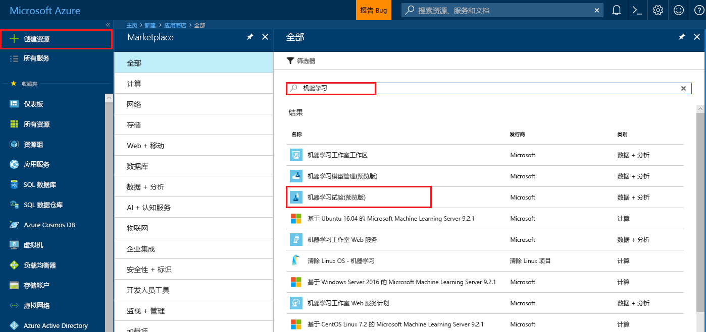

# <a name="quickstart-install-and-get-started-with-azure-machine-learning-services"></a>快速入门：安装并开始使用 Azure 机器学习服务
Azure 机器学习服务（预览版）是集成式的端到端数据科学和高级分析解决方案。 它可让专业数据科学家以云的规模准备数据、开发试验和部署模型。

本快速入门演示如何：

* 创建 Azure 机器学习服务的服务帐户
* 安装并登录 Azure Machine Learning Workbench。
* 在 Workbench 中创建项目
* 在该项目中运行脚本  
* 访问命令行界面 (CLI)


作为 Microsoft Azure 产品组合的一部分，Azure 机器学习服务需要 Azure 订阅。 如果你还没有 Azure 订阅，可以在开始前创建一个 [免费帐户](https://azure.microsoft.com/free/?WT.mc_id=A261C142F)。

此外，必须具有足够权限，才能创建诸如资源组、虚拟机之类的资产。 

<a name="prerequisites"></a>可以将 Azure Machine Learning Workbench 应用程序安装在以下操作系统上：
- Windows 10 或 Windows Server 2016
- macOS Sierra 或 High Sierra

## <a name="create-azure-machine-learning-services-accounts"></a>创建 Azure 机器学习服务帐户
使用 Azure 门户预配 Azure 机器学习帐户： 
1. 使用将要使用的 Azure 订阅的凭据登录到 [Azure 门户](https://portal.azure.com/)。 如果还没有 Azure 订阅，请现在就创建一个[免费帐户](https://azure.microsoft.com/free/?WT.mc_id=A261C142F)。 

   

1. 选择门户左上角的“创建资源”按钮 (+)。

   

1. 在搜索栏中输入“机器学习”。 选择名为“机器学习试验”的搜索结果。 

   

1. 在“机器学习试验”窗格中滚动到底部，选择“创建”，开始定义试验帐户。  

   

1. 在“ML 试验”窗格中，配置机器学习试验帐户。 

   设置|针对教程建议的值|说明
   ---|---|---
   试验帐户名称 | 唯一的名称 |输入用于标识帐户的唯一名称。 可以使用自己的名称，或者能够最好地标识试验的部门或项目名称。 名称应介于 2 到 32 个字符之间， 只应包含字母数字字符和短划线 (-) 字符。 
   订阅 | 用户的订阅 |选择要用于试验的 Azure 订阅。 如果有多个订阅，请选择要计费的资源所在的相应订阅。
   资源组 | 你的资源组 | 使用订阅中的现有资源组，或者输入一个名称，为此试验帐户创建新的资源组。 
   Location | _离用户最近的区域_ | 选择最靠近用户和数据资源的位置。
   席位数 | 2 | 输入席位数。 了解[席位如何影响定价](https://azure.microsoft.com/pricing/details/machine-learning/)。<br/><br/>本快速入门只需要两个座位。 可以根据需要在 Azure 门户中添加或删除席位。
   存储帐户 | 唯一的名称 | 选择“新建”，然后提供一个名称，用于创建 [Azure 存储帐户](https://docs.microsoft.com/en-us/azure/storage/common/storage-quickstart-create-account?tabs=portal)。 名称应该 3-24 个字符长，只应包含字母数字字符。 也可选择“使用现有”，从下拉列表中选择现有的存储帐户。 存储帐户是必需的，用于保存项目内容和运行历史记录数据。 
   试验帐户的工作区 | IrisGarden<br/>（在教程中使用的名称） | 提供此帐户的工作区的名称。 名称应介于 2 到 32 个字符之间， 只应包含字母数字字符和短划线 (-) 字符。 此工作空间包含创建、管理和发布试验所需的工具。
   分配工作区的所有者 | 你的帐户 | 选择自己的帐户作为工作区所有者。
   创建模型管理帐户 | **勾选标记** |现在请创建一个模型管理帐户，这样就可以在需要以实时 Web 服务的方式部署和管理模型时使用此资源。 <br/><br/>建议在创建试验帐户的同时创建模型管理帐户，当然这是可选操作。
   帐户名 | 唯一的名称 | 选择用于标识模型管理帐户的唯一名称。 可以使用自己的名称，或者能够最好地标识试验的部门或项目名称。 名称应介于 2 到 32 个字符之间， 只应包含字母数字字符和短划线 (-) 字符。 
   模型管理定价层 | **DEVTEST** | 选择“未选择定价层”，指定新模型管理帐户的定价层。 为了节省成本，请选择“DEVTEST”（如果可在订阅中使用，可用性受限）， 否则，请选择 S1 定价层。 单击“选择”保存定价层选择。 
   固定到仪表板 | _勾选标记_ | 选中“固定到仪表板”选项，以便轻松地在 Azure 门户的前端仪表板页上跟踪机器学习试验帐户。

   

5. 选择“创建”，开始试验帐户和模型管理帐户的创建过程。

   

   创建帐户可能需要一些时间。 单击 Azure 门户工具栏上的“通知”图标（钟形）即可查看部署过程的状态。
   
   


## <a name="install-and-log-in-to-workbench"></a>安装并登录 Workbench

Azure Machine Learning Workbench 适用于 Windows 或 macOS。 请参阅[支持的平台](#prerequisites)的列表。

>[!WARNING]
>安装可能需要大约 30 分钟才能完成。 

1. 下载并启动最新的 Workbench 安装程序。 
   >[!IMPORTANT]
   >将安装程序整个下载到磁盘上，然后在磁盘中运行安装程序。 不要直接从浏览器的下载小组件运行安装程序。

   **在 Windows 上：** 

   &nbsp;&nbsp;&nbsp;&nbsp;A. 下载 [AmlWorkbenchSetup.msi](https://aka.ms/azureml-wb-msi)。  <br/>
   &nbsp;&nbsp;&nbsp;&nbsp;B. 在文件资源管理器中双击下载的安装程序。

   **在 macOS 上：** 

   &nbsp;&nbsp;&nbsp;&nbsp;A. 下载 [AmlWorkbench.dmg](https://aka.ms/azureml-wb-dmg)。 <br/>
   &nbsp;&nbsp;&nbsp;&nbsp;B. 在 Finder 中双击下载的安装程序。<br/><br/>

1. 按照安装程序中的屏幕说明操作，直至完成。 

   **安装可能需要大约 30 分钟才能完成。**  
   
   | |Azure Machine Learning Workbench 的安装路径|
   |--------|------------------------------------------------|
   |Windows|C:\Users\\<user\>\AppData\Local\AmlWorkbench|
   |macOS|/Applications/Azure ML Workbench.app|

   安装程序会下载并安装所有必需依赖项，例如 Python、Miniconda 和其他相关库。 此安装还包括 Azure 跨平台命令行工具，即 Azure CLI。

1. 启动 Workbench，方法是选择安装程序最后一个屏幕上的“启动 Workbench”按钮。 

   即使关闭了安装程序，请执行以下操作：
   + 在 Windows 上，请使用 **Machine Learning Workbench** 桌面快捷方式来启动它。 
   + 在 macOS 上，请在 Launchpad 中选择“Azure ML Workbench”。

1. 在第一个屏幕上选择“Microsoft 登录”，使用 Azure Machine Learning Workbench 进行身份验证。 使用在 Azure 门户中使用过的相同凭据创建试验帐户和模型管理帐户。 

   登录后，Workbench 使用在 Azure 订阅中找到的第一个试验帐户，并显示与该帐户关联的所有工作区和项目。 

   >[!TIP]
   > 可以使用 Workbench 应用程序窗口左下角的图标切换到另一试验帐户。

## <a name="create-a-project-in-workbench"></a>在 Workbench 中创建项目

在 Azure 机器学习中，项目是解决问题时所做的所有工作的逻辑容器。 它映射到本地磁盘上的单个文件夹，可以向其中添加任何文件或子文件夹。 

在这里，我们将使用一个包含[鸢尾花卉数据集](https://en.wikipedia.org/wiki/Iris_flower_data_set)的模板创建新的 Workbench 项目。 那些遵循此快速入门的教程会依赖该数据来生成一个模型，以便根据鸢尾花的部分物理特征来预测其类型。  

1. 打开 Azure Machine Learning Workbench 后，在“项目”窗格中选择加号 (+)，然后选择“新建项目”。  

   

1. 填充各窗体字段，然后选择“创建”按钮在 Workbench 中创建新项目。

   字段|针对教程建议的值|说明
   ---|---|---
   项目名称 | myIris |输入用于标识帐户的唯一名称。 可以使用自己的名称，或者能够最好地标识试验的部门或项目名称。 名称应介于 2 到 32 个字符之间， 只应包含字母数字字符和短划线 (-) 字符。 
   项目目录 | c:\Temp\ | 指定在其中创建项目的目录。
   项目说明 | 留空 | 用于描述项目的可选字段。
   Visualstudio.com GIT 存储库 URL |留空 | 可选字段。 还可以在 Visual Studio Team Services 中将项目与 Git 存储库进行关联，以便进行源代码管理和协作。 [了解如何进行该设置](https://docs.microsoft.com/en-us/azure/machine-learning/preview/using-git-ml-project#step-3-set-up-a-machine-learning-project-and-git-repo)。 
   所选工作区 | IrisGarden（如果存在） | 在 Azure 门户中选择一个已经为试验帐户创建的工作区。 <br/>如果是按本快速入门进行的操作，则应该已经有了一个名为 IrisGarden 的工作区。 如果还没有该工作区，则请选择一个在创建试验帐户时创建的工作区，或者任何其他需要使用的工作区。
   项目模板 | 鸢尾花分类 | 模板包含的脚本和数据可以用来探索产品的功能。 此模板包含的脚本和数据是本快速入门以及此文档站点中的其他教程所需要的。 

   
 
 此时会创建新的项目，并会打开包含该项目的项目仪表板。 此时，可以浏览项目主页、数据源、Notebook 和源代码文件。 

>[!TIP]
>可以将 Workbench 配置为与 Python IDE 配合使用，体验如何顺利地进行数据科学开发， 然后即可在 IDE 中与项目交互。 [了解操作方法](how-to-configure-your-IDE.md)。 

## <a name="run-a-python-script"></a>运行 Python 脚本

现在可以在本地计算机上运行 **iris_sklearn.py** 脚本了。 默认情况下，此脚本是“鸢尾花分类”项目模板随附的。 此脚本使用常用的 Python [scikit-learn](http://scikit-learn.org/stable/index.html) 库来生成[逻辑回归](https://en.wikipedia.org/wiki/Logistic_regression)模型。

1. 在“项目仪表板”页顶部的命令栏中，选择“local”作为执行目标，选择“iris_sklearn.py”作为要运行的脚本。 默认情况下，这些值是预先选定的。 

   示例中包含其他可供以后查看的文件，但在本快速入门中，我们只关注 **iris_sklearn.py**。 

   

1. 在“参数”文本框中输入 **0.01**。 此数字对应于正则化率，在脚本中用于配置逻辑回归模型。 

1. 选择“运行”，开始在计算机上执行脚本。 **iris_sklearn.py** 作业会立即显示在右侧的“作业”面板中，方便你监视脚本的执行情况。

   祝贺你！ 你已在 Azure Machine Learning Workbench 中成功运行了 Python 脚本。

1. 使用 **0.001** 到 **10** 范围内的不同参数值（例如，使用 10 的幂）重复执行步骤 2 - 3 多次。 每个运行都会显示在“作业”窗格中。

1. 检查运行历史记录，方法是：先选择“运行”视图，然后选择“运行”列表中的“iris_sklearn.py”。 

   

   此视图显示了在 **iris_sklearn.py** 中执行的每个运行。 运行历史记录仪表板还显示最常见的指标、一组默认图形和每个运行的指标列表。 

1. 可以使用齿轮和筛选器图标，通过对配置执行排序、筛选和调整操作来自定义此视图。

   

3. 在“作业”窗格中选择已完成的运行，以便查看该特定执行的详细视图。 详细信息包括其他指标、所生成的文件，以及其他可能有用的日志。

## <a name="start-the-cli"></a>启动 CLI

Azure 机器学习命令行界面 (CLI) 也已安装。 可以通过 CLI 界面来访问 Azure 机器学习服务并与之交互，使用 `az` 命令执行端到端数据科学工作流所需的所有任务。 [了解详细信息。](tutorial-iris-azure-cli.md)

可以在 Workbench 的工具栏中使用“文件”→“打开命令提示符”来启动 Azure Machine Learning CLI。

可以在 Azure Machine Learning CLI 中使用 --help 参数获取与命令相关的帮助。

```az ml --help```

## <a name="clean-up-resources"></a>清理资源

[!INCLUDE [aml-delete-resource-group](../../../includes/aml-delete-resource-group.md)]

## <a name="next-steps"></a>后续步骤
现在已创建必需的 Azure 机器学习帐户并安装 Azure Machine Learning Workbench 应用程序。 此外还创建了项目、运行了脚本并浏览了脚本的运行历史记录。

有关此工作流的更深入体验，包括如何将鸢尾花模型部署为 Web 服务，请遵循完整的“鸢尾花分类”教程。 该教程包含[数据准备](tutorial-classifying-iris-part-1.md)、[试验](tutorial-classifying-iris-part-2.md)和[模型管理](tutorial-classifying-iris-part-3.md)的详细步骤。 

> [!div class="nextstepaction"]
> [教程：鸢尾花分类（第 1 部分）](tutorial-classifying-iris-part-1.md)

>[!NOTE]
> 虽然已创建模型管理帐户，但尚未将环境设置为适合部署 Web 服务的环境。 了解如何设置[部署环境](deployment-setup-configuration.md)。
