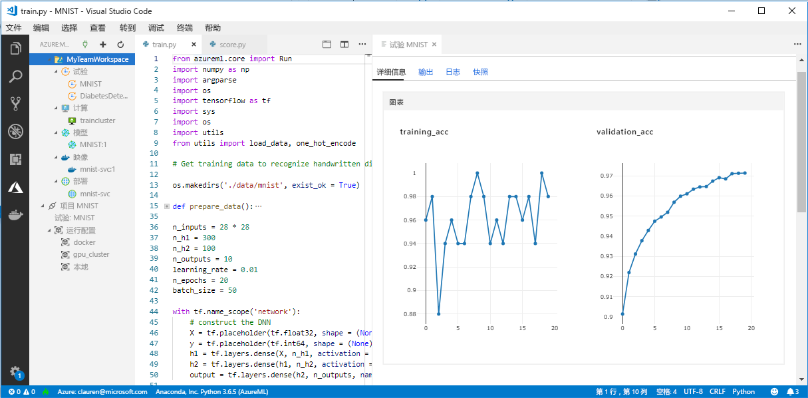

# <a name="what-happened-to-azure-machine-learning-workbench"></a>Azure Machine Learning Workbench 有何遭遇？

为了给改进后的[体系结构](concept-azure-machine-learning-architecture.md)让路，2018 年 9 月版本弃用并替换了 Azure Machine Learning Workbench 应用程序和其他一些早期功能。 

为改善用户体验，此版本包含许多重大更新，这些更新由客户反馈促成。 从实验运行到模型部署的核心功能没有变化。 但现在，可以使用可靠的 <a href="https://aka.ms/aml-sdk" target="_blank">SDK</a> 和 [Azure CLI](reference-azure-machine-learning-cli.md) 来完成机器学习任务和管道。  

在旧版 Azure 机器学习服务中创建的大多数项目，都存储在自己的本地存储或云存储中。 这些项目永远不会消失。

本文介绍了具体变化及其对使用 Azure Machine Learning Workbench 及其 API 构建的已有内容的影响。

>[!Warning]
>本文不适用于 Azure 机器学习工作室用户。 适用于已安装 Workbench（预览版）应用程序和/或拥有试验和模型管理预览帐户的 Azure 机器学习服务客户。


## <a name="what-changed"></a>有何变化？

最新版 Azure 机器学习服务包括以下功能：
+ [简化的 Azure 资源模型](concept-azure-machine-learning-architecture.md)。
+ [全新门户 UI](how-to-track-experiments.md)，用于管理试验和计算目标。
+ 更全面的全新 Python <a href="https://aka.ms/aml-sdk" target="_blank">SDK</a>。
+ 已扩充的全新 [Azure CLI 扩展](reference-azure-machine-learning-cli.md)，用于机器学习。

重新设计的[架构](concept-azure-machine-learning-architecture.md)，易于使用。 无需使用多个 Azure 资源和帐户，只需使用 [Azure 机器学习服务工作区](concept-workspace.md)即可。 可以在 [Azure 门户]((setup-create-workspace.md#portal) 中快速创建工作区。 通过使用工作区，多个用户可以存储定型和部署计算目标、模型试验、Docker 映像、已部署模型等。

虽然当前版本中有新的已改进的 CLI 和 SDK 客户端，但桌面工作台应用程序本身已经停用。 可以在 [Azure 门户的工作区仪表板](how-to-track-experiments.md#view-the-experiment-in-the-azure-portal)中管理试验。 借助仪表板，可以获取试验历史记录、管理附加到工作区的计算目标、管理模型和 Docker 映像，甚至还能部署 Web 服务。

<a name="timeline"></a>

## <a name="support-timeline"></a>支持时间线

于 2019 年 1 月 9 日，对 Machine Learning Workbench、Azure 机器学习试验和模型管理帐户及其相关 SDK 和 CLI 的支持已经结束。 

通过此 <a href="https://aka.ms/aml-sdk" target="_blank">SDK</a>、[CLI](reference-azure-machine-learning-cli.md) 和[门户](setup-create-workspace.md#portal)即可使用所有最新功能。

## <a name="what-about-run-histories"></a>运行历史记录又如何？

旧的运行历史记录不再可访问，你仍然可以在最新版本中查看运行情况。 

运行历史记录现在称为“试验”  。 可使用 SDK、CLI 或 Azure 门户收集并探索模型的试验。

门户的工作区仪表板仅在 Microsoft Edge、Chrome 和 Firefox 浏览器上受支持：

[](./media/overview-what-happened-to-workbench/image001.png#lightbox)

使用新的 CLI 和 SDK 开始训练模型并跟踪运行历史记录。 可以了解如何使用[教程：使用 Azure 机器学习服务训练模型](tutorial-train-models-with-aml.md)。

## <a name="can-i-still-prep-data"></a>我能否仍准备数据？

已有的数据准备文件不可移植到最新版本中，因为 Machine Learning Workbench 已遭弃用。 但你仍然可以为建模准备任何大小的数据集。   

对于任意大小的数据集，在通过编写 Python 代码进行建模之前，你都可以使用 [Azure 机器学习数据准备包](https://aka.ms/data-prep-sdk)来快速准备数据。 

可以按照[本教程](tutorial-data-prep.md)，深入了解如何使用 Azure 机器学习数据准备 SDK。

## <a name="will-projects-persist"></a>项目是否继续存在？

不会丢失任何代码或工作。 在旧版本中，项目是包含本地目录的云实体。 在最新版本中，可使用本地配置文件将本地目录附加到 Azure 机器学习服务工作区。 请参阅[最新体系结构的关系图](concept-azure-machine-learning-architecture.md)。

大部分项目内容已存在于本地计算机上。 因此，只需在相应目录中创建配置文件，并在代码中引用它，即可连接到工作区。 要继续使用包含文件和脚本的本地目录，请在[“experiment.submit”](https://docs.microsoft.com/python/api/azureml-core/azureml.core.experiment.experiment?view=azure-ml-py)Python 命令中指定该目录的名称或使用 `az ml project attach` CLI 命令。  例如：
```python
run = exp.submit(source_directory=script_folder,
                 script='train.py', run_config=run_config_system_managed)
```

[创建工作区](setup-create-workspace.md#portal)以开始使用。

## <a name="what-about-my-registered-models-and-images"></a>我注册的模型和映像又如何？

若要继续使用旧模型注册表中注册的模型，必须将它们迁移到新工作区。 若要迁移模型，请下载模型并将其在新工作区中重新注册。 

你在自己的旧映像注册表中创建的映像不能直接迁移到新工作区。 大多数情况下，可以部署此模型，不需创建映像。 可以根据需要在新工作区中为模型创建一个映像。 有关详细信息，请参阅[管理、注册、部署和监视机器学习模型](concept-model-management-and-deployment.md)。

## <a name="what-about-deployed-web-services"></a>已部署 Web 服务又如何？

现在，对旧 CLI 的支持已经结束，你无法再重新部署模型或管理最初使用模型管理帐户部署的 Web 服务。 但是，只要仍支持 Azure 容器服务 (ACS)，这些 Web 服务就将继续有效。

在最新版本中，模型作为 Web 服务部署到 Azure 容器实例 (ACI) 或 Azure Kubernetes 服务 (AKS) 群集。 还可以部署到 FPGA 和 Azure IoT Edge。 

通过以下文章，了解详细信息：
+ [在何处以及如何部署模型](how-to-deploy-and-where.md)
+ [教程：使用 Azure 机器学习服务部署模型](tutorial-deploy-models-with-aml.md)

## <a name="what-about-the-old-sdk-and-cli"></a>旧的 SDK 和 CLI 又如何？

它们将继续正常运行到 1 月。 请参阅前面的[时间线](#timeline)。 建议开始使用最新 SDK 或 CLI 新建试验和模型。

在最新版本中，使用全新 Python SDK，可以在任何 Python 环境中与 Azure 机器学习服务进行交互。 了解如何安装最新版 <a href="https://aka.ms/aml-sdk" target="_blank">SDK</a>。 还可以结合使用更新后的 [Azure 机器学习 CLI 扩展](reference-azure-machine-learning-cli.md)和丰富的 `az ml` 命令集，在任何命令行环境（包括 Azure Cloud Shell）中与服务进行交互。

## <a name="what-about-visual-studio-code-tools-for-ai"></a>Visual Studio Code Tools for AI 怎么样？

在此最新版本中，该扩展已重命名为 Azure Machine Learning for Visual Studio Code，并已进行了扩展和改进，以使用上述新功能。

[](./media/overview-what-happened-to-workbench/vscode-big.png#lightbox)

## <a name="what-about-domain-packages"></a>域包又如何？

计算机视觉、文本分析和预测的域包无法与最新版 Azure 机器学习结合使用。 不过，仍可以使用最新版 Azure 机器学习 Python <a href="https://aka.ms/aml-sdk" target="_blank">SDK</a>，生成并定型计算机视觉、文本分析和预测模型。 若要了解如何迁移使用计算机视觉、文本分析和预测包构建的已有模型，请联系 [AML-Packages@microsoft.com](mailto:AML-Packages@microsoft.com)。

## <a name="next-steps"></a>后续步骤

了解 [Azure 机器学习服务的最新体系结构](concept-azure-machine-learning-architecture.md)。 

有关该服务的概述，请阅读[什么是 Azure 机器学习服务？](overview-what-is-azure-ml.md)。

使用由两部分（[设置环境和工作区](tutorial-1st-experiment-sdk-setup.md)和[训练第一个模型](tutorial-1st-experiment-sdk-train.md)）组成的教程创建第一个试验

有关此工作流的更深入体验，请参阅[完整教程](tutorial-train-models-with-aml.md)，其中包含使用 Azure 机器学习服务训练和部署模型的详细步骤。 
