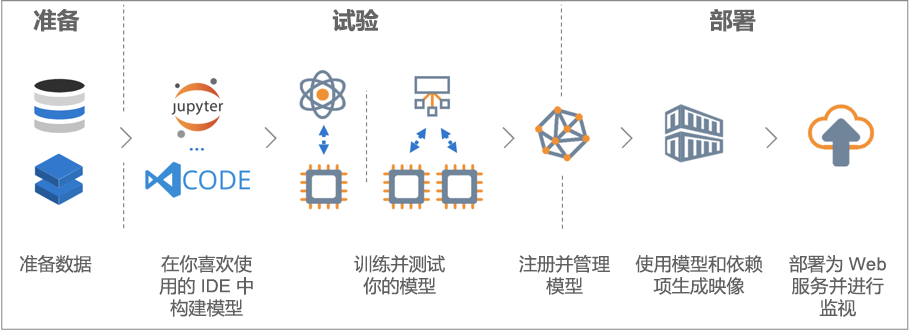

# 什么是 Azure 机器学习服务？

Azure 机器学习服务是一项云服务，可以使用它来训练、部署、自动执行以及管理机器学习模型，所有这些都是在云提供的广泛范围内进行的。

## 什么是机器学习？

机器学习是一项数据科研技术，可以让计算机根据现有的数据来预测将来的行为、结果和趋势。 使用机器学习，计算机可以在不需显式编程的情况下进行学习。

机器学习的预测可让应用和设备变得更聪明。 例如，在网上购物时，机器学习可根据你购买的产品帮助推荐其他产品。 或者，在刷信用卡时，机器学习可将这笔交易与交易数据库进行比较，帮助检测诈骗。 当吸尘器机器人打扫房间时，机器学习可帮助它确定作业是否已完成。

## 什么是 Azure 机器学习服务？

Azure 机器学习服务提供了一个基于云的环境，你可以使用这一环境来开发、培训、测试、部署、管理和跟踪机器学习模型。

[  ] (./media/overview-what-is-azure-ml/aml.png#lightbox)

Azure 机器学习服务完全支持开放源代码技术，因此，你可以使用数以万计的开放源代码 Python 包与机器学习组件（如 TensorFlow 和 scikit-learn）。
支持丰富的工具（例如 [Jupyter Notebook](http://jupyter.org) 或 [Azure Machine Learning for Visual Studio Code](https://marketplace.visualstudio.com/items?itemName=ms-toolsai.vscode-ai#overview) 扩展），因此可以交互式地轻松探索数据、转换数据，然后开发和测试模型。
此外，Azure 机器学习服务还包括[自动化模型生成和优化](tutorial-auto-train-models.md)的功能，能够帮助你轻松、高效和准确地创建模型。

使用 Azure 机器学习服务，你可以先在本地计算机上开始培训，然后扩大到云。 借助许多可用的[计算目标](how-to-set-up-training-targets.md)（例如 Azure 机器学习计算和 [Azure Databricks](/azure/azure-databricks/what-is-azure-databricks) 以及[高级超参数优化服务](how-to-tune-hyperparameters.md)，你可以借助云的力量更快地构建更好的模型。

在拥有合适的模型后，即可轻松地将其部署在 Docker 等的容器中。 这意味着，可以轻松部署到 Azure 容器实例或 Azure Kubernetes 服务，或者，你可以在自己的部署中使用容器，无论是在本地还是在云中。 有关详细信息，请参阅[部署方式及位置](how-to-deploy-and-where.md)文档。
在尝试寻找最佳解决方案时，可以管理已部署的模型并跟踪多个运行。
在部署后，你的模型可以基于大量数据[实时](how-to-consume-web-service.md)或[异步](how-to-run-batch-predictions.md)返回预测。

使用高级[机器学习管道](concept-ml-pipelines.md)，你可以针对数据准备、模型训练和评估以及部署的所有步骤进行协作。

## 通过 Azure 机器学习服务，我可以执行哪些操作？

Azure 机器学习服务可以自动训练模型并自动优化模型。
有关示例，请参阅[教程：使用 Azure 自动机器学习自动训练分类模型](tutorial-auto-train-models.md)。

可以使用适用于 Python 的 Azure 机器学习 <a href="https://aka.ms/aml-sdk" target="_blank">SDK</a>，以及开放源代码 Python 包，在 Azure 机器学习服务工作区中自行生成和训练高度准确的机器学习和深度学习模型。
可以从开放源代码 Python 包中提供的许多机器学习组件中进行选择，例如：

- <a href="https://scikit-learn.org/stable/" target="_blank">Scikit-learn</a>
- <a href="https://www.tensorflow.org" target="_blank">Tensorflow</a>
- <a href="https://pytorch.org" target="_blank">PyTorch</a>
- CNTK
- <a href="http://mxnet.io" target="_blank">MXNet</a>

在获得模型后，使用它来创建容器（例如 Docker），可以将该容器部署在本地以进行测试。 完成测试后，可以在 Azure 容器实例或 Azure Kubernetes 服务中将模型部署为生产 Web 服务。 有关详细信息，请参阅[部署方式及位置](how-to-deploy-and-where.md)文档。

然后，可以使用 [Azure Machine Learning SDK for Python](https://aka.ms/aml-sdk) 或 [Azure 门户](https://portal.azure.com/)来管理已部署的模型。
你可以在跟踪模型的试验的同时评估模型指标、重新训练和重新部署模型的新版本。

要开始使用 Azure 机器学习服务，请参阅下面的[后续步骤](#next-steps)。

## Azure 机器学习服务与 Studio 有何不同？

Azure 机器学习工作室是一个协作式拖放可视化工作区，无需编写代码即可生成、测试和部署机器学习解决方案。 它使用预构建和预配置的机器学习算法和数据处理模块。

如果想要快速轻松地试验机器学习模型，请使用机器学习工作室，并且内置的机器学习算法足以供你的解决方案使用。

如果你在 Python 环境中工作并且希望更好地控制机器学习算法，或者你想使用开放源代码机器学习库，那么机器学习服务将是你的最佳选择。

> [!NOTE]
> Azure 机器学习服务无法部署或管理在 Azure 机器学习工作室中创建的模型。

## 免费试用

如果还没有 Azure 订阅，请在开始前创建免费帐户。 立即试用 [Azure 机器学习服务免费版或付费版](http://aka.ms/AMLFree)。

你将获得可用于 Azure 服务的额度。 信用额度用完后，可以保留该帐户并继续使用[免费的 Azure 服务](https://azure.microsoft.com/free/)。 除非显式更改设置并要求付费，否则不会对信用卡收取任何费用。 此外，也可以[激活 MSDN 订户权益](https://azure.microsoft.com/pricing/member-offers/msdn-benefits-details/?WT.mc_id=A261C142F)，这将每月为你提供可用于试用付费版 Azure 服务的信用额度。

## 后续步骤

- 创建一个机器学习服务工作区以[使用 Azure 门户](quickstart-get-started.md)或 [Python](quickstart-create-workspace-with-python.md) 开始入门学习。

- 根据完整教程，[使用 Azure 机器学习训练并部署一个图像分类模型](tutorial-train-models-with-aml.md)。

- [使用 Azure 机器学习自动生成并自动优化一个模型](tutorial-auto-train-models.md)。

- 使用 [Azure 机器学习数据准备 SDK](https://aka.ms/data-prep-sdk) 准备数据。

- 了解[机器学习管道](/azure/machine-learning/service/concept-ml-pipelines)，以便生成、优化和管理机器学习方案。

- 阅读深入的 [Azure 机器学习服务体系结构和概念](concept-azure-machine-learning-architecture.md)文章。

- 有关 Microsoft 提供的其他机器学习产品的更多信息，请参阅 [Microsoft 的其他机器学习产品](./overview-more-machine-learning.md)。

<!-- 

An intro to AML or an end-to-end quickstart video could go here.

In this 9-minute video, learn how you can benefit your app. You'll learn about key features and what a typical workflow looks like. 

>[!VIDEO https://channel9.msdn.com/Events/Connect/2016/138/player]
 
+ 0-3 minutes covers key features and use-cases.
+ 3-4 minutes covers service provisioning. 
+ 4-6 minutes covers Import Data wizard used to create an index using the built-in real estate dataset.

-->
