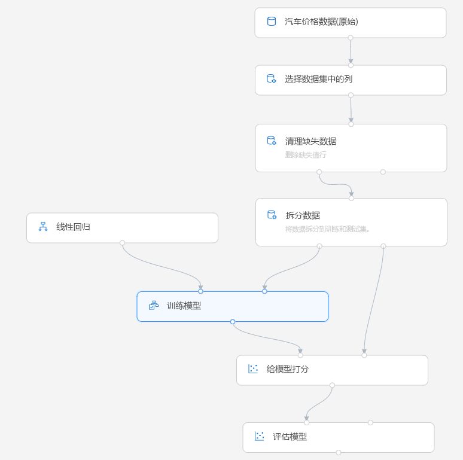

# 什么是 Azure 机器学习服务？

Azure 机器学习服务是一项云服务，可以使用它来训练、部署、自动执行以及管理机器学习模型，所有这些都是在云提供的广泛范围内进行的。

## 什么是机器学习？

机器学习是一项数据科研技术，可以让计算机根据现有的数据来预测将来的行为、结果和趋势。 使用机器学习，计算机可以在不需显式编程的情况下进行学习。

机器学习的预测可让应用和设备变得更聪明。 例如，在网上购物时，机器学习可根据购买的产品帮助推荐其他产品。 或者，在刷信用卡时，机器学习可将这笔交易与交易数据库进行比较，帮助检测诈骗。 当吸尘器机器人打扫房间时，机器学习可帮助它确定作业是否已完成。

## 什么是 Azure 机器学习服务？

Azure 机器学习服务提供了一个基于云的环境，你可以使用这一环境来准备数据、培训、测试、部署、管理和跟踪机器学习模型。 开始在本地计算机上训练，然后横向扩展到云。 此服务完全支持开源技术（例如 PyTorch、TensorFlow 和 scikit-learn），可以用于任何类型的机器学习，从经典机器学习到深度学习、监督式学习和非监督式学习，不一而足。

使用如下所示的丰富工具浏览并准备数据、训练并测试模型，以及对其进行部署：
+ [可视界面](ui-tutorial-automobile-price-train-score.md)：可以在其中拖放模块，以便构建试验，然后部署模型
+ [Jupyter 笔记本](https://jupyter.org)：可以在其中使用 [SDK](https://docs.microsoft.com/azure/machine-learning/service/#reference) 编写你自己的代码，例如[这些示例笔记本](https://aka.ms/aml-notebooks)
+ [Visual Studio Code 扩展](how-to-vscode-tools.md)

## 通过 Azure 机器学习服务，我可以执行哪些操作？

将 <a href="https://aka.ms/aml-sdk" target="_blank">Azure 机器学习 Python SDK</a> 与开源 Python 包配合使用，或者使用[可视界面（预览版）](ui-tutorial-automobile-price-train-score.md)，你自己可以在 Azure 机器学习服务工作区中生成并训练高度精确的机器学习和深度学习模型。

可以从开源 Python 包中提供的许多机器学习组件（例如 <a href="https://scikit-learn.org/stable/" target="_blank">Scikit-learn</a>、<a href="https://www.tensorflow.org" target="_blank">Tensorflow</a>、<a href="https://pytorch.org" target="_blank">PyTorch</a> 和 <a href="https://mxnet.io" target="_blank">MXNet</a>）中进行选择。

不管是编写代码还是使用可视界面，都可以在试验时跟踪多个运行，以便查找最佳解决方案并管理部署的模型。

### 代码优先体验

开始使用 <a href="https://aka.ms/aml-sdk" target="_blank">Azure 机器学习 Python SDK</a> 在本地计算机上训练，然后横向扩展到运行。 借助许多可用的[计算目标](how-to-set-up-training-targets.md)（例如 Azure 机器学习计算和 [Azure Databricks](/azure/azure-databricks/what-is-azure-databricks)）以及[高级超参数优化服务](how-to-tune-hyperparameters.md)，可以利用云的强大功能更快地生成更好的模型。

也可使用 SDK [自动完成模型训练和优化](tutorial-auto-train-models.md)。

### 基于 UI 的低代码体验

若要进行无代码训练，请尝试：

+ 在易于使用的界面中创建[自动 ML 试验](tutorial-first-experiment-automated-ml.md)。
+ [在可视界面中进行拖放试验](ui-tutorial-automobile-price-train-score.md)。
  

### 操作化 (MLOps)

有了正确的模型以后，即可轻松地将其用在 Web 服务中、IoT 设备上或 Power BI 中。 有关详细信息，请参阅有关[部署方式及位置](how-to-deploy-and-where.md)的文章。

然后，可以使用[适用于 Python 的 Azure 机器学习 SDK](https://aka.ms/aml-sdk) 或 [Azure 门户](https://portal.azure.com/)来管理已部署的模型。

可以使用这些模型[实时](how-to-consume-web-service.md)返回预测，或者在有大量数据的情况下[异步](how-to-run-batch-predictions.md)返回预测。

使用高级[机器学习管道](concept-ml-pipelines.md)，可以在每一步（从数据准备、模型训练和评估一直到部署）进行协作。 使用 Pipelines 可以：

* 自动完成云中的端到端机器学习过程
* 重用组件，并仅在需要时重新运行步骤
* 在每个步骤中使用不同的计算资源
* 运行批量评分任务

若要开始使用 Azure 机器学习服务，请参阅[后续步骤](#next-steps)。

## Azure 机器学习服务与工作室有何不同？

[机器学习工作室](../studio/what-is-ml-studio.md)是一个协作型拖放式可视工作区，可以在其中生成、测试和部署机器学习解决方案，不需编写代码。 它使用预先生成和预先配置的机器学习算法、数据处理模块和专用计算平台。

Azure 机器学习服务提供 SDK **和**可视界面（预览版），可以快速准备数据以及训练和部署机器学习模型。 此可视界面（预览版）提供与工作室类似的拖放体验。 但是，不像工作室的专用计算平台，此可视界面使用你自己的计算资源，并且已完全集成到 Azure 机器学习服务中。

这是一个快速比较。

|| 机器学习工作室 | Azure 机器学习服务： 可视界面|
|---| --- | --- |
|| 正式发布 (GA) | 预览|
|界面的模块| 很多 | 常用模块的初始集|
|训练计算目标| 专用计算目标，仅限 CPU 支持| 支持 Azure 机器学习计算、GPU 或 CPU。 （其他在 SDK 中受支持的计算）|
|部署计算目标| 专用 Web 服务格式，不可自定义 | 企业安全选项和 Azure Kubernetes 服务。  （SDK 中支持的[其他计算](how-to-deploy-and-where.md)） |
|自动化模型训练和超参数优化 | 否 | 在可视界面中尚不支持。   （在 SDK 和 Azure 门户中受支持。） |

参考以下教程试用可视界面（预览版）：[教程：使用可视界面预测汽车价格](ui-tutorial-automobile-price-train-score.md)。

> [!NOTE]
> 在工作室中创建的模型不能通过 Azure 机器学习服务来部署或管理。 但是，在服务可视界面中创建和部署的模型可以通过 Azure 机器学习服务工作区进行管理。

## 免费试用

如果还没有 Azure 订阅，请在开始前创建免费帐户。 立即试用 [Azure 机器学习服务免费版或付费版](https://aka.ms/AMLFree)。

你将获得可用于 Azure 服务的赠送额度。 额度用完后，可以保留该帐户并继续使用[免费的 Azure 服务](https://azure.microsoft.com/free/)。 除非显式更改设置并要求付费，否则不会对信用卡收取任何费用。 或者[激活 MSDN 订户权益](https://azure.microsoft.com/pricing/member-offers/msdn-benefits-details/?WT.mc_id=A261C142F)，享受每月试用付费版 Azure 服务的信用额度。

## 后续步骤

- [创建机器学习服务工作区](how-to-manage-workspace.md)以开始使用。

- 按照完整的教程进行操作：
  + [创建工作区并训练第一个 ML 模型](tutorial-1st-experiment-sdk-setup.md)
  + [使用 Azure 机器学习服务训练图像分类模型](tutorial-train-models-with-aml.md)

- 了解[机器学习管道](/azure/machine-learning/service/concept-ml-pipelines)，以便生成、优化和管理机器学习方案。

- 阅读深入的 [Azure 机器学习服务体系结构和概念](concept-azure-machine-learning-architecture.md)文章。

- 有关详细信息，请参阅 [Microsoft 提供的其他机器学习产品](/azure/architecture/data-guide/technology-choices/data-science-and-machine-learning)。
