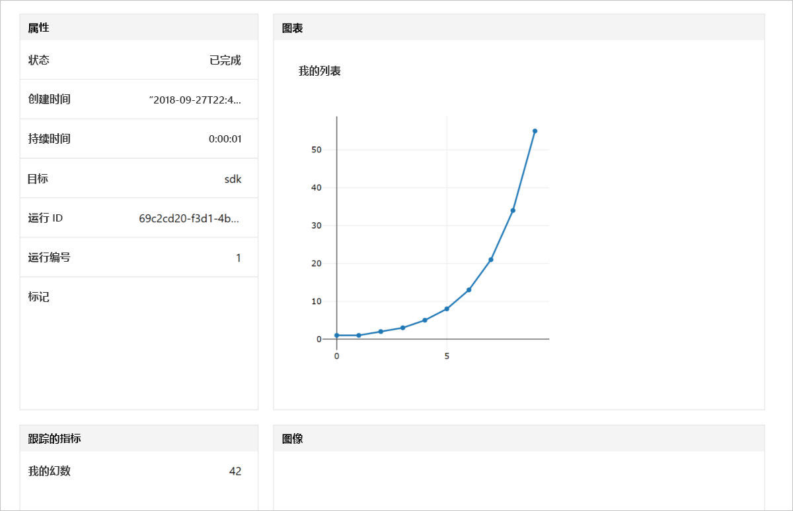

# <a name="quickstart-use-python-to-get-started-with-azure-machine-learning"></a>快速入门：通过 Python 开始使用 Azure 机器学习

在本快速入门中，我们将通过用于 Python 的 Azure 机器学习 SDK 来创建并使用机器学习服务[工作区](concept-azure-machine-learning-architecture.md)。 此工作区是一个基础块，用于配合 Azure 机器学习服务在云中试验、训练和部署机器学习模型。

在本教程中，我们将安装 Python SDK 并执行以下操作：
* 在 Azure 订阅中创建工作区
* 创建该工作区的配置文件，以便稍后在其他 Notebook 和脚本中使用
* 编写代码用于记录工作区中的值
* 在工作区中查看所记录的值

在本快速入门中创建的工作区及其配置文件可用作其他 Azure 机器学习教程和操作方法文章的先决条件。 与其他 Azure 服务一样，Azure 机器学习服务也有相关的限制和配额。 [了解配额以及如何请求提高配额。](how-to-manage-quotas.md)

为方便起见，如果区域支持，下述资源将自动添加到你的工作区：[容器注册表](https://azure.microsoft.com/services/container-registry/)、[存储](https://azure.microsoft.com/services/storage/)、[应用程序见解](https://azure.microsoft.com/services/application-insights/)和 [Key Vault](https://azure.microsoft.com/services/key-vault/)。

如果还没有 Azure 订阅，可以在开始前创建一个[免费帐户](https://azure.microsoft.com/free/?WT.mc_id=A261C142F)。


##  <a name="install-the-sdk"></a>安装 SDK

如果使用的是 2018 年 9 月 27 日之后创建的 Data Science Virtual Machine (DSVM)，请**跳过本部分**，因为预装的 Python SDK 随附了这些 DSVM。

在安装该 SDK 之前，我们建议先创建一个隔离的 Python 环境。 尽管本快速入门使用 [Miniconda](https://conda.io/docs/user-guide/install/index.html)，但你也可以使用完整安装的 [Anaconda](https://www.anaconda.com/)，或使用 [Python virtualenv](https://virtualenv.pypa.io/en/stable/)。

### <a name="install-miniconda"></a>安装 Miniconda


[下载](https://conda.io/miniconda.html)并安装 Miniconda。 选择 Python 3.7 或更高版本。 不要选择 Python 2.x 版本。

### <a name="create-an-isolated-python-environment"></a>创建隔离的 Python 环境 

启动命令行窗口，并使用 Python 3.6 创建名为 `myenv` 的新 conda 环境。

```sh
conda create -n myenv -y Python=3.6
```

激活该环境。

  ```sh
  conda activate myenv
  ```

### <a name="install-the-sdk"></a>安装 SDK

在激活的 conda 环境中安装 SDK。 此代码在 `myenv` conda 环境中安装 Azure 机器学习 SDK 的核心组件以及 Jupyter Notebook 服务器。  完成安装**大约需要 4 分钟时间**。

```sh
pip install azureml-sdk[notebooks]
```

## <a name="create-a-workspace"></a>创建工作区

键入以下命令启动 Jupyter Notebook。
```sh
jupyter notebook
```

在浏览器窗口中，使用默认 `Python 3` 内核创建新的 Notebook。 

在 Notebook 单元中键入并执行以下 Python 代码来显示 SDK 版本。

```python
import azureml.core
print(azureml.core.VERSION)
```

创建新 Azure 资源组和新工作区。

[在 Azure 门户中的订阅列表内](https://ms.portal.azure.com/#blade/Microsoft_Azure_Billing/SubscriptionsBlade)找到 `<azure-subscription-id>` 的值。 使用你在其中充当所有者或参与者角色的任何订阅。

```python
from azureml.core import Workspace
ws = Workspace.create(name='myworkspace',
                      subscription_id='<azure-subscription-id>',
                      resource_group='myresourcegroup',
                      create_resource_group=True,
                      location='eastus2' # or other supported Azure region
                     )
```

执行上述代码可以触发一个用于登录到 Azure 帐户的新浏览器窗口。 登录后，身份验证令牌将在本地缓存。

若要查看工作区的详细信息，包括关联的存储、容器注册表和 Key Vault，请键入：

```python
ws.get_details()
```

## <a name="write-a-configuration-file"></a>编写配置文件

将配置文件中工作区的详细信息保存到当前目录中。 此文件名为“aml_config\config.json”。  

稍后可以使用同一目录或子目录中的 Notebook 和脚本，通过此工作区配置文件轻松加载此同一工作区。 

```python
# Create the configuration file.
ws.write_config()

# Use this code to load the workspace from 
# other scripts and notebooks in this directory.
# ws = Workspace.from_config()
```

`write_config()` API 调用在当前目录中创建配置文件。 `config.json` 文件包含以下内容：

```json
{
    "subscription_id": "<azure-subscription-id>",
    "resource_group": "myresourcegroup",
    "workspace_name": "myworkspace"
}
```

## <a name="use-the-workspace"></a>使用工作区

编写一些使用 SDK 基本 API 来跟踪试验运行的代码。

```python
from azureml.core import Experiment

# create a new experiemnt
exp = Experiment(workspace=ws, name='myexp')

# start a run
run = exp.start_logging()

# log a number
run.log('my magic number', 42)

# log a list (Fibonacci numbers)
run.log_list('my list', [1, 1, 2, 3, 5, 8, 13, 21, 34, 55]) 

# finish the run
run.complete()
```

## <a name="view-logged-results"></a>查看记录的结果
运行完成后，可在 Azure 门户中查看试验运行。 使用以下代码列显最后一次运行的结果的 URL。

```python
print(run.get_portal_url())
```

在浏览器中使用相应的链接查看 Azure 门户中记录的值。



## <a name="clean-up-resources"></a>清理资源 
>[!IMPORTANT]
>已创建的资源可以用作其他 Azure 机器学习教程和操作方法文章的先决条件。

如果不打算使用此处创建的内容，请删除在本快速入门中创建的资源，以免产生任何费用。

```python
ws.delete(delete_dependent_resources=True)
```

## <a name="next-steps"></a>后续步骤

现在，你已创建了必要的资源来开始试验和部署模型。 此外，在 Notebook 中运行了代码，并在云工作区中浏览了该代码的运行历史记录。

需要在环境中额外安装几个用于 Azure 机器学习教程的包：

1. 在浏览器中关闭 Notebook。
1. 在命令行窗口中，使用 `Ctrl`+`C` 停止 Notebook 服务器。
1. 安装附加的包。

    ```sh
    conda install -y cython matplotlib scikit-learn pandas numpy
    pip install azureml-sdk[automl]
    ```

安装这些包后，请遵循教程来训练并部署模型。  

> [!div class="nextstepaction"]
> [教程：训练图像分类模型](tutorial-train-models-with-aml.md)

还可以学习 [GitHub 中的更高级示例](https://aka.ms/aml-notebooks)。
