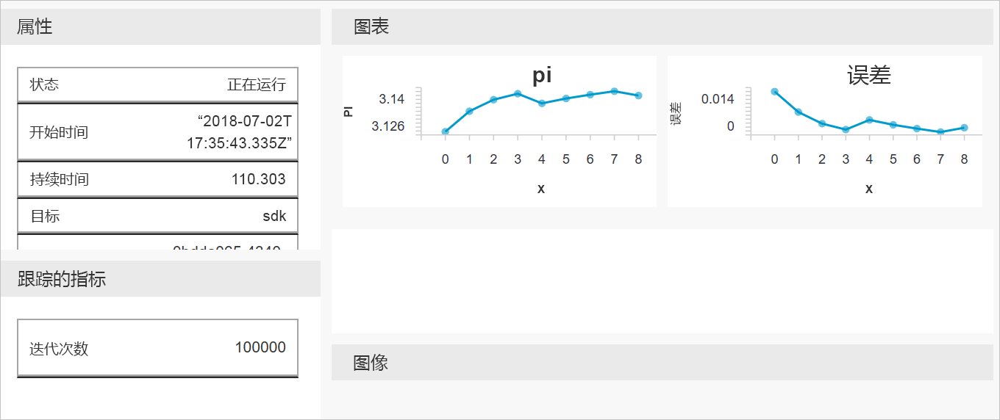

# <a name="quickstart-get-started-with-azure-machine-learning-using-the-cli-extension"></a>快速入门：使用 CLI 扩展开始使用 Azure 机器学习

在此快速入门中，将使用机器学习 CLI 扩展以开始使用 [Azure 机器学习服务](overview-what-is-azure-ml.md)（预览版）。

使用 CLI，你将学习如何：

1. 在 Azure 订阅中创建工作区。 工作区由由一个或多个用户使用，以便在云端存储计算资源、模型、部署和运行历史记录。
1. 将项目附加到工作区。   项目是一个本地文件夹，其中包含解决机器学习问题所需的脚本和配置文件。  
1. 在跨多个迭代记录一些值的项目中运行 Python 脚本。
1. 查看工作区运行历史中的记录值。

> [!NOTE]
> 为方便起见，如果区域支持，下述资源将自动添加到你的工作区：[容器注册表](https://azure.microsoft.com/services/container-registry/)、[存储](https://azure.microsoft.com/services/storage/)、[应用程序见解](https://azure.microsoft.com/services/application-insights/)和 [Key Vault](https://azure.microsoft.com/services/key-vault/)。

所创建的资源可用作其他 Azure 机器学习教程和操作方法文章的先决条件。

此 CLI 针对 Azure 机器学习服务在基于 Python 的 <a href="http://aka.ms/aml-sdk" target="_blank">SDK</a> 基础上构建而成。

## <a name="prerequisites"></a>先决条件

在开始快速入门步骤之前，请确保满足以下先决条件：

+ Azure 订阅。 如果没有 Azure 订阅，请在开始之前创建一个[免费帐户](https://azure.microsoft.com/free/?WT.mc_id=A261C142F)。
+ 已安装 [Python 3.5 或更高版本](https://www.python.org/)
+ 已安装 [Azure CLI](https://docs.microsoft.com/cli/azure/install-azure-cli?view=azure-cli-latest)

## <a name="install-the-cli-extension"></a>安装 CLI 扩展

在计算机上打开命令行编辑器，并安装[面向 Azure CLI 的机器学习扩展](reference-azure-machine-learning-cli.md)。  安装可能需要几分钟才能完成。

```azurecli
az extension add azureml-sdk
```

## <a name="install-the-sdk"></a>安装 SDK

[!INCLUDE [aml-install-sdk](../../../includes/aml-install-sdk.md)]

## <a name="create-a-resource-group"></a>创建资源组

资源组是用于保存 Azure 解决方案相关资源的容器。 使用 Azure CLI，登录到 Azure，指定订阅，并创建资源组。

在命令行窗口，使用 Azure CLI 命令 `az login` 登录。 按照提示进行交互式登录：
    
   ```azurecli
   az login
   ```

列出可用的 Azure 订阅，并指定要使用的订阅：
   ```azurecli
   az account list --output table
   az account set --subscription <your-subscription-id>
   az account show
   ```
   其中，\<your-subscription-id\> 是要使用的订阅的 ID 值。 请勿包括大括号。

创建资源组来保存工作区。
在本快速入门：
   + 资源组的名称是 `docs-aml`。
   + 区域是 `eastus2`。 

   ```azurecli
   az group create -n docs-aml -l eastus2
   ```

## <a name="create-a-workspace-and-a-project-folder"></a>创建一个工作区和项目文件夹

在命令行窗口，在资源组下创建 Azure 机器学习工作区。


   在本快速入门：
   + 工作区名称是 `docs-ws`。
   + 资源组名称是 `docs-aml`

   ```azurecli
   az ml workspace create -n docs-ws -g docs-aml
   ```

在命令行窗口，在本地计算机为 Azure 机器学习项目创建一个文件夹。

   ```
   mkdir docs-prj
   cd docs-prj
   ```

## <a name="create-a-python-script"></a>创建 Python 脚本

[!INCLUDE [aml-create-script-pi](../../../includes/aml-create-script-pi.md)]

## <a name="run-the-script"></a>运行脚本

将文件夹作为项目附加到工作区。 `--history` 参数指定用于捕获每次运行指标的运行历史记录文件的名称。

   ```azurecli
   az ml project attach --history my_history -w docs-ws -g docs-aml
   ```

在本地计算机上运行脚本。

   ```azurecli
   az ml run submit -c local pi.py
   ```

   此命令运行代码，并将 Web 链接输出到控制台。 将链接复制粘贴到 Web 浏览器。

在 Web 浏览器访问 URL。 Web 门户将显示运行的结果。 可以检查该运行或此前运行的结果，如果它们存在的话。

门户仪表板仅在 Edge、Chrome 和 Firefox 浏览器上受支持。

   

## <a name="clean-up-resources"></a>清理资源

[!INCLUDE [aml-delete-resource-group](../../../includes/aml-delete-resource-group.md)]

## <a name="next-steps"></a>后续步骤
现在，你已创建了必要的资源来开始试验和部署模型。 此外还创建了项目、运行了脚本并浏览了脚本的运行历史记录。

要深入体验工作流，请按照 Azure 机器学习教程构建、定型和部署模型。

> [!div class="nextstepaction"]
> [教程：构建、定型和部署](tutorial-train-models-with-aml.md)