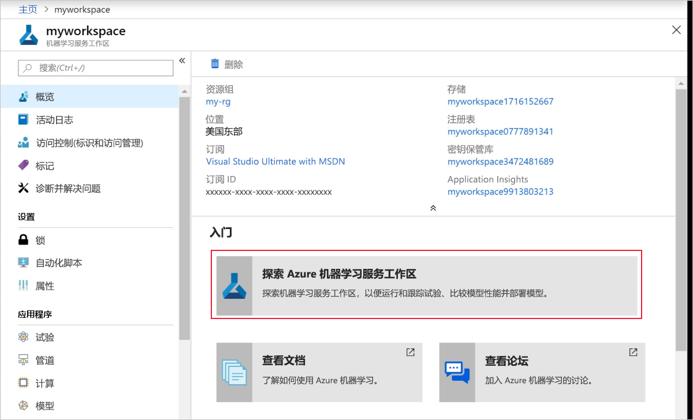
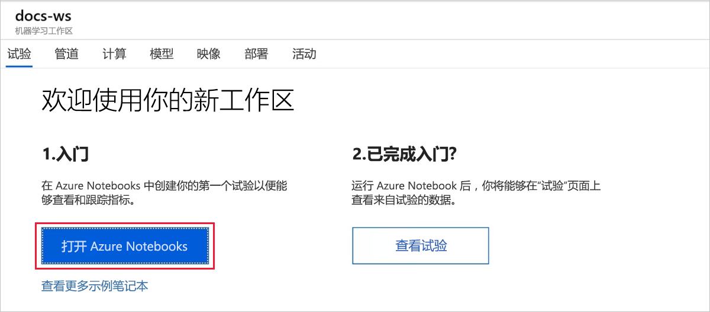
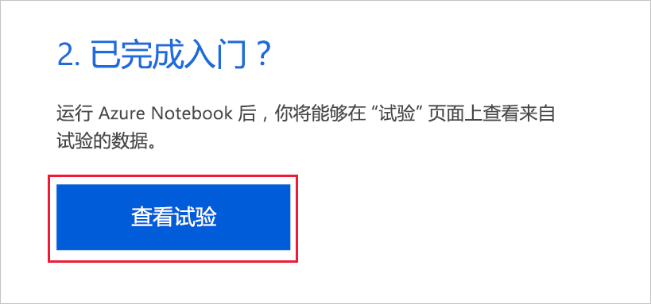
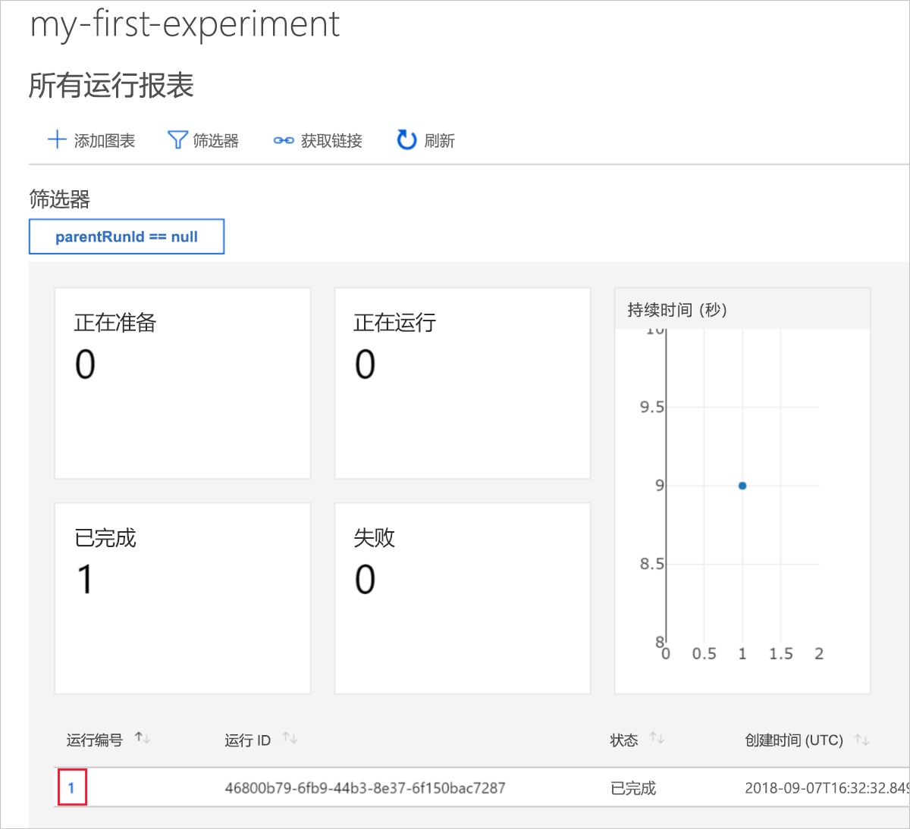
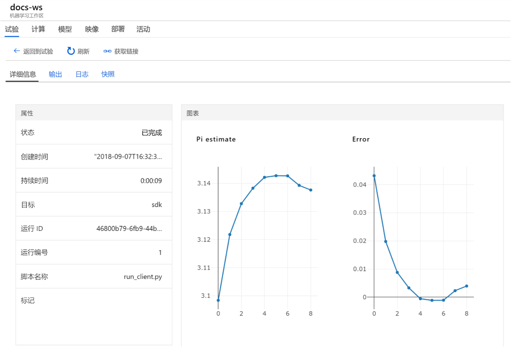

# 快速入门：通过 Azure 门户开始使用 Azure 机器学习

在本快速入门中，请使用 Azure 门户创建 Azure 机器学习工作区。 该工作区是基础的云端块，用于通过机器学习进行机器学习模型的试验、训练和部署。 本快速入门使用云资源，不需安装。 要改为配置自己的 Jupyter 笔记本服务器，请参阅[快速入门：通过 Python 开始使用 Azure 机器学习](quickstart-create-workspace-with-python.md)。

> [!VIDEO https://www.microsoft.com/en-us/videoplayer/embed/RE2F9Ad]

在本快速入门中，请执行以下操作：

* 在 Azure 订阅中创建工作区。
* 在 Azure Notebook 中搭配 Python 使用，并记录多个迭代中的值。
* 在工作区中查看所记录的值。

如果区域支持，下述 Azure 资源会自动添加到工作区：

  - [Azure 容器注册表](https://azure.microsoft.com/services/container-registry/)
  - [Azure 存储](https://azure.microsoft.com/services/storage/)
  - [Azure Application Insights](https://azure.microsoft.com/services/application-insights/) 
  - [Azure Key Vault](https://azure.microsoft.com/services/key-vault/)

所创建的资源可以用作其他机器学习服务教程和操作方法文章的先决条件。 与其他 Azure 服务一样，与机器学习关联的某些资源也存在限制，例如计算群集大小。 详细了解[默认限制以及如何增加配额](how-to-manage-quotas.md)。

如果还没有 Azure 订阅，请在开始前创建免费帐户。 立即试用 [Azure 机器学习服务免费版或付费版](http://aka.ms/AMLFree)。

## 创建工作区 

[!INCLUDE [aml-create-portal](../../../includes/aml-create-in-portal.md)]

在工作区页面上，选择`Explore your Azure Machine Learning service workspace`。

 

## 使用工作区

现在看看工作区如何帮助你管理机器学习脚本。 本部分的操作：

* 在 Azure Notebooks 中打开笔记本。
* 运行会创建一些记录值的代码。
* 在工作区中查看所记录的值。

该示例介绍如何通过工作区跟踪脚本中生成的信息。 

### 打开笔记本 

Azure Notebooks 为 Jupyter Notebook 提供了一个免费的云平台，它预配置有运行机器学习所需的一切内容。  

选择`Open Azure Notebooks`，尝试第一个试验。

 

组织可能需要[管理员许可](https://notebooks.azure.com/help/signing-up/work-or-school-account/admin-consent)才能让你登录。

登录后，会打开一个新的选项卡并显示 `Clone Library` 提示。 选择 `Clone`。

### 运行笔记本

除了两个 Notebook，还将显示 `config.json` 文件。 此配置文件包含已创建的工作区的相关信息。  

选择 `01.run-experiment.ipynb` 以打开 Notebook。

若要一次运行一个单元，请使用 `Shift`+`Enter`。 也可选择 `Cells` > `Run All` 运行整个 Notebook。 在单元旁边看到星号 [*] 时，表明它正在运行。 该单元的代码完成后，会显示一个数字。 

运行完 Notebook 中的所有单元格以后，即可在工作区中查看记录的值。

## 查看所记录的值

运行 Notebook 中的所有单元后，返回到门户页面。  

选择 `View Experiments`。

关闭 `Reports` 弹出窗口。

选择 `my-first-experiment`。

查看刚才执行的运行相关信息。 向下滚动页面，找到运行表。 选择运行编号链接。

 

你会看到自动创建的记录值的绘图。 只要使用相同的名称参数记录了多个值，系统就会自动为你生成绘图。

   

由于估算 pi 的代码使用随机值，因此绘图会显示不同的值。  

## 清理资源 

[!INCLUDE [aml-delete-resource-group](../../../includes/aml-delete-resource-group.md)]

还可保留资源组，但请删除单个工作区。 显示工作区属性，然后选择“删除”。

## 后续步骤

你已创建了进行试验和部署模型所需的资源。 另外，已在 Notebook 中运行一些代码。 已在云工作区中浏览了该代码的运行历史记录。

若要深入体验工作流，请按照机器学习教程来训练和部署模型。  

> [!div class="nextstepaction"]
> [教程：训练图像分类模型](tutorial-train-models-with-aml.md)
