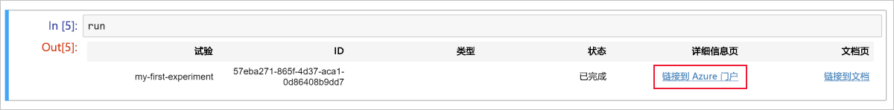
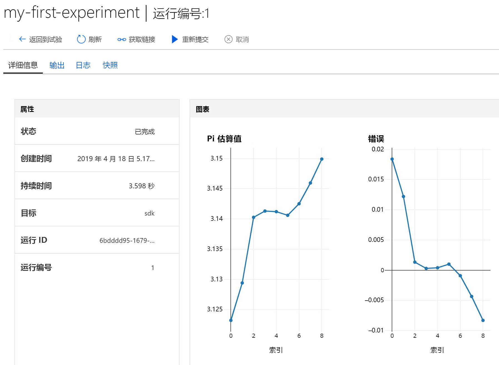

# 快速入门：通过基于云的 Notebook 服务器开始使用 Azure 机器学习

创建基于云的笔记本服务器，然后使用它。  在本快速入门中，我们运行 Python 代码，在 [Azure 机器学习服务工作区](concept-azure-machine-learning-architecture.md)中记录值。 该工作区是基础的云端块，用于通过机器学习进行机器学习模型的试验、训练和部署。 

本快速入门介绍如何在 Azure 机器学习工作区中创建云资源，该工作区已配置了运行 Azure 机器学习所需的 Python 环境。 若要改用自己的环境，请参阅[快速入门：通过自己的 Notebook 服务器开始使用 Azure 机器学习](quickstart-run-local-notebook.md)。  

在本快速入门中，你将执行以下操作：

* 在工作区中创建新的基于云的笔记本服务器。
* 启动 Jupyter Web 界面。
* 打开一个笔记本，其中包含的代码可以在每次迭代时消除 pi 和日志错误。
* 运行笔记本。
* 在工作区中查看所记录的错误值。 该示例介绍如何通过工作区跟踪脚本中生成的信息。

如果没有 Azure 订阅，请在开始之前创建一个免费帐户。 立即试用 [Azure 机器学习服务免费版或付费版](https://aka.ms/AMLFree)。

## 创建工作区

如果你有一个 Azure 机器学习服务工作区，请跳至[下一部分](#create-a-cloud-based-notebook-server)。 否则，请立即创建一个。

[!INCLUDE [aml-create-portal](../../../includes/aml-create-in-portal.md)]

## 创建基于云的笔记本服务器

 在工作区中创建云资源，以便开始使用 Jupyter 笔记本。 此服务提供一个基于云的平台，该平台已预先配置了运行 Azure 机器学习服务所需的一切。

1. 在 [Azure 门户](https://portal.azure.com/)中打开你的工作区。  如果不确定如何在门户中查找工作区，请参阅如何[查找工作区](how-to-manage-workspace.md#view)。

1. 在 Azure 门户的工作区页上，选择左侧的“笔记本 VM”。

1. 选择“+新建”，创建一个笔记本 VM。

     

1. 为 VM 提供一个名称。 然后选择“创建”。

    > [!NOTE]
    > 笔记本 VM 名称必须为 2 到 16 个字符。 有效字符为字母、数字和 - 字符。  名称还必须在 Azure 订阅中独一无二。

    

1. 等待约 4-5 分钟，直至状态更改为“正在运行”。

## 启动 Jupyter Web 界面

在 VM 运行以后，使用“笔记本 VM”部分启动 Jupyter Web 界面。

1. 在 VM 的“URI”列中选择“Jupyter”。  

    

    此链接启动笔记本服务器并在新的浏览器标签页中打开 Jupyter 笔记本网页。此链接将仅适用于创建 VM 的人。

1. 在 Jupyter 笔记本网页上，顶部文件夹名称为用户名。  选择该文件夹。

1. samples 文件夹名称包含版本号，例如 **samples-1.0.33.1**。  选择 samples 文件夹。

1. 选择**快速入门**笔记本。

## 运行笔记本

运行一个笔记本，估算 pi 并将错误记录到工作区。

1. 选择 **01.run-experiment.ipynb** 以打开笔记本。

1. 单击第一个代码单元，然后选择“运行”。

    > [!NOTE]
    > 代码单元之前有括号。 如果括号是空的 (__[  ]__)，则表明代码尚未运行。 运行代码时，会看到一个星号 (__[*]__)。 代码完成后，会显示一个数字 **[1]**。  该数字表明单元的运行顺序。
    >
    > 使用 **Shift-Enter** 作为运行某个单元的快捷方式。

    

1. 运行第二个代码单元。 如果看到身份验证说明，请复制代码，然后单击登录链接。 登录后，浏览器会记住该设置。  

    

1. 完成后，会显示单元编号 __[2]__。  如果已登录过，则会看到一条表明身份验证成功的状态消息。   如果未登录过，则不会看到此单元的任何输出，只会看到编号，表明该单元已成功运行。

    

1. 运行余下的代码单元。  当每个单元完成运行时，会看到其单元编号显示。 只有最后一个单元显示任意其他输出。  

    在最大的代码单元中，会看到 `run.log` 在多个位置使用。 每个 `run.log` 都会将其值添加到工作区。

## 查看所记录的值

1. `run` 单元的输出包含一个可以返回到 Azure 门户的链接，用于在工作区中查看试验结果。

    

1. 单击“链接到 Azure 门户”，查看在工作区中的运行的相关信息。  此链接打开 Azure 门户中的工作区。

1. 你看到的已记录值的绘图已自动在工作区中创建。 只要使用相同的名称参数记录了多个值，系统就会自动为你生成绘图。

   

由于估算 pi 的代码使用随机值，因此绘图会显示不同的值。  

## 清理资源

### 停止笔记本 VM

在不使用笔记本 VM 时，请将其停止，以便降低成本。  

1. 在工作区中，选择“笔记本 VM”。

   

1. 从列表中选择 VM。

1. 选择“停止”。

1. 准备再次使用服务器时，请选择“启动”。

### 删除所有内容

[!INCLUDE [aml-delete-resource-group](../../../includes/aml-delete-resource-group.md)]

还可保留资源组，但请删除单个工作区。 显示工作区属性，然后选择“删除”。

## 后续步骤

在本快速入门中，我们完成了以下任务：

* 创建笔记本 VM。
* 启动 Jupyter Web 界面。
* 打开一个笔记本，其中包含的代码可以在每次迭代时消除 pi 和日志错误。
* 运行笔记本。
* 在工作区中查看所记录的错误值。  该示例介绍如何通过工作区跟踪脚本中生成的信息。 

在 Jupyter Notebook 网页上浏览 samples 文件夹中的其他笔记本，详细了解 Azure 机器学习服务。

若要深入体验工作流，请按照机器学习教程来训练和部署模型：  

> [!div class="nextstepaction"]
> [教程：训练图像分类模型](tutorial-train-models-with-aml.md)
