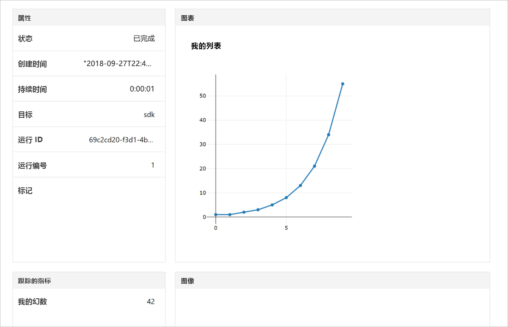

# <a name="quickstart-use-your-own-notebook-server-to-get-started-with-azure-machine-learning"></a>快速入门：通过自己的 Notebook 服务器开始使用 Azure 机器学习

通过你自己的 Python 环境和 Jupyter Notebook 服务器开始使用 Azure 机器学习服务。  有关不需安装 SDK 的快速入门，请参阅[快速入门：通过基于云的 Notebook 服务器开始使用 Azure 机器学习](quickstart-run-cloud-notebook.md)。

本快速入门展示了如何使用 [Azure 机器学习服务工作区](concept-azure-machine-learning-architecture.md)来跟踪你的机器学习试验。 你将运行 Python 代码，用以将值记录到工作区中。

观看本快速入门的视频版本：

> [!VIDEO https://www.microsoft.com/en-us/videoplayer/embed/RE2G9N6]

如果没有 Azure 订阅，请在开始之前创建一个免费帐户。 立即试用 [Azure 机器学习服务免费版或付费版](https://aka.ms/AMLFree)。

## <a name="prerequisites"></a>先决条件

* 一个安装了 Azure 机器学习 SDK 的 Python 3.6 Notebook 服务器
* 一个 Azure 机器学习服务工作区
* 一个工作区配置文件 (.azureml/config.json)  。

从[创建 Azure 机器学习服务工作区](setup-create-workspace.md#sdk)获取所有这些先决条件。


## <a name="use-the-workspace"></a>使用工作区

在工作区配置文件 (.azureml/config.json)  所在目录中创建一个脚本或启动一个笔记本。

### <a name="attach-to-workspace"></a>附加到工作区

此代码从要附加到工作区的配置文件中读取信息。

```
from azureml.core import Workspace

ws = Workspace.from_config()
```

### <a name="log-values"></a>记录值

运行使用 SDK 基本 API 来跟踪试验运行的代码。

1. 在工作区中创建一个试验。
1. 将单个值记录到试验中。
1. 将值列表记录到试验中。

[!code-python[](~/aml-sdk-samples/ignore/doc-qa/quickstart-create-workspace-with-python/quickstart.py?name=useWs)]

## <a name="view-logged-results"></a>查看记录的结果

运行完成后，可在 Azure 门户中查看试验运行。 使用以下代码打印导航至最后一次运行的结果的 URL：

```python
print(run.get_portal_url())
```

此代码返回一个链接，你可以使用该链接在浏览器中查看 Azure 门户中记录的值。



## <a name="clean-up-resources"></a>清理资源 

>[!IMPORTANT]
>可以使用此处已创建的资源作为其他机器学习教程和操作方法文章的先决条件。

如果不打算使用本文中创建的资源，请删除它们，以免产生任何费用。

[!code-python[](~/aml-sdk-samples/ignore/doc-qa/quickstart-create-workspace-with-python/quickstart.py?name=delete)]

## <a name="next-steps"></a>后续步骤

在本文中，你创建了进行试验和部署模型所需的资源。 在 Notebook 中运行了代码，并在云端工作区中浏览了该代码的运行历史记录。

> [!div class="nextstepaction"]
> [教程：训练图像分类模型](tutorial-train-models-with-aml.md)

还可以学习 [GitHub 中的更高级示例](https://aka.ms/aml-notebooks)或查看 [SDK 用户指南](https://docs.microsoft.com/python/api/overview/azure/ml/intro?view=azure-ml-py)。
