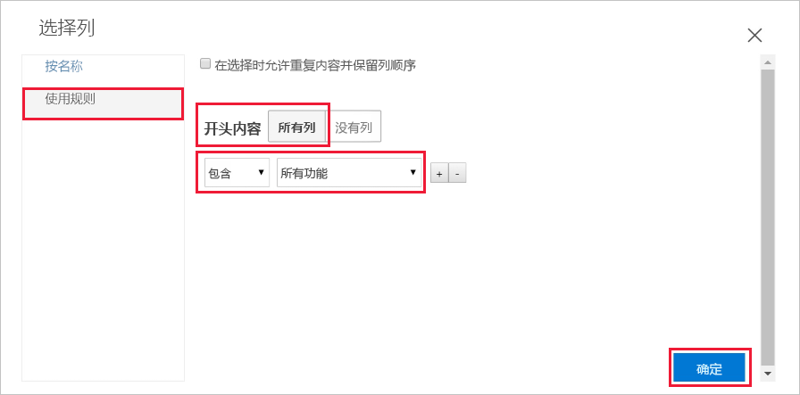
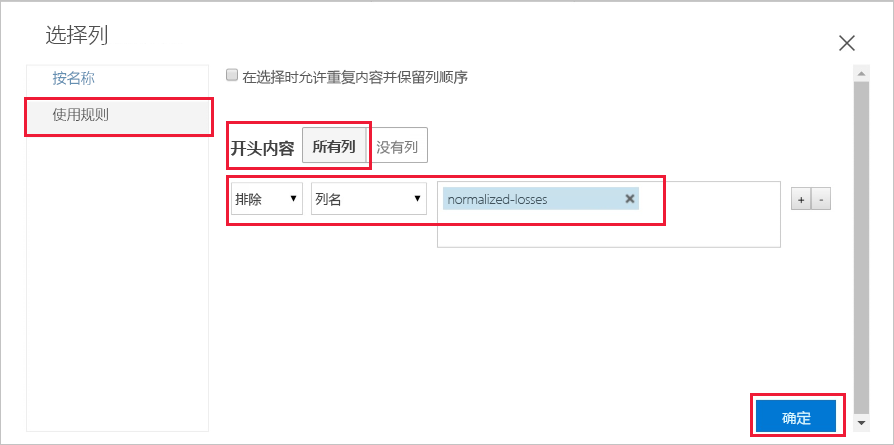
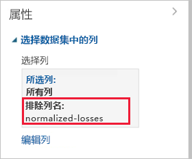
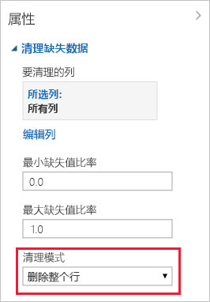

# 快速入门：在 Azure 机器学习中在不编写代码的情况下准备数据并将其可视化

在 Azure 机器学习的拖放可视界面（预览版）中准备数据并将其可视化。 将要使用的数据包含各种个人汽车的条目，包括制造商、车型、技术规格、价格等信息。  

在本快速入门中，我们将浏览并准备数据：

- 创建第一个试验，以便添加和预览数据
- 准备数据，删除缺失的值
- 运行试验
- 可视化生成的数据

如果一点都不熟悉机器学习，请观看[适合初学者的数据科学](https://docs.microsoft.com/azure/machine-learning/studio/data-science-for-beginners-the-5-questions-data-science-answers)视频系列，这是一个有关机器学习的很好的简介。

## 先决条件

如果还没有 Azure 订阅，请在开始前创建免费帐户。 立即试用 [Azure 机器学习服务免费版或付费版](https://aka.ms/AMLFree)。

### 创建工作区

如果你有一个 Azure 机器学习服务工作区，请跳至[下一部分](#start)。 否则，请立即创建一个。

[!INCLUDE [aml-create-portal](../../../includes/aml-create-in-portal.md)]

##  打开可视界面网页

1. 在 [Azure 门户](https://portal.azure.com/)中打开你的工作区。  

1. 在工作区中，选择“可视界面”。   然后，选择“启动可视界面”。   
 
    

    界面网页会在新浏览器页中打开。  

## 创建第一个试验

此可视界面工具提供了一个交互式的可视场所，可以轻松地在预测分析模型上执行生成、测试和迭代操作。 可以将数据集和分析模块拖放到交互式画布上，将它们连接到一起即可构建一个试验  。  立即创建第一个试验。

1. 在左下角选择“新增”。 

1. 选择“空白试验”。 

1. 将为试验提供一个默认名称。 选择该文本，将其重命名为“Quickstart-explore data”。 此名称不需独一无二。

1. 屏幕底部的**迷你图**用于查看大型试验。  本快速入门不需要它，因此请单击顶部的箭头将其最小化。  

    

## 添加数据

需要用于机器学习的首先是数据。 可以使用本界面中包含的数个示例数据集，也可从多个源导入数据。 就此示例来说，可以使用示例数据集“汽车价格数据*(原始)”。  

1. 试验画布左侧是数据集和模块的控制板。 选择“保存的数据集”，然后选择“示例”，以便查看可用的示例数据集。  

1. 选择数据集“汽车价格数据*(原始)”，然后将其拖到画布上。 

   

## 选择列

选择要处理哪些数据列。  若要开始操作，请将模块配置为显示所有可用列。

> [!TIP]
> 如果知道所需数据或模块的名称，请使用调色板顶部的搜索栏进行快速查找。  本快速入门的其余部分将使用此快捷方式。

1. 在“搜索”框中键入“选择”，以便查找“在数据集中选择列”模块。  

1. 单击“在数据集中选择列”，然后将其拖到画布上。  将模块拖到此前添加的数据集下方。

1. 将数据集连接到“在数据集中选择列”：  单击数据集的输出端口，将其拖到“在数据集中选择列”的输入端口，然后放开鼠标按钮。  即便是在画布上来回移动，数据集和模块仍保持连接。

    > [!TIP]
    > 数据集和模块都有由小圆圈表示的输入和输出端口 - 输入端口位于顶部，输出端口位于底部。 将一个模块的输出端口连接到另一个模块的输入端口时，即可通过试验创建数据流。
    >
    > 如果无法连接模块，可尝试一路拖到要连接的节点中。

     

    红色感叹号表示尚未设置该模块的属性。 我们会在下一步完成该操作。
   
1. 选择“在数据集中选择列”模块。 

1. 在画布右侧的“属性”窗格中，选择“编辑列”。  

    在“选择列”对话框中选择“所有列”，并包括“所有功能”。    此对话框应如下所示：

     

1. 在右下角，选择“确定”以关闭列选择器。 

## 运行试验

在任何时刻，单击数据集或模块的输出端口即可查看数据流中的数据在该时刻的情形。  如果“可视化”选项已禁用，则先需要运行此试验。   我们会在下一步完成该操作。

[!INCLUDE [aml-ui-create-training-compute](../../../includes/aml-ui-create-training-compute.md)]

在计算目标可用后，试验就会运行。 在运行完成以后，会在每个模块上显示绿色的复选标记。

## 预览数据

运行初始试验以后，可以将数据可视化，详细了解需处理的信息。

1. 选择“在数据集中选择列”底部的输出端口，然后选择“可视化”。  

1. 单击数据窗口中的不同列，查看有关该列的信息。  

    在此数据集中，每行代表一辆汽车，与每辆汽车关联的变量显示为列。    此数据集中有 205 行和 26 列。

     每次单击某个数据列时，就会在左侧显示该列的**统计**信息和**可视化**图像。  例如，单击 **num-of-doors** 时，会看到它有 2 个唯一值和 2 个缺失值。  向下滚动即可看到值：两个门和四个门。

     

1. 单击每个列即可详细了解数据集。

## 准备数据

数据集通常需要经过一定的预处理才能进行分析。 可能已注意到在各个行的列中存在缺失值。 需要清除这些缺失值，使模型能够正确分析数据。 将删除任何有缺失值的行。 另外，**normalized-losses** 列有大比例的缺失值，因此你将从模型中完全排除该列。

> [!TIP]
> 使用大多数模块时，都必须从输入数据中清除缺失值。  

### 删除列

首先，彻底删除 **normalized-losses** 列。

1. 选择“在数据集中选择列”模块。 

1. 在画布右侧的“属性”窗格中，选择“编辑列”。  

    * 让“使用规则”和“所有列”保持选中状态。  

    * 在下拉列表中，选择“排除”  和“列名称”  ，并在文本框内部单击。 键入“normalized-losses”。 

    * 在右下角，选择“确定”以关闭列选择器。 

    
        
    现在，“在数据集中选择列”的属性窗格指示它会传递数据集中除 **normalized-losses** 外的所有列。
        
    属性窗格显示 **normalized-losses** 列已排除。
        
    
        
    可以双击模块并输入文本，为模块添加注释。 这有助于快速查看模块在实验中的运行情况。 

1. 双击“在数据集中选择列”模块，键入注释“排除规范化的损失”。  
    
    键入注释后，在模块外单击。  此时会显示一个向下箭头，表明模块包含注释。

1. 单击向下箭头，显示注释。

    模块现在显示向上箭头，隐藏注释。
        
    

### 清理缺失数据

现在添加另一模块，该模块删除有缺失值的任何余下的行。

1. 在“搜索”框中键入“清理”，查找“清理缺失数据”模块。  

1. 将“清理缺失数据”模块拖到试验画布上，然后将其连接到“在数据集中选择列”模块。   

1. 在“属性”窗格中，选择“清理模式”下的“删除整个行”。  

    这些选项指导“清理缺失数据”来清理数据，方法是删除有缺失值的行。 

1. 双击该模块并键入注释“删除缺失值行”。
 
    

    试验现在应该如下所示：
    
    

## 可视化结果

由于对试验中的模块进行了更改，因此状态已变为“处于草稿状态”。  若要将新的干净数据可视化，先需再次运行试验。

1. 选择底部的“运行”，运行此试验。 

    这次可以重复使用此前创建的计算目标。  

1. 选择对话框中的“运行”。 

   

1. 当运行完成以后，右键单击“清理缺失数据”模块，将新的干净数据可视化。   

    

1. 单击已清理数据窗口中的不同列，查看数据的改变情况。  

    

    现在有 193 行和 25 列。

    单击 **num-of-doors** 时，可以看到它仍有 2 个唯一值，但现在有 0 个缺失值。  

## 清理资源

[!INCLUDE [aml-ui-cleanup](../../../includes/aml-ui-cleanup.md)]

## 后续步骤

在此快速入门中，读者学习了如何：

- 创建第一个试验，以便添加和预览数据
- 准备数据，删除缺失的值
- 可视化生成的数据

继续阅读教程，了解如何使用该数据来预测汽车的价格。

> [!div class="nextstepaction"]
> [教程：使用可视界面预测汽车价格](ui-tutorial-automobile-price-train-score.md)
