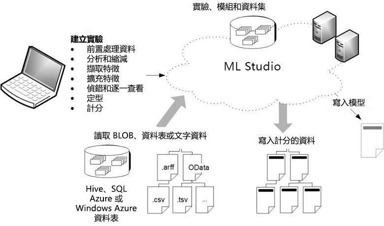

# 什么是机器学习工作室（经典版）？

[!INCLUDE [Designer notice](../../../includes/designer-notice.md)]

Microsoft Azure 机器学习工作室（经典版）是一个协作型拖放式工具，可用于根据数据构建、测试和部署预测分析解决方案。 Azure 机器学习工作室（经典版）将模型发布为可让自定义应用或 BI 工具（如 Excel）方便使用的 Web 服务。

机器学习工作室（经典版）中融合了数据科学、预测分析、云资源和数据。

## 机器学习工作室（经典版）交互式工作区
若要开发预测分析模型，通常使用一个或多个源中的数据，然后通过各种数据操作和统计函数对该数据进行转换和分析，生成一组结果。 开发此类模型是一个迭代过程。 在修改各种函数及其参数时，结果会不断趋于一致，直到已训练的有效模型令人满意。

Azure 机器学习工作室（经典版）提供交互式的可视工作区，可在其中轻松构建、测试和迭代预测分析模型。 可以将数据集和分析模块拖放到交互式画布，将它们连接在一起构成试验，然后在机器学习工作室（经典版）中运行。 若要在模型设计上迭代，则需要编辑试验，可根据需要保存一个副本，并重新运行该试验。 准备就绪后，可以将 ***训练实验*** 转换为 ***预测试验***，然后将其发布为 ***Web 服务”发布***，以便其他人可以访问模型。

不需要编程，只需以可视方式连接数据集和模块即可构建预测分析模型。

## 机器学习工作室（经典版）与 Azure 机器学习有什么区别？

[Azure 机器学习](../overview-what-is-azure-ml.md)提供 SDK 和 Azure 机器学习设计器（预览版），可以快速准备数据，以及对机器学习模型进行训练和部署  。 此设计器提供与工作室（经典版）类似的拖放体验。 但是，不像工作室（经典版）的专用计算平台，此设计器使用你自己的计算资源，并且已完全集成到 Azure 机器学习中。

下面是一个快速比较：

|| 机器学习工作室（经典版） | Azure 机器学习 |
|---| --- | --- |
| 拖放界面 | 是 | 是 - [Azure 机器学习设计器（预览版）](../concept-designer.md) |
| 试验 | 可缩放（10 GB 训练数据限制） | 使用计算目标进行缩放 |
| 拖放界面的模块 | 很多 | 常用[模块](../algorithm-module-reference/module-reference.md)的初始集|
|训练计算目标| 专用计算目标，仅限 CPU 支持| 支持 Azure 机器学习计算（GPU 或 CPU）和笔记本 VM。 （[SDK 中支持的其他计算](../concept-compute-target.md#train)）|
|推断计算目标| 专用 Web 服务格式，不可自定义 |  Azure Kubernetes 服务和 AML 计算  （[SDK 中支持的其他计算](../how-to-deploy-and-where.md)） |
| ML 管道 | 不支持 | 支持[管道](../concept-ml-pipelines.md) |
| MLOps | 基本模型管理和部署 | 可配置的部署 - 模型和管道版本控制和跟踪 |
| 模型格式 | 专用格式，仅限工作室（经典版） | 标准格式取决于训练作业类型 |
|自动化模型训练和超参数优化 | 否 | 尚未在设计器中   （[在 SDK 和工作区登陆页中受支持](../concept-automated-ml.md)） | 

尝试使用[教程：使用设计器预测汽车价格](../tutorial-designer-automobile-price-train-score.md)

> [!NOTE]
> 在工作室（经典版）中创建的模型不能通过 Azure 机器学习来部署或管理。 但是，在设计器中创建和部署的模型可以通过 Azure 机器学习工作区进行管理。

## 下载机器学习工作室（经典版）概述示意图
下载“Microsoft Azure 机器学习工作室（经典版）功能概述”示意图，并获取机器学习工作室（经典版）功能的高级视图  。 若要随时随地查看，可以打印卡片大小（11 x 17 英寸）的示意图。

**此处下载关系图：[Microsoft Azure 机器学习工作室（经典版）功能概述](https://download.microsoft.com/download/C/4/6/C4606116-522F-428A-BE04-B6D3213E9E52/ml_studio_overview_v1.1.pdf)** 

## 工作室（经典版）试验的组成部分
试验由数据集组成，数据集将数据提供给分析模块，将这些模块连接起来即可构成预测分析模型。 具体而言，有效的试验有以下特征：

* 试验至少包含一个数据集和一个模块
* 数据集只能连接到模块
* 模块可以连接到数据集或其他模块
* 模块的所有输入端口必须与数据流建立某种连接
* 必须设置每个模块的所有必需参数

可以从头开始创建试验，或者使用现有的示例试验作为模板。 有关详细信息，请参阅[复制示例试验以创建新的机器学习试验](sample-experiments.md)。

有关创建简单试验的示例，请参阅 [Create a simple experiment in Azure Machine Learning Studio](create-experiment.md)（在 Azure 机器学习工作室（经典版）中创建简单试验）。

有关创建预测分析解决方案的更完整演练，请参阅 [Develop a predictive solution with Azure Machine Learning Studio](tutorial-part1-credit-risk.md)（使用 Azure 机器学习工作室（经典版）开发预测解决方案）。

### 数据集
数据集是指已上传到机器学习工作室（经典版），可在建模过程中使用的数据。 机器学习工作室（经典版）提供了许多示例数据集供试验，你可根据需要上传更多的数据集。 下面是随附数据集的一些例子：

* **各种汽车的 MPG 数据** - 汽车的每加仑燃油英里数 (MPG) 值，按缸数、马力等参数列出。
* **乳腺症数据** - 乳腺癌诊断数据。
* **森林火灾数据** - 葡萄牙东北部森林火灾的规模。

构建试验时，可以从画布左侧提供的数据集列表中进行选择。

有关机器学习工作室（经典版）随附的示例数据集列表，请参阅 [Use the sample data sets in Azure Machine Learning Studio](use-sample-datasets.md)（使用 Azure 机器学习工作室（经典版）中的示例数据集）。

### 模块
模块是可对数据执行的算法。 Azure 机器学习工作室（经典版）有许多模块，包括数据引入函数、训练、评分和验证过程。 下面是随附模块的一些例子：

* [转换为 ARFF][convert-to-arff] - 将 .NET 序列化数据集转换为属性关系文件格式 (ARFF)。
* [计算基本统计信息][elementary-statistics] - 计算基本统计信息，例如平均值、标准偏差等。
* [线性回归][linear-regression] - 创建基于在线梯度下降的线性回归模型。
* [评分模型][score-model] - 为训练的分类或回归模型评分。

构建试验时，可以从画布左侧提供的模块列表中选择。

模块可能提供一组参数用于配置模块的内部算法。 在画布上选择模块时，模块的参数会显示在画布右侧的“属性”  窗格中。 可以在该窗格中修改参数来调整模型。

在浏览可用的机器学习算法大型库时如需帮助，请参阅 [How to choose algorithms for Microsoft Azure Machine Learning Studio](algorithm-choice.md)（如何选择 Microsoft Azure 机器学习工作室（经典版）的算法）。

## 部署预测分析 Web 服务
准备好预测分析模型后，可以从机器学习工作室（经典版）将它部署为 Web 服务。 有关此过程的信息，请参阅 [Deploy an Azure Machine Learning web service](deploy-a-machine-learning-web-service.md)（部署 Azure 机器学习 Web 服务）。

## 后续步骤
可以使用[分步快速入门](create-experiment.md)和[基于样本的构建](sample-experiments.md)了解预测分析和机器学习的基础知识。

<!-- Module References -->
[convert-to-arff]: https://msdn.microsoft.com/library/azure/62d2cece-d832-4a7a-a0bd-f01f03af0960/
[elementary-statistics]: https://msdn.microsoft.com/library/azure/3086b8d4-c895-45ba-8aa9-34f0c944d4d3/
[linear-regression]: https://msdn.microsoft.com/library/azure/31960a6f-789b-4cf7-88d6-2e1152c0bd1a/
[score-model]: https://msdn.microsoft.com/library/azure/401b4f92-e724-4d5a-be81-d5b0ff9bdb33/
