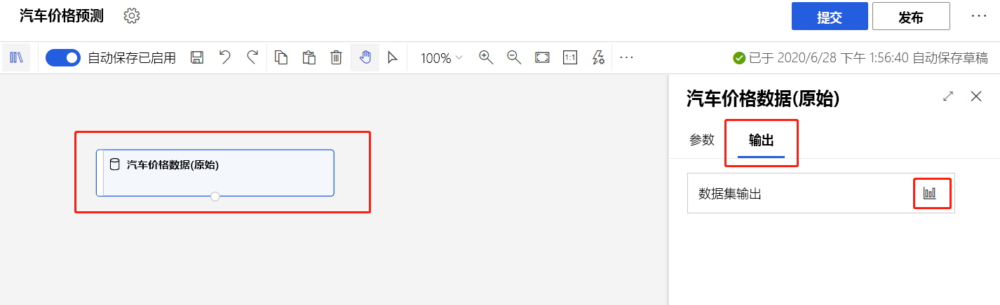
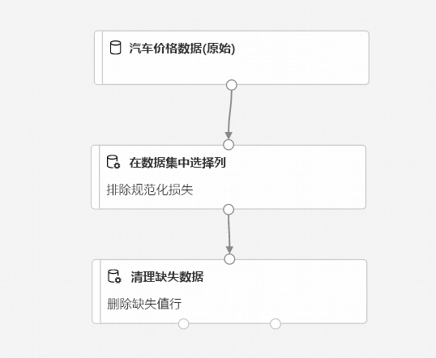
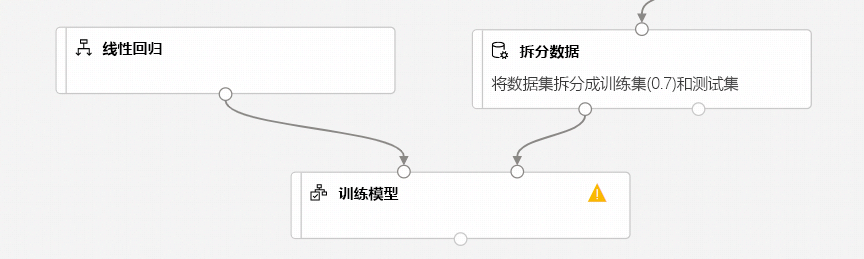
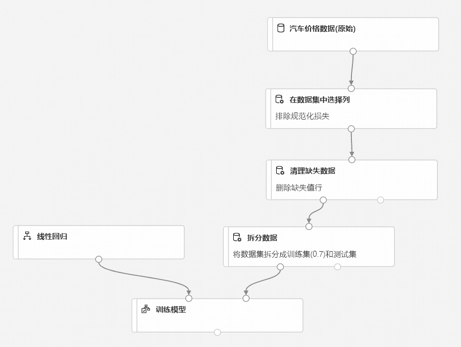
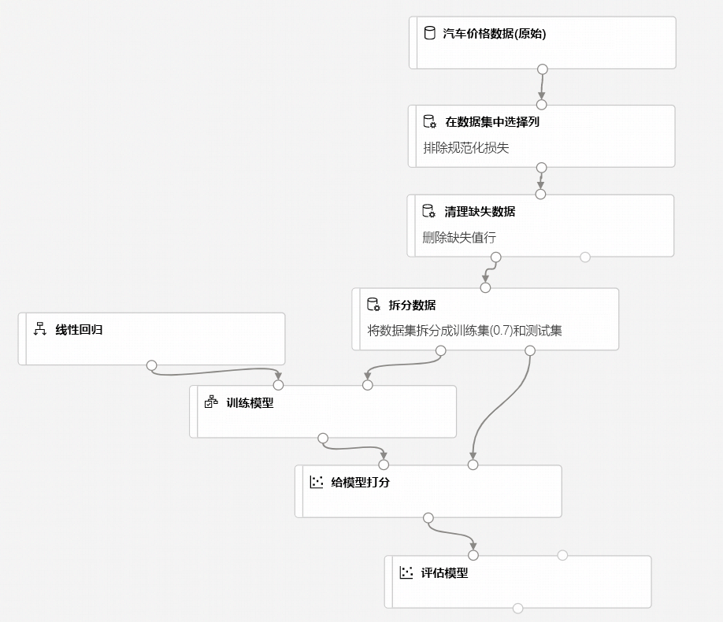
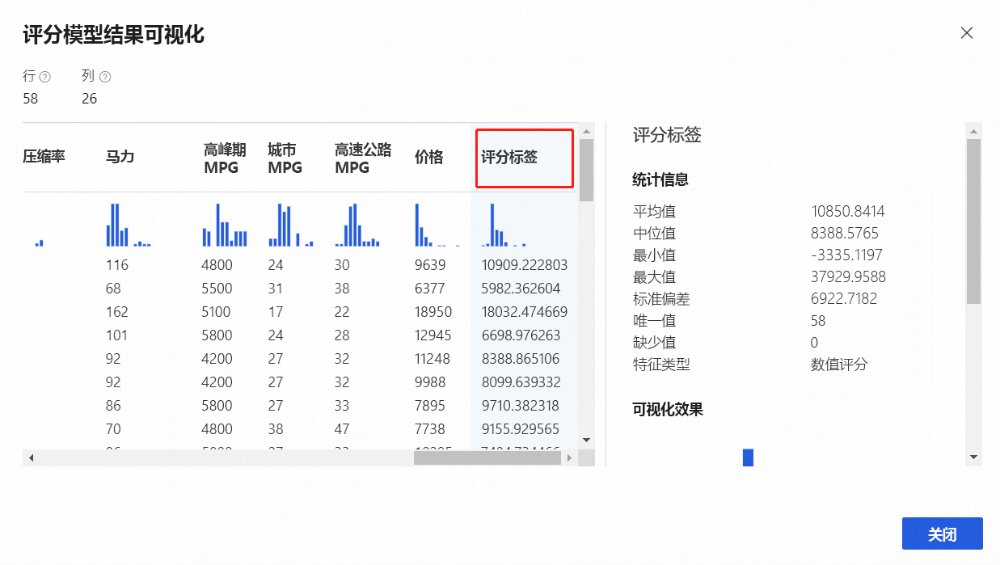

# 教程：使用设计器预测汽车价格（预览）
[!INCLUDE [applies-to-skus](../../includes/aml-applies-to-enterprise-sku.md)]

本教程分为两部分，介绍如何使用 Azure 机器学习设计器来训练并部署一个可预测汽车价格的机器学习模型。 该设计器是一个拖放式的工具，在其中可以创建机器学习模型，而无需编写任何代码。

本教程的第一部分介绍如何：

> [!div class="checklist"]
> * 创建新管道。
> * 导入数据。
> * 准备数据。
> * 训练机器学习模型。
> * 评估机器学习模型。

在本教程的[第二部分](tutorial-designer-automobile-price-deploy.md)，你要将模型部署为实时推理终结点，以根据发送它的技术规范来预测任何汽车的价格。 

> [!NOTE]
>我们提供了本教程的已完成版本作为示例管道。
>
>若要找到该示例，请转到工作区中的设计器。 在“新建管道部分，选择”示例 1 - 回归:   汽车价格预测(基本)”。

## 创建新管道

Azure 机器学习管道可将多个机器学习和数据处理步骤组织成单个资源。 管道可让你在不同的项目和用户之间组织、管理与重用复杂的机器学习工作流。

若要创建 Azure 机器学习管道，需要一个 Azure 机器学习工作区。 本部分介绍如何创建这两个资源。

### 创建新的工作区

若要使用设计器，首先需要一个 Azure 机器学习工作区。 工作区是 Azure 机器学习的顶级资源，提供一个中心位置用于处理 Azure 机器学习中创建的所有项目。

如果你已使用企业版创建了一个 Azure 机器学习工作区，请[跳到下一部分](#create-the-pipeline)。

[!INCLUDE [aml-create-portal](../../includes/aml-create-in-portal-enterprise.md)]

### 创建管道

1. 登录到 <a href="https://ml.azure.com?tabs=jre" target="_blank">ml.azure.com</a>，选择要使用的工作区。

1. 选择“设计器”。 

    

1. 选择“易用的预生成模块”。 

1. 在画布顶部，选择默认管道名称“Pipeline-Created-on”。  将其重命名为“汽车价格预测”。  名称不需唯一。

## 设置默认计算目标

管道在计算目标上运行，该目标是附加到工作区的计算资源。 创建计算目标后，就可以在以后的运行中重用它。

可为整个管道设置**默认计算目标**，告知每个模块要默认使用同一个计算目标。 但是，可以基于每个模块指定计算目标。

1. 在管道名称旁边，选择画布顶部的**齿轮图标**  打开“设置”窗格。 

1. 在画布右侧的“设置”窗格中，选择“选择计算目标”。  

    如果已有可用的计算目标，则可以选择它来运行此管道。

    > [!NOTE]
    > 设计器只能对机器学习计算目标运行试验。 不会显示其他计算目标。

1. 输入计算资源的名称。

1. 选择“保存”。 

    > [!NOTE]
    > 创建计算资源大约需要五分钟。 创建资源之后，可以重用它，并跳过此等待时间，以便将来运行。
    >
    > 计算资源在空闲时会自动缩放为 0 个节点以节省成本。 在延迟之后再次使用它时，可能会经历大约五分钟的等待时间，同时它会重新扩展。

## 导入数据

此设计器中包含多个示例数据集供你进行试验。 本教程使用“汽车价格数据(原始)”  。 

1. 管道画布左侧是数据集和模块的控制板。 选择“数据集”，然后查看“示例”部分以查看可用的示例数据集   。

1. 选择数据集“汽车价格数据(原始)”，然后将其拖到画布上  。

   

### 可视化数据

可将数据可视化以了解要使用的数据集。

1. 选择“汽车价格数据(原始)”模块。 

1. 在画布右侧的模块详细信息窗格中，选择“输出”。 

1. 选择图形图标以可视化数据。

    

1. 选择数据窗口中的不同列，查看有关每个列的信息。

    每行代表一辆汽车，与每辆汽车关联的变量显示为列。 此数据集中有 205 行和 26 列。

## 准备数据

数据集通常需要在分析之前经过某种预处理。 在检查数据集时，你可能已经注意到某些值缺失。 必须清除这些缺失值，使模型能够正确分析数据。

### 删除列

训练模型时，必须对缺失的数据执行某些操作。 在此数据集中，**normalized-losses** 列缺失许多值，因此需要从模型中完全排除该列。

1. 在画布左侧的模块控制板中，展开“数据转换”部分并找到“选择数据集中的列”模块。  

1. 将“选择数据集中的列”模块拖到画布上  。 将该模块放在数据集模块下面。

1. 将“汽车价格数据(原始)”数据集连接到“选择数据集中的列”模块   。 从数据集的输出端口（画布上数据集底部的小圆圈）拖到“选择数据集中的列”  的输入端口（模块顶部的小圆圈）。

    > [!TIP]
    > 将一个模块的输出端口连接到另一个模块的输入端口时，即可通过管道创建数据流。
    >

    

1. 选择“在数据集中选择列”模块。 

1. 在画布右侧的模块详细信息窗格中，选择“编辑列”。 

1. 展开“包含”旁边的“列名”下拉列表，然后选择“所有列”。   

1. 选择 **+** 以添加新规则。

1. 在下拉菜单中，选择“排除”和“列名”。  
    
1. 在文本框中输入“normalized-losses”  。

1. 在右下角，选择“保存”以关闭列选择器。 

    

1. 选择“在数据集中选择列”模块。  

1. 在画布右侧的模块详细信息窗格中，选择“注释”文本框，并输入“排除规范化损失”。  

    注释将显示在图形中，以帮助你组织管道。

### 清理缺失数据

删除“normalized-losses”列后，数据集仍缺失值  。 可以使用“清理缺失数据”模块来删除剩余的缺失数据  。

> [!TIP]
> 在设计器中使用大多数模块时，都必须从输入数据中清除缺失值。

1. 在画布左侧的模块控制板中，展开“数据转换”部分并找到“清理缺失数据”模块。  

1. 将“清理缺失数据”模块拖到管道画布上  。 将它连接到“选择数据集中的列”模块  。 

1. 选择“清理缺失数据”模块。 

1. 在画布右侧的模块详细信息窗格中，选择“清理模式”下的“删除整行”。  

1. 在画布右侧的模块详细信息窗格中，选择“注释”框并输入“删除缺失值行”。   

    管道现在应如下所示：
    
    

## 训练机器学习模型

准备好用于处理数据的模块后，接下来可以设置训练模块。

由于你要预测价格（一个数字），因此可以使用回归算法。 本示例将使用线性回归模型。

### 拆分数据

拆分数据是机器学习中的一项常见任务。 你要将数据拆分成两个独立的数据集。 一个数据集训练模型，另一个数据集测试模型的表现。

1. 在模块控制板中，展开“数据转换”部分并找到“拆分数据”模块。  

1. 将“拆分数据”模块拖到管道画布上。 

1. 将“清理缺失数据”模块的左侧端口连接到“拆分数据”模块。  

    > [!IMPORTANT]
    > 请确保“清理缺失数据”的左侧输出端口连接到“拆分数据”。   左侧端口包含清理的数据。 右侧端口包含丢弃的数据。

1. 选择“拆分数据”  模块。

1. 在画布右侧的模块详细信息窗格中，将“第一个输出数据集中的行的比例”设置为 0.7。 

    此选项使用 70% 的数据来训练模型，保留 30% 的数据用于测试。 可通过左侧输出端口访问 70% 的数据集。 可通过右侧输出端口访问剩余的数据。

1. 在画布右侧的模块详细信息窗格中，选择“注释”框并输入“将数据集拆分为训练集 (0.7) 和测试集 (0.3)”。  

### 定型模型

在模型中提供包含价格的数据集以对其进行训练。 算法将构造一个模型，用于解释训练数据提供的特征与价格之间的关系。

1. 在模块控制板中，展开“机器学习算法”。 
    
    此选项显示多个可用于初始化学习算法的模块类别。

1. 选择“回归” > “线性回归”并将其拖到管道画布上   。

1. 找到“训练模型”模块并将其拖到管道画布上。  

1. 将“线性回归”模块的输出连接到“训练模型”模块的左侧输入。  

1. 将“拆分数据”模块的训练数据输出（左侧端口）连接到“训练模型”模块的右侧输入。  
    
    > [!IMPORTANT]
    > 请确保“拆分数据”的左侧输出端口连接到“训练模型”。   左侧端口包含训练集。 右侧端口包含测试集。

    

1. 在模块控制板中展开“模块训练”部分，然后将“训练模型”模块拖到画布上。  

1. 选择**训练模型**模块。

1. 在画布右侧的模块详细信息窗格中，选择“编辑列”选择器。 

1. 在“标签列”对话框中展开下拉菜单，然后选择“列名”   。 

1. 在文本框中，输入“价格”以指定模型要预测的值。 

    管道应如下所示：

    

### 添加“评分模型”模块

使用 70% 的数据训练模型后，可以使用该模型为另外 30% 的数据评分，确定模型的运行情况。

1. 在搜索框中输入“评分模型”以找到“评分模型”模块   。 将该模块拖到管道画布上。 

1. 将 **训练模型** 模块的输出连接到 **评分模型** 的左侧输入端口。 将 **拆分数据** 模型的测试数据输出（右端口）连接到 **评分模型** 的右侧输入端口。

### 添加“评估模型”模块

使用“评估模型”模块来评估模型为测试数据集评分的准确度。 

1. 在搜索框中输入“评估”以找到“评估模型”模块   。 将该模块拖到管道画布上。 

1. 将“评分模型”模块的输出连接到“评估模型”的左侧输入。   

    最终的管道应如下所示：

    

## 运行管道

完成管道的所有设置后，可以提交管道运行来训练机器学习模型。 在设计器中生成管道时，可以随时提交管道运行。 你可以这样做，以便边运行边检查自己的工作，并验证管道功能是否按预期工作。

1. 在画布顶部选择“运行”。 

1. 在“设置管道运行”  对话框中，为“试验”  选择“+ 新建试验”  。

    > [!NOTE]
    > 试验将相似的管道运行组合在一起。 如果多次运行管道，则可以选择相同的试验进行连续运行。

    1. 输入描述性名称“试验名称”  。

    1. 选择“运行”。 
    
    可以在画布的右上角查看运行状态和详细信息。

### 查看评分标签

运行完成后，可以查看管道运行的结果。 首先查看回归模型生成的预测。

1. 选择“评分模型”模块以查看其输出。 

1. 在画布右侧的模块详细信息窗格中，选择“输出”> 图形图标  查看结果。 

    在此处可以看到从测试数据预测的价格和实际价格。

    

### 评估模型

使用“评估模型”来确定已训练的模型处理测试数据集时的表现。 

1. 选择“评估模型”模块以查看其输出。 

1. 在画布右侧的模块详细信息窗格中，选择“输出”> 图形图标  查看结果。 

针对模型显示了以下统计信息：

* **平均绝对误差(MAE)** ：绝对误差的平均值。 误差是指预测值与实际值之间的差。
* **均方根误差(RMSE)** ：对测试数据集所做预测的平均误差的平方根。
* **相对绝对误差**：相对于实际值与所有实际值平均值之间的绝对差异的绝对误差平均值。
* **相对平方误差**：相对于实际值与所有实际值平均值之间的平方差异的平方误差平均值。
* **决定系数**：也称为 R 平方值，这是一个统计指标，表示模型的数据拟合度。

每个误差统计值越小越好。 值越小，表示预测越接近实际值。 对于决定系数，其值越接近 1 (1.0)，预测就越精确。

## 清理资源

若要继续学习本教程的第 2 部分[部署模型](tutorial-designer-automobile-price-deploy.md)，请跳过本部分。

[!INCLUDE [aml-ui-cleanup](../../includes/aml-ui-cleanup.md)]

## 后续步骤

第二部分介绍如何将模型部署为实时终结点。

> [!div class="nextstepaction"]
> [继续部署模型](tutorial-designer-automobile-price-deploy.md)
