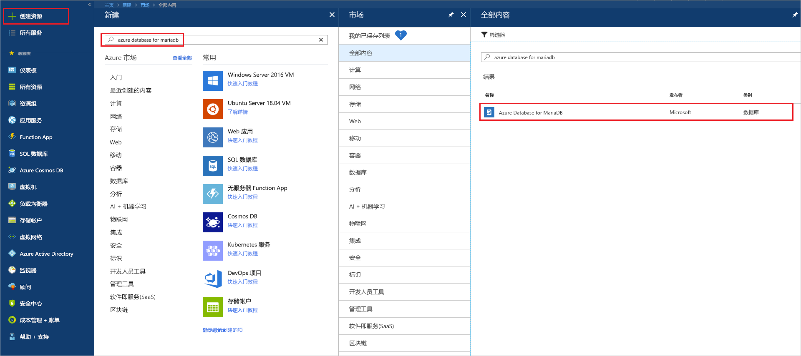
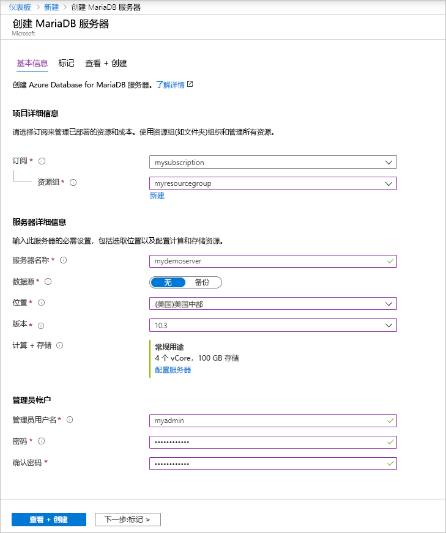
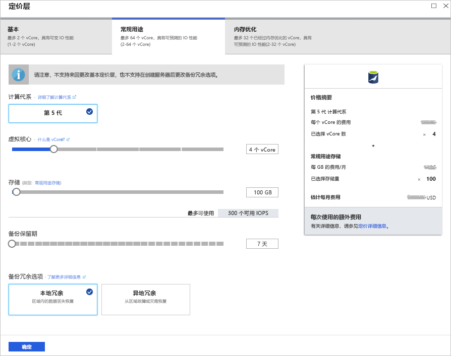
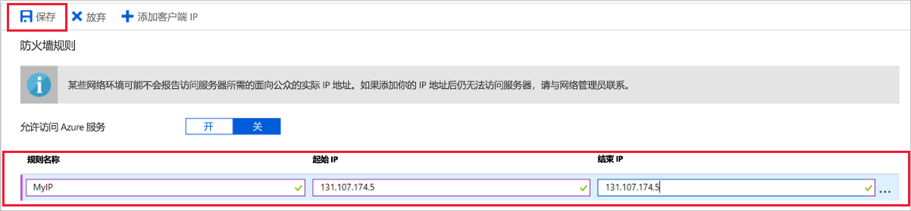
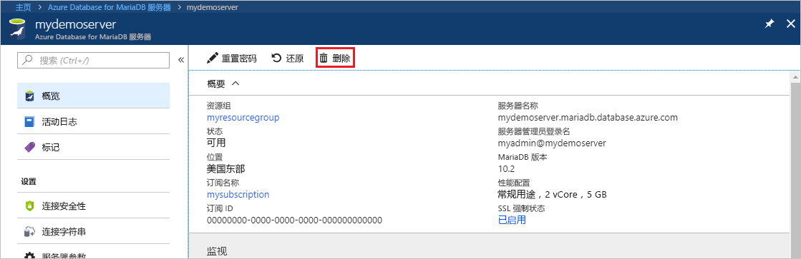

# <a name="create-an-azure-database-for-mariadb-server-by-using-the-azure-portal"></a>使用 Azure 门户创建 Azure Database for MariaDB 服务器

Azure Database for MariaDB 是一种托管服务，可用于在云中运行、管理和缩放高可用性的 MariaDB 数据库。 本快速入门介绍了如何使用 Azure 门户在大约五分钟内创建 Azure Database for MariaDB 服务器。  

如果还没有 Azure 订阅，可以在开始前创建一个[免费 Azure 帐户](https://azure.microsoft.com/free/)。

## <a name="sign-in-to-the-azure-portal"></a>登录到 Azure 门户

在 Web 浏览器中转到 [Azure 门户](https://portal.azure.com/)。 输入登录到门户所需的凭据。 默认视图是服务仪表板。

## <a name="create-an-azure-database-for-mariadb-server"></a>创建 Azure Database for MariaDB 服务器

创建 Azure Database for MariaDB 服务器时，请使用定义好的一组[计算和存储资源](concepts-pricing-tiers.md)。 请在 [Azure 资源组](../azure-resource-manager/resource-group-overview.md)中创建该服务器。

若要创建 Azure Database for MariaDB 服务器，请执行以下操作：

1. 选择门户左上角的“创建资源”按钮 (+)。

2. 选择“数据库” > “Azure Database for MariaDB”。 还可以在搜索框中键入“MariaDB”以查找该服务。

   

3. 输入或选择以下服务器详细信息：
   
   

    设置 | 建议的值 | 说明
    ---|---|---
    服务器名称 | 唯一的服务器名称 | 选择用于标识 Azure Database for MariaDB 服务器的唯一名称。 例如，**mydemoserver**。 域名 *.mariadb.database.azure.com* 将追加到所输入的服务器名称后面。 服务器名称只能包含小写字母、数字和连字符 (-) 字符。 它必须包含 3 到 63 个字符。
    订阅 | *用户的订阅* | 选择要用于服务器的 Azure 订阅。 如果有多个订阅，请选择要计费的资源所在的订阅。
    资源组 | myresourcegroup | 输入新的资源组名称，或选择现有的资源组。 
    选择源 | **空白** | 选择“空白”可从头开始创建新服务器。 （如果要从现有 Azure Database for MariaDB 服务器的异地备份创建服务器，请选择“备份”。）
    服务器管理员登录名 | **myadmin** | 连接到服务器时需使用的登录帐户。 管理员登录名不能是“azure_superuser”、“admin”、“administrator”、“root”、“guest”或“public”。
    密码 | 由用户选择 | 为服务器管理员帐户输入新密码。 该密码必须包含 8 到 128 个字符。 密码必须包含以下三个类别的字符：英文大写字母、英文小写字母、数字 (0-9)和非字母数字字符（!, $, #, % 等）。
    确认密码 | 由用户选择| 确认管理员帐户密码。
    位置 | 离用户最近的区域| 选择最靠近用户或其他 Azure 应用程序的位置。
    版本 | 最新版本| 最新版本，有特定要求（即要求使用其他版本）的除外。
    定价层 | 请参阅说明。 | 新服务器的计算、存储和备份配置。 选择“定价层” > “常规用途”。 为以下设置保留默认值：<br><ul><li>**计算代系**（第 5 代）</li><li>**vCore**（4 个 vCore）</li><li>**存储空间** (100 GB)</li><li>**备份保持期**（7 天）</li></ul><br>若要在异地冗余存储中启用服务器备份，请选择“异地冗余”作为“备份冗余选项”。 <br><br>若要保存此定价层选择，请选择“确定”。 下一个屏幕截图捕获了这些选择。
  
   > [!NOTE]
   > 如果轻量级计算和 I/O 足以满足工作负荷要求，请考虑使用“基本”定价层。 请注意，在“基本”定价层中创建的服务器以后不能扩展到“常规用途”或“内存优化”定价层。 有关详细信息，请参阅[定价页](https://azure.microsoft.com/pricing/details/mariadb/)。
   > 

   

4.  选择“创建”以预配服务器。 预配可能需要长达 20 分钟的时间。
   
5.  若要监视部署过程，请在工具栏上选择“通知”（钟形图标）。
   
默认情况下，将在服务器下创建以下数据库：**information_schema**、**mysql**、**performance_schema** 和 **sys**。


## <a name="configure-firewall-rule"></a>配置服务器级防火墙规则

Azure Database for MariaDB 服务在服务器级别创建防火墙。 除非创建了防火墙规则来为特定的 IP 地址打开防火墙，否则防火墙会阻止外部应用程序和工具连接到服务器或服务器上的任何数据库。 

若要创建服务器级防火墙规则，请执行以下操作：

1. 部署完成后，请找到服务器。 可以根据需要进行搜索。 例如，在左侧菜单中，选择“所有资源”。 然后，输入服务器名称。 例如，输入 **mydemoserver**，以便搜索新建的服务器。 从搜索结果列表中选择服务器名称。 此时会打开服务器的“概览”页。 可以在此页上更改其他设置。

2. 在服务器概览页中，选择“连接安全性”。

3. 在“防火墙规则”下，选择“规则名称”列中的空白文本框，开始创建防火墙规则。 指定将连接到此服务器的客户端的精确 IP 范围。
   
   

4. 在“连接安全性”页的上部工具栏中，选择“保存”。 在继续操作之前，请等待指示更新已成功完成的通知出现。 

   > [!NOTE]
   > 连接到 Azure Database for MariaDB 时，经端口 3306 进行通信。 如果尝试从企业网络内部进行连接，则可能不允许经端口 3306 的出站流量。 这种情况下，若要连接到服务器，必须要求 IT 部门打开端口 3306。
   > 

## <a name="get-connection-information"></a>获取连接信息

若要连接到数据库服务器，需提供完整的服务器名称和管理员登录凭据。 此前可能已在本文中记下这些值。 如果没有记下这些值，可以在 Azure 门户的服务器“概览”页或“属性”页中轻松地找到服务器名称和登录信息：

1. 转到服务器的“概览”页。 记下“服务器名称”和“服务器管理员登录名”的值。 

2. 若要复制这些值，请将光标放置在要复制的字段上方。 复制图标会显示在文本右侧。 根据需要选择复制图标即可复制这些值。

在我们的示例中，服务器名称是 mydemoserver.mariadb.database.azure.com，服务器管理员登录名是 myadmin\@mydemoserver。

## <a name="connect-to-azure-database-for-mariadb-by-using-the-mysql-command-line"></a>使用 mysql 命令行连接到 Azure Database for MariaDB

可以通过多个应用程序连接到 Azure Database for MariaDB 服务器。

首先，我们将使用 [mysql](https://dev.mysql.com/doc/refman/5.7/en/mysql.html) 命令行工具来演示如何连接到该服务器。 也可使用 Web 浏览器和 Azure Cloud Shell，不安装软件。 如果已通过本地方式安装了 mysql 实用程序，也可从该处进行连接。

1. 通过 Azure 门户右上工具栏中的终端图标 (**>_**) 启动 Azure Cloud Shell。
   

2. Azure Cloud Shell 会在浏览器中打开。 可以在 Cloud Shell 中使用 bash shell 命令。

   

3. 在 Cloud Shell 提示符下输入 mysql 命令行，连接到 Azure Database for MariaDB 服务器。

    若要通过 mysql 实用程序连接到 Azure Database for MariaDB 服务器，请使用以下格式：

    ```bash
    mysql --host <fully qualified server name> --user <server admin login name>@<server name> -p
    ```

    例如，以下命令连接到示例服务器：

    ```azurecli-interactive
    mysql --host mydemoserver.mariadb.database.azure.com --user myadmin@mydemoserver -p
    ```

    mysql 参数 |建议的值|说明
    ---|---|---
    --host | 服务器名称 | 在创建 Azure Database for MariaDB 服务器时使用的服务器名称值。 示例服务器为 **mydemoserver.mariadb.database.azure.com**。 请使用完全限定的域名 (**\*.mariadb.database.azure.com**)，如示例中所示。 如果不记得服务器名称，请完成上一部分的步骤，以便获取连接信息。
    --user | 服务器管理员登录名 |在创建 Azure Database for MariaDB 服务器时使用的服务器管理员登录用户名。 如果不记得用户名，请完成上一部分的步骤，以便获取连接信息。 格式为 username\@servername。
    -p | 你的密码<br>（等待系统提示） |出现提示时，输入用于创建服务器的密码。 键入密码字符时，这些字符不会显示在 bash 提示符处。 输入密码后，按 Enter。

   连接 mysql 实用程序后，它会显示 `mysql>` 提示符。 可以在提示符下输入命令。 

   下面是 mysql 输出的示例：

    ```bash
    Welcome to the MySQL monitor.  Commands end with ; or \g.
    Your MySQL connection id is 65505
    Server version: 5.6.39.0 MariaDB Server
    
    Copyright (c) 2000, 2017, Oracle and/or its affiliates. All rights reserved.
    
    Oracle is a registered trademark of Oracle Corporation and/or its
    affiliates. Other names may be trademarks of their respective
    owners.

    Type 'help;' or '\h' for help. Type '\c' to clear the current input statement.
    
    mysql>
    ```
    
    > [!TIP]
    > 如果未将防火墙配置为允许 Azure Cloud Shell 的 IP 地址，则会出现以下错误：
    >
    >   错误 2003 (28000): 不允许 IP 地址为 123.456.789.0 的客户端访问服务器。
    >
    > 若要解决此错误，请确保服务器配置符合[配置服务器级防火墙规则](#configure-firewall-rule)中所述步骤的要求。

4. 若要验证连接，请在 `mysql>` 提示符处输入 **status**，以便检查服务器状态。

    ```sql
    status
    ```

   > [!TIP]
   > 有关其他命令，请参阅 [MySQL 5.7 参考手册 - 第 4.5.1 章](https://dev.mysql.com/doc/refman/5.7/en/mysql.html)。

5. 在出现 `mysql>` 提示时通过输入以下命令，以便创建空数据库：

   ```sql
   CREATE DATABASE quickstartdb;
   ```
   该命令可能需要几分钟时间才能完成。 

   可以在 Azure Database for MariaDB 服务器中创建一个或多个数据库。 可以为每个服务器创建单一数据库来使用所有资源，也可以创建多个数据库来共享资源。 可以创建的数据库数目没有限制，但多个数据库共享相同的服务器资源。 

6. 若要列出数据库，请在 `mysql>` 提示符处输入以下命令：

    ```sql
    SHOW DATABASES;
    ```

7. 输入 **\q**，然后按 Enter 关闭 mysql 工具。 然后可以关闭 Azure Cloud Shell。

你已连接到 Azure Database for MariaDB 服务器并创建一个空白用户数据库。 在下一部分，请使用另一常用工具（即 MySQL Workbench）连接到同一服务器。

## <a name="connect-to-the-server-by-using-mysql-workbench"></a>使用 MySQL Workbench 连接服务器

若要使用 MySQL Workbench 连接到服务器，请执行以下操作：

1. 打开客户端计算机上的 MySQL Workbench。 若要下载并安装 MySQL Workbench，请访问 [Download MySQL Workbench](https://dev.mysql.com/downloads/workbench/)（下载 MySQL Workbench）。

2. 若要创建新的连接，请选择“MySQL 连接”标题旁边的加号 (**+**)。

3. 在“设置新连接”对话框的“参数”选项卡上，输入服务器连接信息。 占位符值作为示例显示。 请将“主机名”、“用户名”和“密码”替换为自己的值。

   

    |设置 |建议的值|字段说明|
    |---|---|---|
     连接名称 | **演示连接** | 此连接的标签。 |
    连接方法 | **标准 (TCP/IP)** | 标准 (TCP/IP) 就足够了。 |
    主机名 | 服务器名称 | 在创建 Azure Database for MariaDB 服务器时使用的服务器名称值。 示例服务器为 **mydemoserver.mariadb.database.azure.com**。 请使用完全限定的域名 (**\*.mariadb.database.azure.com**)，如示例中所示。 如果不记得服务器名称，请完成本文前面的步骤，以便获取连接信息。|
     端口 | 3306 | 连接到 Azure Database for MariaDB 服务器时要使用的端口。 |
    用户名 |  服务器管理员登录名 | 在创建 Azure Database for MariaDB 服务器时使用的服务器管理员登录信息。 示例用户名是 myadmin\@mydemoserver。 如果不记得用户名，请完成本文前面的步骤，以便获取连接信息。 格式为 username\@servername。
    密码 | 你的密码 | 若要保存密码，请选择“在保管库中存储”。 |

4. 若要检查所有参数是否已正确配置，请选择“测试连接”。 然后，选择“确定”以保存连接。 

    > [!NOTE]
    > 默认情况下，SSL 是在服务器上强制实施的， 需要额外配置才能成功进行连接。 有关详细信息，请参阅[配置应用程序中的 SSL 连接性以安全连接到 Azure Database for MariaDB](./howto-configure-ssl.md)。 若要禁用本快速入门的 SSL，请在 Azure 门户的服务器概览页的菜单中选择“连接安全性”。 对于“强制实施 SSL 连接”，请选择“禁用”。
    >

## <a name="clean-up-resources"></a>清理资源

可以通过两种方式清理在本快速入门中创建的资源。 可以删除 [Azure 资源组](../azure-resource-manager/resource-group-overview.md)。 此选项删除资源组中的所有资源。 若要保持其他资源原封不动，请只删除单服务器资源。

> [!TIP]
> 本教程系列中的其他快速入门教程是在本文的基础上制作的。 如果打算继续使用 Azure Database for MariaDB 快速入门，请不要清除在本快速入门中创建的资源。 如果不打算继续，请执行以下步骤，删除在本快速入门中创建的所有资源。
>

若要删除包括新建服务器在内的整个资源组，请执行以下操作：

1.  在 Azure 门户中查找资源组。 在左侧菜单中选择“资源组”，然后选择资源组的名称（在我们的示例中为 myresourcegroup）。

2.  在资源组页上，选择“删除”。 然后，键入确认删除的资源组的名称（在我们的示例中为 **myresourcegroup**）。 选择“删除”。

仅删除新建的服务器：

1. 在 Azure 门户中找到服务器（如果尚未将其打开）。 在左侧菜单中，选择“所有资源”。 然后搜索所创建的服务器。

2. 在“概览”页上，选择“删除”。 

   

3. 确认要删除的服务器的名称。 在它下面显示会受删除影响的数据库。 输入确认删除的服务器名称（在我们的示例中为 **mydemoserver**）。 选择“删除”。

## <a name="next-steps"></a>后续步骤

- [设计你的第一个 Azure Database for MariaDB 数据库](./tutorial-design-database-using-portal.md)
