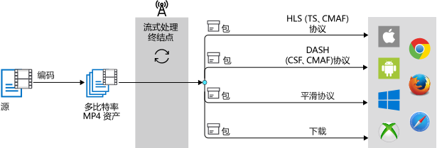
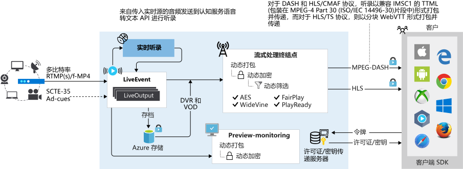

# <a name="dynamic-packaging-in-media-services-v3"></a>媒体服务 v3 中的动态打包

Microsoft Azure 媒体服务可用于对许多媒体源文件格式进行编码。 它通过不同的流式处理协议（无论是否提供内容保护）来提供它们，以覆盖所有主要设备（如 iOS 和 Android 设备）。 这些客户端可理解不同的协议。 例如，iOS 要求以 HTTP Live Streaming (HLS) 格式传送流，Android 设备支持 HLS 以及 MPEG DASH。

在媒体服务中，[流式处理终结点](streaming-endpoint-concept.md)表示动态（即时）打包和源服务，该服务可直接将你的实时和按需内容发送到客户端播放器应用。 它使用下一部分中所述的一种常见流式处理媒体协议。 动态打包是所有流式处理终结点（标准或高级）的标准功能。

## <a name="a-iddelivery-protocolsto-prepare-your-source-files-for-delivery"></a><a id="delivery-protocols"/>准备源文件供传输

若要利用动态打包，需将夹层（源）文件[编码](encoding-concept.md)为一组自适应比特率 MP4（ISO 基本媒体 14496-12）文件。 你需要具备包含媒体服务动态打包所需的编码 MP4 和流式处理配置文件的[资产](assets-concept.md)。 通过此组 MP4 文件，可以使用动态打包通过下述流媒体协议传送视频。

> [!TIP]
> 获取 MP4 和流式处理配置文件的一种方式是[使用媒体服务对夹层文件进行编码](#encode-to-adaptive-bitrate-mp4s)。 

要使编码资产中的视频可供客户端播放，必须创建[流式处理定位符](streaming-locators-concept.md)，然后生成流式处理 URL。 然后，根据流式处理客户端清单中指定的格式（HLS、MPEG DASH 或平滑流式处理），使用你选择的协议接收流。

因此，只需以单一存储格式存储文件并为其付费，然后媒体服务服务就会基于客户端的请求构建并提供相应响应。

如果计划使用媒体服务动态加密来保护内容，请参阅[流式处理协议和加密类型](content-protection-overview.md#streaming-protocols-and-encryption-types)。

### <a name="hls-protocol"></a>HLS 协议

流式处理客户端可以指定以下 HLS 格式：

|协议|示例|
|---|---|
|HLS V4 |`https://amsv3account-usw22.streaming.media.azure.net/21b17732-0112-4d76-b526-763dcd843449/ignite.ism/manifest(format=m3u8-aapl)`||
|HLS V3 |`https://amsv3account-usw22.streaming.media.azure.net/21b17732-0112-4d76-b526-763dcd843449/ignite.ism/manifest(format=m3u8-aapl-v3)`||
|HLS CMAF| `https://amsv3account-usw22.streaming.media.azure.net/21b17732-0112-4d76-b526-763dcd843449/ignite.ism/manifest(format=m3u8-cmaf)`||

### <a name="mpeg-dash-protocol"></a>MPEG-DASH 协议

流式处理客户端可以指定以下 MPEG-DASH 格式：

|协议|示例|
|---|---|
|MPEG-DASH CSF| `https://amsv3account-usw22.streaming.media.azure.net/21b17732-0112-4d76-b526-763dcd843449/ignite.ism/manifest(format=mpd-time-csf)` ||
|MPEG-DASH CMAF|`https://amsv3account-usw22.streaming.media.azure.net/21b17732-0112-4d76-b526-763dcd843449/ignite.ism/manifest(format=mpd-time-cmaf)` ||

### <a name="smooth-streaming-protocol"></a>平滑流式处理协议

流式处理客户端可以指定以下平滑流式处理格式：

|协议|说明/示例| 
|---|---|
|平滑流| `https://amsv3account-usw22.streaming.media.azure.net/21b17732-0112-4d76-b526-763dcd843449/ignite.ism/manifest`||
|平滑流式处理 2.0（旧清单）|默认情况下，平滑流式处理清单格式包含重复标记（r 标记）。 但是，一些播放器不支持 `r-tag`。 使用这些播放器的客户端可以使用禁用 r 标记的格式：<br/><br/>`https://amsv3account-usw22.streaming.media.azure.net/21b17732-0112-4d76-b526-763dcd843449/ignite.ism/manifest(format=fmp4-v20)`|

## <a name="on-demand-streaming-workflow"></a>按需流式处理工作流

以下步骤显示了常见的媒体服务流式处理工作流，其中动态打包与 Azure 媒体服务中的标准编码器一起使用。

1. 上传输入文件，如 QuickTime/MOV 或 MXF 文件。 此文件也称为夹层文件或源文件。 有关受支持格式的列表，请参阅 [Media Encoder Standard 支持的格式](media-encoder-standard-formats.md)。
1. 将夹层文件[编码](#encode-to-adaptive-bitrate-mp4s)为 H.264/AAC MP4 自适应比特率集。
1. 发布包含自适应比特率 MP4 集的输出资产。 通过创建流式处理定位符进行发布。
1. 生成针对不同格式（HLS、MPEG-DASH 和平滑流式处理）的 URL。 **流式处理终结点**将负责为所有这些不同格式提供正确的清单和请求。

下图显示了使用动态打包进行按需流式处理的工作流。



### <a name="encode-to-adaptive-bitrate-mp4s"></a>编码为自适应比特率 MP4

以下文章介绍[如何使用媒体服务对视频进行编码](encoding-concept.md)的示例：

* [使用内置预设从 HTTPS URL 进行编码](job-input-from-http-how-to.md)。
* [使用内置预设对本地文件进行编码](job-input-from-local-file-how-to.md)。
* [构建自定义预设，以确定特定方案或设备要求](customize-encoder-presets-how-to.md)。

请参阅 Media Encoder Standard [格式和编解码器](media-encoder-standard-formats.md)的列表。

## <a name="live-streaming-workflow"></a>实时传送视频流工作流

直播活动可以是下述两种类型之一：直通或实时编码。 

以下是使用动态打包进行实时传送视频流的常用工作流：

1. 创建[直播活动](live-events-outputs-concept.md)。
1. 获取引入 URL 并配置本地编码器以使用 URL 发送贡献源。
1. 获取预览 URL 并使用它验证是否接收到来自编码器的输入。
1. 创建新资产。
1. 创建实时输出并使用创建的资产名称。<br />实时输出会将流存档到资产中。
1. 使用内置的流式处理策略类型创建流式处理定位符。<br />如果想要加密内容，请查看[内容保护概述](content-protection-overview.md)。
1. 列出流式处理定位符的路径，以获取要使用的 URL。
1. 获取要从中进行流式传输的流式处理终结点的主机名。
1. 生成针对不同格式（HLS、MPEG-DASH 和平滑流式处理）的 URL。 流式处理终结点负责提供正确的清单并请求不同的格式。

此关系图显示使用动态打包进行实时传送视频流的工作流：



有关在媒体服务 v3 中实时传送视频流的信息，请参阅[实时传送视频流概述](live-streaming-overview.md)。

## <a name="video-codecs-supported-by-dynamic-packaging"></a>动态打包支持的视频编解码器

动态打包支持 MP4 文件，其中包含使用 [H.264](https://en.m.wikipedia.org/wiki/H.264/MPEG-4_AVC)（MPEG-4 AVC 或 AVC1）或 [H.265](https://en.m.wikipedia.org/wiki/High_Efficiency_Video_Coding)（HEVC、hev1 或 hvc1）编码的视频。

> [!NOTE]
> 已使用动态打包测试了高达 4K 的分辨率和高达 60 帧/秒的帧速率。 [高级编码器](https://docs.microsoft.com/azure/media-services/previous/media-services-encode-asset#media-encoder-premium-workflow)支持通过旧版 v2 API 编码为 H.265。

## <a name="a-idaudio-codecsaudio-codecs-supported-by-dynamic-packaging"></a><a id="audio-codecs"/>动态打包支持的音频编解码器

动态打包支持采用以下协议编码的音频：

* [AAC](https://en.wikipedia.org/wiki/Advanced_Audio_Coding)（AAC-LC、HE-AAC v1 或 HE-AAC v2）
* [Dolby Digital Plus](https://en.wikipedia.org/wiki/Dolby_Digital_Plus)（增强型 AC-3 或 E-AC3）
* Dolby Atmos<br />
   流式处理 Dolby Atmos 内容支持 MPEG-DASH 协议等标准，包括采用公共流式处理格式 (CSF) 或公共媒体应用程序格式 (CMAF) 分段的 MP4，以及通过具有 CMAF 的 HTTP Live Streaming (HLS)。

* [DTS](https://en.wikipedia.org/wiki/DTS_%28sound_system%29)<br />
   DASH-CSF、DASH-CMAF、HLS-M2TS 和 HLS-CMAF 打包格式支持的 DTS 编解码器包括：  

    * DTS Digital Surround (dtsc)
    * DTS-HD High Resolution 和 DTS-HD Master Audio  (dtsh)
    * DTS Express (dtse)
    * DTS-HD Lossless (no core) (dtsl)

动态打包支持使用 DASH 或 HLS（版本 4 或更高版本）的多音轨，用于流式传输包含使用多个编解码器和语言的多音轨的资产。

### <a name="additional-notes"></a>附加说明

动态打包不支持包含 [Dolby Digital](https://en.wikipedia.org/wiki/Dolby_Digital) (AC3) 音频（它是旧编解码器）的文件。

> [!NOTE]
> [高级编码器](https://docs.microsoft.com/azure/media-services/previous/media-services-encode-asset#media-encoder-premium-workflow)支持通过旧版 v2 API 编码为 Dolby Digital Plus。

## <a name="manifests"></a>清单

在媒体服务动态打包中，HLS、MPEG-DASH 和平滑流式处理的流式处理客户端清单是基于 URL 中的格式选择器动态生成的。  

清单文件包含流元数据，例如轨迹类型（音频、视频或文本）、轨迹名称、开始和结束时间、比特率（质量）、轨迹语言、演播窗口（持续时间固定的滑动窗口）和视频编解码器 (FourCC)。 此文件还会通过提供有关下一个可播放视频片段及其位置的信息，来指示播放器检索下一个片段。 片段（或段）实际上是视频内容的“区块”。

### <a name="examples"></a>示例

#### <a name="hls"></a>HLS

以下示例是 HLS 清单文件，也称为 HLS 主播放列表： 

```
#EXTM3U
#EXT-X-VERSION:4
#EXT-X-MEDIA:TYPE=AUDIO,GROUP-ID="audio",NAME="aac_eng_2_128041_2_1",LANGUAGE="eng",DEFAULT=YES,AUTOSELECT=YES,URI="QualityLevels(128041)/Manifest(aac_eng_2_128041_2_1,format=m3u8-aapl)"
#EXT-X-STREAM-INF:BANDWIDTH=536608,RESOLUTION=320x180,CODECS="avc1.64000d,mp4a.40.2",AUDIO="audio"
QualityLevels(381048)/Manifest(video,format=m3u8-aapl)
#EXT-X-I-FRAME-STREAM-INF:BANDWIDTH=536608,RESOLUTION=320x180,CODECS="avc1.64000d",URI="QualityLevels(381048)/Manifest(video,format=m3u8-aapl,type=keyframes)"
#EXT-X-STREAM-INF:BANDWIDTH=884544,RESOLUTION=480x270,CODECS="avc1.640015,mp4a.40.2",AUDIO="audio"
QualityLevels(721495)/Manifest(video,format=m3u8-aapl)
#EXT-X-I-FRAME-STREAM-INF:BANDWIDTH=884544,RESOLUTION=480x270,CODECS="avc1.640015",URI="QualityLevels(721495)/Manifest(video,format=m3u8-aapl,type=keyframes)"
#EXT-X-STREAM-INF:BANDWIDTH=1327398,RESOLUTION=640x360,CODECS="avc1.64001e,mp4a.40.2",AUDIO="audio"
QualityLevels(1154816)/Manifest(video,format=m3u8-aapl)
#EXT-X-I-FRAME-STREAM-INF:BANDWIDTH=1327398,RESOLUTION=640x360,CODECS="avc1.64001e",URI="QualityLevels(1154816)/Manifest(video,format=m3u8-aapl,type=keyframes)"
#EXT-X-STREAM-INF:BANDWIDTH=2413312,RESOLUTION=960x540,CODECS="avc1.64001f,mp4a.40.2",AUDIO="audio"
QualityLevels(2217354)/Manifest(video,format=m3u8-aapl)
#EXT-X-I-FRAME-STREAM-INF:BANDWIDTH=2413312,RESOLUTION=960x540,CODECS="avc1.64001f",URI="QualityLevels(2217354)/Manifest(video,format=m3u8-aapl,type=keyframes)"
#EXT-X-STREAM-INF:BANDWIDTH=3805760,RESOLUTION=1280x720,CODECS="avc1.640020,mp4a.40.2",AUDIO="audio"
QualityLevels(3579827)/Manifest(video,format=m3u8-aapl)
#EXT-X-I-FRAME-STREAM-INF:BANDWIDTH=3805760,RESOLUTION=1280x720,CODECS="avc1.640020",URI="QualityLevels(3579827)/Manifest(video,format=m3u8-aapl,type=keyframes)"
#EXT-X-STREAM-INF:BANDWIDTH=139017,CODECS="mp4a.40.2",AUDIO="audio"
QualityLevels(128041)/Manifest(aac_eng_2_128041_2_1,format=m3u8-aapl)
```

#### <a name="mpeg-dash"></a>MPEG-DASH

以下示例是 MPEG-DASH 清单文件，也称为 MPEG-DASH 媒体演示说明 (MPD)：

```xml
<?xml version="1.0" encoding="UTF-8"?>
<MPD xmlns="urn:mpeg:dash:schema:mpd:2011" xmlns:xsi="https://www.w3.org/2001/XMLSchema-instance" profiles="urn:mpeg:dash:profile:isoff-live:2011" type="static" mediaPresentationDuration="PT1M10.315S" minBufferTime="PT7S">
   <Period>
      <AdaptationSet id="1" group="5" profiles="ccff" bitstreamSwitching="false" segmentAlignment="true" contentType="audio" mimeType="audio/mp4" codecs="mp4a.40.2" lang="en">
         <SegmentTemplate timescale="10000000" media="QualityLevels($Bandwidth$)/Fragments(aac_eng_2_128041_2_1=$Time$,format=mpd-time-csf)" initialization="QualityLevels($Bandwidth$)/Fragments(aac_eng_2_128041_2_1=i,format=mpd-time-csf)">
            <SegmentTimeline>
               <S d="60160000" r="10" />
               <S d="41386666" />
            </SegmentTimeline>
         </SegmentTemplate>
         <Representation id="5_A_aac_eng_2_128041_2_1_1" bandwidth="128041" audioSamplingRate="48000" />
      </AdaptationSet>
      <AdaptationSet id="2" group="1" profiles="ccff" bitstreamSwitching="false" segmentAlignment="true" contentType="video" mimeType="video/mp4" codecs="avc1.640020" maxWidth="1280" maxHeight="720" startWithSAP="1">
         <SegmentTemplate timescale="10000000" media="QualityLevels($Bandwidth$)/Fragments(video=$Time$,format=mpd-time-csf)" initialization="QualityLevels($Bandwidth$)/Fragments(video=i,format=mpd-time-csf)">
            <SegmentTimeline>
               <S d="60060000" r="10" />
               <S d="42375666" />
            </SegmentTimeline>
         </SegmentTemplate>
         <Representation id="1_V_video_1" bandwidth="3579827" width="1280" height="720" />
         <Representation id="1_V_video_2" bandwidth="2217354" codecs="avc1.64001F" width="960" height="540" />
         <Representation id="1_V_video_3" bandwidth="1154816" codecs="avc1.64001E" width="640" height="360" />
         <Representation id="1_V_video_4" bandwidth="721495" codecs="avc1.640015" width="480" height="270" />
         <Representation id="1_V_video_5" bandwidth="381048" codecs="avc1.64000D" width="320" height="180" />
      </AdaptationSet>
   </Period>
</MPD>
```
#### <a name="smooth-streaming"></a>平滑流

下面是平滑流式处理清单文件的示例：

```xml
<?xml version="1.0" encoding="UTF-8"?>
<SmoothStreamingMedia MajorVersion="2" MinorVersion="2" Duration="703146666" TimeScale="10000000">
   <StreamIndex Chunks="12" Type="audio" Url="QualityLevels({bitrate})/Fragments(aac_eng_2_128041_2_1={start time})" QualityLevels="1" Language="eng" Name="aac_eng_2_128041_2_1">
      <QualityLevel AudioTag="255" Index="0" BitsPerSample="16" Bitrate="128041" FourCC="AACL" CodecPrivateData="1190" Channels="2" PacketSize="4" SamplingRate="48000" />
      <c t="0" d="60160000" r="11" />
      <c d="41386666" />
   </StreamIndex>
   <StreamIndex Chunks="12" Type="video" Url="QualityLevels({bitrate})/Fragments(video={start time})" QualityLevels="5">
      <QualityLevel Index="0" Bitrate="3579827" FourCC="H264" MaxWidth="1280" MaxHeight="720" CodecPrivateData="0000000167640020ACD9405005BB011000003E90000EA600F18319600000000168EBECB22C" />
      <QualityLevel Index="1" Bitrate="2217354" FourCC="H264" MaxWidth="960" MaxHeight="540" CodecPrivateData="000000016764001FACD940F0117EF01100000303E90000EA600F1831960000000168EBECB22C" />
      <QualityLevel Index="2" Bitrate="1154816" FourCC="H264" MaxWidth="640" MaxHeight="360" CodecPrivateData="000000016764001EACD940A02FF9701100000303E90000EA600F162D960000000168EBECB22C" />
      <QualityLevel Index="3" Bitrate="721495" FourCC="H264" MaxWidth="480" MaxHeight="270" CodecPrivateData="0000000167640015ACD941E08FEB011000003E90000EA600F162D9600000000168EBECB22C" />
      <QualityLevel Index="4" Bitrate="381048" FourCC="H264" MaxWidth="320" MaxHeight="180" CodecPrivateData="000000016764000DACD941419F9F011000003E90000EA600F14299600000000168EBECB22C" />
      <c t="0" d="60060000" r="11" />
      <c d="42375666" />
   </StreamIndex>
</SmoothStreamingMedia>
```

### <a name="naming-of-tracks-in-the-manifest"></a>命名清单中的曲目

如果在 .ism 文件中指定了音轨名称，则媒体服务会在 `AdaptationSet` 中添加 `Label` 元素，以指定特定音轨的纹理信息。输出 DASH 清单的示例：

```xml
<AdaptationSet codecs="mp4a.40.2" contentType="audio" lang="en" mimeType="audio/mp4" subsegmentAlignment="true" subsegmentStartsWithSAP="1">
  <Label>audio_track_name</Label>
  <Role schemeIdUri="urn:mpeg:dash:role:2011" value="main"/>
  <Representation audioSamplingRate="48000" bandwidth="131152" id="German_Forest_Short_Poem_english-en-68s-2-lc-128000bps_seg">
    <BaseURL>German_Forest_Short_Poem_english-en-68s-2-lc-128000bps_seg.mp4</BaseURL>
  </Representation>
</AdaptationSet>
```

播放机可以使用 `Label` 元素在其 UI 上显示。

### <a name="signaling-audio-description-tracks"></a>发出音频描述轨道的信号

可以向视频中添加旁白轨道，以帮助视力受损的客户通过倾听旁白来跟随视频录制。 需要将音轨批注为清单中的音频描述。 为此，请将“accessibility”和“role”参数添加到 .ism 文件中。 你有责任正确设置这些参数，以将音频轨道作为音频描述发出信号。 例如，将 `<param name="accessibility" value="description" />` 和 `<param name="role" value="alternate"` 添加到特定音频轨道的 .ism 文件中。 

有关详细信息，请参阅[如何发出描述性音轨信号](signal-descriptive-audio-howto.md)示例。

#### <a name="smooth-streaming-manifest"></a>平滑流式处理清单

如果正在播放平滑流式处理流，则清单将在该音频轨道的 `Accessibility` 和 `Role` 属性中携带值。例如，`Role="alternate" Accessibility="description"` 将添加到 `StreamIndex` 元素中，以指示它是音频描述。

#### <a name="dash-manifest"></a>DASH 清单

对于 DASH 清单，将添加以下两个元素以发出音频描述信号：

```xml
<Accessibility schemeIdUri="urn:mpeg:dash:role:2011" value="description"/>
<Role schemeIdUri="urn:mpeg:dash:role:2011" value="alternate"/>
```

#### <a name="hls-playlist"></a>HLS 播放列表

对于 HLS v7 及更高版本 `(format=m3u8-cmaf)`，当音频描述跟踪收到信号时，其播放列表将携带 `AUTOSELECT=YES,CHARACTERISTICS="public.accessibility.describes-video"`。

#### <a name="example"></a>示例

有关详细信息，请参阅[如何发出音频描述轨道信号](signal-descriptive-audio-howto.md)。

## <a name="dynamic-manifest"></a>动态清单

若要控制发送到播放器的曲目数目、格式、比特率和呈现时间范围，可以将动态筛选与媒体服务动态包生成工具配合使用。 有关详细信息，请参阅[预筛选清单与动态包生成工具配合使用](filters-dynamic-manifest-overview.md)。

## <a name="dynamic-encryption"></a>动态加密

可以使用动态加密借助 AES-128 或三种主要数字版权管理 (DRM) 系统中的任何一种对实时或按需内容进行动态加密  ：内容。 媒体服务还提供用于向已授权客户端传送 AES 密钥和 DRM 许可证的服务。 有关详细信息，请参阅[动态加密](content-protection-overview.md)。

> [!NOTE]
> Widevine 是 Google Inc. 提供的一项服务，并受 Google Inc. 服务条款和隐私策略的约束。

## <a name="more-information"></a>详细信息

查看 [Azure 媒体服务社区](media-services-community.md)，了解提出问题、提供反馈和获取有关媒体服务的更新的不同方法。

## <a name="need-help"></a>需要帮助？

可以通过导航到[新建支持请求](https://portal.azure.com/#blade/Microsoft_Azure_Support/HelpAndSupportBlade/newsupportrequest)来开具支持票证。

## <a name="next-steps"></a>后续步骤

> [!NOTE]
> 目前，无法使用 Azure 门户来管理 v3 资源。 请使用 [REST API](https://aka.ms/ams-v3-rest-ref)、[CLI](https://aka.ms/ams-v3-cli-ref) 或受支持的 [SDK](media-services-apis-overview.md#sdks) 之一。

了解如何[对视频进行上传、编码和流式处理](stream-files-tutorial-with-api.md)。
