# 创建 Azure 媒体服务实时传送流

本快速入门帮助你使用 Azure 门户和 Telestream Wirecast 创建 Azure 媒体服务实时传送流。 本文假设你有一个 Azure 订阅，并已创建媒体服务帐户。

如果没有 Azure 订阅，请在开始之前创建一个[免费帐户](https://azure.microsoft.com/free/)。

## 登录到 Azure 门户

打开 Web 浏览器，转到 [Microsoft Azure 门户](https://portal.azure.com/)。 输入登录到门户所需的凭据。 默认视图是服务仪表板。

本快速入门将介绍以下方面的内容：

- 使用免费试用版 Telestream Wirecast 设置本地编码器。
- 设置实时传送流。
- 设置实时传送流输出。
- 运行默认的流式处理终结点。
- 使用 Azure Media Player 观看实时传送流和按需输出。

为简单起见，我们将为 Wirecast、直通云编码和 RTMP 中的 Azure 媒体服务使用一个编码预设。

## 使用 Wirecast 设置本地编码器

1. 在 [Telestream 网站](https://www.telestream.net)上下载适用于你的操作系统的 Wirecast，然后进行安装。
1. 启动该应用程序，并使用常用的电子邮件地址注册产品。 将应用程序保持打开状态。
1. 在收到的电子邮件中验证你的电子邮件地址。 然后，该应用程序会启动免费试用版。
1. 建议：在打开的应用程序屏幕中观看视频教程。

## 设置 Azure 媒体服务实时传送流

1. 在门户中转到 Azure 媒体服务帐户，然后从“媒体服务”列表中选择“实时传送视频流”。  

   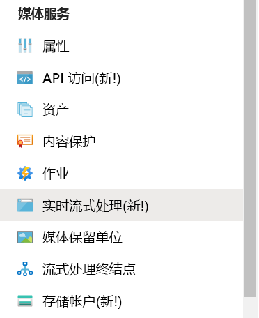
1. 选择“添加实时事件”创建新的实时传送视频流事件。 

   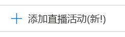
1. 在“实时事件名称”框中，输入新事件的名称，例如 TestLiveEvent。  

   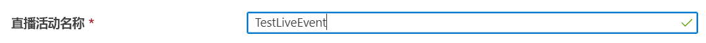
1. 在“说明”框中输入事件的可选说明。 
1. 选择“直通 – 无云编码”选项。 

   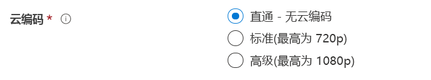
1. 选择“RTMP”选项。 
1. 确保选择了与“启动实时事件”对应的“无”选项，以免在该实时事件准备就绪之前产生费用。   （启动实时事件后，即会开始计费。）

   
1. 选择“查看 + 创建”按钮检查设置。 
1. 选择“创建”按钮以创建实时事件。  随后你会返回到实时事件列表。
1. 选择刚刚创建的实时事件的链接。 可以观察到你的事件已停止。
1. 在浏览器中将此页保持打开状态。 稍后我们将返回到该文件。

## 使用 Wirecast Studio 设置实时传送流

1. 在 Wirecast 应用程序中，从主菜单中选择“创建空文档”，然后选择“继续”。  

   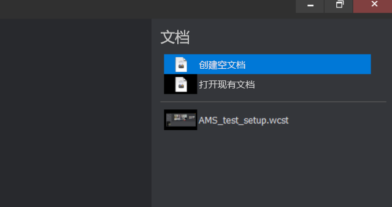
1. 将鼠标悬停在“Wirecast 层”区域中的第一个层上。   选择出现的“添加”图标，然后选择要流式传输的视频输入。 

   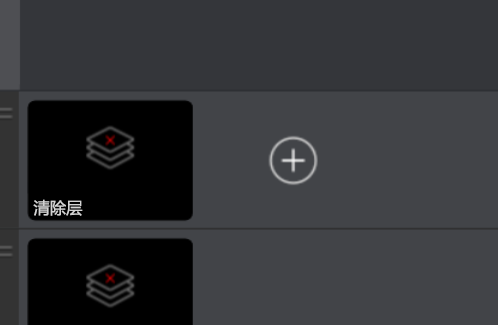

   此时会打开“主层 1”对话框。 
1. 在菜单中选择“视频捕获”，然后选择要使用的摄像头。 

   

   来自摄像头的景象将显示在预览区域中。
1. 将鼠标悬停在“Wirecast 层”区域中的第二个层上。  选择出现的“添加”图标，然后选择要流式传输的音频输入。  此时会打开“主层 2”对话框。 
1. 在菜单中选择“音频捕获”，然后选择要使用的音频输入。 

   
1. 在主菜单中选择“输出设置”。  此时会显示“选择输出目标”对话框。 
1. 从“目标”下拉列表中选择“Azure 媒体服务”。   Azure 媒体服务的输出设置会自动填充大部分输出设置。 

   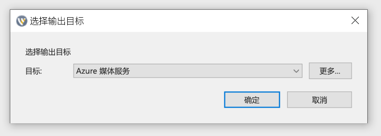

在接下来的过程中，你将在浏览器中返回到 Azure 媒体服务来复制输入 URL，以便将其输入到输出设置中：

1. 在门户的“Azure 媒体服务”页上，选择“启动”以启动实时传送流事件。  （现在开始计费。）

   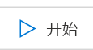
2. 将“安全/不安全”切换开关设置为“不安全”。   此步骤会将协议设置为 RTMP 而不是 RTMPS。
3. 在“输入 URL”中，将 URL 复制到剪贴板。 

   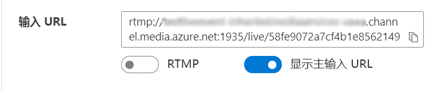
4. 切换到 Wirecast 应用程序，将“输入 URL”粘贴到输出设置中的“地址”框。  

   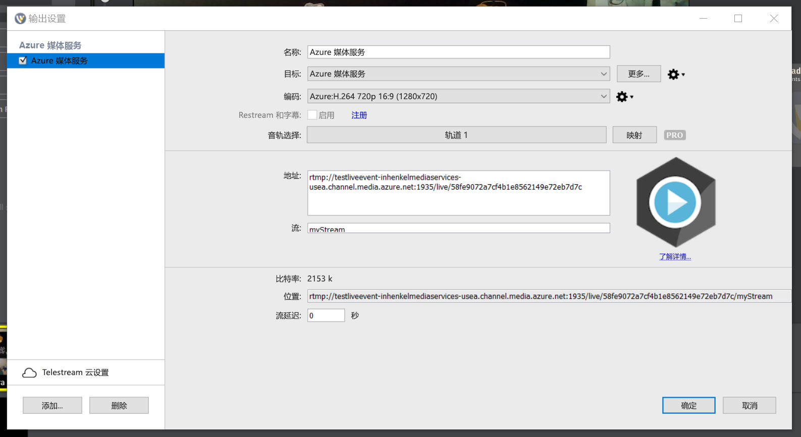
5. 选择“确定”  。

## 设置输出

此部分将设置输出，并使你可以保存实时流的录制内容。  

> [!NOTE]
> 若要流式传输此输出，流式处理终结点必须正在运行。 请参阅后面的[运行默认的流式处理终结点](#run-the-default-streaming-endpoint)部分。

1. 选择“输出”视频查看器下面的“创建输出”链接。  
1. 如果需要，请将“名称”框中的输出名称编辑为用户更容易理解的内容，以便于今后查找。 
   
   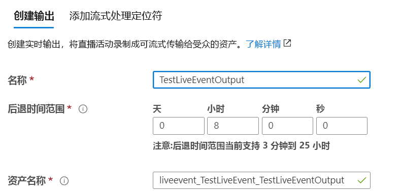
1. 暂时不要理会其余所有框。
1. 选择“下一步”添加流定位器。 
1. 如果需要，请将定位器的名称更改为用户更容易理解的内容。
   
   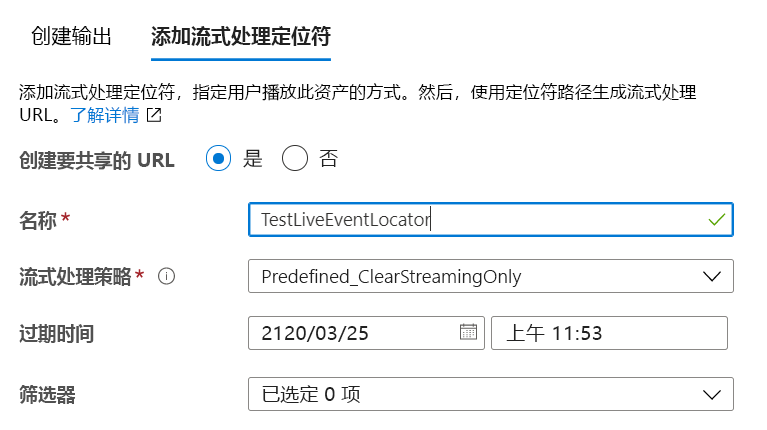
1. 暂时不要理会此屏幕上的其他任何设置。
1. 选择“创建”  。

## 开始广播

1. 在 Wirecast 中，从主菜单中选择“输出” > “开始/停止广播” > “启动 Azure 媒体服务:    Azure 媒体服务”。

   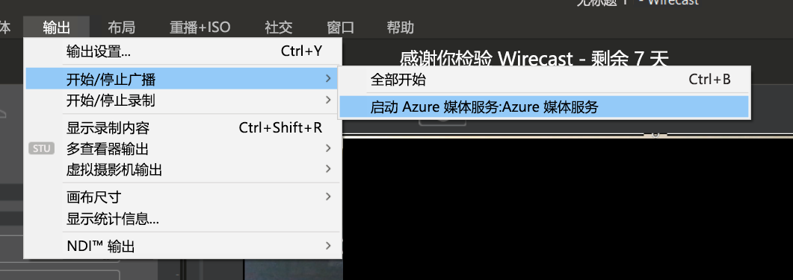

   将流发送到实时事件后，Wirecast 中的“实时”窗口会显示在 Azure 媒体服务中实时事件页上的视频播放器中。 

1. 选择预览窗口下面的“开始”按钮，以开始广播已为 Wirecast 层选择的视频和音频。 

   

   > [!TIP]
   > 如果出错，请选择播放器上方的“重新加载播放器”链接来尝试重新加载播放器。 

## 运行默认的流式处理终结点

1. 在媒体服务列表中选择“流式处理终结点”。 

   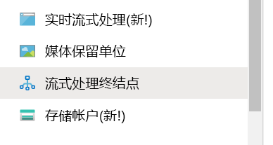
1. 如果默认流式处理终结点的状态为“已停止”，请选择它。 此步骤会将你转到该终结点的页面。
1. 选择“开始”  。
   
   

## 使用 Azure Media Player 播放输出的广播

1. 复制“输出”视频播放器下面的流 URL。 
1. 在 Web 浏览器中，打开 [Azure Media Player 演示](https://ampdemo.azureedge.net/azuremediaplayer.html)。
1. 将流 URL 粘贴到 Azure Media Player 的“URL”框中。 
1. 选择“更新播放器”按钮。 
1. 选择视频中的“播放”图标查看实时传送流。 

## 停止广播

如果你认为已流式传输了足够的内容，请停止广播。

1. 在 Wirecast 中选择“广播”按钮。  此步骤会从 Wirecast 中停止广播。
1. 在门户中选择“停止”。  随后会出现一条警告消息，指出实时传送流将会停止，但输出现在会变为按需资产。
1. 选择警告消息中的“停止”。  Azure Media Player 现在会显示错误，因为实时传送流不再可用。

## 使用 Azure Media Player 播放按需输出

现在，只要流式处理终结点正在运行，创建的输出就可供按需流式处理。

1. 转到媒体服务列表并选择“资产”。 
1. 找到前面创建的事件输出，然后选择指向该资产的链接。 此时会打开资产输出页。
1. 复制该资产的视频播放器下的流 URL。
1. 在浏览器中返回到 Azure Media Player，将流 URL 粘贴到“URL”框中。
1. 选择“更新播放器”。 
1. 选择视频中的“播放”图标以观看按需资产。 

## 清理资源

> [!IMPORTANT]
> 请停止服务！ 完成本快速入门中的步骤后，请务必停止实时事件和流式处理终结点，否则系统会按它们的运行时间计收费用。 若要停止实时事件，请参阅[停止广播](#stop-the-broadcast)过程的步骤 2 和 3。

若要停止流式处理终结点，请执行以下操作：

1. 从媒体服务列表中选择“流式处理终结点”。 
2. 选择前面启动的默认流式处理终结点。 此步骤会打开该终结点的页面。
3. 选择“停止”  。

> [!TIP]
> 如果你不想要保留来自此事件的资产，请务必将其删除，以免产生存储费用。

## 后续步骤
> [!div class="nextstepaction"]
> [媒体服务中的实时事件和实时输出](./live-events-outputs-concept.md)
