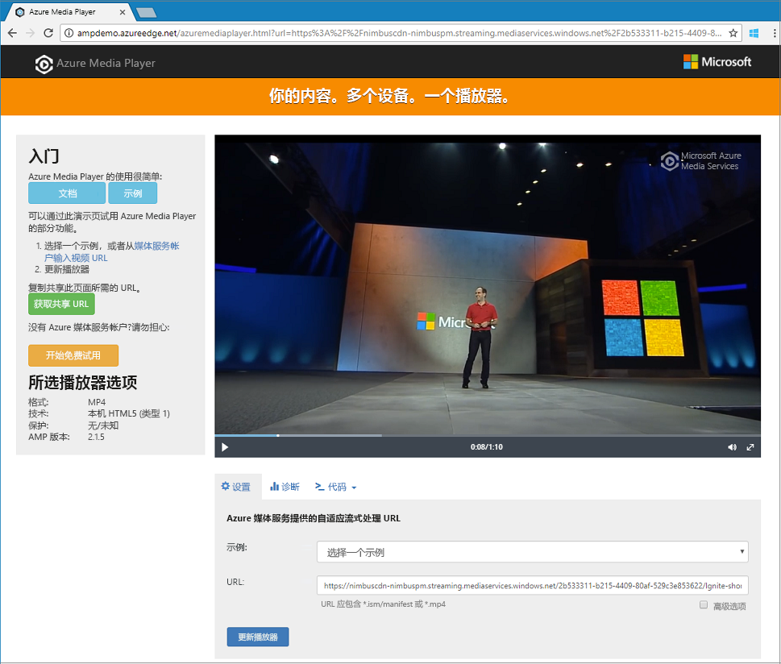

# <a name="quickstart-stream-video-files---net"></a>快速入门：流式传输视频文件 - .NET

> [!NOTE]
> Azure 媒体服务的最新版本目前处于预览状态，可能称为 v3 版本。 若要开始使用 v3 API，应按照快速入门所述创建新的 Azure 媒体服务帐户。 

本快速入门将为你演示，使用 Azure 媒体服务在各种浏览器和设备上对视频进行流式处理有多轻松。 

完成本快速入门后即可对视频进行流式处理。  



[!INCLUDE [quickstarts-free-trial-note](../../../includes/quickstarts-free-trial-note.md)]

## <a name="prerequisites"></a>先决条件

如果没有安装 Visual Studio，可下载 [Visual Studio Community 2017](https://www.visualstudio.com/thank-you-downloading-visual-studio/?sku=Community&rel=15)。

## <a name="download-the-sample"></a>下载示例

使用以下命令将包含流式处理 .NET 示例的 GitHub 存储库克隆到计算机：  

 ```bash
 git clone https://github.com/Azure-Samples/media-services-v3-dotnet-quickstarts.git
 ```

有关示例代码中的每个功能的内容介绍，请在[此源文件](https://github.com/Azure-Samples/media-services-v3-dotnet-quickstarts/blob/master/AMSV3Quickstarts/EncodeAndStreamFiles/Program.cs)中查看相关代码和注释。

## <a name="log-in-to-azure"></a>登录 Azure

登录到 [Azure 门户](http://portal.azure.com)。

[!INCLUDE [cloud-shell-try-it.md](../../../includes/cloud-shell-try-it.md)]

[!INCLUDE [media-services-cli-create-v3-account-include](../../../includes/media-services-cli-create-v3-account-include.md)]

[!INCLUDE [media-services-v3-cli-access-api-include](../../../includes/media-services-v3-cli-access-api-include.md)]

## <a name="run-the-sample-app"></a>运行示例应用

运行应用时，显示使用不同协议播放视频的 URL。 

1. 按 Ctrl+F5 运行 EncodeAndStreamFiles 应用程序。
2. 选择 Apple 的“HLS”协议（以 manifest(format=m3u8-aapl) 结束），并从控制台复制流式处理 URL。


在此示例的[源代码](https://github.com/Azure-Samples/media-services-v3-dotnet-quickstarts/blob/master/AMSV3Quickstarts/EncodeAndStreamFiles/Program.cs)中，可查看 URL 的生成方式。 若要生成 URL，需要连接流式处理终结点的主机名和流式处理定位符路径。  

## <a name="test-with-azure-media-player"></a>使用 Azure Media Player 进行测试

本文使用 Azure Media Player 测试流式传输。 

> [!NOTE]
> 如果播放器在 Https 站点上进行托管，请确保将 URL 更新为“https”。

1. 打开 Web 浏览器并导航到 [https://aka.ms/azuremediaplayer/](https://aka.ms/azuremediaplayer/)。
2. 在“URL:”框中，粘贴运行应用程序时获取的某个流式处理 URL 值。 
3. 按“更新播放器”。

Azure Media Player 可用于测试，但不可在生产环境中使用。 

## <a name="clean-up-resources"></a>清理资源

如果不再需要你的资源组中的任何一个资源（包括使用本快速入门创建的媒体服务和存储帐户），请删除该资源组。 可以使用 CloudShell 工具。

在 CloudShell 中，执行以下命令：

```azurecli-interactive
az group delete --name amsResourceGroup
```

## <a name="examine-the-code"></a>检查代码

有关示例代码中的每个功能的内容介绍，请在[此源文件](https://github.com/Azure-Samples/media-services-v3-dotnet-quickstarts/blob/master/AMSV3Quickstarts/EncodeAndStreamFiles/Program.cs)中查看相关代码和注释。

如需了解更高级的流式处理示例及其详细说明，请参阅[上传、编码和流式处理文件](stream-files-tutorial-with-api.md)教程。 

## <a name="multithreading"></a>多线程处理

Azure 媒体服务 v3 SDK 不是线程安全的。 使用多线程应用程序时，应在每个线程上生成一个新的 AzureMediaServicesClient 对象。

## <a name="next-steps"></a>后续步骤

> [!div class="nextstepaction"]
> [教程：上传、编码和流式处理文件](stream-files-tutorial-with-api.md)
