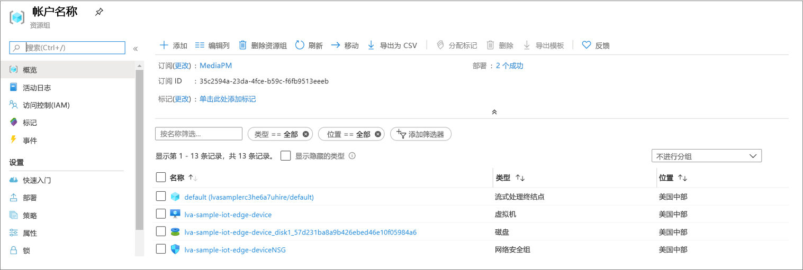
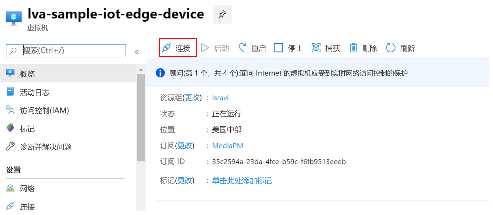

# <a name="quickstart-detect-motion-and-record-video-on-edge-devices"></a>快速入门：检测运动并在边缘设备上录制视频
 
本快速入门介绍了如何在 IoT Edge 上使用实时视频分析来分析（模拟）IP 相机中的实时视频源。 本快速入门介绍如何检测是否存在任何运动，如果存在，则将 MP4 视频剪辑录制到边缘设备上的本地文件系统中。 本快速入门将 Azure VM 用作 IoT Edge 设备，并且还使用模拟的实时视频流。 

本文基于用 C# 编写的示例代码。 本文以[检测运动并发出事件](detect-motion-emit-events-quickstart.md)快速入门为基础。 

## <a name="prerequisites"></a>先决条件

* 具有活动订阅的 Azure 帐户。 如果没有帐户，可[免费创建一个帐户](https://azure.microsoft.com/free/?WT.mc_id=A261C142F)。
* 包含以下扩展的 [Visual Studio Code](https://code.visualstudio.com/)：
    * [Azure IoT Tools](https://marketplace.visualstudio.com/items?itemName=vsciot-vscode.azure-iot-tools)
    * [C#](https://marketplace.visualstudio.com/items?itemName=ms-dotnettools.csharp)
* [.NET Core 3.1 SDK](https://dotnet.microsoft.com/download/dotnet-core/3.1)。
* 如果尚未完成[检测运动并发出事件](detect-motion-emit-events-quickstart.md)快速入门，请按照以下步骤操作：
     1. [设置 Azure 资源](detect-motion-emit-events-quickstart.md#set-up-azure-resources)
     1. [设置开发环境](detect-motion-emit-events-quickstart.md#set-up-your-development-environment)
     1. [生成并部署 IoT Edge 部署清单](detect-motion-emit-events-quickstart.md#generate-and-deploy-the-deployment-manifest)
     1. [准备监视事件](detect-motion-emit-events-quickstart.md#prepare-to-monitor-events)

> [!TIP]
> 在安装 Azure IoT Tools 时，系统可能会提示安装 Docker。 可以忽略此提示。

## <a name="review-the-sample-video"></a>观看示例视频
在为此快速入门设置 Azure 资源时，一个停车场短视频被复制到 Azure 中用作 IoT Edge 设备的 Linux VM 上。 本教程将使用此视频文件模拟实时流。

打开 [VLC 媒体播放器](https://www.videolan.org/vlc/)等应用程序，选择 Ctrl+N，然后将[此链接](https://lvamedia.blob.core.windows.net/public/lots_015.mkv)粘贴到停车场视频中并开始播放。 大约在 5 秒的时候，一辆白色汽车在停车场间移动。

完成以下步骤，以使用 IoT Edge 上的实时视频分析功能检测汽车的运动，并从大约第 5 秒的标记处开始录制视频剪辑。

## <a name="overview"></a>概述


上图显示本快速入门中信号的流动方式。 [Edge 模块](https://github.com/Azure/live-video-analytics/tree/master/utilities/rtspsim-live555)模拟托管实时流协议 (RTSP) 服务器的 IP 相机。 [RTSP 源](media-graph-concept.md#rtsp-source)节点从该服务器拉取视频源，并将视频帧发送到[运动检测处理器](media-graph-concept.md#motion-detection-processor)节点。 RTSP 源会将同一视频帧发送到[信号入口处理器](media-graph-concept.md#signal-gate-processor)节点，该节点在被事件触发前会保持关闭状态。

当运动检测处理器检测到视频中的运动时，它会将事件发送到信号入口处理器节点，并触发该节点。 门会打开，并将这一状态保持到配置的时间结束为止，并将视频帧发送到[文件接收器](media-graph-concept.md#file-sink)节点。 该接收器节点以 MP4 文件形式将视频录制到边缘设备上的本地文件系统中。 该文件保存在配置的位置。

在本快速入门中，请执行以下操作：

1. 创建并部署媒体图。
1. 解释结果。
1. 清理资源。

## <a name="examine-and-edit-the-sample-files"></a>检查和编辑示例文件
作为本快速入门的先决条件的一部分，请将示例代码下载到一个文件夹中。 按照以下步骤检查并编辑示例代码。

1. 在 Visual Studio Code 中，转到 src/edge。 你可看到 .env 文件以及一些部署模板文件。

    部署模板是指边缘设备的部署清单，其中使用变量指定某些属性。 该 .env 文件包含这些变量的值。
1. 转到 src/cloud-to-device-console-app 文件夹。 你可在此处看到 appsettings.json 文件和一些其他文件：
    * c2d-console-app.csproj - Visual Studio Code 的项目文件。
    * operations.json - 希望程序运行的操作的列表。
    * Program.cs - 示例程序代码。 此代码：

        * 加载应用设置。
        * 调用 IoT Edge 模块上的实时视频分析公开的直接方法。 可以通过调用模块的[直接方法](direct-methods.md)来使用该模块分析实时视频流。 
        * 暂停以检查“终端”窗口中程序的输出，并检查“输出”窗口中模块生成的事件 。
        * 调用直接方法以清理资源。

1. 编辑 operations.json 文件：
    * 将链接更改为图拓扑：

        `"topologyUrl" : "https://raw.githubusercontent.com/Azure/live-video-analytics/master/MediaGraph/topologies/evr-motion-files/topology.json"`
    * 在 `GraphInstanceSet` 下，编辑图拓扑的名称，使其与上一个链接中的值匹配：
    
      `"topologyName" : "EVRToFilesOnMotionDetection"`

    * 编辑 RTSP URL，使其指向视频文件：

        `"value": "rtsp://rtspsim:554/media/lots_015.mkv"`

    * 在 `GraphTopologyDelete` 下，编辑名称：

        `"name": "EVRToFilesOnMotionDetection"`

## <a name="review---check-the-modules-status"></a>查看 - 检查模块的状态

在[生成和部署 IoT Edge 部署清单](detect-motion-emit-events-quickstart.md#generate-and-deploy-the-deployment-manifest)步骤中，在 Visual Studio Code 中，展开 AZURE IOT 中心（在左下部分）下的“lva-sample-device”节点 。 应会看到已部署以下模块：

* 实时视频分析模块，名为 `lvaEdge`
* `rtspsim` 模块，可模拟 RTSP 服务器，充当实时视频源的源

  

> [!NOTE]
> 如果使用的是自己的边缘设备，而不是设置脚本预配的边缘设备，请转到你的边缘设备并使用管理员权限运行以下命令，以拉取并存储该快速入门所使用的示例视频文件：  

```
mkdir /home/lvaadmin/samples
mkdir /home/lvaadmin/samples/input    
curl https://lvamedia.blob.core.windows.net/public/camera-300s.mkv > /home/lvaadmin/samples/input/camera-300s.mkv  
chown -R lvaadmin /home/lvaadmin/samples/  
```

## <a name="review---prepare-for-monitoring-events"></a>查看 - 准备监视事件
请确保已完成[准备监视事件](detect-motion-emit-events-quickstart.md#prepare-to-monitor-events)的步骤。


## <a name="run-the-sample-program"></a>运行示例程序

1. 通过选择 F5 键启动调试会话。 “终端”窗口会打印一些消息。
1. operations.json 代码调用直接方法 `GraphTopologyList` 和 `GraphInstanceList`。 如果在学完先前的快速入门后清理了资源，则该过程将返回空列表，然后暂停。 按 Enter 键。

```
--------------------------------------------------------------------------
Executing operation GraphTopologyList
-----------------------  Request: GraphTopologyList  --------------------------------------------------
{
  "@apiVersion": "1.0"
}
---------------  Response: GraphTopologyList - Status: 200  ---------------
{
  "value": []
}
--------------------------------------------------------------------------
Executing operation WaitForInput
Press Enter to continue
```

  “终端”窗口将显示下一组直接方法调用：  
  * 使用前面的 `topologyUrl` 调用 `GraphTopologySet` 
  * 对 `GraphInstanceSet` 的调用，该调用使用以下正文：

```
{
  "@apiVersion": "1.0",
  "name": "Sample-Graph",
  "properties": {
    "topologyName": "EVRToFilesOnMotionDetection",
    "description": "Sample graph description",
    "parameters": [
      {
        "name": "rtspUrl",
        "value": "rtsp://rtspsim:554/media/lots_015.mkv"
      },
      {
        "name": "rtspUserName",
        "value": "testuser"
      },
      {
        "name": "rtspPassword",
        "value": "testpassword"
      }
    ]
  }
}
```

  * 对 `GraphInstanceActivate` 的调用，用于启动图形实例和视频流
  * 对 `GraphInstanceList` 的第二次调用，显示图形实例处于运行状态  

3. “终端”窗口中的输出会在出现 `Press Enter to continue` 时暂停。 暂时不要选择 Enter。 向上滚动，查看调用的直接方法的 JSON 响应有效负载。
1. 切换到 Visual Studio Code 中的“输出”窗口。 你将看到 IoT Edge 模块上的实时视频分析正发送到 IoT 中心的消息。 本快速入门中的以下部分将讨论这些消息。

1. 媒体图将继续运行并打印结果。 RTSP 模拟器不断循环源视频。 若要停止媒体图，请返回“终端”窗口，并选择 Enter。 

    接下来的一系列调用会清理资源：
     * 调用 `GraphInstanceDeactivate` 停用图形实例。
     * 调用 `GraphInstanceDelete` 删除该实例。
     * 调用 `GraphTopologyDelete` 删除拓扑。
     * 最后一次调用 `GraphTopologyList` 显示该列表现在为空。

## <a name="interpret-results"></a>解释结果 
运行媒体图时，来自运动检测器处理器节点的结果将通过 IoT 中心接收器节点发送到 IoT 中心。 Visual Studio Code 的“输出”窗口中显示的消息包含 `body` 部分和 `applicationProperties` 部分。 有关详细信息，请参阅[创建和读取 IoT 中心消息](../../iot-hub/iot-hub-devguide-messages-construct.md)。

在下面的消息中，实时视频分析模块定义了应用程序属性和正文内容。

### <a name="mediasessionestablished-event"></a>MediaSessionEstablished 事件

对媒体图进行实例化后，RTSP 源节点尝试连接到在 rtspsim-live555 容器上运行的 RTSP 服务器。 如果连接成功，则打印以下事件。

```
[IoTHubMonitor] [05:37:21 AM] Message received from [lva-sample-device/lvaEdge]:
{  
"body": {
"sdp": "SDP:\nv=0\r\no=- 1586450538111534 1 IN IP4 xxx.xxx.xxx.xxx\r\ns=Matroska video+audio+(optional)subtitles, streamed by the LIVE555 Media Server\r\ni=media/camera-300s.mkv\r\nt=0 0\r\na=tool:LIVE555 Streaming Media v2020.03.06\r\na=type:broadcast\r\na=control:*\r\na=range:npt=0-300.000\r\na=x-qt-text-nam:Matroska video+audio+(optional)subtitles, streamed by the LIVE555 Media Server\r\na=x-qt-text-inf:media/camera-300s.mkv\r\nm=video 0 RTP/AVP 96\r\nc=IN IP4 0.0.0.0\r\nb=AS:500\r\na=rtpmap:96 H264/90000\r\na=fmtp:96 packetization-mode=1;profile-level-id=4D0029;sprop-parameter-sets={SPS}\r\na=control:track1\r\n"  
},  
"applicationProperties": {  
    "dataVersion": "1.0",  
    "topic": "/subscriptions/{subscriptionID}/resourceGroups/{name}/providers/microsoft.media/mediaservices/hubname",  
    "subject": "/graphInstances/Sample-Graph-1/sources/rtspSource",  
    "eventType": "Microsoft.Media.MediaGraph.Diagnostics.MediaSessionEstablished",  
    "eventTime": "2020-05-21T05:37:21.398Z",
    }  
}
```

在以上脚本中： 

* 消息为诊断事件 `MediaSessionEstablished`。 它指示 RTSP 源节点（使用者）建立了与 RTSP 模拟器的连接，并开始接收（模拟的）实时馈送。
* `applicationProperties` 中的 `subject` 引用生成消息的图形拓扑中的节点。 在本例中，该消息来自 RTSP 源节点。
* `applicationProperties` 中的 `eventType` 指示此事件是诊断事件。
* `eventTime` 值为事件发生的时间。
* `body` 部分包含有关诊断事件的数据。 在本例中，数据包含[会话描述协议 (SDP)](https://en.wikipedia.org/wiki/Session_Description_Protocol) 详细信息。

### <a name="recordingstarted-event"></a>RecordingStarted 事件

检测到运动时，将激活信号入口处理器节点，媒体图中的文件接收器节点将开始写入 MP4 文件。 文件接收器节点发送操作事件。 将 `type` 设置为 `motion`，指示它是运动检测处理器的结果。 `eventTime` 值是运动发生的 UTC 时间。 有关该过程的详细信息，请参阅本快速入门中的[概述](#overview)部分。

以下是此消息的示例：

```
[IoTHubMonitor] [05:37:27 AM] Message received from [lva-sample-device/lvaEdge]:
{
  "body": {
    "outputType": "filePath",
    "outputLocation": "/var/media/sampleFilesFromEVR-filesinkOutput-20200521T053726Z.mp4"
  },
  "applicationProperties": {
    "topic": "/subscriptions/{subscriptionID}/resourceGroups/{name}/providers/microsoft.media/mediaservices/hubname",  
    "subject": "/graphInstances/Sample-Graph-1/sinks/fileSink",
    "eventType": "Microsoft.Media.Graph.Operational.RecordingStarted",
    "eventTime": "2020-05-21T05:37:27.713Z",
    "dataVersion": "1.0"
  }
}
```

在上面的消息中： 

* `applicationProperties` 中的 `subject` 引用生成消息的媒体图中的节点。 在本例中，该消息来自文件接收器节点。
* `applicationProperties` 中的 `eventType` 指示此事件是操作事件。
* `eventTime` 值为事件发生的时间。 此时间为 `MediaSessionEstablished` 后视频开始流动后的 5 到 6 秒。 该时间对应于[汽车开始驶入](#review-the-sample-video)停车场时的第 5-6 秒标记处。
* `body` 部分包含有关操作事件的数据。 在本例中，数据包括 `outputType` 和 `outputLocation`。
* `outputType` 变量表示此信息与文件路径有关。
* `outputLocation` 值是 MP4 文件在边缘模块中的位置。

### <a name="recordingstopped-and-recordingavailable-events"></a>RecordingStopped 和 RecordingAvailable 事件

如果在[图形拓扑](https://github.com/Azure/live-video-analytics/blob/master/MediaGraph/topologies/evr-motion-files/topology.json)中检查信号入口处理器节点的属性，你会看到激活时间设置为 5 秒。 因此，在收到 `RecordingStarted` 事件后约 5 秒，你将获得：

* `RecordingStopped` 事件，指示录制已停止。
* `RecordingAvailable` 事件，指示现在可查看 MP4 文件。

这两个事件的发出时间通常彼此相隔数秒。

## <a name="play-the-mp4-clip"></a>播放 MP4 文件剪辑

通过使用 OUTPUT_VIDEO_FOLDER_ON_DEVICE 密钥，将 MP4 文件写入在 .env 文件中配置的边缘设备上的目录中。 如果使用了默认值，则结果应位于 /var/media/ 文件夹中。

播放 MP4 文件剪辑：

1. 转到资源组，找到 VM，然后使用 Azure Bastion 进行连接。

    
    
    

1. 使用[设置 Azure 资源](detect-motion-emit-events-quickstart.md#set-up-azure-resources)时生成的凭据登录。 
1. 在命令提示符下，转到相关目录。 默认位置为 /var/media。 应会在目录中看到 MP4 文件。

     

1. 使用[安全复制 (SCP)](../../virtual-machines/linux/copy-files-to-linux-vm-using-scp.md) 将文件复制到本地计算机。 
1. 使用 [VLC 媒体播放器](https://www.videolan.org/vlc/)或任何其他 MP4 文件播放器播放这些文件。

## <a name="clean-up-resources"></a>清理资源

如果想学习其他快速入门，请保留所创建的资源。 否则，请在 Azure 门户中，转到资源组，选择运行本快速入门所用的资源组，然后删除所有资源。

## <a name="next-steps"></a>后续步骤

* 按照[对自己的模型运行实时视频分析](use-your-model-quickstart.md)快速入门操作，将 AI 应用于实时视频源。
* 查看高级用户面临的其他挑战：

    * 使用支持 RTSP 的 [IP 相机](https://en.wikipedia.org/wiki/IP_camera)，而不是使用 RTSP 模拟器。 可以在 [ONVIF 一致性](https://www.onvif.org/conformant-products)产品页上找到支持 RTSP 的 IP 相机。 查找符合配置文件 G、S 或 T 的设备。
    * 使用 AMD64 或 x64 Linux 设备，而不使用 Azure 中的 Linux VM。 此设备必须与 IP 相机位于同一网络中。 按照[在 Linux 上安装 Azure IoT Edge 运行时](../../iot-edge/how-to-install-iot-edge-linux.md)中的说明进行操作。 然后按照[将首个 IoT Edge 模块部署到虚拟 Linux 设备](../../iot-edge/quickstart-linux.md)中的说明进行操作，将设备注册到 Azure IoT 中心。
