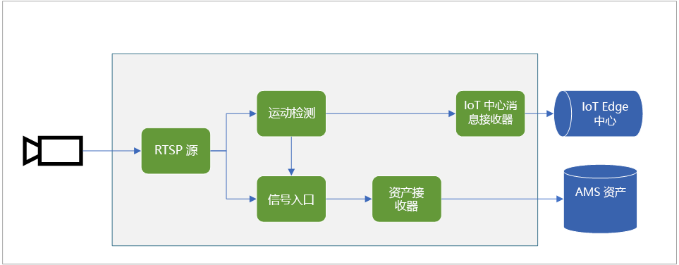
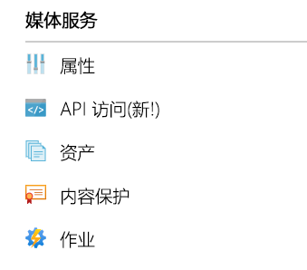
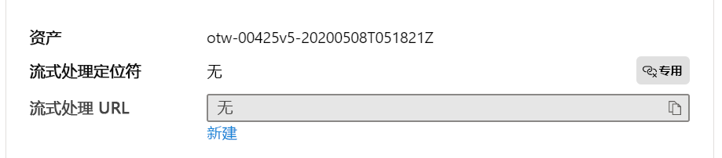

# <a name="quickstart-detect-motion-record-video-to-media-services"></a>快速入门：检测运动，将视频录制到媒体服务

本文逐步讲解如何使用 IoT Edge 上的实时视频分析进行[基于事件的录制](event-based-video-recording-concept.md)。 它将 Azure 中的 Linux VM 用作 IoT Edge 设备并使用模拟的实时视频流。 分析此视频流以了解是否存在移动物体。 检测到运动时，会将事件发送到 Azure IoT 中心，并将视频流的相关部分记录为 Azure 媒体服务中的资产。

本文以[开始使用快速入门](get-started-detect-motion-emit-events-quickstart.md)为基础。

## <a name="prerequisites"></a>先决条件

* 具有活动订阅的 Azure 帐户。 [免费创建帐户](https://azure.microsoft.com/free/?WT.mc_id=A261C142F)。
* 计算机上的 [Visual Studio Code](https://code.visualstudio.com/) 有 [Azure IoT Tools 扩展](https://marketplace.visualstudio.com/items?itemName=vsciot-vscode.azure-iot-tools)。
* 如果之前尚未完成[快速入门](get-started-detect-motion-emit-events-quickstart.md)，请完成以下步骤：
    * [设置 Azure 资源](get-started-detect-motion-emit-events-quickstart.md#set-up-azure-resources)
    * [部署模块](get-started-detect-motion-emit-events-quickstart.md#deploy-modules-on-your-edge-device)
    * [配置 Visual Studio Code](get-started-detect-motion-emit-events-quickstart.md#configure-the-azure-iot-tools-extension)

## <a name="review-the-sample-video"></a>观看示例视频

作为上述 Azure 资源设置步骤的一部分，一个停车场（短）视频将被复制到 Azure 中用作 IoT Edge 设备的 Linux VM 上。 本教程将使用此视频文件模拟实时流。

可以使用 [VLC Player](https://www.videolan.org/vlc/) 等应用程序，启动它，按 `Ctrl+N`，然后粘贴[停车场视频示例](https://lvamedia.blob.core.windows.net/public/lots_015.mkv)链接以开始播放。 大约在 5 秒的时候，一辆白色汽车在停车场间移动。

完成以下步骤时，会使用 IoT Edge 上的实时视频分析功能检测汽车的运动，并从大约第 5 秒的标记处开始录制视频剪辑。 下图直观呈现了整个过程。



## <a name="use-direct-method-calls"></a>使用直接方法调用

可以通过调用直接方法来使用该模块分析实时视频流。 阅读 [IoT Edge 上的实时视频分析的直接方法](direct-methods.md)，了解模块提供的所有直接方法。 

### <a name="invoke-graphtopologylist"></a>调用 GraphTopologyList
此步骤会枚举模块中的所有[图形拓扑](media-graph-concept.md#media-graph-topologies-and-instances)。

1. 右键单击“lvaEdge”模块，然后从上下文菜单中选择“调用模块直接方法”。
1. 你将看到一个编辑框在 Visual Studio Code 窗口的顶部中间弹出。 在编辑框中输入“GraphTopologyList”，然后按 Enter。
1. 接下来，复制以下 JSON 有效负载并将其粘贴到编辑框中，然后按 Enter。
    
```
{
    "@apiVersion" : "1.0"
}
```

几秒钟内，你将看到 Visual Studio Code 中弹出“输出”窗口，并显示以下响应
    
```
[DirectMethod] Invoking Direct Method [GraphTopologyList] to [lva-sample-device/lvaEdge] ...
[DirectMethod] Response from [lva-sample-device/lvaEdge]:
{
  "status": 200,
  "payload": {
    "value": []
  }
}
```
    
由于没有创建图形拓扑，所以预期会出现上述响应。

### <a name="invoke-graphtopologyset"></a>调用 GraphTopologySet

通过与调用 GraphTopologyList 相同的步骤，你可以使用以下 JSON 作为有效负载，调用 GraphTopologySet 以设置[图形拓扑](media-graph-concept.md#media-graph-topologies-and-instances)。 你将创建一个名为“EVRtoAssetsOnMotionDetection”的图形拓扑。

```
{
    "@apiVersion": "1.0",
    "name": "EVRtoAssetsOnMotionDetection",
    "properties": {
      "description": "Event-based video recording to Assets based on motion events",
      "parameters": [
        {
            "name": "rtspUserName",
            "type": "String",
            "description": "rtsp source user name.",
            "default": "dummyUserName"
        },
        {
            "name": "rtspPassword",
            "type": "String",
            "description": "rtsp source password.",
            "default" : "dummyPassword"
        },
        {
            "name": "rtspUrl",
            "type": "String",
            "description": "rtsp Url"
        },
        {
            "name": "motionSensitivity",
            "type": "String",
            "description": "motion detection sensitivity",
            "default" : "medium"
        },
        {
            "name": "hubSinkOutputName",
            "type": "String",
            "description": "hub sink output name",
            "default" : "iothubsinkoutput"
        }                              
    ],         

      "sources": [
        {
          "@type": "#Microsoft.Media.MediaGraphRtspSource",
          "name": "rtspSource",
          "endpoint": {
            "@type": "#Microsoft.Media.MediaGraphUnsecuredEndpoint",
            "url": "${rtspUrl}",
            "credentials": {
              "@type": "#Microsoft.Media.MediaGraphUsernamePasswordCredentials",
              "username": "${rtspUserName}",
              "password": "${rtspPassword}"
            }
          }
        }
      ],
      "processors": [
        {
          "@type": "#Microsoft.Media.MediaGraphMotionDetectionProcessor",
          "name": "motionDetection",
          "sensitivity": "${motionSensitivity}",
          "inputs": [
            {
              "nodeName": "rtspSource"
            }
          ]
        },
        {
          "@type": "#Microsoft.Media.MediaGraphSignalGateProcessor",
          "name": "signalGateProcessor",
          "inputs": [
            {
              "nodeName": "motionDetection"
            },
            {
              "nodeName": "rtspSource"
            }
          ],
          "activationEvaluationWindow": "PT1S",
          "activationSignalOffset": "PT0S",
          "minimumActivationTime": "PT30S",
          "maximumActivationTime": "PT30S"
        }
      ],
      "sinks": [
        {
          "@type": "#Microsoft.Media.MediaGraphAssetSink",
          "name": "assetSink",
          "assetNamePattern": "sampleAssetFromEVR-LVAEdge-${System.DateTime}",
          "segmentLength": "PT0M30S",
          "localMediaCacheMaximumSizeMiB": "2048",
          "localMediaCachePath": "/var/lib/azuremediaservices/tmp/",
          "inputs": [
            {
              "nodeName": "signalGateProcessor"
            }
          ]
        },
        {
          "@type": "#Microsoft.Media.MediaGraphIoTHubMessageSink",
          "name": "hubSink",
          "hubOutputName": "${hubSinkOutputName}",
          "inputs": [
            {
              "nodeName": "motionDetection"
            }
          ]
        }
      ]
    }
}
```

上述 JSON 有效负载的结果是创建一个定义了五个参数（其中四个参数具有默认值）的图形拓扑。 拓扑有一个源节点（[RTSP 源](media-graph-concept.md#rtsp-source)）、两个处理器节点（[运动检测处理器](media-graph-concept.md#motion-detection-processor)和[信号入口处理器](media-graph-concept.md#signal-gate-processor)）以及两个接收器节点（IoT 中心接收器和[资产接收器](media-graph-concept.md#asset-sink)）。 拓扑的直观呈现形式如下所示。

几秒钟内，“输出”窗口中显示以下响应。

```
[DirectMethod] Invoking Direct Method [GraphTopologySet] to [lva-sample-device/lvaEdge] ...
[DirectMethod] Response from [lva-sample-device/lvaEdge]:
{
  "status": 201,
  "payload": {
    "systemData": {
      "createdAt": "2020-05-12T22:05:31.603Z",
      "lastModifiedAt": "2020-05-12T22:05:31.603Z"
    },
    "name": "EVRtoAssetsOnMotionDetection",
    "properties": {
      "description": "Event-based video recording to assets based on motion events",
      "parameters": [
        {
          "name": "rtspUserName",
          "type": "String",
          "description": "rtsp source user name.",
          "default": "dummyUserName"
        },
        {
          "name": "rtspPassword",
          "type": "String",
          "description": "rtsp source password.",
          "default": "dummyPassword"
        },
        {
          "name": "rtspUrl",
          "type": "String",
          "description": "rtsp Url"
        },
        {
          "name": "motionSensitivity",
          "type": "String",
          "description": "motion detection sensitivity",
          "default": "medium"
        },
        {
          "name": "hubSinkOutputName",
          "type": "String",
          "description": "hub sink output name",
          "default": "iothubsinkoutput"
        }
      ],
      "sources": [
        {
          "@type": "#Microsoft.Media.MediaGraphRtspSource",
          "name": "rtspSource",
          "transport": "Tcp",
          "endpoint": {
            "@type": "#Microsoft.Media.MediaGraphUnsecuredEndpoint",
            "url": "${rtspUrl}",
            "credentials": {
              "@type": "#Microsoft.Media.MediaGraphUsernamePasswordCredentials",
              "username": "${rtspUserName}",
              "password": "${rtspPassword}"
            }
          }
        }
      ],
      "processors": [
        {
          "@type": "#Microsoft.Media.MediaGraphMotionDetectionProcessor",
          "sensitivity": "${motionSensitivity}",
          "name": "motionDetection",
          "inputs": [
            {
              "nodeName": "rtspSource",
              "outputSelectors": []
            }
          ]
        },
        {
          "@type": "#Microsoft.Media.MediaGraphSignalGateProcessor",
          "activationEvaluationWindow": "PT1S",
          "activationSignalOffset": "PT0S",
          "minimumActivationTime": "PT30S",
          "maximumActivationTime": "PT30S",
          "name": "signalGateProcessor",
          "inputs": [
            {
              "nodeName": "motionDetection",
              "outputSelectors": []
            },
            {
              "nodeName": "rtspSource",
              "outputSelectors": []
            }
          ]
        }
      ],
      "sinks": [
        {
          "@type": "#Microsoft.Media.MediaGraphAssetSink",
          "localMediaCachePath": "/var/lib/azuremediaservices/tmp/",
          "localMediaCacheMaximumSizeMiB": "2048",
          "segmentLength": "PT0M30S",
          "assetNamePattern": "sampleAssetFromEVR-LVAEdge-${System.DateTime}",
          "name": "assetSink",
          "inputs": [
            {
              "nodeName": "signalGateProcessor",
              "outputSelectors": []
            }
          ]
        },
        {
          "@type": "#Microsoft.Media.MediaGraphIoTHubMessageSink",
          "hubOutputName": "${hubSinkOutputName}",
          "name": "hubSink",
          "inputs": [
            {
              "nodeName": "motionDetection",
              "outputSelectors": []
            }
          ]
        }
      ]
    }
  }
}
```

返回的状态为 201，表示已创建新图形拓扑。 请尝试在后续步骤中使用以下直接方法：

* 再次调用 GraphTopologySet，并检查返回的状态代码是否为 200。 状态代码 200 表示已成功更新现有图形拓扑。
* 再次调用 GraphTopologySet，但更改描述字符串。 检查响应中的状态代码是否为 200，说明是否更新为新值。
* 调用之前部分概述的 GraphTopologyList，并检查现在是否可以在返回的有效负载中看到“EVRtoAssetsOnMotionDetection”拓扑。

### <a name="invoke-graphtopologyget"></a>调用 GraphTopologyGet

现在，使用以下有效负载调用 GraphTopologyGet
```

{
    "@apiVersion" : "1.0",
    "name" : "EVRtoAssetsOnMotionDetection"
}
```

几秒钟内，你应该可在“输出”窗口中看到以下响应

```
[DirectMethod] Invoking Direct Method [GraphTopologyGet] to [lva-sample-device/lvaEdge] ...
[DirectMethod] Response from [lva-sample-device/lvaEdge]:
{
  "status": 200,
  "payload": {
    "systemData": {
      "createdAt": "2020-05-12T22:05:31.603Z",
      "lastModifiedAt": "2020-05-12T22:05:31.603Z"
    },
    "name": "EVRtoAssetsOnMotionDetection",
    "properties": {
      "description": "Event-based video recording to Assets based on motion events",
      "parameters": [
        {
          "name": "rtspUserName",
          "type": "String",
          "description": "rtsp source user name.",
          "default": "dummyUserName"
        },
        {
          "name": "rtspPassword",
          "type": "String",
          "description": "rtsp source password.",
          "default": "dummyPassword"
        },
        {
          "name": "rtspUrl",
          "type": "String",
          "description": "rtsp Url"
        },
        {
          "name": "motionSensitivity",
          "type": "String",
          "description": "motion detection sensitivity",
          "default": "medium"
        },
        {
          "name": "hubSinkOutputName",
          "type": "String",
          "description": "hub sink output name",
          "default": "iothubsinkoutput"
        }
      ],
      "sources": [
        {
          "@type": "#Microsoft.Media.MediaGraphRtspSource",
          "name": "rtspSource",
          "transport": "Tcp",
          "endpoint": {
            "@type": "#Microsoft.Media.MediaGraphUnsecuredEndpoint",
            "url": "${rtspUrl}",
            "credentials": {
              "@type": "#Microsoft.Media.MediaGraphUsernamePasswordCredentials",
              "username": "${rtspUserName}",
              "password": "${rtspPassword}"
            }
          }
        }
      ],
      "processors": [
        {
          "@type": "#Microsoft.Media.MediaGraphMotionDetectionProcessor",
          "sensitivity": "${motionSensitivity}",
          "name": "motionDetection",
          "inputs": [
            {
              "nodeName": "rtspSource",
              "outputSelectors": []
            }
          ]
        },
        {
          "@type": "#Microsoft.Media.MediaGraphSignalGateProcessor",
          "activationEvaluationWindow": "PT1S",
          "activationSignalOffset": "PT0S",
          "minimumActivationTime": "PT30S",
          "maximumActivationTime": "PT30S",
          "name": "signalGateProcessor",
          "inputs": [
            {
              "nodeName": "motionDetection",
              "outputSelectors": []
            },
            {
              "nodeName": "rtspSource",
              "outputSelectors": []
            }
          ]
        }
      ],
      "sinks": [
        {
          "@type": "#Microsoft.Media.MediaGraphAssetSink",
          "localMediaCachePath": "/var/lib/azuremediaservices/tmp/",
          "localMediaCacheMaximumSizeMiB": "2048",
          "segmentLength": "PT0M30S",
          "assetNamePattern": "sampleAssetFromEVR-LVAEdge-${System.DateTime}",
          "name": "assetSink",
          "inputs": [
            {
              "nodeName": "signalGateProcessor",
              "outputSelectors": []
            }
          ]
        },
        {
          "@type": "#Microsoft.Media.MediaGraphIoTHubMessageSink",
          "hubOutputName": "${hubSinkOutputName}",
          "name": "hubSink",
          "inputs": [
            {
              "nodeName": "motionDetection",
              "outputSelectors": []
            }
          ]
        }
      ]
    }
  }
}
```

请注意响应有效负载中的以下属性：

* 状态代码为 200，表示成功。
* 有效负载具有“created”和“lastModified”时间戳。

### <a name="invoke-graphinstanceset"></a>调用 GraphInstanceSet

接下来，创建引用上述图形拓扑的图形实例。 如[此处](media-graph-concept.md#media-graph-topologies-and-instances)所述，图形实例允许你分析来自具有相同图形拓扑的许多照相机的实时视频流。

现在使用以下有效负载调用 GraphInstanceSet 直接方法：

```
{
    "@apiVersion" : "1.0",
    "name" : "Sample-Graph-2",
    "properties" : {
        "topologyName" : "EVRtoAssetsOnMotionDetection",
        "description" : "Sample graph description",
        "parameters" : [
            { "name" : "rtspUrl", "value" : "rtsp://rtspsim:554/media/lots_015.mkv" }
        ]
    }
}
```

注意以下事项：

* 上述有效负载指定需要为其创建图形实例的图形拓扑名称 (EVRtoAssetsOnMotionDetection)。
* 有效负载包含“rtspUrl”的参数值，该参数在拓扑负载中没有默认值。

几秒钟内，你可在“输出”窗口中看到以下响应：

```
[DirectMethod] Invoking Direct Method [GraphInstanceSet] to [lva-sample-device/lvaEdge] ...
[DirectMethod] Response from [lva-sample-device/lvaEdge]:
{
  "status": 201,
  "payload": {
    "systemData": {
      "createdAt": "2020-05-12T23:30:20.666Z",
      "lastModifiedAt": "2020-05-12T23:30:20.666Z"
    },
    "name": "Sample-Graph-2",
    "properties": {
      "state": "Inactive",
      "description": "Sample graph description",
      "topologyName": "EVRtoAssetsOnMotionDetection",
      "parameters": [
        {
          "name": "rtspUrl",
          "value": "rtsp://rtspsim:554/media/lots_015.mkv"
        }
      ]
    }
  }
}
```

请注意响应有效负载中的以下属性：

* 状态代码为 201，指示已创建新实例。
* 状态为“非活动”，指示图形实例已创建但未激活。 有关详细信息，请参阅[媒体图](media-graph-concept.md)状态。

请尝试在后续步骤中使用以下直接方法：

* 使用相同的有效负载再次调用 GraphInstanceSet，并注意返回的状态代码是 200。
* 再次调用 GraphInstanceSet，但使用不同的说明，并注意响应有效负载中更新的说明，指示图形实例已成功更新。
* 调用 GraphInstanceSet，但将名称更改为“Sample-Graph-3”并观察响应有效负载。 请注意，创建了一个新的图形实例（即状态代码为 201）。 在完成快速入门后，记得清理此类重复实例。

### <a name="prepare-for-monitoring-events"></a>准备监视事件

创建的媒体图使用运动检测处理器节点检测运动，而且此类事件将中继到 IoT 中心。 若要准备观察此类事件，请执行以下步骤

1. 在 Visual Studio Code 中打开“资源管理器”窗格，然后在左下角查找“Azure IoT 中心”。
1. 展开“设备”节点
1. 右键单击“lva-sample-device”，然后选择“开始监视内置事件监视”选项

    
    
    几秒钟内，你可在“输出”窗口看到以下消息：

```
[IoTHubMonitor] Start monitoring message arrived in built-in endpoint for all devices ...
[IoTHubMonitor] Created partition receiver [0] for consumerGroup [$Default]
[IoTHubMonitor] Created partition receiver [1] for consumerGroup [$Default]
[IoTHubMonitor] Created partition receiver [2] for consumerGroup [$Default]
[IoTHubMonitor] Created partition receiver [3] for consumerGroup [$Default]
```

### <a name="invoke-graphinstanceactivate"></a>调用 GraphInstanceActivate

现在激活图形实例，它通过模块启动实时视频流。 使用以下有效负载调用直接方法 GraphInstanceActivate：

```
{
    "@apiVersion" : "1.0",
    "name" : "Sample-Graph-2"
}
```

几秒钟内，你应该可在“输出”窗口中看到以下响应

```
[DirectMethod] Invoking Direct Method [GraphInstanceActivate] to [lva-sample-device/lvaEdge] ...
[DirectMethod] Response from [lva-sample-device/lvaEdge]:
{
  "status": 200,
  "payload": null
}
```

响应有效负载中的状态代码 200 指示图形实例已成功激活。

### <a name="invoke-graphinstanceget"></a>调用 GraphInstanceGet

现在使用以下有效负载调用 GraphInstanceGet 直接方法：

```
{
    "@apiVersion" : "1.0",
    "name" : "Sample-Graph-2"
}
```

几秒钟内，你应该可在“输出”窗口中看到以下响应

```
[DirectMethod] Invoking Direct Method [GraphInstanceGet] to [lva-sample-device/lvaEdge] ...
[DirectMethod] Response from [lva-sample-device/lvaEdge]:
{
  "status": 200,
  "payload": {
    "systemData": {
      "createdAt": "2020-05-12T23:30:20.666Z",
      "lastModifiedAt": "2020-05-12T23:30:20.666Z"
    },
    "name": "Sample-Graph-2",
    "properties": {
      "state": "Active",
      "description": "Sample graph description",
      "topologyName": "EVRtoAssetsOnMotionDetection",
      "parameters": [
        {
          "name": "rtspUrl",
          "value": "rtsp://rtspsim:554/media/lots_015.mkv"
        }
      ]
    }
  }
}
```

请注意响应有效负载中的以下属性：

* 状态代码为 200，表示成功。
* 状态为“活动”，表示图形实例现在处于“活动”状态。

## <a name="observe-results"></a>观察结果

上面创建和激活的图形实例使用运动检测处理器节点来检测传入实时视频流中的运动，并将事件发送到 IoT 中心接收器。 这些事件随后被转送到 IoT 中心，现在可以观察到这一点。 可在“输出”窗口看到以下消息

```
[IoTHubMonitor] [4:33:04 PM] Message received from [lva-sample-device/lvaEdge]:
{
  "body": {
    "sdp": "SDP:\nv=0\r\no=- 1589326384077235 1 IN IP4 XXX.XX.XX.XXX\r\ns=Matroska video+audio+(optional)subtitles, streamed by the LIVE555 Media Server\r\ni=media/lots_015.mkv\r\nt=0 0\r\na=tool:LIVE555 Streaming Media v2020.04.12\r\na=type:broadcast\r\na=control:*\r\na=range:npt=0-73.000\r\na=x-qt-text-nam:Matroska video+audio+(optional)subtitles, streamed by the LIVE555 Media Server\r\na=x-qt-text-inf:media/lots_015.mkv\r\nm=video 0 RTP/AVP 96\r\nc=IN IP4 0.0.0.0\r\nb=AS:500\r\na=rtpmap:96 H264/90000\r\na=fmtp:96 packetization-mode=1;profile-level-id=640028;sprop-parameter-sets=XXXXXXXXXXXXXXXXXXXXXXXXXXXXXXXXXXX\r\na=control:track1\r\n"
  },
  "applicationProperties": {
    "topic": "/subscriptions/{subscriptionId}/resourceGroups/{resourceGroupName}/providers/microsoft.media/mediaservices/{amsAccountName}",
    "subject": "/graphInstances/Sample-Graph-2/sources/rtspSource",
    "eventType": "Microsoft.Media.Graph.Diagnostics.MediaSessionEstablished",
    "eventTime": "2020-05-12T23:33:04.077Z",
    "dataVersion": "1.0"
  }
}
[IoTHubMonitor] [4:33:09 PM] Message received from [lva-sample-device/lvaEdge]:
{
  "body": {
    "timestamp": 143039375044290,
    "inferences": [
      {
        "type": "motion",
        "motion": {
          "box": {
            "l": 0.48954,
            "t": 0.140741,
            "w": 0.075,
            "h": 0.058824
          }
        }
      }
    ]
  },
  "applicationProperties": {
    "topic": "/subscriptions/{subscriptionId}/resourceGroups/{resourceGroupName}/providers/microsoft.media/mediaservices/{amsAccountName}",
    "subject": "/graphInstances/Sample-Graph-2/processors/md",
    "eventType": "Microsoft.Media.Graph.Analytics.Inference",
    "eventTime": "2020-05-12T23:33:09.381Z",
    "dataVersion": "1.0"
  }
}
```

请注意上述消息中的以下属性

* 每条消息都包含“正文”部分和“applicationProperties”部分。 若要理解这些部分的内容，请阅读[创建和读取 IoT 中心消息](../../iot-hub/iot-hub-devguide-messages-construct.md)一文。
* 第一条消息是诊断事件 (MediaSessionEstablished)，表示 RTSP源节点（使用者）能够与 RTSP 模拟器建立连接，并开始接收（模拟的）实时源。
* ApplicationProperties 中的“subject”引用生成消息的图形拓扑中的节点。 在本例中，该消息来自 RTSP 源节点。
* applicationProperties 中的“eventType”指示这是诊断事件。
* “eventTime”指示事件发生的时间。
* “body”包含有关诊断事件的数据 - 它是 [SDP](https://en.wikipedia.org/wiki/Session_Description_Protocol) 消息。
* 第二条消息是一个分析事件。 可以查看到是在 MediaSessionEstablished 消息后大约 5 秒发送了该消息，这对应于视频开始时到汽车穿过停车场的时间之间的延迟。
* applicationProperties 中的“使用者”引用图形中的运动检测处理器节点，该节点生成此消息
* 该事件是推理事件，因此“body”包含“timestamp”和“inferences”数据。
* “inferences”部分指示“type”为“motion”，并且具有关于“motion”事件的其他数据。

下面是你将看到的下一条消息。

```
[IoTHubMonitor] [4:33:10 PM] Message received from [lva-sample-device/lvaEdge]:
{
  "body": {
    "outputType": "assetName",
    "outputLocation": "sampleAssetFromEVR-LVAEdge-20200512T233309Z"
  },
  "applicationProperties": {
    "topic": "/subscriptions/{subscriptionId}/resourceGroups/{resourceGroupName}/providers/microsoft.media/mediaservices/{amsAccountName}",
    "subject": "/graphInstances/Sample-Graph-2/sinks/assetSink",
    "eventType": "Microsoft.Media.Graph.Operational.RecordingStarted",
    "eventTime": "2020-05-12T23:33:10.392Z",
    "dataVersion": "1.0"
  }
}
```

* 第三条消息是操作事件。 可以查看到它是紧随动作检测消息之后发送的，后者充当了触发器，使录制过程开始。
* ApplicationProperties 中的“subject”引用图形中的资产接收器节点，该节点生成此消息。
* 正文包含有关输出位置的信息，在本例中是用于录制视频的 Azure 媒体服务资产的名称。 请记下此值，稍后你将在此快速入门中使用它。

在拓扑中，为信号入口处理器节点配置的激活时间为 30 秒，这意味着，图形拓扑会将大约 30 秒的视频录制到资产中。 录制视频时，运动检测处理器节点会继续发出推理事件，这些事件将显示在“输出”窗口中。 一段时间后，会显示以下消息。

```
[IoTHubMonitor] [4:33:31 PM] Message received from [lva-sample-device/lvaEdge]:
{
  "body": {
    "outputType": "assetName",
    "outputLocation": "sampleAssetFromEVR-LVAEdge-20200512T233309Z"
  },
  "applicationProperties": {
    "topic": "/subscriptions/{subscriptionId}/resourceGroups/{resourceGroupName}/providers/microsoft.media/mediaservices/{amsAccountName}",
    "subject": "/graphInstances/Sample-Graph-2/sinks/assetSink",
    "eventType": "Microsoft.Media.Graph.Operational.RecordingAvailable",
    "eventTime": "2020-05-12T23:33:31.051Z",
    "dataVersion": "1.0"
  }
}
```

* 此消息也是操作事件。 事件 RecordingAvailable 表示已向资产写入足够的数据，以便播放机/客户端启动视频播放
* applicationProperties 中的“使用者”引用图形中的资产接收器节点，该节点生成此消息
* 正文包含有关输出位置的信息，在本例中是用于录制视频的 Azure 媒体服务资产的名称。

如果允许图形实例继续运行，则会显示此消息。

```
[IoTHubMonitor] [4:33:40 PM] Message received from [lva-sample-device/lvaEdge]:
{
  "body": {
    "outputType": "assetName",
    "outputLocation": "sampleAssetFromEVR-LVAEdge-20200512T233309Z"
  },
  "applicationProperties": {
    "topic": "/subscriptions/{subscriptionId}/resourceGroups/{resourceGroupName}/providers/microsoft.media/mediaservices/{amsAccountName}",
    "subject": "/graphInstances/Sample-Graph-2/sinks/assetSink",
    "eventType": "Microsoft.Media.Graph.Operational.RecordingStopped",
    "eventTime": "2020-05-12T23:33:40.014Z",
    "dataVersion": "1.0"
  }
}
```

* 此消息也是操作事件。 事件 RecordingStopped 指示已停止录制。
* 请注意，自 RecordingStarted 事件发生后已经过大约 30 秒，这与信号入口处理器节点中激活时间的值匹配。
* ApplicationProperties 中的“subject”引用图形中的资产接收器节点，该节点生成此消息。
* 正文包含有关输出位置的信息，在本例中是用于录制视频的 Azure 媒体服务资产的名称。

如果允许图形实例继续运行，RTSP 模拟器将到达视频文件的末尾并停止/断开连接。 然后，RTSP 源节点会重新连接到模拟器，此过程将重复。
    
## <a name="invoke-additional-direct-method-calls-to-clean-up"></a>调用其他直接方法调用进行清理

现在，调用直接方法以停用和删除图形实例（按该顺序执行操作）。

### <a name="invoke-graphinstancedeactivate"></a>调用 GraphInstanceDeactivate

使用以下有效负载调用 GraphInstanceDeactivate 直接方法：

```
{
    "@apiVersion" : "1.0",
    "name" : "Sample-Graph-2"
}
```

几秒钟内，你应该可在“输出”窗口中看到以下响应。

```
[DirectMethod] Invoking Direct Method [GraphInstanceDeactivate] to [lva-sample-device/lvaEdge] ...
[DirectMethod] Response from [lva-sample-device/lvaEdge]:
{
  "status": 200,
  "payload": null
}
```

状态代码 200 指示图形实例已成功停用。

请尝试以下步骤：

* 如前面各节所示调用 GraphInstanceGet，并观察“状态”值。

### <a name="invoke-graphinstancedelete"></a>调用 GraphInstanceDelete

使用以下有效负载调用直接方法 GraphInstanceDelete

```
{
    "@apiVersion" : "1.0",
    "name" : "Sample-Graph-2"
}
```

几秒钟内，你应该可在“输出”窗口中看到以下响应：

```
[DirectMethod] Invoking Direct Method [GraphInstanceDelete] to [lva-sample-device/lvaEdge] ...
[DirectMethod] Response from [lva-sample-device/lvaEdge]:
{
  "status": 200,
  "payload": null
}
```

响应中的状态代码 200 指示图形实例已成功删除。

### <a name="invoke-graphtopologydelete"></a>调用 GraphTopologyDelete

使用以下有效负载调用 GraphTopologyDelete 直接方法：

```
{
    "@apiVersion" : "1.0",
    "name" : "EVRtoAssetsOnMotionDetection"
}
```

几秒钟内，你应该可在“输出”窗口中看到以下响应

```
[DirectMethod] Invoking Direct Method [GraphTopologyDelete] to [lva-sample-device/lvaEdge] ...
[DirectMethod] Response from [lva-sample-device/lvaEdge]:
{
  "status": 200,
  "payload": null
}
```

状态代码 200 指示 MediaGraph 拓扑已成功删除。

请尝试在后续步骤中使用以下直接方法：

* 调用 GraphTopologyList 并观察到模块中没有图形拓扑。
* 使用与 GraphTopologyList 相同的有效负载调用 GraphInstanceList，并观察到未枚举任何图形实例。

## <a name="playing-back-the-recorded-video"></a>播放录制的视频

接下来，可以使用 Azure 门户播放录制的视频。

1. 登录到 [Azure 门户](https://portal.azure.com/)，在搜索框中键入“媒体服务”。
1. 找到 Azure 媒体服务帐户并将其打开。
1. 在媒体服务列表中找到并选择“资产”项。

    
1. 如果在本快速入门中你是首次使用 Azure 媒体服务，则仅会列出此快速入门中生成的资产，你可以选取最早的资产。
1. 或者使用在上述操作事件中作为 outputLocation 提供的资产的名称。
1. 在打开的详细信息页中，单击“流式处理 URL”文本框正下方的“新建”链接。

    
1. 在为“添加流式处理定位符”打开的窗格中，接受默认值，并点击底部的“添加”。
1. 在“资产详细信息”页中，视频播放器现在应已加载到视频的第一帧，可以点击播放按钮。 检查确认确实看到了汽车穿过停车场的那部分视频。

    

> [!NOTE]
> 由于模拟的实时视频是在激活图形时启动，因此与一天中的时间值不相关，也不会通过此播放机快捷方式公开。 连续视频录制和播放的相关教程显示了如何显示时间戳。

## <a name="clean-up-resources"></a>清理资源

如果不打算继续使用此应用程序，请删除本快速入门中创建的资源。

## <a name="next-steps"></a>后续步骤

* 了解如何以编程方式调用 IoT Edge 上的实时视频分析[直接方法](direct-methods.md)。
* 详细了解诊断消息。    
