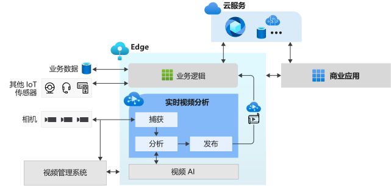

# 什么是 IoT Edge 上的实时视频分析？ （预览版）

IoT Edge 上的实时视频分析提供了一个平台，可用于构建跨越边缘和云的智能视频应用程序。 此平台提供了捕获、记录和分析实时视频的功能，并且可以将结果（视频和/或视频分析）发布到 Azure 服务（云中和/或边缘）。 该平台可用于通过视频分析增强 IoT 解决方案。 IoT Edge 上的实时视频分析功能可以与其他 Azure IoT Edge 模块结合，如 IoT Edge 上的流分析、IoT Edge 上的认知服务以及云中的 Azure 服务（如媒体服务、事件中心、认知服务等），以构建强大的混合（例如边缘+云）应用程序。

IoT Edge 上的实时视频分析被设计成可扩展平台，由此可连接不同的视频分析边缘模块（如认知服务容器、使用开放源代码机器学习模型构建的自定义边缘模块，或使用自己的数据训练的自定义模型）并使用这些模块分析实时视频，而不必担心构建和运行实时视频管道的复杂性。

## 加速 IoT 解决方案开发 

将视频分析与来自其他 IoT 传感器的信号和/或业务数据相结合的 IoT 解决方案可以帮助自动或半自动制定业务决策，从而提高工作效率。 利用 IoT Edge 上的实时视频分析可以更快地构建此类解决方案。 通过此平台，你可以专注于构建特定于业务的视频分析模块和逻辑，不必担心管理和运行视频管道的复杂性。

借助 IoT Edge 上的实时视频分析，你可以继续将 [CCTV 相机](https://en.wikipedia.org/wiki/Closed-circuit_television_camera)与现有[视频管理系统 (VMS)](https://en.wikipedia.org/wiki/Video_management_system) 结合使用，并独立构建视频分析应用。 IoT Edge 上的实时视频分析可与计算机视觉 SDK 和工具包结合使用，用于构建先进的 IoT 解决方案。 下图对此进行了说明。

## 支持的环境

支持 Linux x86-64 和 ARM64 环境。
> [!NOTE]
> 内部版本 `1.0.4` 及更高版本支持 ARM64 设备。
> 支持在 ARM64 设备上运行 Azure IoT Edge 运行时，该支持为[公共预览版](https://azure.microsoft.com/support/legal/preview-supplemental-terms/)。

## 入门

阅读以下概念文章，然后尝试参考快速入门以在实时视频源上运行动作检测。

### 概念

* [媒体图](media-graph-concept.md)
* [视频录制](video-recording-concept.md)
* [视频播放](video-playback-concept.md)
* [连续视频录制](continuous-video-recording-concept.md)
* [基于事件的视频录制](event-based-video-recording-concept.md)
* [在不录制视频的情况下进行实时视频分析](analyze-live-video-concept.md)

## 后续步骤

* 按照[快速入门：使用自己的模型运行实时视频分析](use-your-model-quickstart.md)文章，查看如何在实时视频源上运行动作检测。
* 查看[术语](terminology.md)
* 了解[实时视频分析开放源代码材料](https://github.com/Azure/live-video-analytics)

