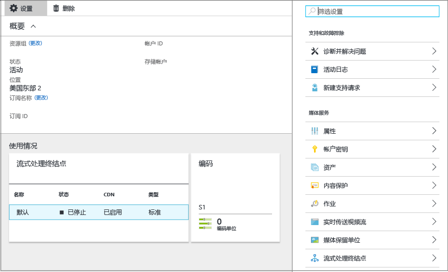
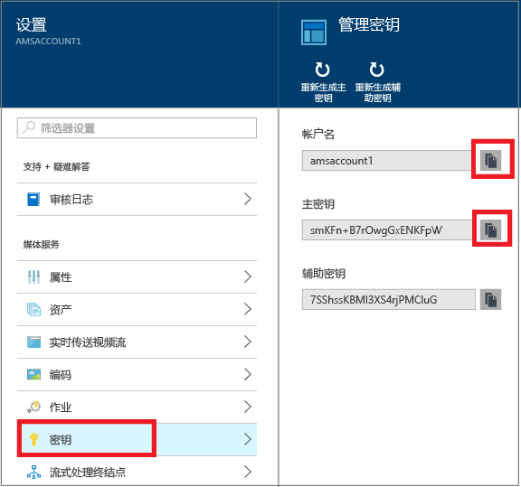

# 利用 Azure 门户创建 Azure 媒体服务帐户
> [!div class="op_single_selector"]
> * [门户](media-services-portal-create-account.md)
> * [PowerShell](media-services-manage-with-powershell.md)
> * [REST](https://docs.microsoft.com/rest/api/media/mediaservice)
> 
> [!NOTE]
> 若要完成本教程，你需要一个 Azure 帐户。 有关详细信息，请参阅 [Azure 免费试用](https://azure.microsoft.com/pricing/free-trial/)。 
> 
> 

使用 Azure 门户，可以快速创建 Azure 媒体服务 (AMS) 帐户。 你可以使用自己的帐户访问媒体服务，这些服务使你能够在 Azure 中存储、加密、编码、管理和流式传输媒体内容。 创建媒体服务帐户时，你还将在此帐户所在的地理区域内创建一个关联的媒体服务帐户（或使用现有存储帐户）。

本文将介绍一些常见概念，并展示如何使用 Azure 门户创建媒体服务帐户。

## 概念
访问媒体服务需要两个关联的帐户：

* 一个媒体服务帐户。 你可以使用你的帐户访问 Azure 中可用的一组基于云的媒体服务。 媒体服务帐户不会存储实际媒体内容， 而是存储有关你帐户中的媒体内容和媒体处理作业的元数据。 创建该帐户时，需要选择一个可用的媒体服务区域。 所选的区域是存储你帐户的元数据记录的数据中心。
  
    可用的媒体服务 (AMS) 区域如下：北欧、西欧、美国西部、美国东部、东南亚、东亚、日本西部、日本东部。 媒体服务不使用地缘组。
  
    AMS 现已在以下数据中心推出：巴西南部、印度西部、印度南部和印度中部。 现在可以使用 Azure 门户创建媒体服务帐户，以及执行此处所述的各项任务。 不过，这些数据中心未启用实时编码。 此外，并非所有类型的编码保留单位都可用于这些数据中心。
  
  * 巴西南部：只可以使用标准和基本编码保留单位。
  * 印度西部、印度南部： 
* 一个 Azure 存储帐户。 存储帐户必须位于媒体服务帐户所在的地理区域内。 创建媒体服务帐户时，你可以选择位于同一区域内的现有存储帐户，也可以在同一区域内创建新的存储帐户。 如果你删除媒体服务帐户，相关存储帐户中的 Blob 不会被删除。

## 创建 AMS 帐户
本部分中的步骤将介绍如何创建 AMS 帐户。

1. 在 [Azure 门户](https://portal.azure.com/)登录。
2. 单击“+新建” > “Web + 移动” > “媒体服务”。
   
    
3. 在“创建媒体服务帐户”中输入所需的值。
   
    
   
   1. 在“帐户名”中，输入新的 AMS 帐户的名称。 媒体服务帐户名称由小写字母或数字构成（不含空格），长度为 3 到 24 个字符。
   2. 在“订阅”中，在你有权访问的不同 Azure 订阅中进行选择。
   3. 在“资源组”中，选择新的或现有的资源。  资源组是共享生命周期、权限和策略的资源的集合。 在[此处](../azure-resource-manager/resource-group-overview.md#resource-groups)了解更多信息。
   4. 在“位置”中，选择将用于存储媒体服务帐户的媒体和元数据记录的地理区域。 此区域将用于处理和流式播放媒体。 下拉列表中仅显示可用的媒体服务区域。 
   5. 在“存储帐户”中，选择一个存储帐户以便提供媒体服务帐户中媒体内容的 Blob 存储。 可选择媒体服务帐户所在的地理区域内的现有存储帐户，也可创建存储帐户。 将在同一区域内创建一个新的存储帐户。 适用于存储帐户名的规则对媒体服务帐户同样适用。
      
       单击[此处](../storage/storage-introduction.md)了解有关存储的详细信息。
   6. 选择“固定到仪表板”以查看帐户部署进度。
4. 单击窗体底部的“创建”。
   
    成功创建帐户后，将会打开概述页。 在流式处理终结点表中，帐户包含一个处于“已停止”状态的默认流式处理终结点。 

    >[!NOTE]
    >创建 AMS 帐户后，会将一个处于“已停止”状态的**默认**流式处理终结点添加到帐户。 若要开始流式传输内容并利用动态打包和动态加密，要从中流式传输内容的流式处理终结点必须处于“正在运行”状态。 
   
    
   
    若要管理 AMS 帐户（例如，上载视频、对资产进行编码、监视作业进度），请使用“设置”窗口。

## 管理密钥
你需要有帐户名和主密钥信息，才能以编程方式访问媒体服务帐户。

1. 在 Azure 门户中，选择你的帐户。 
   
    “设置”窗口显示在右侧。 
2. 在“设置”窗口中，选择“密钥”。 
   
    “管理密钥”窗口显示帐户名，主密钥和辅助密钥也会显示。 
3. 按复制按钮复制这些值。
   
    

## 后续步骤
现在可以将文件上载到 AMS 帐户。 有关详细信息，请参阅 [上载文件](media-services-portal-upload-files.md)。

## 媒体服务学习路径
[!INCLUDE [media-services-learning-paths-include](../../includes/media-services-learning-paths-include.md)]

## 提供反馈
[!INCLUDE [media-services-user-voice-include](../../includes/media-services-user-voice-include.md)]

<!--HONumber=Jan17_HO2-->

