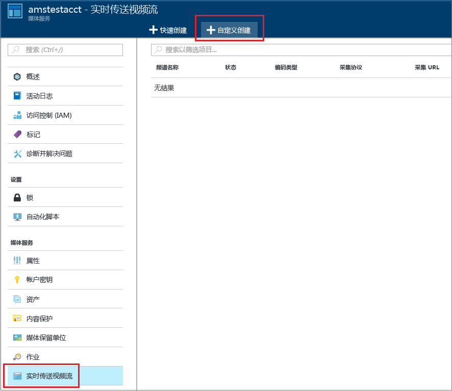
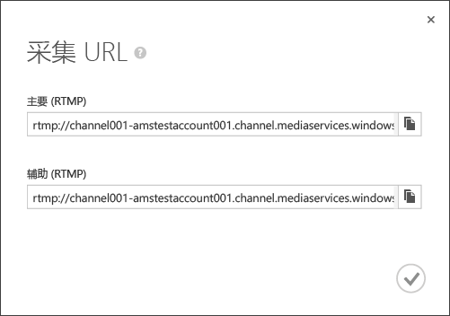
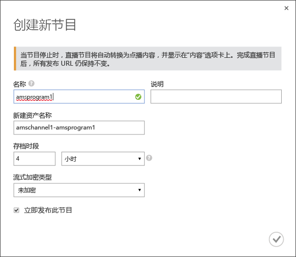
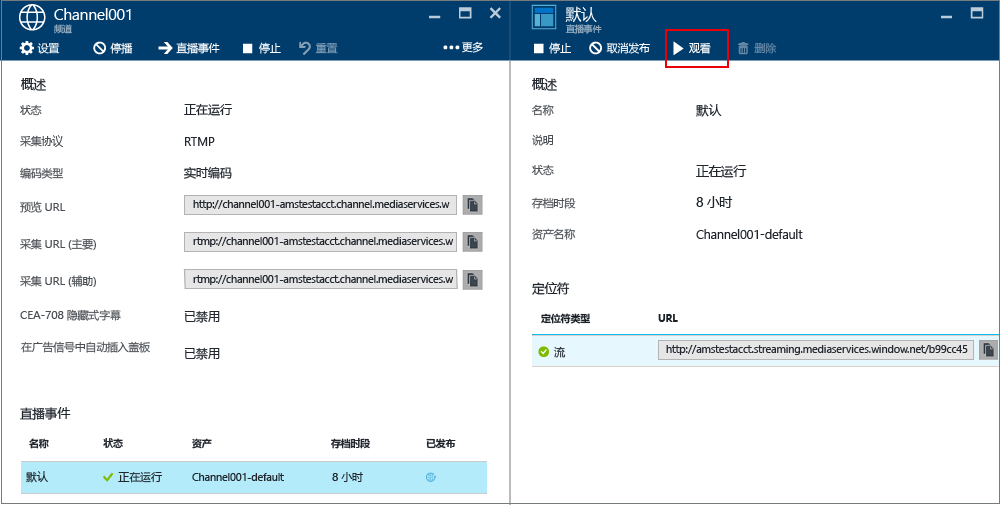
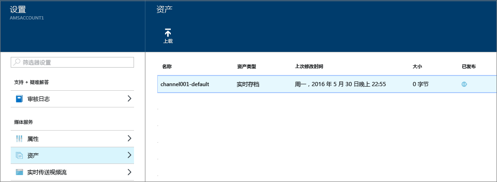

# 如何使用 Azure 媒体服务实时传送视频流，通过 Azure 门户创建多比特率流
> [!div class="op_single_selector"]
> * [门户](media-services-portal-creating-live-encoder-enabled-channel.md)
> * [.NET](media-services-dotnet-creating-live-encoder-enabled-channel.md)
> * [REST API](https://docs.microsoft.com/rest/api/media/operations/channel)
> 
> 

本教程将指导你完成创建 **频道** 的步骤，该频道接收单比特率实时流，并将其编码为多比特率流。

> [!NOTE]
> 有关为实时编码启用的通道的更多相关概念信息，请参阅 [使用 Azure 媒体服务执行实时流式处理以创建多比特率流](media-services-manage-live-encoder-enabled-channels.md)。
> 
> 

## 常见的实时流方案
以下是在创建常见的实时流应用程序时涉及的常规步骤。

> [!NOTE]
> 目前，实时事件的最大建议持续时间为 8 小时。 如果需要较长时间运行某个频道，请通过 Microsoft.com 联系 amslived。
> 
> 

1. 将视频摄像机连接到计算机。 启动并配置可以通过以下协议之一输出单比特率流的本地实时编码器：RTMP、平滑流式处理或 RTP (MPEG-TS)。 有关详细信息，请参阅 [Azure 媒体服务 RTMP 支持和实时编码器](http://go.microsoft.com/fwlink/?LinkId=532824)。
   
    此步骤也可以在创建频道后执行。
2. 创建并启动频道。 
3. 检索频道引入 URL。 
   
    实时编码器使用引入 URL 将流发送到频道。
4. 检索频道预览 URL。 
   
    使用此 URL 来验证频道是否正常接收实时流。
5. 创建事件/节目（这也会创建资产）。 
6. 发布事件（这将为关联的资产创建点播定位符）。    
7. 在准备好开始流式传输和存档时，启动事件。
8. （可选）可以向实时编码器发信号，以启动广告。 将广告插入到输出流中。
9. 要停止流式传输并存档事件时，停止事件。
10. 删除事件（并选择性地删除资产）。   

## 本教程的内容
在本教程中，将使用 Azure 门户完成以下任务： 

1. 创建能够执行实时编码的通道。
2. 获取引入 URL，以便将其提供给实时编码器。 实时编码器将使用此 URL 将流引入通道。
3. 创建事件/节目（和资产）。
4. 发布资产并获取流式处理 URL。  
5. 播放内容。
6. 清理。

## 先决条件
以下是完成本教程所需具备的条件。

* 若要完成本教程，你需要一个 Azure 帐户。 如果你没有帐户，只需花费几分钟就能创建一个免费试用帐户。 
  有关详细信息，请参阅 [Azure 免费试用](https://azure.microsoft.com/pricing/free-trial/)。
* 一个媒体服务 帐户。 若要创建媒体服务帐户，请参阅[创建帐户](media-services-portal-create-account.md)。
* 可以发送单比特率实时流的摄像头和编码器。

## 创建频道
1. 在 [Azure 门户](https://portal.azure.com/)中，选择“媒体服务”，然后单击媒体服务帐户名。
2. 选择“实时传送视频流” 。
3. 选择“自定义创建” 。 选择此选项可以创建一个频道来进行实时编码。
   
    
4. 单击“设置” 。
   
   1. 选择“实时编码”  频道类型。 此类型指定要创建能够进行实时编码的频道。 这意味着传入单比特率流将发送到频道，并使用指定的实时编码器设置编码为多比特率流。 有关详细信息，请参阅 [使用 Azure 媒体服务执行实时流式处理以创建多比特率流](media-services-manage-live-encoder-enabled-channels.md)。 单击“确定”。
   2. 指定频道的名称。
   3. 单击屏幕底部的“确定”。
5. 选择“引入”  选项卡。
   
   1. 在此页上，可以选择流式处理协议。 对于“实时编码”  频道类型，其有效的协议选项包括：
      
      * 单比特率分片 MP4（平滑流）
      * 单比特率 RTMP
      * RTP (MPEG-TS)：RTP 上的 MPEG-2 传输流。
        
        有关每个协议的详细说明，请参阅 [使用 Azure 媒体服务执行实时流式处理以创建多比特率流](media-services-manage-live-encoder-enabled-channels.md)。
        
        运行频道或其关联的事件/节目时，不能更改协议选项。 如果需要其他协议，应当为每个流协议创建单独的频道。  
   2. 可以对引入中应用 IP 限制。 
      
       可定义允许向该通道引入视频的 IP 地址。 允许的 IP 地址可以指定为单个 IP 地址（例如“10.0.0.1”）、使用一个 IP 地址和 CIDR 子网掩码的 IP 范围（例如“10.0.0.1/22”），或使用一个 IP 地址和点分十进制子网掩码的 IP 范围（例如“10.0.0.1(255.255.252.0)”）。
      
       如果未指定 IP 地址并且没有规则定义，则不会允许任何 IP 地址。 若要允许任何 IP 地址，请创建一个规则并设置 0.0.0.0/0。
6. 在“预览”  选项卡上，对预览应用 IP 限制。
7. 在“编码”  选项卡上，指定编码预设。 
   
    目前，唯一可以选择的系统预设是 **“默认 720p”**。 要指定自定义预设，请打开 Microsoft 支持票证。 输入创建的预设名称。 

> [!NOTE]
> 目前，通道启动可能最多需要 30 分钟。 频道重置可能最多需要 5 分钟。
> 
> 

创建频道后，可以单击频道并选择“设置”  选项卡，在该选项卡中可以查看频道配置。 

有关详细信息，请参阅 [使用 Azure 媒体服务执行实时流式处理以创建多比特率流](media-services-manage-live-encoder-enabled-channels.md)。

## 获取引入 URL
创建通道后，你可以获得要提供给实时编码器的引入 URL。 编码器将使用这些 URL 来输入实时流。

## 创建并管理事件
### 概述
频道与事件/节目相关联，使用事件/节目，你可以控制实时流中的段的发布和存储。 频道管理事件/节目。 频道和节目的关系非常类似于传统媒体，频道具有恒定的内容流，而节目的范围限定为该频道上的一些定时事件。

可以通过设置“存档时段”  长度，指定希望保留事件录制内容的小时数。 此值的设置范围是最短 5 分钟，最长 25 小时。 存储时间窗口长度还决定了客户端能够从当前实时位置按时间向后搜索的最长时间。 超出指定时间长度后，事件也能够运行，但落在时间窗口长度后面的内容将全部被丢弃。 此属性的这个值还决定了客户端清单能够增加多长时间。

每个事件都与某个资产关联。 若要发布事件，必须为关联的资产创建按需定位符。 创建此定位符后，你可以生成提供给客户端的流 URL。

一个通道最多支持三个并发运行的事件，因此你可以为同一传入流创建多个存档。 这样，你便可以根据需要发布和存档事件的不同部分。 例如，业务要求是存档 6 小时的事件，但只广播过去 10 分钟的内容。 需要创建两个同时运行的事件才能实现此目的。 一个事件设置为存档 6 小时的事件但不发布节目。 另一个事件设置为存档 10 分钟的事件并发布节目。

不应当将现有节目重用于新事件。 与之相反，应针对每个事件创建并启动新节目。

在准备好开始流式传输和存档时，启动事件/节目。 要停止流式传输并存档事件时，停止事件。 

若要删除存档的内容，请停止并删除事件，然后删除关联的资产。 如果资产被某个事件使用，则无法删除，必须先删除事件才行。 

即使你停止并删除了事件，只要你没有删除资产，用户也将能够按需将你的已存档内容作为视频进行流式传输。

如果希望保留已存档的内容但不希望其可供流式传输，请删除流式传输定位符。

### 创建/启动/停止事件
将流传输到通道后，你可以通过创建资产、节目和流定位符来启动流式传输事件。 这将会存档流，并使观看者可通过流式处理终结点使用该流。 

>[!NOTE]
>创建 AMS 帐户后，会将一个处于“已停止”状态的**默认**流式处理终结点添加到帐户。 若要开始流式传输内容并利用动态打包和动态加密，要从中流式传输内容的流式处理终结点必须处于“正在运行”状态。 

可通过两种方式启动该事件： 

1. 在“通道”页上，按“实时事件”添加新事件。
   
    指定：事件名称、资产名称、存档时段和加密选项。
   
    
   
    如果保持选中“立即发布此实时事件”  ，将会创建事件的发布 URL。
   
    准备好流式传输事件时，可以按“启动” 。
   
    启动事件后，可以按“观看”  开始播放内容。
2. 或者，可使用快捷方式并按“通道”页上的“开始播放”按钮。 这将会创建默认资产、节目和流式处理定位符。
   
    事件命名为 **default** ，存档时段设置为 8 小时。

可以从“实时事件”  页上观看所发布的事件。 

如果单击“停播” ，则所有实时事件停止。 

## 观看事件
要观看事件，请在 Azure 门户中单击“观看”  ，或者先复制流式处理 URL，然后使用选择的播放器进行播放。 

停止时，实时事件会自动转换为点播内容。

## 清理
如果你已完成流式处理事件，并想要清理先前设置的资源，请遵循以下过程。

* 停止从编码器推送流。
* 停止通道。 停止通道后，将不会产生任何费用。 当你需要重新启动它时，它将采用相同的引入 URL，因此你无需重新配置编码器。
* 除非你想要继续以点播流形式提供实时事件的存档，否则你可以停止流式处理终结点。 如果通道处于停止状态，将不会产生任何费用。

## 查看存档的内容
即使你停止并删除了事件，只要你没有删除资产，用户也将能够按需将你的已存档内容作为视频进行流式传输。 如果资产被某个事件使用，则无法将其删除，必须先删除该事件。 

若要管理资产，请选择“设置”，再单击“资产”。

## 注意事项
* 目前，实时事件的最大建议持续时间为 8 小时。 如果要运行一个需要更长时间的通道，请通过 Microsoft.com 联系 amslived。
* 确保要从中流式传输内容的流式处理终结点处于“正在运行”状态。

## 后续步骤
查看媒体服务学习路径。

[!INCLUDE [media-services-learning-paths-include](../../includes/media-services-learning-paths-include.md)]

## 提供反馈
[!INCLUDE [media-services-user-voice-include](../../includes/media-services-user-voice-include.md)]

