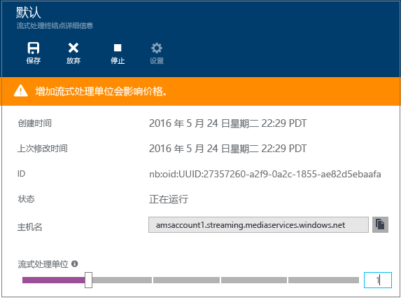

<properties 
	pageTitle="如何使用 Azure 媒体服务执行实时传送视频流以通过 Azure 门户创建多比特率流 | Azure" 
	description="本教程将指导你完成创建通道的步骤，该通道接收单比特率实时流并利用 Azure 门户将其编码为多比特率流。" 
	services="media-services" 
	documentationCenter="" 
	authors="anilmur" 
	manager="erikre" 
	editor=""/>

<tags 
	ms.service="media-services" 
	ms.workload="media" 
	ms.tgt_pltfrm="na" 
	ms.devlang="na" 
	ms.topic="get-started-article"
	ms.date="09/06/2016"
	wacn.date=""
	ms.author="juliako;juliako"/>

#如何使用 Azure 媒体服务执行实时传送视频流以通过 Azure 门户创建多比特率流

> [AZURE.SELECTOR]
- [门户](/documentation/articles/media-services-portal-creating-live-encoder-enabled-channel/)
- [.NET](/documentation/articles/media-services-dotnet-creating-live-encoder-enabled-channel/)
- [REST API](https://msdn.microsoft.com/zh-cn/library/azure/dn783458.aspx)

本教程将指导你完成创建**通道**的步骤，该通道接收单比特率实时流，并将其编码为多比特率流。

>[AZURE.NOTE]有关为实时编码启用的通道的更多相关概念信息，请参阅[使用 Azure 媒体服务执行实时流式处理以创建多比特率流](/documentation/articles/media-services-manage-live-encoder-enabled-channels/)。

##常见的实时流方案

以下是在创建常见的实时流应用程序时涉及的常规步骤。

>[AZURE.NOTE] 目前，实时事件的最大建议持续时间为 8 小时。如果你需要运行一个需要更长时间的通道，请通过 Azure.cn 联系 amslived。

1. 将视频摄像机连接到计算机。启动并配置可以通过以下协议之一输出单比特率流的本地实时编码器：RTMP、平滑流式处理或 RTP (MPEG-TS)。有关详细信息，请参阅 [Azure 媒体服务 RTMP 支持和实时编码器](https://azure.microsoft.com/zh-cn/blog/azure-media-services-rtmp-support-and-live-encoders/)。
	
	此步骤也可以在创建通道后执行。

1. 创建并启动通道。

1. 检索通道引入 URL。

	实时编码器使用引入 URL 将流发送到通道。
1. 检索通道预览 URL。

	使用此 URL 来验证通道是否正常接收实时流。

3. 创建事件/节目（还将创建一个资产）。
1. 发布事件（将创建相关资产的按需定位符）。

	确保你要从中以流形式传输内容的流式传输终结点上至少有一个流式传输保留单元。
1. 在准备好开始流式传输和存档时，启动事件。
2. （可选）可以向实时编码器发信号，以启动广告。将广告插入到输出流中。
1. 在要停止流式传输和归档事件时，停止事件。
1. 删除事件（并选择性地删除资产）。

##本教程的内容

在本教程中，将使用 Azure 门户完成以下任务：

2.  配置流式处理终结点。
3.  创建能够执行实时编码的通道。
1.  获取引入 URL，以便将其提供给实时编码器。实时编码器将使用此 URL 将流引入通道。
1.  创建事件/节目（及资产）
1.  发布资产并获取流 URL
1.  播放内容
2.  清理

##先决条件
以下是完成本教程所需具备的条件。

- 若要完成本教程，你需要一个 Azure 帐户。如果你没有帐户，可以创建一个试用帐户，只需几分钟即可完成。有关详细信息，请参阅 [Azure 试用](/pricing/1rmb-trial/)。
- 一个媒体服务帐户。若要创建媒体服务帐户，请参阅[创建帐户](/documentation/articles/media-services-create-account/)。
- 可以发送单比特率实时流的摄像头和编码器。

##配置流式处理终结点 

媒体服务所提供的动态打包可让你以下述流格式传送多比特率 MP4，而无须重新打包成这些流格式：MPEG DASH、HLS、Smooth Streaming 或 HDS。通过动态打包，你只需要存储及支付一种存储格式的文件，媒体服务将会根据客户端的要求创建并提供适当的响应。

若要利用动态打包，你需要获取计划从中传送内容的流式处理终结点的至少一个流式处理单元。

若要创建和更改流式处理保留单元数，请执行以下操作：

1. 在 [Azure 门户](https://portal.azure.cn/)登录。
1. 在“设置”窗口中，单击“流式处理终结点”。

2. 单击默认的流式处理终结点。

	此时会显示“默认流式处理终结点详细信息”窗口。

3. 若要指定流式处理单元数，请滑动“流式处理单元”滑块。

	

4. 单击“保存”按钮保存更改。

	>[AZURE.NOTE]分配新的单元最多需要 20 分钟即可完成。

##创建通道

1. 在 [Azure 门户](https://portal.azure.cn/)中，单击“媒体服务”，然后单击媒体服务帐户名。
2. 选择“实时传送视频流”。
3. 选择“自定义创建”。此选项可创建为实时编码启用的通道。

	  

	
4. 单击“设置”。
	
	1.  选择“实时编码”通道类型。此类型指定要创建能够进行实时编码的通道。这意味着传入单比特率流将发送到通道，并使用指定的实时编码器设置编码为多比特率流。有关详细信息，请参阅[使用 Azure 媒体服务执行实时流式处理以创建多比特率流](/documentation/articles/media-services-manage-live-encoder-enabled-channels/)。单击“确定”。
	2. 指定通道名称。
	3. 单击屏幕底部的“确定”。
	
5. 选择“引入”选项卡。

	1. 可在本页上选择流协议。对于“实时编码”通道类型，有效的协议选项为：
		
		- 单比特率分片 MP4（平滑流）
		- 单比特率 RTMP
		- RTP (MPEG-TS)：RTP 上的 MPEG-2 传输流。
		
		有关每个协议的详细说明，请参阅[使用 Azure 媒体服务执行实时流式处理以创建多比特率流](/documentation/articles/media-services-manage-live-encoder-enabled-channels/)。
	
		通道或其关联的事件/节目正在运行时，无法更改协议选项。如需其他协议，应针对各个流协议创建单独的通道。

	2. 可在引入时应用 IP 限制。
	
		可定义允许向该通道引入视频的 IP 地址。允许的 IP 地址可以指定为单个 IP 地址（例如“10.0.0.1”）、使用一个 IP 地址和 CIDR 子网掩码的 IP 范围（例如“10.0.0.1/22”），或使用一个 IP 地址和点分十进制子网掩码的 IP 范围（例如“10.0.0.1(255.255.252.0)”）。

		如果未指定 IP 地址并且没有规则定义，则不会允许任何 IP 地址。若要允许任何 IP 地址，请创建一个规则并设置 0.0.0.0/0。

6. 在“预览”选项卡上，应用针对预览的 IP 限制。
7. 在“编码”选项卡上，指定编码预设。

	目前，唯一可以选择的系统预设是**“默认 720p”**。

>[AZURE.NOTE] 目前，通道启动可能最多需要 30 分钟。通道重置可能最多需要 5 分钟。

创建通道后，可单击该通道，然后选择含有通道配置的“设置”。

有关详细信息，请参阅[使用 Azure 媒体服务执行实时流式处理以创建多比特率流](/documentation/articles/media-services-manage-live-encoder-enabled-channels/)。

##获取引入 URL

创建通道后，你可以获得要提供给实时编码器的引入 URL。编码器将使用这些 URL 来输入实时流。

  

##创建并管理事件

###概述

通道与事件/节目相关联，使用事件/节目，你可以控制实时流中的段的发布和存储。通道管理事件/节目。通道和节目的关系非常类似于传统媒体，通道具有恒定的内容流，而节目的范围限定为该通道上的一些定时事件。

可设置**存档时段**的长度，指定希望保留事件录制内容的小时数。此值的设置范围是最短 5 分钟，最长 25 小时。存储时间窗口长度还决定了客户端能够从当前实时位置按时间向后搜索的最长时间。超出指定时间长度后，事件也能够运行，但落在时间窗口长度后面的内容将全部被丢弃。此属性的这个值还决定了客户端清单能够增加多长时间。

每个事件均与某资产关联。若要发布事件，必须为关联的资产创建按需定位符。创建此定位符后，你可以生成提供给客户端的流 URL。

一个通道最多支持三个并发运行的事件，因此你可以为同一传入流创建多个存档。这样，你便可以根据需要发布和存档事件的不同部分。例如，你的业务需求是存档 6 小时的节目，但只播放过去 10 分钟的内容。为此，需创建两个同时运行的事件。一个事件设为存档 6 小时但不发布该节目。另一个事件设置为存档 10 分钟且要发布该节目。

不应当将现有节目重用于新事件。与之相反，应针对每个事件创建并启动新节目。

可开始流式传输和存档时，启动事件/节目。在要停止流式传输和归档事件时，停止事件。

若要删除存档的内容，请停止并删除事件，然后删除关联的资产。资产在由某事件使用时不可删除；必须先删除该事件。

即使你停止并删除了事件，只要你没有删除资产，用户也将能够按需将你的已存档内容作为视频进行流式传输。

如果希望保留已存档的内容但不希望其可供流式传输，请删除流式传输定位符。

###创建/启动/停止事件

将流传输到通道后，你可以通过创建资产、节目和流定位符来启动流式传输事件。这将会存档流，并使观看者可通过流式处理终结点使用该流。

可通过两种方式启动该事件：

1. 在“通道”页上，按“实时事件”添加新事件。

	指定：事件名称、资产名称、归档时段和加密选项。
	
	
	
	如果保留选中“立即发布此节目”，将创建事件的发布 URL。
	
	可流式传输事件时，按“启动”。

	启动事件后，可按“观看”开始播放内容。

2. 或者，可使用快捷方式并按“通道”页上的“开始播放”按钮。这将创建默认资产、节目和流定位符。

	事件命名为 **default**，归档时段设置为 8 小时。

可从“实时事件”页面上观看已发布的事件。

如果单击“停播”，将停止所有实时事件。

##观看事件

若要观看事件，请在 Azure 门户中单击“观看”，或者先复制流 URL，然后使用所选播放器进行播放。
 
  

停止时，实时事件会自动转换为点播内容。

##清理

如果你已完成流式处理事件，并想要清理先前设置的资源，请遵循以下过程。

- 停止从编码器推送流。
- 停止通道。停止通道后，将不会产生任何费用。当你需要重新启动它时，它将采用相同的引入 URL，因此你无需重新配置编码器。
- 除非你想要继续以点播流形式提供实时事件的存档，否则你可以停止流式处理终结点。如果通道处于停止状态，将不会产生任何费用。
  
##查看存档的内容

即使你停止并删除了事件，只要你没有删除资产，用户也将能够按需将你的已存档内容作为视频进行流式传输。如果资产被某个事件使用，则无法将其删除，必须先删除该事件。

若要管理资产，请选择“设置”，再单击“资产”。

  

##注意事项

- 目前，实时事件的最大建议持续时间为 8 小时。如果你需要运行一个需要更长时间的通道，请通过 Azure.cn 联系 amslived。
- 确保你要从中以流形式传输内容的流式传输终结点上至少有一个流式传输保留单元。

 

<!---HONumber=Mooncake_0926_2016-->