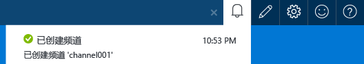
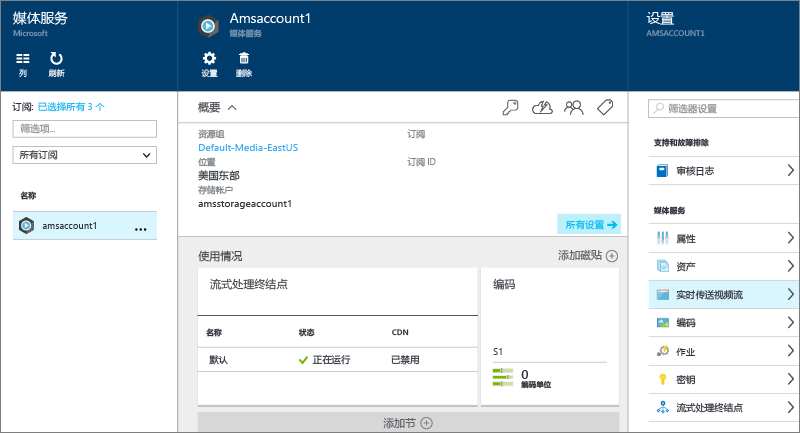
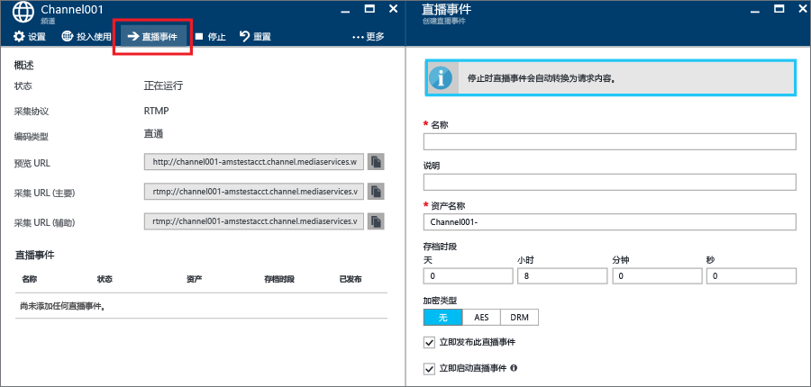
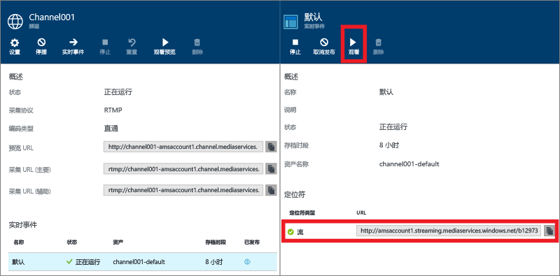
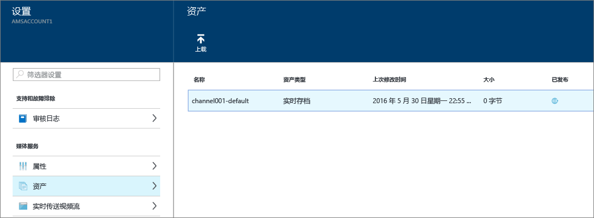

# 如何通过 Azure 门户使用本地编码器执行实时流式处理
> [!div class="op_single_selector"]
> * [门户](media-services-portal-live-passthrough-get-started.md)
> * [.NET](media-services-dotnet-live-encode-with-onpremises-encoders.md)
> * [REST](https://docs.microsoft.com/rest/api/media/operations/channel)
> 
> 

本教程介绍了使用 Azure 门户创建经配置后可以进行直通传递的 **通道** 的步骤。 

## 先决条件
以下是完成本教程所需具备的条件：

* 一个 Azure 帐户。 有关详细信息，请参阅 [Azure 免费试用](https://azure.microsoft.com/pricing/free-trial/)。 
* 一个媒体服务帐户。 若要创建媒体服务帐户，请参阅[如何创建媒体服务帐户](media-services-portal-create-account.md)。
* 网络摄像机。 例如， [Telestream Wirecast 编码器](http://www.telestream.net/wirecast/overview.htm)。

强烈建议你阅读以下文章：

* [Azure 媒体服务 RTMP 支持和实时编码器](https://azure.microsoft.com/blog/2014/09/18/azure-media-services-rtmp-support-and-live-encoders/)
* [使用 Azure 媒体服务实时传送视频流概述](media-services-manage-channels-overview.md)
* [使用本地编码器执行实时流式处理以创建多比特率流](media-services-live-streaming-with-onprem-encoders.md)

## 常见实时流式处理方案
以下步骤说明了在创建常用的实时传送视频流应用程序时涉及的任务，这些应用程序使用的通道经配置后可以进行直通传递。 本教程说明了如何创建和管理直通通道和实时事件。

>[!NOTE]
>确保要从中流式传输内容的流式处理终结点处于“正在运行”状态。 
    
1. 将视频摄像机连接到计算机。 启动并配置输出多比特率 RTMP 或分段 MP4 流的本地实时编码器接收实时输入流。 有关详细信息，请参阅 [Azure 媒体服务 RTMP 支持和实时编码器](http://go.microsoft.com/fwlink/?LinkId=532824)。
   
    此步骤也可以在创建频道后执行。
2. 创建并启动直通通道。
3. 检索频道引入 URL。 
   
    实时编码器使用引入 URL 将流发送到频道。
4. 检索频道预览 URL。 
   
    使用此 URL 来验证频道是否正常接收实时流。
5. 创建实时事件/节目。 
   
    使用 Azure 门户时，创建实时事件的同时还会创建资产。 

6. 在准备好开始流式传输和存档时，启动事件/节目。
7. （可选）可以向实时编码器发信号，以启动广告。 将广告插入到输出流中。
8. 在要停止对事件进行流式传输和存档时，停止事件/节目。
9. 删除事件/节目（并选择性地删除资产）。     

> [!IMPORTANT]
> 请参阅 [使用本地编码器实时传送视频流以创建多比特率流](media-services-live-streaming-with-onprem-encoders.md) ，了解与实时传送视频流（使用本地编码器和直通通道）相关的概念和注意事项。
> 
> 

## 查看通知和错误
若要查看 Azure 门户生成的通知和错误，请单击“通知”图标。

## 创建并启动直通通道和事件
频道与事件/节目相关联，使用事件/节目，你可以控制实时流中的段的发布和存储。 通道管理事件。 

可以通过设置 **存档窗口** 长度，指定你希望保留节目录制内容的小时数。 此值的设置范围是最短 5 分钟，最长 25 小时。 存储时间窗口长度还决定了客户端能够从当前实时位置按时间向后搜索的最长时间。 超出指定时间长度后，事件也能够运行，但落在时间窗口长度后面的内容将全部被丢弃。 此属性的这个值还决定了客户端清单能够增加多长时间。

每个事件都与某个资产关联。 若要发布事件，必须为关联的资产创建按需定位符。 创建此定位符后，可以生成一个可提供给客户端的流 URL。

一个通道最多支持三个并发运行的事件，因此你可以为同一传入流创建多个存档。 这样，你便可以根据需要发布和存档事件的不同部分。 例如，你的业务要求是存档 6 小时的节目，但只广播过去 10 分钟的内容。 为了实现此目的，你需要创建两个同时运行的节目。 一个节目设置为存档 6 小时的事件但不发布该节目。 另一个节目设置为存档 10 分钟的事件，并且要发布该节目。

不应重复使用现有的实时事件。 与之相反，应针对每个事件创建并启动新事件。

在准备好开始流式传输和存档时，启动事件。 在要停止对事件进行流式传输和存档时，停止节目。 

若要删除存档的内容，请停止并删除事件，然后删除关联的资产。 如果资产被某个事件使用，则无法将其删除，必须先删除该事件。 

即使你停止并删除了事件，只要你没有删除资产，用户也将能够按需将你的已存档内容作为视频进行流式传输。

如果希望保留已存档的内容但不希望其可供流式传输，请删除流式传输定位符。

### 使用门户来创建通道
本部分将介绍如何使用“快速创建”  选项创建直通通道。

有关直通通道的详细信息，请参阅 [使用本地编码器实时传送视频流以创建多比特率流](media-services-live-streaming-with-onprem-encoders.md)。

1. 在 [Azure 门户](https://portal.azure.com/)中，选择 Azure 媒体服务帐户。
2. 在“设置”窗口中，单击“实时传送视频流”。 
   
    
   
    此时将显示“实时传送视频流”  窗口。
3. 单击“快速创建”  ，即可使用 RTMP 引入协议创建直通通道。
   
    此时将显示“创建新通道”  窗口。
4. 为新通道命名，然后单击“创建” 。 
   
    此时将使用 RTMP 引入协议创建直通通道。

## 创建事件
1. 选择要添加事件的通道。
2. 按“实时事件”  按钮。

## 获取引入 URL
创建通道后，你可以获得要提供给实时编码器的引入 URL。 编码器将使用这些 URL 来输入实时流。

## 观看事件
要观看事件，请在 Azure 门户中单击“观看”  ，或者先复制流式处理 URL，然后使用选择的播放器进行播放。 

停止后，实时事件将自动转换为按需内容。

## 清理
有关直通通道的详细信息，请参阅 [使用本地编码器实时传送视频流以创建多比特率流](media-services-live-streaming-with-onprem-encoders.md)。

* 只有当频道中的所有事件/节目都已停止时，才能停止频道。  通道停止后，不会产生任何费用。 当你需要重新启动它时，它将采用相同的引入 URL，因此你无需重新配置编码器。
* 只有当频道中的所有实时事件都已删除时，才能删除频道。

## 查看存档的内容
即使你停止并删除了事件，只要你没有删除资产，用户也将能够按需将你的已存档内容作为视频进行流式传输。 如果资产被某个事件使用，则无法将其删除，必须先删除该事件。 

若要管理资产，请选择“设置”，再单击“资产”。

## 后续步骤
查看媒体服务学习路径。

[!INCLUDE [media-services-learning-paths-include](../../includes/media-services-learning-paths-include.md)]

## 提供反馈
[!INCLUDE [media-services-user-voice-include](../../includes/media-services-user-voice-include.md)]

