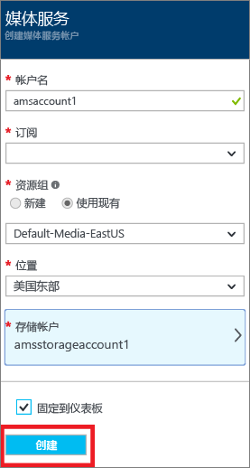
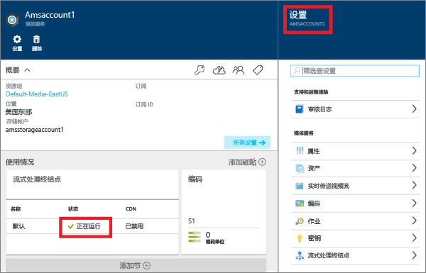
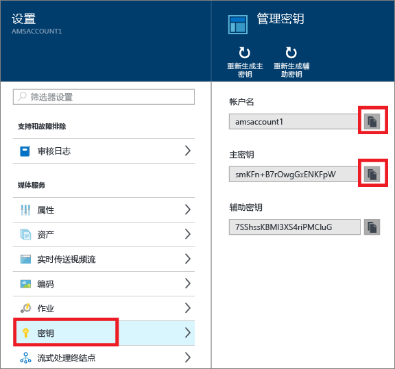
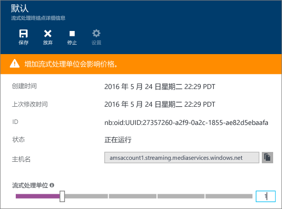

<properties
	pageTitle=" 使用 Azure 门户按需传送内容入门 | Microsoft Azure"
	description="本教程介绍了在 Azure 门户中使用 Azure 媒体服务 (AMS) 应用程序实施基本的视频点播 (VoD) 内容传送服务的步骤。"
	services="media-services"
	documentationCenter=""
	authors="Juliako"
	manager="erikre"
	editor=""/>

<tags
	ms.service="media-services"
	ms.workload="media"
	ms.tgt_pltfrm="na"
	ms.devlang="na"
	ms.topic="get-started-article"
	ms.date="08/30/2016"
	ms.author="juliako"/>

# 使用 Azure 门户按需传送内容入门

[AZURE.INCLUDE [media-services-selector-get-started](../../includes/media-services-selector-get-started.md)]

本教程介绍了在 Azure 门户中使用 Azure 媒体服务 (AMS) 应用程序实施基本的视频点播 (VoD) 内容传送服务的步骤。

> [AZURE.NOTE] 若要完成本教程，你需要一个 Azure 帐户。有关详细信息，请参阅 [Azure 免费试用](https://azure.microsoft.com/pricing/free-trial/)。

本教程包括以下任务：

1.  创建 Azure 媒体服务帐户。
2.  配置流式处理终结点。
1.  上载视频文件。
1.  将源文件编码为一组自适应比特率 MP4 文件。
1.  发布资产并获取流式处理和渐进式下载 URL。
1.  播放内容。

## 创建 Azure 媒体服务帐户

本部分中的步骤将介绍如何创建 AMS 帐户。

1. 在 [Azure 门户](https://portal.azure.com/)登录。
2. 单击“+新建”>“媒体 + CDN”>“媒体服务”。

	

3. 在“创建媒体服务帐户”中输入所需的值。

	
	
	1. 在“帐户名称”中，输入新的 AMS 帐户的名称。媒体服务帐户名称由小写字母或数字构成（不含空格），长度为 3 到 24 个字符。
	2. 在“订阅”中，在你有权访问的不同 Azure 订阅中进行选择。
	
	2. 在“资源组”中，选择新的或现有的资源。资源组是一组共享生命周期、权限和策略的资源。在[此处](resource-group-overview.md#resource-groups)了解更多信息。
	3. 在“位置”中，选择用于存储媒体服务帐户的媒体和元数据记录的地理区域。此区域用于处理和流式传输媒体。下拉列表中仅显示可用的媒体服务区域。
	
	3. 在“存储帐户”中，选择一个存储帐户以便为媒体服务帐户中的媒体内容提供 Blob 存储。可以选择位于媒体服务帐户所在的同一地理区域内的现有存储帐户，也可以创建一个存储帐户。将在同一区域内创建一个新的存储帐户。适用于存储帐户名的规则对媒体服务帐户同样适用。

		单击[此处](storage-introduction.md)了解有关存储的详细信息。

	4. 选择“固定到仪表板”以查看帐户部署进度。
	
7. 单击窗体底部的“创建”。

	成功创建帐户后，状态将更改为“正在运行”。

	

	若要管理 AMS 帐户（例如，上载视频、编码资产、监视作业进度），请使用“设置”窗口。

## 管理密钥

你需要有帐户名和主密钥信息，才能以编程方式访问媒体服务帐户。

1. 在 Azure 门户中，选择你的帐户。

	“设置”窗口显示在右侧。

2. 在“设置”窗口中，选择“密钥”。

	“管理密钥”窗口显示帐户名称，主密钥和辅助密钥也会显示。
3. 按复制按钮复制这些值。
	
	

## 配置流式处理终结点

使用 Azure 媒体服务时，最常见的场景之一是通过自适应比特率流式处理将视频传送至你的客户端。媒体服务支持以下自适应比特率流式处理技术：HTTP 实时流式处理 (HLS)、平滑流式处理、MPEG DASH 和 HDS（仅适用于 Adobe PrimeTime/Access 许可证持有人）。

媒体服务所提供的动态打包可让你以媒体服务支持的流格式（MPEG DASH、HLS、Smooth Streaming、HDS）及时传送自适应比特率 MP4 编码内容，无需按这些流格式逐个存储预先打包的版本。

若要使用动态打包，必须执行下列操作：

- 将夹层（源）文件编码成一组自适应比特率 MP4 文件（本教程稍后将演示编码步骤）。
- 针对你要从其传送内容的“流式处理终结点”，创建至少一个流式处理单元。以下步骤显示如何更改流式处理单元数。

通过动态打包，只需要存储及支付一种存储格式的文件，媒体服务将根据客户端的要求创建并提供适当的响应。

若要创建和更改流式处理保留单元数，请执行以下操作：

1. 在“设置”窗口中，单击“流式处理终结点”。

2. 单击默认的流式处理终结点。

	此时会显示“默认流式处理终结点详细信息”窗口。

3. 若要指定流式处理单元数，请滑动“流式处理单元”滑块。

	

4. 单击“保存”按钮保存更改。

	>[AZURE.NOTE]分配新的单元最多需要 20 分钟即可完成。

## 上载文件

若要使用 Azure 媒体服务流式传输视频，需先上载源视频、将其编码成多个比特率，然后发布结果。第一步在本部分介绍。

1. 在“设置”窗口中，单击“资产”。

	

3. 单击“上载”按钮。

	此时会显示“上载视频资产”窗口。

	>[AZURE.NOTE] 没有文件大小限制。
	
4. 浏览到计算机中所需视频的位置，选中该视频，然后点击“确定”。

	上载开始，你可以在文件名下看到进度。

上载完成后，可以看到“资产”窗口中列出新的资产。

## 对资产进行编码

使用 Azure 媒体服务时最常见的方案之一是将自适应比特率流传送至你的客户端。媒体服务支持以下自适应比特率流式处理技术：HTTP 实时流式处理 (HLS)、平滑流式处理、MPEG DASH 和 HDS（仅适用于 Adobe PrimeTime/Access 许可证持有人）。若要对视频进行准备，以便进行自适应比特率流式处理，你需要将源视频编码成多比特率文件。应使用“媒体编码器标准版”编码器来编码视频。

此外，媒体服务提供的动态打包可让你以下述流格式传送多比特率 MP4，无需重新打包成这些流格式：MPEG DASH、HLS、Smooth Streaming 或 HDS。通过动态打包，只需要存储及支付一种存储格式的文件，媒体服务将根据客户端的要求创建并提供适当的响应。

若要使用动态打包，必须执行下列操作：

- 将源文件编码成一组多比特率 MP4 文件（本部分稍后将演示编码步骤）。
- 针对你要传送内容的“流式处理终结点”，获取至少一个流式处理单位。有关详细信息，请参阅[配置流式处理终结点](media-services-portal-vod-get-started.md#configure-streaming-endpoints)。

### 使用门户进行编码

本部分介绍使用媒体编码器标准版为内容编码时可以执行的步骤。

1.  在“设置”窗口中，选择“资产”。
2.  在“资产”窗口中，选择你想要编码的资产。
3.  按“编码”按钮。
4.  在“对资产进行编码”窗口中，选择“媒体编码器标准版”处理器和预设。例如，如果你知道输入视频的分辨率为 1920x1080 像素，则可使用“H264 多比特率 1080p”预设。有关预设的详细信息，请参阅[此](https://msdn.microsoft.com/library/azure/mt269960.aspx)文章 – 选择最适合输入视频的预设很重要。如果视频的分辨率低 (640x360)，则不应使用默认的“H264 多比特率 1080p”预设。
	
	为了方便管理，系统允许你编辑输出资产的名称，以及作业的名称。
		
	
5. 按“创建”。

### 监视编码作业进度

若要监视编码作业的进度，请单击“设置”（位于页面顶部），然后选择“作业”。

## 发布内容

若要为用户提供一个可用来流式传输内容或下载内容的 URL，你首先需要通过创建定位符来“发布”资产。定位符提供对资产中所含文件的访问权限。媒体服务支持两种类型的定位符：

- 用于自适应流式处理（例如，对 MPEG DASH、HLS 或 Smooth Streaming 进行流式处理）的流式处理 (OnDemandOrigin) 定位符。若要创建流式处理定位符，你的资产必须包含一个 .ism 文件。
- 渐进式 (SAS) 定位符，用于通过渐进式下载来传输视频。

流 URL 采用以下格式，你可以用它来播放平滑流资产。

	{streaming endpoint name-media services account name}.streaming.mediaservices.windows.net/{locator ID}/{filename}.ism/Manifest

若要生成 HLS 流 URL，请将 (format=m3u8-aapl) 附加到 URL。

	{streaming endpoint name-media services account name}.streaming.mediaservices.windows.net/{locator ID}/{filename}.ism/Manifest(format=m3u8-aapl)

若要生成 MPEG DASH 流 URL，请将 (format=mpd-time-csf) 追加到 URL。

	{streaming endpoint name-media services account name}.streaming.mediaservices.windows.net/{locator ID}/{filename}.ism/Manifest(format=mpd-time-csf)

SAS URL 采用以下格式。

	{blob container name}/{asset name}/{file name}/{SAS signature}

>[AZURE.NOTE] 如果使用门户在 2015 年 3 月之前创建定位符，则会创建过期日期在两年后的定位符。

若要更新定位符的过期日期，请使用 [REST](http://msdn.microsoft.com/library/azure/hh974308.aspx#update_a_locator) 或 [.NET](http://go.microsoft.com/fwlink/?LinkID=533259) API。当更新 SAS 定位符的过期日期时，URL 将发生变化。

### 使用门户发布资产

若要使用门户发布资产，请执行以下操作：

1. 选择“设置”>“资产”。
1. 选择你想要发布的资产。
1. 单击“发布”按钮。
1. 选择定位符类型。
2. 按“添加”。

	

URL 将添加到“已发布 URL”列表。

## 从门户播放内容

Azure 门户提供可用于测试视频的内容播放器。

单击所需的视频，然后单击“播放”按钮。

请注意以下事项：

- 确保视频已发布。
- 此“Media Player”从默认的流式处理终结点播放。如果要从非默认流式处理终结点播放，请单击复制该 URL，然后使用其他播放器。例如 [Azure 媒体服务播放器](http://amsplayer.azurewebsites.net/azuremediaplayer.html)。

##后续步骤

查看媒体服务学习路径。

[AZURE.INCLUDE [media-services-learning-paths-include](../../includes/media-services-learning-paths-include.md)]

##提供反馈

[AZURE.INCLUDE [media-services-user-voice-include](../../includes/media-services-user-voice-include.md)]

<!---HONumber=AcomDC_0921_2016-->