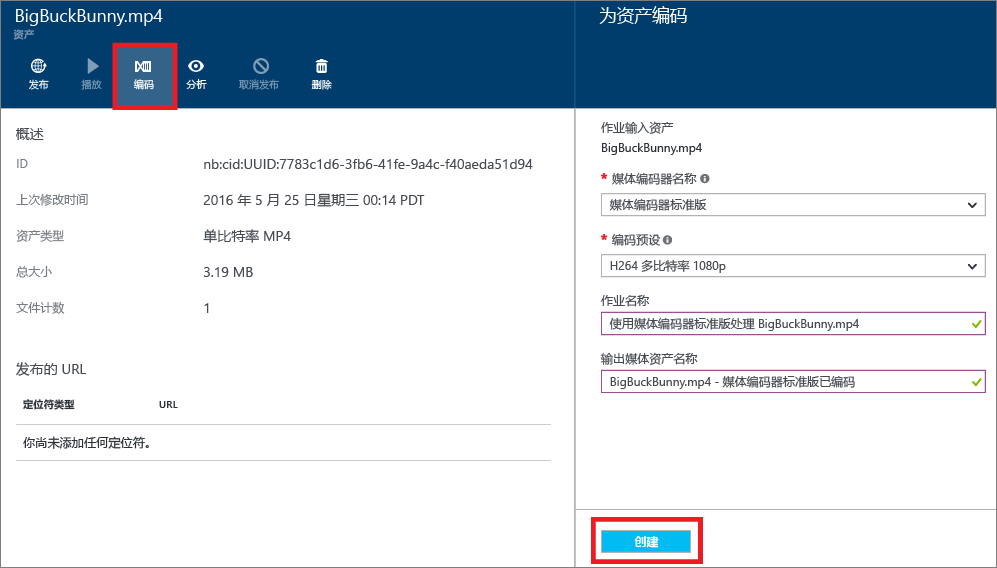
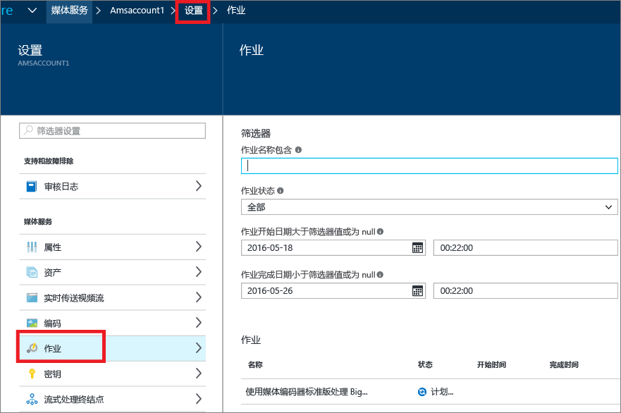
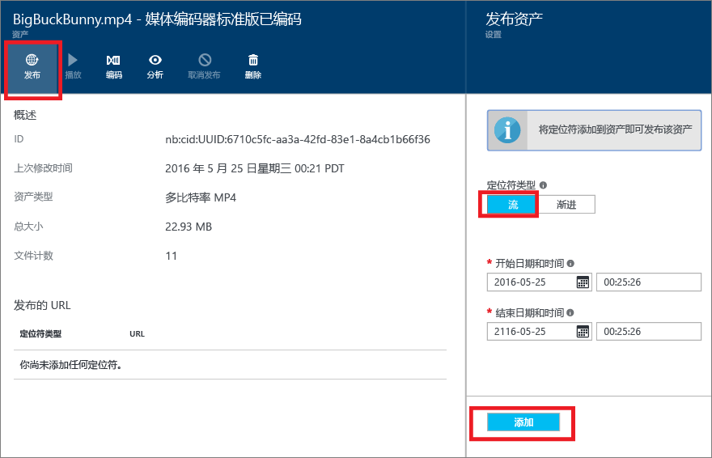
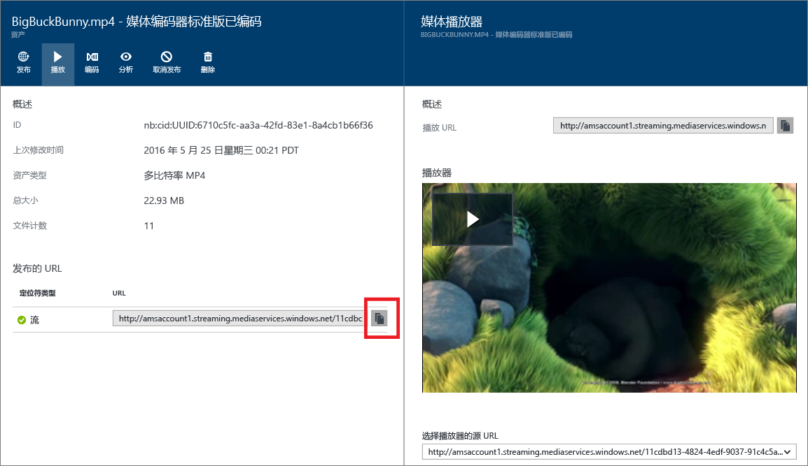

# 使用 Azure 门户按需传送内容入门
[!INCLUDE [media-services-selector-get-started](../../includes/media-services-selector-get-started.md)]

本教程介绍了在 Azure 门户中使用 Azure 媒体服务 (AMS) 应用程序实施基本的视频点播 (VoD) 内容传送服务的步骤。

## 先决条件
以下是完成本教程所需具备的条件：

* 一个 Azure 帐户。 有关详细信息，请参阅 [Azure 免费试用](https://azure.microsoft.com/pricing/free-trial/)。 
* 一个媒体服务帐户。 若要创建媒体服务帐户，请参阅[如何创建媒体服务帐户](media-services-portal-create-account.md)。

本教程包括以下任务：

1. 启动流式处理终结点。
2. 上传视频文件。
3. 将源文件编码为一组自适应比特率 MP4 文件。
4. 发布资产并获取流式处理和渐进式下载 URL。  
5. 播放内容。

## 启动流式处理终结点 

使用 Azure 媒体服务时，最常见的场景之一是通过自适应比特率流式处理传送视频。 媒体服务提供动态打包，可按媒体服务支持的流格式（MPEG DASH、HLS、平滑流式处理）及时传送自适应比特率 MP4 编码内容，而无需存储上述各种流格式的预打包版本。

>[!NOTE]
>创建 AMS 帐户后，会将一个处于“已停止”状态的**默认**流式处理终结点添加到帐户。 若要开始流式传输内容并利用动态打包和动态加密，要从中流式传输内容的流式处理终结点必须处于“正在运行”状态。 

若要启动流式处理终结点，请执行以下操作：

1. 在 [Azure 门户](https://portal.azure.com/)登录。
2. 在“设置”窗口中，单击“流式处理终结点”。 
3. 单击默认的流式处理终结点。 

    此时会显示“默认流式处理终结点详细信息”窗口。

4. 单击“启动”图标。
5. 单击“保存”按钮保存更改。

## 上传文件
若要使用 Azure 媒体服务流式传输视频，需先上传源视频、将其编码成多个比特率，然后发布结果。 第一步在本部分介绍。 

1. 在“设置”窗口中，单击“资产”。
   
    
2. 单击“上传”按钮。
   
    此时会显示“上传视频资产”窗口。
   
   > [!NOTE]
   > 没有文件大小限制。
   > 
   > 
3. 浏览到计算机中所需视频的位置，选中该视频，并点击“确定”。  
   
    上传开始，你可以在文件名下看到进度。  

上传完成后，可以看到“资产”  窗口中列出新的资产。 

## 对资产进行编码

使用 Azure 媒体服务时最常见的方案之一是将自适应比特率流传送至客户端。 媒体服务支持以下自适应比特率流式处理技术：HTTP Live Streaming (HLS)、平滑流式处理和 MPEG DASH。 要对视频进行准备，以便进行自适应比特率流式处理，需要将源视频编码成多比特率文件。 应使用 **Media Encoder Standard** 编码器来对视频编码。  

此外，媒体服务提供的动态打包可让用户以下述流格式传送多比特率 MP4，无需重新打包成这些流格式：MPEG DASH、HLS 和平滑流式处理。 通过动态打包，只需要存储及支付一种存储格式的文件，媒体服务就会根据客户端的要求创建并提供适当的响应。

要利用动态打包，需将源文件编码成一组多比特率 MP4 文件（本部分稍后将演示编码步骤）。

### 使用门户进行编码
本部分介绍使用 Media Encoder Standard 为内容编码时可以执行的步骤。

1. 在“设置”窗口中，选择“资产”。  
2. 在“资产”窗口中，选择想要编码的资产。
3. 按“编码”按钮。
4. 在“对资产进行编码”窗口中，选择“Media Encoder Standard”处理器和预设。 有关预设的信息，请参阅[自动生成比特率阶梯](media-services-autogen-bitrate-ladder-with-mes.md)和 [MES 的任务预设](media-services-mes-presets-overview.md)。 如果计划控制所使用的编码预设，请谨记：必须选择最适合输入视频的预设。 例如，如果知道输入视频的分辨率为 1920x1080 像素，则可使用“H264 多比特率 1080p”预设。 如果视频的分辨率低 (640x360)，则不应使用“H264 多比特率 1080p”预设。
   
   为了方便管理，系统允许编辑输出资产的名称，以及作业的名称。
   
   
5. 按“创建”。

### 监视编码作业进度
要监视编码作业的进度，请单击“设置”（位于页面顶部），并选择“作业”。

## 发布内容
要为用户提供一个可用来流式传输内容或下载内容的 URL，首先需要通过创建定位符来“发布”资产。 定位符提供对资产中所含文件的访问权限。 媒体服务支持两种类型的定位符： 

* 用于自适应流式处理（例如，对 MPEG DASH、HLS 或 Smooth Streaming 进行流式处理）的流式处理 (OnDemandOrigin) 定位符。 要创建流式处理定位符，资产必须包含一个 .ism 文件。 
* 渐进式 (SAS) 定位符，用于通过渐进式下载来传输视频。

流 URL 采用以下格式，可以用它来播放平滑流资产。

    {streaming endpoint name-media services account name}.streaming.mediaservices.windows.net/{locator ID}/{filename}.ism/Manifest

要生成 HLS 流 URL，请将 (format=m3u8-aapl) 附加到 URL。

    {streaming endpoint name-media services account name}.streaming.mediaservices.windows.net/{locator ID}/{filename}.ism/Manifest(format=m3u8-aapl)

要生成 MPEG DASH 流 URL，请将 (format=mpd-time-csf) 附加到 URL。

    {streaming endpoint name-media services account name}.streaming.mediaservices.windows.net/{locator ID}/{filename}.ism/Manifest(format=mpd-time-csf)

SAS URL 采用以下格式。

    {blob container name}/{asset name}/{file name}/{SAS signature}

> [!NOTE]
> 如果使用门户在 2015 年 3 月之前创建定位符，则会创建过期日期在两年后的定位符。  
> 
> 

若要更新定位符的过期日期，请使用 [REST](https://docs.microsoft.com/rest/api/media/operations/locator#update_a_locator) 或 [.NET](http://go.microsoft.com/fwlink/?LinkID=533259) API。 当更新 SAS 定位符的过期日期时，URL 将发生变化。

### 使用门户发布资产
若要使用门户发布资产，请执行以下操作：

1. 选择“设置” > “资产”。
2. 选择想要发布的资产。
3. 单击“上传”按钮 发布。
4. 选择定位符类型。
5. 按“添加”。
   
    

URL 将添加到“已发布 URL”列表。

## 从门户播放内容
Azure 门户提供可用于测试视频的内容播放器。

单击所需的视频，并单击“播放”按钮。

请注意以下事项：

* 若要开始流式处理，请开始运行“默认”流式处理终结点。
* 确保视频已发布。
* 此“Media Player”  从默认的流式处理终结点播放。 如果要从非默认流式处理终结点播放，请单击复制该 URL，并使用其他播放器。 例如 [Azure 媒体服务播放器](http://amsplayer.azurewebsites.net/azuremediaplayer.html)。

## 后续步骤
查看媒体服务学习路径。

[!INCLUDE [media-services-learning-paths-include](../../includes/media-services-learning-paths-include.md)]

## 提供反馈
[!INCLUDE [media-services-user-voice-include](../../includes/media-services-user-voice-include.md)]

