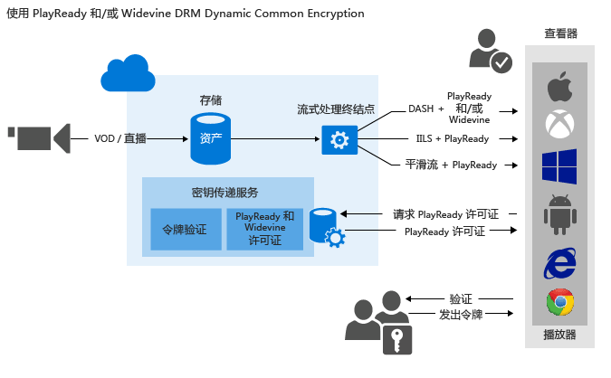

# <a name="use-playready-andor-widevine-dynamic-common-encryption"></a>使用 PlayReady 和/或 Widevine DRM 动态通用加密

> [!div class="op_single_selector"]
> * [.NET](media-services-protect-with-playready-widevine.md)
> * [Java](https://github.com/southworkscom/azure-sdk-for-media-services-java-samples)
> * [PHP](https://github.com/Azure/azure-sdk-for-php/tree/master/examples/MediaServices)
>

> [!NOTE]
> 若要获取最新版本的 Java SDK 并开始使用 Java 进行开发，请参阅[用于 Azure 媒体服务的 Java 客户端 SDK 入门](https://docs.microsoft.com/azure/media-services/media-services-java-how-to-use)。 <br/>
> 若要下载最新的用于媒体服务的 PHP SDK，请在 [Packagist 存储库](https://packagist.org/packages/microsoft/windowsazure#v0.5.7)中查找 0.5.7 版 Microsoft/WindowsAzure 包。 

## <a name="overview"></a>概述

 可以使用媒体服务传送受 [PlayReady 数字版权管理 (DRM)](https://www.microsoft.com/playready/overview/) 保护的 MPEG-DASH 流、平滑流式处理流和 HTTP 实时流式处理 (HLS) 流。 还可以传送通过 Widevine DRM 许可证加密的 DASH 流。 PlayReady 和 Widevine 都是按通用加密 (ISO/IEC 23001-7 CENC) 规范加密的。 可以通过[媒体服务 .NET SDK](https://www.nuget.org/packages/windowsazure.mediaservices/)（从版本 3.5.1 开始）或 REST API 来配置 AssetDeliveryConfiguration 以使用 Widevine。

媒体服务提供传送 PlayReady 和 Widevine DRM 许可证的服务。 媒体服务还提供可用于配置权限和限制的 API，这样当用户播放受保护的内容时，便可通过 PlayReady 或 Widevine DRM 运行时强制实施这些权限和限制。 当用户请求受 DRM 保护的内容时，播放器应用程序会从媒体服务许可证服务请求许可证。 如果播放器应用程序获得授权，媒体服务许可证服务会向该播放器颁发许可证。 PlayReady 或者 Widevine 许可证包含客户端播放器用来对内容进行解密和流式传输的解密密钥。

还可通过以下媒体服务合作伙伴来传送 Widevine 许可证： 

* [Axinom](http://www.axinom.com/press/ibc-axinom-drm-6/) 
* [EZDRM](http://ezdrm.com/) 
* [castLabs](http://castlabs.com/company/partners/azure/) 

有关详细信息，请参阅与 [Axinom](media-services-axinom-integration.md) 和 [castLabs](media-services-castlabs-integration.md) 的集成。

媒体服务支持通过多种方式对发出密钥请求的用户进行授权。 内容密钥授权策略可能有一种或多种授权限制：开放或令牌限制。 令牌限制策略必须附带由安全令牌服务 (STS) 颁发的令牌。 媒体服务支持采用[简单 Web 令牌](https://msdn.microsoft.com/library/gg185950.aspx#BKMK_2) (SWT) 格式和 [JSON Web 令牌](https://msdn.microsoft.com/library/gg185950.aspx#BKMK_3) (JWT) 格式的令牌。 

有关详细信息，请参阅[配置内容密钥授权策略](media-services-protect-with-aes128.md#configure_key_auth_policy)。

为了充分利用动态加密，资产需包含一组多码率 MP4 文件或多码率平滑流源文件。 还需要为资产配置传送策略（在本主题后面部分介绍）。 然后，根据在流式处理 URL 中指定的格式，按需流式处理服务器会确保使用选定的协议来传送流。 因此，可存储只使用单一存储格式的文件并为其付费。 媒体服务会根据客户端的每个请求生成并提供适当的 HTTP 响应。

致力于开发应用程序的开发人员可以参考本文，了解如何让应用程序传送受多个 DRM（例如 PlayReady 和 Widevine）保护的媒体。 本文介绍如何使用授权策略来配置 PlayReady 许可证传送服务，确保只有经过授权的客户端才能接收 PlayReady 或 Widevine 许可证。 此外，还介绍如何通过 DASH 使用 PlayReady 或 Widevine DRM 进行动态加密。

>[!NOTE]
>创建媒体服务帐户时，会将一个处于“已停止”状态的默认流式处理终结点添加到帐户。 若要开始流式传输内容并利用动态打包和动态加密，必须确保流式处理终结点处于“正在运行”状态，以便从其流式传输内容。 

## <a name="download-the-sample"></a>下载示例
可以从 [GitHub 上的 Azure 示例](https://github.com/Azure-Samples/media-services-dotnet-dynamic-encryption-with-drm)下载本文所述的示例。

## <a name="configure-dynamic-common-encryption-and-drm-license-delivery-services"></a>配置动态通用加密和 DRM 许可证传送服务

使用媒体服务许可证传送服务和动态加密通过 PlayReady 来保护资产时，请执行下述常规步骤：

1. 创建资产并将文件上传到资产。

2. 将包含文件的资产编码为自适应比特率 MP4 集。

3. 创建内容密钥并将其与编码资产相关联。 在媒体服务中，内容密钥包含资产的加密密钥。

4. 配置内容密钥授权策略。 必须配置内容密钥授权策略。 客户端必须符合该策略才能将内容密钥传送到客户端。

    创建内容密钥授权策略时，必须指定传送方法（PlayReady 或 Widevine）和限制（开放或令牌）。 还必须指定特定于密钥传送类型的信息，以便定义将密钥传送到客户端的方法（[PlayReady](media-services-playready-license-template-overview.md) 或 [Widevine](media-services-widevine-license-template-overview.md) 许可证模板）。

5. 为资产配置传送策略。 传送策略配置包括传送协议（例如，MPEG-DASH、HLS、平滑流式处理或所有这些协议）。 配置还包括动态加密类型（例如通用加密）和 PlayReady 或 Widevine 许可证获取 URL。

    可以将不同的策略应用到同一资产上的每个协议。 例如，可以将 PlayReady 加密应用到平滑流/DASH，将 AES 信封应用到 HLS。 传送策略中未定义的任何协议（例如，如果添加的单个策略仅将 HLS 指定为协议）都无法进行流式处理。 如果根本没有定义任何资产传送策略，则属例外。 此时，允许所有明文形式的协议。

6. 创建 OnDemand 定位符以获取流式处理 URL。

可以在文章末尾找到完整的 .NET 示例。

下图演示了上述工作流。 在图中，使用令牌进行了身份验证。



本文余下部分提供了详细说明、代码示例和主题链接，介绍了如何完成上述任务。

## <a name="current-limitations"></a>当前限制
如果添加或更新资产传送策略，则必须删除任何关联的定位符并创建新的定位符。

目前情况下，配合使用 Widevine 与媒体服务进行加密时，不允许存在多个内容密钥。 

## <a name="create-an-asset-and-upload-files-into-the-asset"></a>创建资产并将文件上传到资产
为了对视频进行管理、编码和流式处理，必须首先将内容上传到媒体服务中。 上传完成后，相关内容即安全地存储在云中供后续处理和流式处理。

有关详细信息，请参阅[将文件上传到媒体服务帐户](media-services-dotnet-upload-files.md)。

## <a name="encode-the-asset-that-contains-the-file-to-the-adaptive-bitrate-mp4-set"></a>将包含文件的资产编码为自适应比特率 MP4 集
使用动态加密时，可创建一项资产，其中包含一组多码率 MP4 文件或多比特率平滑流式处理源文件。 然后，按需流式处理服务器会确保你以选定的协议按清单和分段请求中的指定格式接收流。 然后即可存储只使用单一存储格式的文件并为其付费。 媒体服务会根据客户端的请求生成并提供适当的响应。 有关详细信息，请参阅[动态打包概述](media-services-dynamic-packaging-overview.md)。

有关如何编码的说明，请参阅[使用 Media Encoder Standard 对资产进行编码](media-services-dotnet-encode-with-media-encoder-standard.md)。

## <a id="create_contentkey"></a>创建内容密钥并将其与编码资产相关联
在媒体服务中，内容密钥包含用于加密资产的密钥。

有关详细信息，请参阅[创建内容密钥](media-services-dotnet-create-contentkey.md)。

## <a id="configure_key_auth_policy"></a>配置内容密钥授权策略
媒体服务支持通过多种方式对发出密钥请求的用户进行身份验证。 必须配置内容密钥授权策略。 客户端（播放器）必须符合该策略才能将密钥传送到客户端。 内容密钥授权策略可能有一种或多种授权限制：开放或令牌限制。

有关详细信息，请参阅[配置内容密钥授权策略](media-services-dotnet-configure-content-key-auth-policy.md#playready-dynamic-encryption)。

## <a id="configure_asset_delivery_policy"></a>配置资产传送策略
为资产配置传送策略。 资产传送策略配置包括：

* DRM 许可证获取 URL。
* 资产传送协议（例如 MPEG-DASH、HLS、平滑流式处理或所有这些协议）。
* 动态加密类型（在本示例中为“通用加密”）。

有关详细信息，请参阅[配置资产传送策略](media-services-dotnet-configure-asset-delivery-policy.md)。

## <a id="create_locator"></a>创建 OnDemand 流式处理定位符以获取流式处理 URL
需要为用户提供平滑流式处理、DASH 或 HLS 的流式处理 URL。

> [!NOTE]
> 如果添加或更新资产的传送策略，则必须删除现有的定位符并创建新的定位符。
>
>

有关如何发布资产和生成流 URL 的说明，请参阅 [生成流 URL](media-services-deliver-streaming-content.md)。

## <a name="get-a-test-token"></a>获取测试令牌
获取用于密钥授权策略的基于令牌限制的测试令牌。

```csharp
    // Deserializes a string containing an XML representation of a TokenRestrictionTemplate
    // back into a TokenRestrictionTemplate class instance.
    TokenRestrictionTemplate tokenTemplate =
        TokenRestrictionTemplateSerializer.Deserialize(tokenTemplateString);

    // Generate a test token based on the data in the given TokenRestrictionTemplate.
    //The GenerateTestToken method returns the token without the word "Bearer" in front,
    //so you have to add it in front of the token string.
    string testToken = TokenRestrictionTemplateSerializer.GenerateTestToken(tokenTemplate);
    Console.WriteLine("The authorization token is:\nBearer {0}", testToken);
```

可以使用 [Azure 媒体服务播放器](http://amsplayer.azurewebsites.net/azuremediaplayer.html)来测试流。

## <a name="create-and-configure-a-visual-studio-project"></a>创建和配置 Visual Studio 项目

1. 设置开发环境，并根据[使用 .NET 进行媒体服务开发](media-services-dotnet-how-to-use.md)中所述，在 app.config 文件中填充连接信息。

2. 将以下元素添加到 app.config 文件中定义的 **appSettings**：

```xml
        <add key="Issuer" value="http://testacs.com"/>
        <add key="Audience" value="urn:test"/>
```

## <a name="example"></a>示例

以下示例演示了用于 .NET 的媒体服务 SDK 3.5.2 版中引入的功能。 （具体而言，它包括了定义 Widevine 许可证模板以及从媒体服务请求 Widevine 许可证的功能。）

使用本部分中所示的代码覆盖 Program.cs 文件中的代码。

>[!NOTE]
>不同媒体服务策略的策略数限制为 1 百万个（例如，Locator 策略或 ContentKeyAuthorizationPolicy 的情况就是如此）。 如果始终使用相同的天数/访问权限，则使用相同的策略 ID。 例如，适用于需要长期保留使用的定位符的策略（非上传策略）。 

有关详细信息，请参阅[使用媒体服务 .NET SDK 管理资产和相关的实体](media-services-dotnet-manage-entities.md#limit-access-policies)。

请务必将变量更新为指向输入文件所在的文件夹。

```csharp
using System;
using System.Collections.Generic;
using System.Configuration;
using System.IO;
using System.Linq;
using System.Threading;
using Microsoft.WindowsAzure.MediaServices.Client;
using Microsoft.WindowsAzure.MediaServices.Client.ContentKeyAuthorization;
using Microsoft.WindowsAzure.MediaServices.Client.DynamicEncryption;
using Microsoft.WindowsAzure.MediaServices.Client.Widevine;
using Newtonsoft.Json;

namespace DynamicEncryptionWithDRM
{
    class Program
    {
        // Read values from the App.config file.
        private static readonly string _AADTenantDomain =
            ConfigurationManager.AppSettings["AMSAADTenantDomain"];
        private static readonly string _RESTAPIEndpoint =
            ConfigurationManager.AppSettings["AMSRESTAPIEndpoint"];
        private static readonly string _AMSClientId =
            ConfigurationManager.AppSettings["AMSClientId"];
        private static readonly string _AMSClientSecret =
            ConfigurationManager.AppSettings["AMSClientSecret"];

        private static readonly Uri _sampleIssuer =
            new Uri(ConfigurationManager.AppSettings["Issuer"]);
        private static readonly Uri _sampleAudience =
            new Uri(ConfigurationManager.AppSettings["Audience"]);

        // Field for service context.
        private static CloudMediaContext _context = null;

        private static readonly string _mediaFiles =
            Path.GetFullPath(@"../..\Media");

        private static readonly string _singleMP4File =
            Path.Combine(_mediaFiles, @"BigBuckBunny.mp4");

        static void Main(string[] args)
        {
            AzureAdTokenCredentials tokenCredentials =
                new AzureAdTokenCredentials(_AADTenantDomain,
                    new AzureAdClientSymmetricKey(_AMSClientId, _AMSClientSecret),
                    AzureEnvironments.AzureCloudEnvironment);

            var tokenProvider = new AzureAdTokenProvider(tokenCredentials);

            _context = new CloudMediaContext(new Uri(_RESTAPIEndpoint), tokenProvider);

            bool tokenRestriction = false;
            string tokenTemplateString = null;

            IAsset asset = UploadFileAndCreateAsset(_singleMP4File);
            Console.WriteLine("Uploaded asset: {0}", asset.Id);

            IAsset encodedAsset = EncodeToAdaptiveBitrateMP4Set(asset);
            Console.WriteLine("Encoded asset: {0}", encodedAsset.Id);

            IContentKey key = CreateCommonTypeContentKey(encodedAsset);
            Console.WriteLine("Created key {0} for the asset {1} ", key.Id, encodedAsset.Id);
            Console.WriteLine("PlayReady License Key delivery URL: {0}", key.GetKeyDeliveryUrl(ContentKeyDeliveryType.PlayReadyLicense));
            Console.WriteLine();

            if (tokenRestriction)
                tokenTemplateString = AddTokenRestrictedAuthorizationPolicy(key);
            else
                AddOpenAuthorizationPolicy(key);

            Console.WriteLine("Added authorization policy: {0}", key.AuthorizationPolicyId);
            Console.WriteLine();

            CreateAssetDeliveryPolicy(encodedAsset, key);
            Console.WriteLine("Created asset delivery policy. \n");
            Console.WriteLine();

            if (tokenRestriction && !String.IsNullOrEmpty(tokenTemplateString))
            {
                // Deserializes a string containing an XML representation of a TokenRestrictionTemplate
                // back into a TokenRestrictionTemplate class instance.
                TokenRestrictionTemplate tokenTemplate =
                    TokenRestrictionTemplateSerializer.Deserialize(tokenTemplateString);

                // Generate a test token based on the data in the given TokenRestrictionTemplate.
                // Note that you need to pass the key ID GUID because 
                // TokenClaim.ContentKeyIdentifierClaim was specified during the creation of TokenRestrictionTemplate.
                Guid rawkey = EncryptionUtils.GetKeyIdAsGuid(key.Id);
                string testToken = TokenRestrictionTemplateSerializer.GenerateTestToken(tokenTemplate, null, rawkey,
                                            DateTime.UtcNow.AddDays(365));
                Console.WriteLine("The authorization token is:\nBearer {0}", testToken);
                Console.WriteLine();
            }

            // You can use the http://amsplayer.azurewebsites.net/azuremediaplayer.html player to test streams.
            // Note that DASH works on Internet Explorer 11 (via PlayReady), Edge (via PlayReady), and Chrome (via Widevine).

            string url = GetStreamingOriginLocator(encodedAsset);
            Console.WriteLine("Encrypted DASH URL: {0}/manifest(format=mpd-time-csf)", url);

            Console.ReadLine();
        }

        static public IAsset UploadFileAndCreateAsset(string singleFilePath)
        {
            if (!File.Exists(singleFilePath))
            {
                Console.WriteLine("File does not exist.");
                return null;
            }

            var assetName = Path.GetFileNameWithoutExtension(singleFilePath);
            IAsset inputAsset = _context.Assets.Create(assetName, AssetCreationOptions.None);

            var assetFile = inputAsset.AssetFiles.Create(Path.GetFileName(singleFilePath));

            Console.WriteLine("Created assetFile {0}", assetFile.Name);

            Console.WriteLine("Upload {0}", assetFile.Name);

            assetFile.Upload(singleFilePath);
            Console.WriteLine("Done uploading {0}", assetFile.Name);

            return inputAsset;
        }

        static public IAsset EncodeToAdaptiveBitrateMP4Set(IAsset inputAsset)
        {
            var encodingPreset = "Adaptive Streaming";

            IJob job = _context.Jobs.Create(String.Format("Encoding into Mp4 {0} to {1}",
                        inputAsset.Name,
                        encodingPreset));

            var mediaProcessors =
            _context.MediaProcessors.Where(p => p.Name.Contains("Media Encoder Standard")).ToList();

            var latestMediaProcessor =
            mediaProcessors.OrderBy(mp => new Version(mp.Version)).LastOrDefault();

            ITask encodeTask = job.Tasks.AddNew("Encoding", latestMediaProcessor, encodingPreset, TaskOptions.None);
            encodeTask.InputAssets.Add(inputAsset);
            encodeTask.OutputAssets.AddNew(String.Format("{0} as {1}", inputAsset.Name, encodingPreset), AssetCreationOptions.StorageEncrypted);

            job.StateChanged += new EventHandler<JobStateChangedEventArgs>(JobStateChanged);
            job.Submit();
            job.GetExecutionProgressTask(CancellationToken.None).Wait();

            return job.OutputMediaAssets[0];
        }


        static public IContentKey CreateCommonTypeContentKey(IAsset asset)
        {

            Guid keyId = Guid.NewGuid();
            byte[] contentKey = GetRandomBuffer(16);

            IContentKey key = _context.ContentKeys.Create(
                        keyId,
                        contentKey,
                        "ContentKey",
                        ContentKeyType.CommonEncryption);

            // Associate the key with the asset.
            asset.ContentKeys.Add(key);

            return key;
        }

        static public void AddOpenAuthorizationPolicy(IContentKey contentKey)
        {

            // Create ContentKeyAuthorizationPolicy with open restrictions
            // and create an authorization policy.         

            List<ContentKeyAuthorizationPolicyRestriction> restrictions = new List<ContentKeyAuthorizationPolicyRestriction>
                {
                new ContentKeyAuthorizationPolicyRestriction
                {
                    Name = "Open",
                    KeyRestrictionType = (int)ContentKeyRestrictionType.Open,
                    Requirements = null
                }
                };

            // Configure PlayReady and Widevine license templates.
            string PlayReadyLicenseTemplate = ConfigurePlayReadyLicenseTemplate();

            string WidevineLicenseTemplate = ConfigureWidevineLicenseTemplate();

            IContentKeyAuthorizationPolicyOption PlayReadyPolicy =
            _context.ContentKeyAuthorizationPolicyOptions.Create("",
                ContentKeyDeliveryType.PlayReadyLicense,
                restrictions, PlayReadyLicenseTemplate);

            IContentKeyAuthorizationPolicyOption WidevinePolicy =
            _context.ContentKeyAuthorizationPolicyOptions.Create("",
                ContentKeyDeliveryType.Widevine,
                restrictions, WidevineLicenseTemplate);

            IContentKeyAuthorizationPolicy contentKeyAuthorizationPolicy = _context.
                ContentKeyAuthorizationPolicies.
                CreateAsync("Deliver Common Content Key with no restrictions").
                Result;


            contentKeyAuthorizationPolicy.Options.Add(PlayReadyPolicy);
            contentKeyAuthorizationPolicy.Options.Add(WidevinePolicy);
            // Associate the content key authorization policy with the content key.
            contentKey.AuthorizationPolicyId = contentKeyAuthorizationPolicy.Id;
            contentKey = contentKey.UpdateAsync().Result;
        }

        public static string AddTokenRestrictedAuthorizationPolicy(IContentKey contentKey)
        {
            string tokenTemplateString = GenerateTokenRequirements();

            List<ContentKeyAuthorizationPolicyRestriction> restrictions = new List<ContentKeyAuthorizationPolicyRestriction>
                {
                new ContentKeyAuthorizationPolicyRestriction
                {
                    Name = "Token Authorization Policy",
                    KeyRestrictionType = (int)ContentKeyRestrictionType.TokenRestricted,
                    Requirements = tokenTemplateString,
                }
                };

            // Configure PlayReady and Widevine license templates.
            string PlayReadyLicenseTemplate = ConfigurePlayReadyLicenseTemplate();

            string WidevineLicenseTemplate = ConfigureWidevineLicenseTemplate();

            IContentKeyAuthorizationPolicyOption PlayReadyPolicy =
            _context.ContentKeyAuthorizationPolicyOptions.Create("Token option",
                ContentKeyDeliveryType.PlayReadyLicense,
                restrictions, PlayReadyLicenseTemplate);

            IContentKeyAuthorizationPolicyOption WidevinePolicy =
            _context.ContentKeyAuthorizationPolicyOptions.Create("Token option",
                ContentKeyDeliveryType.Widevine,
                restrictions, WidevineLicenseTemplate);

            IContentKeyAuthorizationPolicy contentKeyAuthorizationPolicy = _context.
                ContentKeyAuthorizationPolicies.
                CreateAsync("Deliver Common Content Key with token restrictions").
                Result;

            contentKeyAuthorizationPolicy.Options.Add(PlayReadyPolicy);
            contentKeyAuthorizationPolicy.Options.Add(WidevinePolicy);

            // Associate the content key authorization policy with the content key.
            contentKey.AuthorizationPolicyId = contentKeyAuthorizationPolicy.Id;
            contentKey = contentKey.UpdateAsync().Result;

            return tokenTemplateString;
        }

        static private string GenerateTokenRequirements()
        {
            TokenRestrictionTemplate template = new TokenRestrictionTemplate(TokenType.SWT);

            template.PrimaryVerificationKey = new SymmetricVerificationKey();
            template.AlternateVerificationKeys.Add(new SymmetricVerificationKey());
            template.Audience = _sampleAudience.ToString();
            template.Issuer = _sampleIssuer.ToString();
            template.RequiredClaims.Add(TokenClaim.ContentKeyIdentifierClaim);

            return TokenRestrictionTemplateSerializer.Serialize(template);
        }

        static private string ConfigurePlayReadyLicenseTemplate()
        {
            // The following code configures the PlayReady license template by using .NET classes
            // and returns the XML string.

            //The PlayReadyLicenseResponseTemplate class represents the template for the response sent back to the end user.
            //It contains a field for a custom data string between the license server and the application
            //(which might be useful for custom app logic) as well as a list of one or more license templates.
            PlayReadyLicenseResponseTemplate responseTemplate = new PlayReadyLicenseResponseTemplate();

            // The PlayReadyLicenseTemplate class represents a license template you can use to create PlayReady licenses
            // to be returned to end users.
            //It contains the data on the content key in the license and any rights or restrictions to be
            //enforced by the PlayReady DRM runtime when you use the content key.
            PlayReadyLicenseTemplate licenseTemplate = new PlayReadyLicenseTemplate();
            //Configure whether the license is persistent (saved in persistent storage on the client)
            //or nonpersistent (held in memory only while the player uses the license).  
            licenseTemplate.LicenseType = PlayReadyLicenseType.Nonpersistent;

            // AllowTestDevices controls whether test devices can use the license or not.  
            // If true, the MinimumSecurityLevel property of the license
            // is set to 150. If false (the default), the MinimumSecurityLevel property of the license is set to 2,000.
            licenseTemplate.AllowTestDevices = true;

            // You also can configure the PlayRight in the PlayReady license by using the PlayReadyPlayRight class.
            // It grants the user the ability to play back the content subject to the zero or more restrictions
            // configured in the license and on the PlayRight itself (for playback-specific policy).
            // Much of the policy on the PlayRight has to do with output restrictions,
            // which control the types of outputs that the content can be played over and
            // any restrictions that must be put in place when you use a given output.
            // For example, if DigitalVideoOnlyContentRestriction is enabled,
            // the DRM runtime allows the video to be displayed only over digital outputs
            //(analog video outputs aren't allowed to pass the content).

            //IMPORTANT: These types of restrictions can be very powerful but also can affect the consumer experience.
            // If output protections are too restrictive, 
            // content might be unplayable on some clients. For more information, see the PlayReady Compliance Rules document.

            // For example:
            //licenseTemplate.PlayRight.AgcAndColorStripeRestriction = new AgcAndColorStripeRestriction(1);

            responseTemplate.LicenseTemplates.Add(licenseTemplate);

            return MediaServicesLicenseTemplateSerializer.Serialize(responseTemplate);
        }

        private static string ConfigureWidevineLicenseTemplate()
        {
            var template = new WidevineMessage
            {
                allowed_track_types = AllowedTrackTypes.SD_HD,
                content_key_specs = new[]
            {
                    new ContentKeySpecs
                    {
                    required_output_protection = new RequiredOutputProtection { hdcp = Hdcp.HDCP_NONE},
                    security_level = 1,
                    track_type = "SD"
                    }
                },
                policy_overrides = new
                {
                    can_play = true,
                    can_persist = true,
                    can_renew = false
                }
            };

            string configuration = JsonConvert.SerializeObject(template);
            return configuration;
        }

        static public void CreateAssetDeliveryPolicy(IAsset asset, IContentKey key)
        {
            // Get the PlayReady license service URL.
            Uri acquisitionUrl = key.GetKeyDeliveryUrl(ContentKeyDeliveryType.PlayReadyLicense);

            // GetKeyDeliveryUrl for Widevine attaches the KID to the URL.
            // For example: https://amsaccount1.keydelivery.mediaservices.windows.net/Widevine/?KID=268a6dcb-18c8-4648-8c95-f46429e4927c.  
            // WidevineBaseLicenseAcquisitionUrl (used in the following) also tells dynamic encryption
            // to append /? KID =< keyId > to the end of the URL when you create the manifest.
            // As a result, the Widevine license acquisition URL has the KID appended twice,
            // so you need to remove the KID in the URL when you call GetKeyDeliveryUrl.

            Uri widevineUrl = key.GetKeyDeliveryUrl(ContentKeyDeliveryType.Widevine);
            UriBuilder uriBuilder = new UriBuilder(widevineUrl);
            uriBuilder.Query = String.Empty;
            widevineUrl = uriBuilder.Uri;

            Dictionary<AssetDeliveryPolicyConfigurationKey, string> assetDeliveryPolicyConfiguration =
            new Dictionary<AssetDeliveryPolicyConfigurationKey, string>
            {
                    {AssetDeliveryPolicyConfigurationKey.PlayReadyLicenseAcquisitionUrl, acquisitionUrl.ToString()},
                    {AssetDeliveryPolicyConfigurationKey.WidevineBaseLicenseAcquisitionUrl, widevineUrl.ToString()}

            };

            // In this case, we specify only the DASH streaming protocol in the delivery policy.
            // All other protocols are blocked from streaming.
            var assetDeliveryPolicy = _context.AssetDeliveryPolicies.Create(
                "AssetDeliveryPolicy",
            AssetDeliveryPolicyType.DynamicCommonEncryption,
            AssetDeliveryProtocol.Dash,
            assetDeliveryPolicyConfiguration);


            // Add AssetDelivery Policy to the asset.
            asset.DeliveryPolicies.Add(assetDeliveryPolicy);

        }

        /// <summary>
        /// Gets the streaming origin locator.
        /// </summary>
        /// <param name="assets"></param>
        /// <returns></returns>
        static public string GetStreamingOriginLocator(IAsset asset)
        {

            // Get a reference to the streaming manifest file from the 
            // collection of files in the asset.

            var assetFile = asset.AssetFiles.Where(f => f.Name.ToLower().
                         EndsWith(".ism")).
                         FirstOrDefault();

            // Create a 30-day read-only access policy.
            IAccessPolicy policy = _context.AccessPolicies.Create("Streaming policy",
            TimeSpan.FromDays(30),
            AccessPermissions.Read);

            // Create a locator to the streaming content on an origin.
            ILocator originLocator = _context.Locators.CreateLocator(LocatorType.OnDemandOrigin, asset,
            policy,
            DateTime.UtcNow.AddMinutes(-5));

            // Create a URL to the manifest file.
            return originLocator.Path + assetFile.Name;
        }

        static private void JobStateChanged(object sender, JobStateChangedEventArgs e)
        {
            Console.WriteLine(string.Format("{0}\n  State: {1}\n  Time: {2}\n\n",
            ((IJob)sender).Name,
            e.CurrentState,
            DateTime.UtcNow.ToString(@"yyyy_M_d__hh_mm_ss")));
        }

        static private byte[] GetRandomBuffer(int length)
        {
            var returnValue = new byte[length];

            using (var rng =
            new System.Security.Cryptography.RNGCryptoServiceProvider())
            {
                rng.GetBytes(returnValue);
            }

            return returnValue;
        }
    }
}
```

## <a name="next-steps"></a>后续步骤

[!INCLUDE [media-services-learning-paths-include](../../includes/media-services-learning-paths-include.md)]

## <a name="provide-feedback"></a>提供反馈
[!INCLUDE [media-services-user-voice-include](../../includes/media-services-user-voice-include.md)]

## <a name="see-also"></a>另请参阅
* [使用带 Multi-DRM 的 CENC 和访问控制](media-services-cenc-with-multidrm-access-control.md)
* [Configure Widevine packaging with Media Services](http://mingfeiy.com/how-to-configure-widevine-packaging-with-azure-media-services)（使用媒体服务配置 Widevine 打包）
* [特此宣布已在 Azure 媒体服务中推出 Google Widevine 许可证传送服务](https://azure.microsoft.com/blog/announcing-general-availability-of-google-widevine-license-services/)
