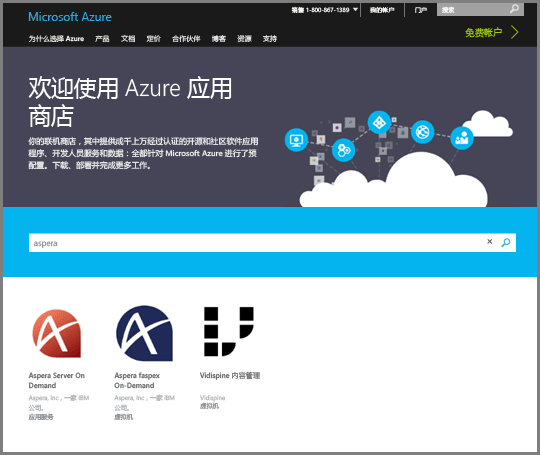
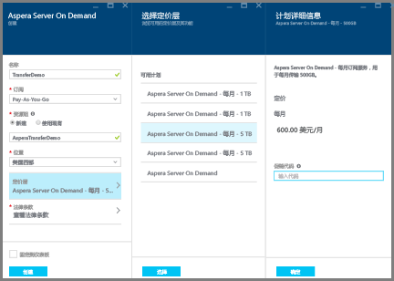
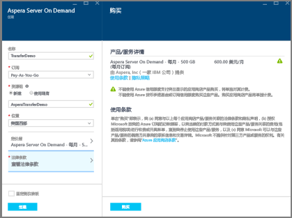
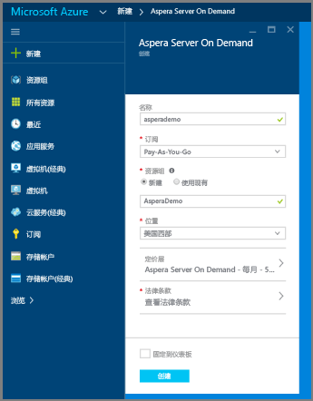
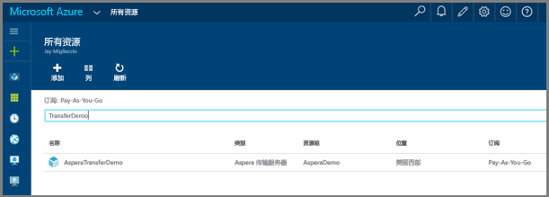
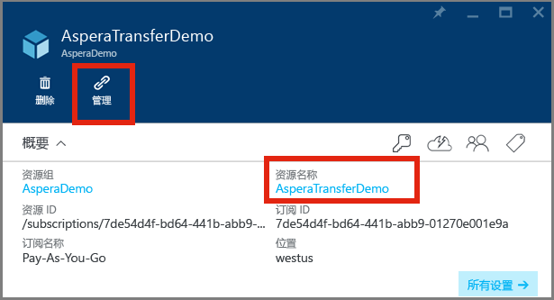

# 使用 Azure 上的 Aspera Server On Demand 服务将文件上传到媒体服务帐户

## 概述

**Aspera** 是一个高速文件传输软件。 使用 **Aspera Server On Demand** for Azure 可快速将大型文件直接上传和下载到 Azure Blob 对象存储。 有关 **Aspera On Demand** 的信息，请参阅 [Aspera 云](http://cloud.asperasoft.com/)站点。 
  
可从 [Azure 应用商店](https://azure.microsoft.com/en-us/marketplace/)购买 **Aspera Server On Demand** for Azure。 若要完成 **Aspera Server On Demand** for Azure 的购买，请使用 Windows Live ID 登录到 Azure 应用商店。

本教程逐步讲解如何使用 Azure 上的 **Aspera Server On Demand** 服务将文件上传到与媒体服务帐户关联的存储帐户。 

[此处](https://github.com/Azure-Samples/media-services-dotnet-functions-integration/tree/master/103-aspera-ingest)提供了一个示例，介绍如何将 Azure Functions 与 Aspera 和媒体服务配合使用。

>[!NOTE]
>使用 Azure 媒体服务媒体处理器 (MP) 进行处理时，支持的最大文件大小有限制。 有关文件大小限制的详细信息，请参阅[此主题](media-services-quotas-and-limitations.md)。
>

## 先决条件 

要完成本教程，需要：

* 一个 Windows Live ID
* 一个 [Azure 帐户](https://azure.microsoft.com)。 有关详细信息，请参阅 [Azure 免费试用](https://azure.microsoft.com/pricing/free-trial/)。 
* 一个 [Azure 媒体服务帐户](media-services-portal-create-account.md)。

## 购买 Aspera On Demand for Azure

登录到 Azure 应用商店后，请遵循以下基本步骤完成 Aspera On Demand for Azure 的购买。

1. 搜索“Aspera”，并选择“Server On Demand”。

   

2. 查看订阅计划，并单击“注册”

   

3. 填写 Server on Demand 订阅的具体信息。

   

4. 单击“定价层”，并在子面板中选择所需的每月用量。 在“计划详细信息”面板中选择“确定”。 然后，在**选择定价层**面板中，单击**选择**。

   

5. 在子面板中单击“法律条款”，查看并接受法律条款。 查看法律条款后，单击“购买”。

   

6. 单击“创建”完成购买。

   

7. Azure 仪表板会告知正在预配该服务。  完成预配后，可通过在资源中搜索服务的名称来找到新订阅。 找到该服务后，双击它启动服务管理门户。

   

8. 启动 Aspera 管理门户。 找到新的 Aspera 服务后，可通过单击该服务访问管理门户。  此时会启动新面板。 在该新面板中，需要单击新服务的**资源名称**。  在以下屏幕截图中，资源名称为“AsperaTransferDemo”。 单击资源名称后，另一个面板启动。 新启动的面板中有一个“管理”链接。 单击“管理”链接即可启动 Aspera 管理门户。

   

9. 单击“管理”链接会转到注册页，必须完成注册才能访问该服务。

   

10. 此时，应有权访问 Aspera 服务管理门户，可在其中创建访问密钥、下载 Aspera 客户端和许可证、查看使用情况以及了解有关 API 的信息。

    以下屏幕截图显示了如何创建访问凭据。 

   

    以下屏幕截图显示了门户中的使用情况报告界面。 

   

## 使用 Aspera 上传文件

1. 下载并安装 Aspera 客户端软件：
    
    * [浏览器插件](http://downloads.asperasoft.com/connect2/)
    * [富客户端](http://downloads.asperasoft.com/en/downloads/2)

2. 进行首次传输。 若要在 Aspera 客户端中使用 Aspera 传输服务来传输文件，需要完成以下任务： 

    1. 使用 Aspera 门户创建访问密钥。  
    2. 下载、安装 Aspera 客户端并购买其许可证（可在 Aspera 门户中找到软件）。  

    >[!NOTE]
    >有关配置信息，请阅读 Aspera 客户端指南。
    
    3. 使用 [Azure 门户](https://portal.azure.com/)检索与 Azure 媒体帐户关联的存储帐户的某些信息。 具体而言，请检查帐户名称和密钥，以及要将内容存放到的存储 Blob 容器名称。 

        * 要从门户获取存储信息，请找到存储帐户，单击“访问密钥”，并复制帐户的名称和密钥。
        * 要获取容器名称，请找到存储帐户，选择“Blob”，然后选择要将内容上传到的容器的名称。 

    下面是 Aspera 客户端“连接管理器”的屏幕截图，必须在其中指定“Azure”存储类型和凭据以及 Blob 容器。

    

## 资源

本文涉及以下资源。 

* [连接浏览器插件](http://downloads.asperasoft.com/connect2/)
* [连接指南](http://downloads.asperasoft.com/en/documentation/8)
* [Aspera 客户端](http://downloads.asperasoft.com/en/downloads/2)
* [客户端指南](http://downloads.asperasoft.com/en/documentation/2)

## 后续步骤

用户现在可以[将 Blob 从存储帐户复制到 AMS 帐户](media-services-copying-existing-blob.md#copy-blobs-from-a-storage-account-into-an-ams-account)。

## 媒体服务学习路径
[!INCLUDE [media-services-learning-paths-include](../../includes/media-services-learning-paths-include.md)]

## 提供反馈
[!INCLUDE [media-services-user-voice-include](../../includes/media-services-user-voice-include.md)]

