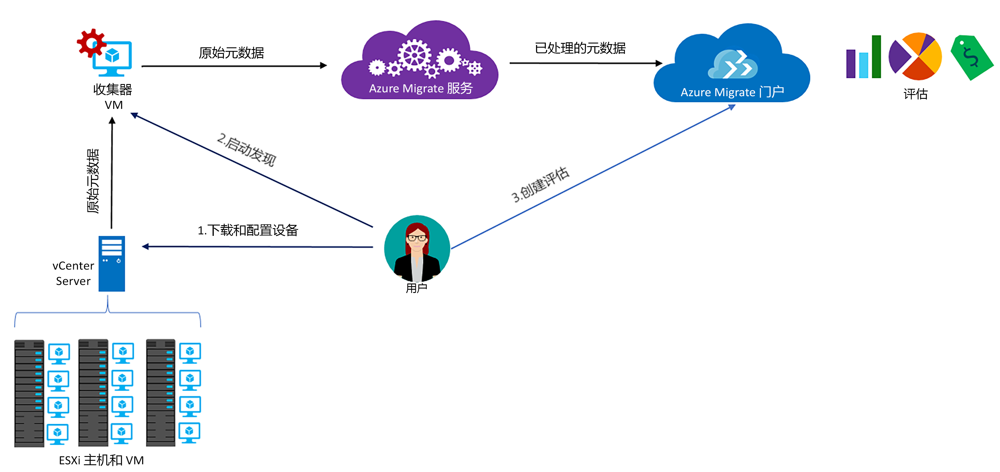

# 关于 Azure Migrate

Azure Migrate 服务会评估要迁移到 Azure 的本地工作负荷。 该服务会评估是否适合从本地计算机迁移到 Azure，以及需要根据性能进行哪些大小调整，并提供在 Azure 中运行本地计算机的成本估算。 如果打算进行直接迁移，或者处于迁移的早期评估阶段，则不妨选择此服务。 进行评估以后，即可使用 [Azure Site Recovery](https://docs.microsoft.com/azure/site-recovery/site-recovery-overview) 和 [Azure 数据库迁移服务](https://docs.microsoft.com/azure/dms/dms-overview)之类的服务将计算机迁移到 Azure。

## 为何使用 Azure Migrate？

Azure Migrate 有助于：

- **评估 Azure 迁移就绪性**：评估本地计算机是否适合在 Azure 中运行。 
- **获取大小建议**：获取 Azure VM 的大小建议，具体取决于本地 VM 的性能历史记录。 
- **估算每月成本**：获取在 Azure 中运行本地计算机的估算成本。  
- **充满信心地进行迁移**：将本地计算机的依赖关系可视化，创建可以一起进行评估和迁移的计算机组。 

## 当前限制

- 目前只能评估要迁移到 Azure VM 的本地 VMware 虚拟机 (VM)。 VMware VM 必须通过 vCenter Server（5.5、6.0 或 6.5 版）进行管理。

> [!NOTE]
> 对 Hyper-V 的支持已在规划中，将尽快启用。 在此期间，建议使用 [Azure Site Recovery 部署规划器](http://aka.ms/asr-dp-hyperv-doc)来计划 Hyper-V 工作负荷的迁移。 

- 一次发现最多可以发现 1000 个 VM，单个项目中最多可以发现 1500 个 VM。 另外，单次评估最多可以评估 400 个 VM。 如需发现或评估更多，可以增加发现或评估的次数。 [了解详细信息](how-to-scale-assessment.md)。
- 只能在“美国中西部”或“美国东部”区域创建一个 Azure Migrate 项目。 但是，这不会影响迁移计划的制定。可以迁移到另一 Azure 目标位置。 迁移项目的位置只用来存储在本地环境中发现的元数据。
- Azure Migrate 仅支持使用托管磁盘进行迁移评估。

## 需要支付哪些费用？

[在此处](https://azure.microsoft.com/en-in/pricing/details/azure-migrate/)详细了解 Azure Migrate 定价。

## 评估内容有哪些？

可以通过评估了解 Azure 是否适合本地 VM，获取在 Azure 中运行 VM 的大小建议和成本估算。 可以通过更改评估属性，根据需要对评估进行自定义。 下面是创建评估时考虑的属性。 

**属性** | **详细信息**
--- | ---
**目标位置** | 要迁移到的 Azure 位置。 默认情况下，目标位置设置为“美国西部 2”。 
**存储冗余** | Azure VM 会在迁移后使用的[存储冗余](https://docs.microsoft.com/azure/storage/common/storage-redundancy)类型。 默认为本地冗余存储 (LRS)。 请注意，Azure Migrate 仅支持基于托管磁盘的评估，而托管磁盘仅支持 LRS，因此该属性目前只有 LRS 选项。 
**调整大小的条件** | Azure Migrate 用来对 Azure 的 VM 进行大小调整的条件。 可以根据本地 VM 的*性能历史记录*来进行大小调整，也可以将 Azure VMs *作为本地 VM* 来调整大小，不考虑性能历史记录。 默认值为基于性能的大小调整。
**定价计划** | 至于成本计算，在评估时要考虑到是否有软件保障，以及是否有享受 [Azure 混合权益](https://azure.microsoft.com/pricing/hybrid-use-benefit/)的资格。 此外还要考虑到你可能有资格获得 [Azure 优惠](https://azure.microsoft.com/support/legal/offer-details/)，并且可以指定在该优惠基础上使用的任何特定于订阅的折扣 (%)。 
**定价层** | 可以指定目标 Azure VM 的[定价层（基本/标准）](../virtual-machines/windows/sizes-general.md)。 例如，如果打算迁移生产环境，则可考虑“标准”层，其提供的 VM 延迟较低但成本可能较高。 而如果使用开发-测试环境，则可考虑“基本”层，其 VM 延迟较高，但成本较低。 默认使用[标准](../virtual-machines/windows/sizes-general.md)层。
**性能历史记录** | 仅在调整大小的条件是基于性能的情况下适用。 默认情况下，Azure Migrate 使用最后一天的性能历史记录来评估本地计算机的性能，百分位数为 95%。 可以在评估属性中修改这些值。 
**舒适因子** | Azure Migrate 在评估期间会考虑到缓冲（舒适因子）。 该缓冲应用到 VM 的机器使用率数据（CPU、内存、磁盘和网络）上。 舒适因子考虑到季节性使用特点、短期性能历史记录，以及未来使用量可能会增加等问题。   例如，一个使用率为 20% 的 10 核 VM 通常相当于一个 2 核 VM。 但是，如果舒适因子为 2.0x，则结果就变成一个 4 核 VM。 默认的舒适设置为 1.3x。

## Azure Migrate 工作原理

1.  创建 Azure Migrate 项目。
2.  Azure Migrate 使用名为“收集器设备”的本地 VM 来发现有关本地计算机的信息。 若要创建该设备，请以开放虚拟化设备 (.ova) 格式下载安装程序文件，然后将其作为 VM 导入到本地 vCenter Server。
3.  首先使用 vCenter Server 中的控制台连接连接到 VM，在连接时为 VM 指定新密码，然后在 VM 中运行收集器应用程序，以便启动发现。
4.  收集器使用 VMware PowerCLI cmdlet 收集 VM 元数据。 发现是无代理发现，且不在 VMware 主机或 VM 上安装任何内容。 收集的元数据包括 VM 信息（核心、内存、磁盘、磁盘大小、网络适配器）。 此外还收集 VM 的性能数据，包括 CPU 和内存使用情况、磁盘 IOPS、磁盘吞吐量 (MBps)、网络输出 (MBps)。
5.  元数据推送到 Azure Migrate 项目， 可以在 Azure 门户中查看。
6.  将发现的 VM 按组收集，以便进行评估。 例如，可以将运行同一应用程序的 VM 作为一组。 若要进行更精确的分组，还可以使用依赖关系可视化来查看特定计算机的依赖关系，或者查看一个组中所有计算机的依赖关系，然后对组进行优化。
7.  形成一个组以后，即可为该组创建评估。 
8.  评估完成以后，可以在门户中查看，也可以通过 Excel 格式来下载。

  

## 有哪些端口要求？

下表汇总了进行 Azure Migrate 通信所需的端口。

|组件          |通信对象     |所需端口  |原因   |
|-------------------|------------------------|---------------|---------|
|收集器          |Azure Migrate 服务   |TCP 443        |连接器通过 SSL 端口 443 连接到服务|
|收集器          |vCenter Server          |默认为 9443   | 默认情况下，收集器在端口 9443 上连接到 vCenter Server。 如果服务器在另一端口上侦听，则应在收集器 VM 上将该端口配置为传出端口。 |
|本地 VM     | Operations Management Suite (OMS) 工作区          |[TCP 443](../log-analytics/log-analytics-windows-agent.md) |MMA 代理使用 TCP 443 连接到 Log Analytics。 只有在使用依赖关系可视化功能且要安装 Microsoft Monitoring Agent (MMA) 的情况下，才需要此端口。 |

  
## 评估后会发生什么情况？

通过 Azure Migrate 服务评估要迁移的本地计算机以后，即可使用多种工具进行迁移：

- **Azure Site Recovery**：可以使用 Azure Site Recovery 迁移到 Azure，如下所示：
  - 准备 Azure 资源，其中包括 Azure 订阅、Azure 虚拟网络和存储帐户。
  - 准备要迁移的本地 VMware 服务器。 请验证 Site Recovery 的 VMware 支持要求，准备要发现的 VMware 服务器，并准备将 Site Recovery 移动服务安装在要迁移的 VM 上。 
  - 设置迁移。 先设置恢复服务保管库，配置源和目标迁移设置，设置复制策略，然后启用复制。 可以运行灾难恢复演练，确保将 VM 正确迁移到 Azure。
  - 运行故障转移，将本地计算机迁移到 Azure。 
  - 在 Site Recovery 迁移教程中[了解详情](../site-recovery/tutorial-migrate-on-premises-to-azure.md)。

- **Azure 数据库迁移**：如果本地计算机在运行 SQL Server、MySQL 或 Oracle 之类的数据库，则可使用 Azure 数据库迁移服务将其迁移到 Azure。 [了解详细信息](https://azure.microsoft.com/campaigns/database-migration/)。

## 后续步骤 
[按教程](tutorial-assessment-vmware.md)创建本地 VMware VM 的评估。