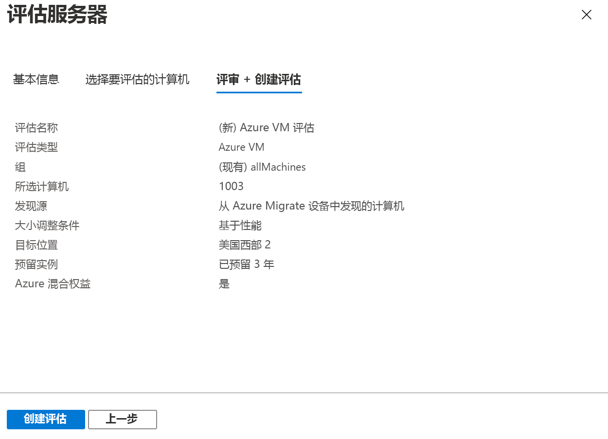

# <a name="assess-vmware-vms-by-using-azure-migrate-server-assessment"></a>使用 Azure Migrate 服务器评估来评估 VMware VM

本文介绍如何使用 Azure Migrate 中的服务器评估工具来评估本地 VMware 虚拟机 (VM)。

[Azure Migrate](migrate-services-overview.md) 在一个中心位置提供多种工具，帮助你发现、评估应用、基础结构和工作负荷并将其迁移到 Microsoft Azure。 该中心包含 Azure Migrate 工具，以及 Microsoft 合作伙伴提供的独立软件供应商 (ISV) 产品/服务。

本教程是演示如何评估 VMware VM 以及将其迁移到 Azure 的教程系列中的第二篇文章。 在本教程中，你将了解如何执行以下操作：
> [!div class="checklist"]
> * 设置一个 Azure Migrate 项目。
> * 设置本地运行的 Azure Migrate 设备用于评估 VM。
> * 开始连续发现本地 VM。 设备会将已发现的 VM 的配置和性能数据发送到 Azure。
> * 分组已发现的 VM 并评估 VM 组。
> * 查看评估。

> [!NOTE]
> 教程中演示了方案的最简单部署路径，使你能够快速设置概念证明。 教程尽可能使用默认选项，不会演示所有可能的设置和路径。 有关详细说明，请查看操作指南文章。

如果没有 Azure 订阅，请在开始之前创建一个[免费帐户](https://azure.microsoft.com/pricing/free-trial/)。

## <a name="prerequisites"></a>必备条件

[完成第一个教程](tutorial-prepare-vmware.md)（本系列）。 否则，本教程中的说明不适用。

下面是在第一篇教程中应已完成的操作：

- 为 Azure Migrate [设置 Azure 权限](tutorial-prepare-vmware.md#prepare-azure)。
- [准备 VMware](tutorial-prepare-vmware.md#prepare-for-vmware-vm-assessment) 以进行评估：
   - [验证](migrate-support-matrix-vmware.md#vmware-requirements) VMware 设置。
   - 在 VMware 中设置使用 OVA 模板创建 VMware VM 所需的权限。
   - 设置[用于 VM 发现的帐户](migrate-support-matrix-vmware.md#vmware-requirements)。 
   - 使[所需端口](migrate-support-matrix-vmware.md#port-access)可用。
   - 了解访问 Azure [所需的 URL](migrate-replication-appliance.md#url-access)。

## <a name="set-up-an-azure-migrate-project"></a>设置 Azure Migrate 项目

按如下所述设置新的 Azure Migrate 项目：

1. 在 Azure 门户中选择“所有服务”，然后搜索 **Azure Migrate**。 
1. 在“服务”下选择“Azure Migrate”。  
1. 在“概览”中的“发现、评估和迁移服务器”下，选择“评估和迁移服务器”。   

   

1. 在“入门”中，选择“添加工具”。  
1. 在“迁移项目”中选择你的 Azure 订阅，并创建一个资源组（如果没有）。      
1. 在“项目详细信息”中，指定项目名称以及要在其中创建项目的地理位置。  支持“亚洲”、“欧洲”、“英国”和“美国”。

   项目地理位置仅用于存储从本地 VM 中收集的元数据。 运行迁移时，可以选择任一目标区域。

   

1. 选择“**下一页**”。
1. 在“选择评估工具”中，选择“Azure Migrate:   服务器评估” > “下一步”。 

   

1. 在“选择迁移工具”中，选择“暂时跳过添加迁移工具” > “下一步”。   
1. 在“查看 + 添加工具”中查看设置，然后选择“添加工具”。  
1. 等待几分钟，让 Azure Migrate 项目部署完成。 随后将转到项目页。 如果未看到该项目，可以从 Azure Migrate 仪表板中的“服务器”访问它。 

## <a name="set-up-the-appliance-vm"></a>设置设备 VM

Azure Migrate 服务器评估运行一个轻型 VMware VM 设备。 此设备执行 VM 发现，并收集 VM 元数据和性能数据。

若要设置该设备，请执行以下操作：

- 下载 OVA 模板文件，并将其导入 vCenter Server。
- 创建设备，并检查它是否可以连接到 Azure Migrate 服务器评估。
- 完成设备的首次配置，并将其注册到 Azure Migrate 项目。

可为单个 Azure Migrate 项目设置多个设备。 在所有设备上，服务器评估支持发现多达 35,000 个 VM。 在每个设备上，它可以发现最多 10,000 个服务器。

### <a name="download-the-ova-template"></a>下载 OVA 模板

1. 在“迁移目标” > “服务器” > “Azure Migrate:    服务器评估”中，选择“发现”。 
1. 在“发现计算机” > “计算机是否已虚拟化?”中，选择“是，使用 VMWare vSphere 虚拟机监控程序”。   
1. 选择“下载”以下载 OVA 模板文件。 

   

### <a name="verify-security"></a>验证安全性

在部署 OVA 文件之前检查其安全性：

1. 在下载文件的计算机上，打开管理员命令窗口。
1. 运行以下命令，生成 OVA 文件的哈希：
  
   ```C:\>CertUtil -HashFile <file_location> [Hashing Algorithm]```
   
   用法示例：```C:\>CertUtil -HashFile C:\AzureMigrate\AzureMigrate.ova SHA256```

对于版本 2.19.07.30，生成的哈希应与这些值匹配：

**算法** | **哈希值**
--- | ---
MD5 | c06ac2a2c0f870d3b274a0b7a73b78b1
SHA256 | 4ce4faa3a78189a09a26bfa5b817c7afcf5b555eb46999c2fad9d2ebc808540c

### <a name="create-the-appliance-vm"></a>创建设备 VM

导入下载的文件，然后创建 VM：

1. 在 vSphere 客户端控制台中，选择“文件”   > “部署 OVF 模板”  。

   

1. 在“部署 OVF 模板向导”>“源”  中，指定 OVA 文件的位置。
1. 在“名称”和“位置”中，为 VM 指定一个易记名称。   选择要在其中托管 VM 的库存对象。
1. 在“主机/群集”中，指定要在其上运行 VM 的主机或群集。 
1. 在“存储”中，指定 VM 的存储目标。 
1. 在“磁盘格式”  中，指定磁盘类型和大小。
1. 在“网络映射”中，指定 VM 要连接到的网络。  该网络需要与 Internet 建立连接，这样才能向 Azure Migrate 服务器评估发送元数据。
1. 检查并确认设置，然后选择“完成”。 

### <a name="verify-appliance-access-to-azure"></a>验证设备的 Azure 访问权限

确保设备 VM 可以连接到 [Azure URL](migrate-appliance.md#url-access)。

### <a name="configure-the-appliance"></a>配置设备

使用以下步骤设置设备：

1. 在 vSphere 客户端控制台中右键单击“VM”，然后选择“打开控制台”  。
1. 提供设备的语言、时区和密码。
1. 在可连接到该 VM 的任一计算机上打开浏览器，然后打开设备 Web 应用的 URL：**https://*设备名称或 IP 地址*:** 44368。

   或者，可以在设备桌面上选择应用快捷方式打开该应用。
1. 在 Web 应用 >“设置必备组件”中执行以下操作： 
   - **许可证**：接受许可条款，并阅读第三方信息。
   - **连接**：应用将检查 VM 是否可访问 Internet。 如果 VM 使用代理：
     - 选择“代理设置”，并以 http://ProxyIPAddress 或 http://ProxyFQDN 格式指定代理地址和侦听端口。 
     - 如果代理需要身份验证，请指定凭据。
     - 请注意，仅支持 HTTP 代理。
   - **时间同步**：设备上的时间应与 Internet 时间同步，这样才能正常进行发现。
   - **安装更新**：设备可确保安装最新的更新。
   - **安装 VDDK**：设备将检查是否已安装 VMWare vSphere 虚拟磁盘开发工具包 (VDDK)。 从 VMware 下载 VDDK 6.7（如果尚未安装它），并将下载的 zip 内容解压缩到设备上的指定位置。

     Azure Migrate 服务器迁移在迁移到 Azure 期间使用 VDDK 复制计算机。       

### <a name="register-the-appliance-with-azure-migrate"></a>将设备注册到 Azure Migrate

1. 选择“登录”。  如果未显示该按钮，请确保已在浏览器中禁用弹出窗口阻止程序。
1. 在新选项卡上，使用 Azure 用户名和密码登录。
   
   不支持使用 PIN 登录。
1. 成功登录后，返回到 Web 应用。
1. 选择在其中创建了 Azure Migrate 项目的订阅，然后选择项目。
1. 指定设备的名称。 该名称应是字母数字，长度为 14 个或更少的字符。
1. 选择“注册”  。

## <a name="start-continuous-discovery"></a>启动持续发现

设备需连接 vCenter Server，以发现 VM 的配置和性能数据。

### <a name="specify-vcenter-server-details"></a>指定 vCenter Server 详细信息
1. 在“指定 vCenter Server 详细信息”中，指定 vCenter Server 实例的名称 (FQDN) 或 IP 地址。  可以保留默认端口，或指定 vCenter Server 侦听的自定义端口。
1. 在“用户名”和“密码”中，指定设备用来发现 vCenter 服务器实例上的 VM 的 vCenter Server 帐户凭据   。 

   请确保该帐户拥有[所需的发现权限](migrate-support-matrix-vmware.md#vmware-requirements)。 可以通过限制对 vCenter 帐户的访问，来[限定发现范围](tutorial-assess-vmware.md#set-the-scope-of-discovery)。
1. 选择“验证连接”，确保设备可以连接到 vCenter Server。 

### <a name="specify-vm-credentials"></a>指定 VM 凭据
若要发现应用程序、角色和功能并可视化 VM 的依赖关系，可以提供用于访问 VMware VM 的 VM 凭据。 可以分别为 Windows VM 和 Linux VM 添加一个凭据。 [详细了解](https://docs.microsoft.com/azure/migrate/migrate-support-matrix-vmware)必需访问权限。

> [!NOTE]
> 此输入为可选，但需要它才能发现应用程序和可视化无代理依赖关系。

1. 在“发现 VM 上的应用程序和依赖关系”中，选择“添加凭据”   。
1. 针对“操作系统”进行选择。 
1. 提供凭据的易记名称。
1. 在“用户名”和“密码”中，指定在 VM 上至少具有来宾访问权限的帐户   。
1. 选择 **添加** 。

指定 vCenter Server 实例和 VM 凭据（可选）后，选择“保存并开始发现”，开始发现本地环境  。

大约 15 分钟后，已发现的 VM 的元数据将显示在门户中。 发现已安装的应用程序、角色和功能需要一些时间， 具体时间取决于待发现的 VM 数量。 如果是 500 个 VM，Azure Migrate 门户大约需要 1 小时才会显示应用程序清单。

### <a name="set-the-scope-of-discovery"></a>设置发现范围

可以通过限制用于发现的 vCenter 帐户的访问权限，来限定发现范围。 可将范围设置为 vCenter Server 数据中心、群集、群集文件夹、主机、主机文件夹或单个 VM。

若要设置范围，请执行以下过程。

#### <a name="1-create-a-vcenter-user-account"></a>1.创建 vCenter 用户帐户
1.  以 vCenter Server 管理员身份登录到 vSphere Web 客户端。
1.  选择“管理”   >   “SSO 用户和组”，然后选择“用户”选项卡。 
1.  选择“新建用户”图标。 
1.  填写所需的信息以创建新用户，然后选择“确定”。 

#### <a name="2-define-a-new-role-with-required-permission"></a>2.定义具有所需权限的新角色
此过程是进行无代理服务器迁移所需的。
1.  以 vCenter Server 管理员身份登录到 vSphere Web 客户端。
1.  浏览到“管理” > “角色管理器”。  
1.  从下拉菜单中选择 vCenter Server 实例。
1.  选择“创建角色”。 
1.  输入新角色的名称（例如 <em>Azure_Migrate</em>）。
1.  将[权限](https://docs.microsoft.com/azure/migrate/migrate-support-matrix-vmware)分配到新定义的角色。
1.  选择“确定”  。

#### <a name="3-assign-permissions-on-vcenter-objects"></a>3.在 vCenter 对象上分配权限

可通过两种方法在 vCenter 的库存对象上将权限分配给已为其分配了角色的 vCenter 用户帐户。

对于“服务器评估”，必须将“只读”角色应用到所有父对象（在其中托管要发现的 VM）的 vCenter 用户帐户。  将包括层次结构中一直到数据中心的所有父对象：主机、主机文件夹、群集、群集文件夹。 这些权限将传播到层次结构中的子对象。

同样，对于“服务器迁移”，必须为所有父对象（在其中托管要迁移的 VM）的 vCenter 用户帐户应用具有[权限](https://docs.microsoft.com/azure/migrate/migrate-support-matrix-vmware)的用户定义角色。 可以将此角色命名为  <em>Azure _Migrate</em>。


替代方法是在数据中心级别分配用户帐户和角色，再将其传播到子对象。 然后，对于不想要发现/迁移的每个对象（例如 VM），为帐户提供“无访问权限”角色。  

此备用配置很繁琐。 它会意外公开访问控制，因为系统会自动为每个新建的子对象授予从父对象继承的访问权限。 因此，建议使用第一种方法。

> [!NOTE]
> 目前，如果在 vCenter VM 文件夹级别授予 vCenter 帐户的访问权限，则服务器评估无法发现 VM。 若要按 VM 文件夹来限定发现范围，可通过以下过程来实现。 这样可确保在 VM 级别为 vCenter 帐户分配只读访问权限。
>
> 1. 针对 VM 文件夹中你要将发现范围限定到的所有 VM 分配只读权限。
> 1. 对托管 VM 的所有父对象授予只读访问权限。 将会包括层次结构中的所有父对象（主机、主机文件夹、群集、群集文件夹），一直到数据中心。 不需将权限传播到所有子对象。
> 1. 选择数据中心作为“收集范围”即可使用凭据进行发现。  设置的基于角色的访问控制可确保相应的 vCenter 用户仅有权访问特定于租户的 VM。
>
> 请注意，支持主机文件夹和群集文件夹。

### <a name="verify-vms-in-the-portal"></a>在门户中验证 VM

发现完成后，可以验证 VM 是否出现在 Azure 门户中：

1. 打开 Azure Migrate 仪表板。
1. 在“Azure Migrate - 服务器” > “Azure Migrate:   服务器评估”中，选择显示了**已发现服务器**计数的图标。

## <a name="set-up-an-assessment"></a>设置评估

可以使用 Azure Migrate 服务器评估创建两种类型的评估：

**评估** | **详细信息** | **数据**
--- | --- | ---
**基于性能** | 基于收集的性能数据的评估 | **建议的 VM 大小**：基于 CPU 和内存利用率数据。<br/><br/> **建议的磁盘类型(标准或高级托管磁盘)** ：基于本地磁盘的 IOPS 和吞吐量。
**本地** | 基于本地大小设置进行的评估 | **建议的 VM 大小**：基于本地 VM 大小。<br/><br> **建议的磁盘类型**：基于为评估选择的存储类型设置。

## <a name="run-an-assessment"></a>运行评估

按如下述运行评估：

1. 查看有关创建评估的[最佳做法](best-practices-assessment.md)。
1. 在“服务器”选项卡上的“Azure Migrate:   服务器评估”磁贴中，选择“评估”。 

   

1. 在“评估服务器”中，指定评估的名称。 
1. 选择“全部查看”，然后查看评估属性  。

   

1. 在“选择或创建组”中，选择“新建”并指定组名称。   组将要评估的一个或多个 VM 集合到一起。
1. 在“将计算机添加到组”中，选择要添加到该组的 VM。 
1. 选择“创建评估”以创建该组并运行评估。 

   

1. 创建评估后，在“服务器” > “Azure Migrate:   服务器评估” > “评估”中查看它。 
1. 选择“导出评估”，将评估下载为 Excel 文件。 

## <a name="review-an-assessment"></a>查看评估

评估描述：

- **Azure 迁移就绪性**：VM 是否适合迁移到 Azure。
- **每月成本估算**：在 Azure 中运行 VM 的估算每月计算和存储成本。
- **每月存储成本估算**：迁移后的磁盘存储估算成本。

若要查看评估，请执行以下操作：

1. 在“迁移目标” > “服务器”中，选择“Azure Migrate:     服务器评估”中的“评估”。
1. 在“评估”中，选择某项评估将其打开。 

   

### <a name="review-azure-readiness"></a>查看 Azure 迁移就绪性

1. 在“Azure 迁移就绪性”中，验证 VM 是否已准备好迁移到 Azure。 
1. 查看 VM 状态：
    - **已做好 Azure 迁移准备**：在 Azure Migrate 针对评估中的 VM 建议 VM 大小并显示估算成本时使用。
    - **准备就绪但存在以下状况**：显示问题和建议的补救措施。
    - **尚未做好 Azure 迁移准备**：显示问题和建议的补救措施。
    - **就绪性未知**：当数据可用性问题导致 Azure Migrate 无法评估就绪性时使用。

1. 选择某种“Azure 迁移就绪性”状态。  可以查看 VM 就绪详情。 还可以深入查看 VM 详细信息，包括计算、存储和网络设置。

### <a name="review-cost-details"></a>查看成本详细信息

评估摘要显示估算出来的在 Azure 中运行 VM 的计算和存储成本。 将聚合评估的组中所有 VM 的成本。 可以深入查看特定 VM 的成本详细信息。

> [!NOTE]
> 成本估算基于计算机及其磁盘和属性的大小建议。 估算适用于以 IaaS VM 形式运行本地 VM。 Azure Migrate 服务器评估不考虑 PaaS 或 SaaS 成本。

已评估组的聚合存储成本按不同类型的存储磁盘划分。 

### <a name="review-confidence-rating"></a>查看置信度分级

Azure Migrate 服务器评估会为基于性能的评估进行置信度分级，从 1 星（最低）到 5 星（最高）不等。


置信度分级用于判断评估的大小建议的可靠性。 此分级基于对评估进行计算时所需数据点的可用性：

**数据点可用性** | **置信度分级**
--- | ---
0%-20% | 1 星
21%-40% | 2 星
41%-60% | 3 星
61%-80% | 4 星
81%-100% | 5 星

[了解最佳做法](best-practices-assessment.md#best-practices-for-confidence-ratings)（针对置信度分级）。

## <a name="next-steps"></a>后续步骤

在本教程中，我们设置了一个 Azure Migrate 设备。 我们还创建并查看了评估。

若要了解如何使用 Azure Migrate 服务器迁移将 VMware VM 迁移到 Azure，请继续学习本系列的第三个教程：

> [!div class="nextstepaction"]
> [迁移 VMware VM](./tutorial-migrate-vmware.md)
