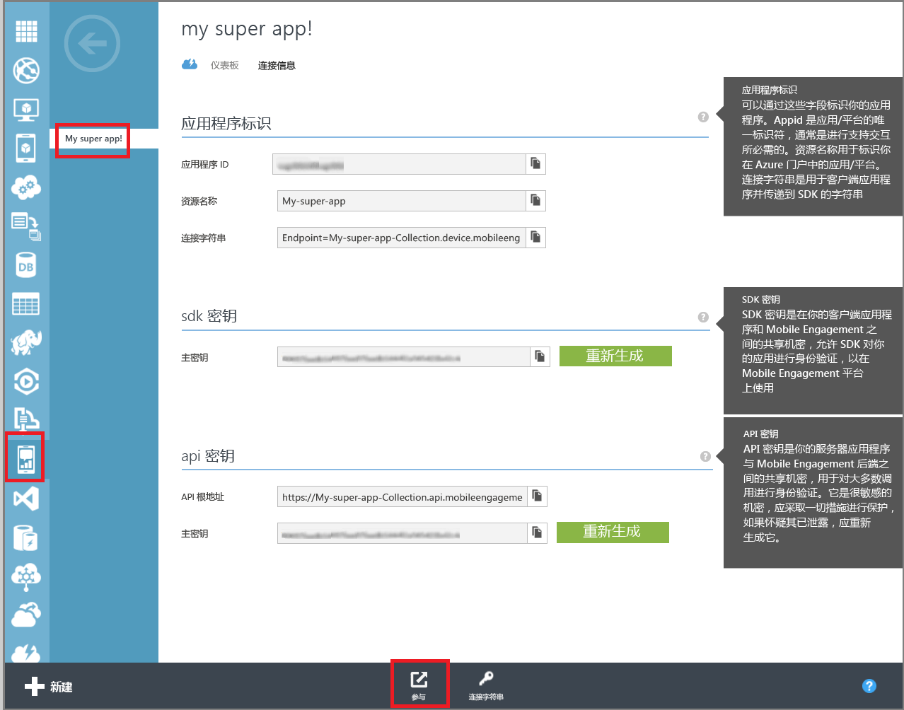

<properties
	pageTitle="创建 Azure Mobile Engagement 应用 | Microsoft Azure"
	description="介绍如何在 Azure 中创建新的 Mobile Engagement 应用集合，并开始通过 Mobile Engagement 门户管理应用。"
	services="mobile-engagement"
	documentationCenter=""
	authors="piyushjo"
	manager="dwrede"
	editor=""/>

<tags
	ms.service="mobile-engagement"
	ms.workload="mobile"
	ms.tgt_pltfrm="mobile-windows-store"
	ms.devlang="na"
	ms.topic="get-started-article"
	ms.date="08/19/2016"  
	ms.author="piyushjo"/>

# 创建 Azure Mobile Engagement 应用

本文将介绍如何使用**快速创建**方法创建新的 **Azure Mobile Engagement** 应用。本文还介绍如何导航到 **Mobile Engagement** 门户，以便对应用开始进行监视和管理。

请注意，必须至少添加一组“基本集成”，才能够收集应用的数据并发送推送通知。[Mobile Engagement 集成](mobile-engagement-windows-store-integrate-engagement.md)中提供了完整的集成文档。

> [AZURE.IMPORTANT] 若要完成任何 Azure Mobile Engagement 教程，必须有一个有效的 Azure 帐户。如果你没有帐户，只需花费几分钟就能创建一个免费试用帐户。有关详细信息，请参阅 <a href="http://azure.microsoft.com/pricing/free-trial/?WT.mc_id=A0E0E5C02&amp;returnurl=http%3A%2F%2Fwww.windowsazure.com%2Fzh-CN%2Fdevelop%2Fmobile%2Ftutorials%2Fget-started%2F" target="_blank">Azure 免费试用</a>。

##为 Azure 中的移动应用设置 Mobile Engagement

[AZURE.INCLUDE [在门户中创建 Mobile Engagement 应用](../../includes/mobile-engagement-create-app-in-portal.md)]

##导航到 Mobile Engagement 门户

若要开始监视和管理应用程序，请单击底部的“参与”按钮，导航到 Mobile Engagement 门户。

进入 Mobile Engagement 门户后，可以分析、创建和管理各个用户段以及联系用户等。

- [监视有关应用程序的实时数据](mobile-engagement-user-interface-monitor.md)
- [分析有关应用程序的历史记录数据](mobile-engagement-user-interface-analytics.md)
- [创建和管理用户段以确定使用模式](mobile-engagement-user-interface-segments.md)
- [通过推送通知与应用程序的用户联系](mobile-engagement-user-interface-reach.md)

##另请参阅

[定义 Mobile Engagement 策略](mobile-engagement-define-your-mobile-engagement-strategy.md)

[Azure Mobile Engagement 入门](mobile-engagement-windows-store-dotnet-get-started.md)（可以在页面顶部选择其他移动平台）。

<!---HONumber=AcomDC_0921_2016-->