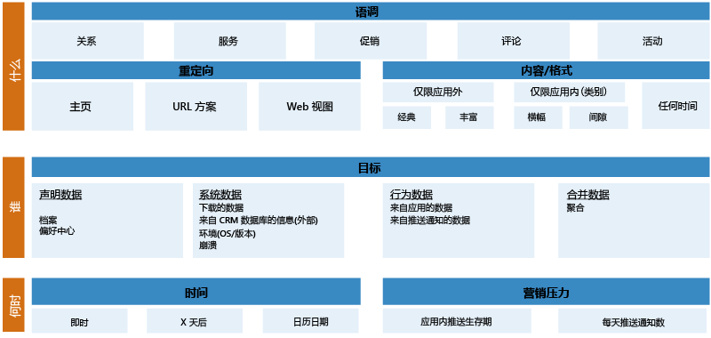
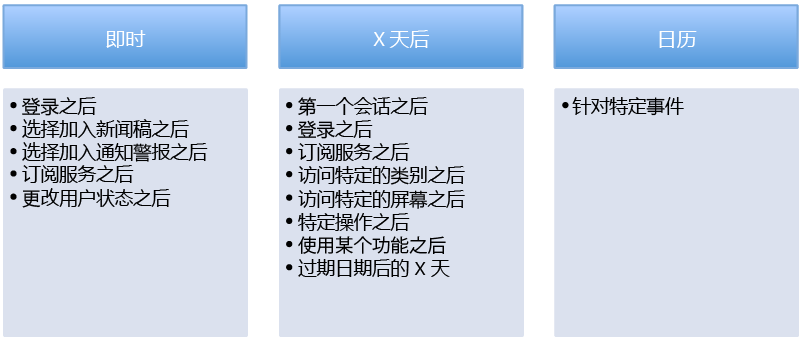

<properties 
	pageTitle="Azure Mobile Engagement 最佳实践入门指南"
	description="Azure Mobile Engagement 和最佳加入实践入门指南" 
	services="mobile-engagement" 
	documentationCenter="mobile" 
	authors="wesmc7777"
	manager="erikre"
	editor=""/>

<tags
	ms.service="mobile-engagement"
	ms.devlang="na"
	ms.topic="get-started-article"
	ms.tgt_pltfrm="mobile-multiple"
	ms.workload="mobile" 
	ms.date="07/07/2016"
	ms.author="wesmc;ricksal"/>

# Azure Mobile Engagement - 最佳实践入门指南

## 概述

**移动屏幕是很拥挤的空间：**2013 年的一项研究发现，移动设备平均安装 27 个应用程序。用户通常每月花 30 小时在其应用上。该时间大部分花在社交网络和游戏上（约 20 小时）。到 2014 年的时候，Android 市场已经有大约 150 万可供用户选择的应用程序。Apple Store 有大约 120 万个应用。移动应用的使用越来越广泛，而开发商在这个不断增长的市场的竞争也越来越剧烈。

一般的移动用户会根据兴趣变化和应用内体验频繁地安装和卸载应用。若要确定某个应用是否成功，仅仅了解多少用户安装了该应用是不够的。必须了解该应用到底有多大用，以及使用趋势是否在改变。以下问题变得很重要：

- 用户是否开始失去该应用的兴趣或者觉得其过时？
- 多少用户已彻底停止使用该应用？
- 应用内购买呈上升还是下降趋势？
- 用户是否因应用问题或失去兴趣而无法完成工作流？
- 是否可以向用户群推送新鲜内容，确保应用的可用性和相关性？
- 该新鲜内容是对所有用户都一样，还是会根据用户在应用内的行为侧重于特定的用户类型？
 
了解此类问题的答案有助于增强应用的生命力，提高应用的收入，对于确定和保留用户群也会很有帮助。

媒体相关应用在用户中的保留率相当高，其中一个原因就是经常提供新鲜内容给用户。一开始就采用各种有用的面向用户类型的推送通知，这对保留应用用户有很大影响。

Azure Mobile Engagement 计划旨在通过相关方法收集和分析详细的应用使用信息，有助于延长应用的生命力以及提高用户保留率。可通过该计划根据行为对用户群分类，创建专门的活动，将推送通知和应用内消息传送给确定的用户类型。关键绩效指标 (KPI) 通过应用的不同方面衡量用户的活跃程度。Azure Mobile Engagement 提供确定这些 KPI 所需的方法。它可以提供所需的基础结构，增强用户对移动应用的参与度，增强投资回报率 (ROI)。

为了充分利用 Azure Mobile Engagement，需要一开始就设计好用户参与计划。可以通过计划更好地确定所需详细数据，对用户群进行分类。分类依据可以是行为和应用内体验。为了确保计划成功，最好能清楚地定义 KPI，对应用的目标进行衡量。定义清楚绩效指标以后，即可在应用中轻松嵌入必需的逻辑，收集分析和评估 KPI 时需使用的细化数据。本主题是定义 KPI 并将其用于用户参与计划的最佳实践指南。

## 步骤 1：定义适合 BET 模型的 KPI

正确定义 KPI 可能很困难。针对不同行业设计的应用各有具体的规范和目标。这会对方法造成混淆。为了避免这种情况，应将目标和 KPI 分为三大类：**业务类**、**用户保留类**和**技术类**。这简称 **BET 模型**。

好的计划通常需要设定目标，并通过 KPI 衡量以下各类 BET 模型的成功与否。

#### 业务 KPI

业务 KPI 应该是最容易构建的部分。在计划移动应用时，可能已经以某种形式定义了此类 KPI。此类 KPI 通常用于衡量应用的收入和 ROI。下表提供了一些业务 KPI 示例，在定义绩效指标时可将其用作参考：

- 媒体业务 KPI
	- 点击广告数
	- 每个用户的页面访问数
	- 当前订阅数
- 游戏业务 KPI
	- 应用内购买数
	- 每用户平均收入 (ARPU)
	- 每个会话所花费的时间
	- 玩游戏的天数以及目前在游戏中的级别
- 电子商务业务 KPI
	- 使用应用的天数
	- 每用户平均收入 (ARPU)
	- 结账时购物车中商品的平均金额
	- 大多数情况下查看和购买商品时所对应的产品类别
- 银行和保险业务 KPI
	- 帐户数
	- 激活的功能数
	- 访问的产品/服务页面数
	- 单击或激活的提醒数

#### 用户参与 KPI

用户参与 KPI 是衡量用户参与度的绩效指标。可根据此方面的趋势确定应用的用户保留率。下面列举了此类 KPI 的一些绩效指标：

- 过去 7 天的活跃用户数
- 过去 7 天的不活跃用户数
- 30 天内未使用过应用的用户数

某些明显的外部因素可能会影响此方面的指标。例如，也许可以认为用户会始终将移动设备带在身边。这可能对，也可能不对。游戏应用在假期的使用率更高，因为这个时候游戏玩家可能不需要工作或学习，因此玩游戏的时间更多。

此类 KPI 定义清楚以后，应该能够很好地衡量应用和客户之间的关系。

#### 技术类 KPI

可以通过此类绩效指标确定应用是在正常运行，还是正在挂起或崩溃。这些指标可以衡量应用的运行状况，确定那些可能妨碍用户使用应用的可用性问题。针对此类别收集的信息可能还包含与营销团队相关的绩效信息。IT 和支持团队也可使用该数据进行故障诊断，确定未报告的 Bug。
 
以下是技术类 KPI 的一些示例：

- 未经处理的或已经处理的异常信息及计数
- 上次崩溃的时间戳
- 最后一次单击的按钮，或最后一次访问的页面
- 应用的内存使用量
- 应用帧速率
- 运行应用的 OS 版本
- 应用版本

定义此类 KPI 的目的是衡量应用性能，找出潜在的 Bug。使用此类指标，为客户提供修补程序所需的时间会减少。还可以通过此类指标定义遇到过特定问题的用户类型。可以通过该用户分类创建活动，提供与可用修补程序和可能的促销计划相关的通知，确保恢复客户满意度。

#### 攻略练习 1：创建 KPI 仪表板

定义营销策略时，应确保可通过 KPI 了解每种主要目标。这些 KPI 应该是明确定义的数据点，用于收集重要信息，监视应用以及最终用户的行为。

构建包含以下信息的 KPI 仪表板

1.	应用的 KPI 有哪些？
2.	需使用什么样的数据点代表每个 KPI？
3.	应用程序的此类数据（即屏幕、设置、系统等）位于何处？
4.	是否可以针对此 KPI 确定一个用户参与序列？

可以通过 [Media Playbook Template][Media Playbook link]（媒体攻略模板）中的 **KPI 生成器**工作表获取示例和指导。

## 步骤 2：用户参与计划

应该考虑将好的移动用户参与计划作为应用的重要组件。这种情况下，绝对应在应用中包括一个好的欢迎计划，在用户使用应用的第一天就执行。这会对应用的用户参与度和保留率产生非常正面的影响。研究表明，大部分用户在安装后的头几天就会停止使用应用。需要在用户仍关注应用的时候，尽早激起其兴趣，尽量满足或超过客户的预期。确保将应用的重要价值和优势呈现给客户。

若要确保移动设备用户的尽早参与，最好的方式是使用推送通知。但是，为了推送通知而对用户分类时，应格外小心。因为，如果用户觉得自己收到的是垃圾邮件或不感兴趣的通知，后果可能很糟糕。用户只需点几下鼠标就可以删除应用程序，然后再也不会回来了。不应向该用户发送内容泛泛的垃圾邮件，而应发送高度个性化的应用内高价值内容。

用户积极参与以后，即可通过用户参与计划推广该应用其他方面的内容。

例如，可以开展一个活动，要求活跃用户对应用评级。此类用户是最活跃的，应用体验最深，因此会给出最准确的评价。应用评级高有助于提升应用的自然下载数，同时减少新客户获取成本。

#### 用户参与序列

全球性的用户参与计划包括不同的用户参与序列。每个序列旨在达成多个目标。

###### 生命推送序列

生命推送序列的目标各不相同，具体取决于用户参与应用的生命周期。特定用户的状态可能为“新”、“不活跃”或“非常活跃”。在参与生命周期的不同阶段，用户可能受益于以提示或文档链接形式提供的新鲜内容。

例如，新用户在首次启动应用时，可能需要应用使用指导方面的帮助，或者会受益于新推出的用户激励计划，如下所示...

*“欢迎加入！ 请注意，登录后第一个月免费试用！”*

###### 行为推送序列

行为推送序列旨在根据所收集的应用用户行为提高使用率。

例如，如果用户非常积极地使用某个梦幻橄榄球应用，则可参与以下推送通知计划，使自己受益...

*“John，伟大的橄榄球迷！ 请登录 NFL 版块，赢取参加超级碗的免费球票！”*

###### 提醒性推送序列

如果为用户提供侧重于其兴趣的相关新闻，用户会很感激。提醒推送序列可以根据用户明确显示的兴趣发送提醒，增强用户参与度。当用户在应用中选择自己的兴趣时，该操作可以是显式操作。根据用户与应用交互期间收集的数据，也可能会确定该操作是隐式操作。

例如，可以通过业务 KPI 发现，电子商务应用用户可能会定期购买特定品牌的咖啡。以下提醒可以增强该用户的应用参与度。
 
*“嗨，Wes，你最喜欢的一个咖啡品牌将在 2015 年 9 月的头一周进行打折销售，提供 25% 的优惠。谢谢你经常惠顾，我们只是不想让你错过这个消息。”*

###### 保留推送序列

此序列旨在保留用户，使用重复性推送通知活动，让用户形成经常使用应用的习惯。如果用户喜欢交互，这可以增强应用的用户保留率。

例如，体育相关应用的用户可能会每周都收到以下推送通知，具体取决于该用户最喜欢的球队：

*“投票选择纽约洋基队是否会赢得本周对阵多伦多蓝鸟队的比赛，即有机会赢取 200 点！”*

#### 3W 方法

掌握不同的推送序列有助于提高最终用户参与度。但是，仍需使用 3W 方法对通知进行个性化操作。3W 方法应该解决每个通知的人员、内容和时间问题。如果能够明确解答这三个问题，则通知应适当专注于用户参与度。

###### 人员：会收到消息的用户类型

应将向用户推送通知视为一种很敏感的通信渠道。确保打算向某个用户类型发送的通知局限于该用户类型感兴趣的范围。通知路由不正确很可能对用户造成负面影响。用户可能会将其视为垃圾邮件，于是卸载应用。

定义会收到通知的用户类型时，可综合使用特定的技术和行为标准。定义用户类型的简单示例可以类似于以下语句：

“所有在 3 天前首次启动了移动应用程序的用户，虽然访问过登录页两次，但实际上并未完成登录”。
 
该语句用于确定需要收集的数据，为特定方案提供支持。

###### 内容：要发送的消息

**语气**

在确保用户参与时，请使用适合分类用户的语气。若要与最终用户进行联系并增强用户对应用的兴趣，可以使用这种绝对好的方式。

**重定向**

推送通知的可用用途不只是打开应用程序。如果通知消息提供了上下文（例如广播新闻或产品促销活动），则该通知可以通过深层链接方式直接链接到应用程序中的正确内容。为了支持此功能，必须创建一个 URL 方案，让应用程序管理重定向。处理用户参与序列时，这是一个重要步骤，不得忘记。

也可针对其他系统管理重定向。例如，可以使用操作 URL 将最终用户重定向到许多其他系统，包括：

- 网站
- 已设置好电子邮件的邮箱
- 短信箱
- 拨号服务
- 直接重定向到应用程序商店，对应用程序评级。

这样可以有多个机会来提高最终用户参与度，并创建自动规则来改进性能。

**格式/内容**

不同的类型和推送通知格式：

1. **公告**：用于在不同的时候（应用外、应用内或任何时候）向用户发送广告消息。
2. **轮询**：用于通过提问从最终用户收集信息。然后，在创建条件来确定最终用户时，会提供这种答案。
3. **数据推送**：用于发送二进制或 base64 数据文件，对应用进行更新。包含在数据推送中的信息会发送到应用程序，在应用中个性化用户的体验。需将应用程序设计为支持数据推送中的数据。
4. **磁贴（仅限 Windows Phone）**：允许用户使用 Microsoft 推送通知服务 (MPNS) 发送包含 XML 数据的原生推送通知（自 SDK 版本 0.9.0 以来一直受支持。磁贴最终的有效负载不能超过 32 千字节。）。消息直接显示在面板的磁贴上。
5. **Webview**：Web 视图是包含 Web 内容的弹出窗口。当最终用户单击了推送通知以后，会显示该弹出窗口。可通过 Web 视图与最终用户进行更多的交互。
 
>[AZURE.NOTE] 请确保要作为推送通知发送的内容符合相应平台（iOS、Android、Windows）为开发应用和发送推送通知而制定的准则。

 

###### 时间：活动的时间安排

激活一个可触发推送通知的活动的最佳时间是什么时间？ 应该是手动还是自动？ 应该是周期性的吗？ 确定正确的时间或频率很重要，可以最大程度地提高用户参与度。每个用户参与序列和方案都必须指定发送推送通知的最佳时间。下面是一些可能的示例：

如果每天都发送许多通知，则必须慎重考虑，因为用户可能会将通信视为垃圾邮件。

可以利用 Azure Mobile Engagement 提供的两种方式，避免通信被视为垃圾邮件。首先，对用户进行精细分类，确保不将多种通信内容发给相同的用户。另外，Azure Mobile Engagement 还提供了“配额”功能。此功能可以限制为某个活动发送的通知数。例如，如果将默认配额设置为每周 5 个通知，则可确保作为活动用户类型添加的用户在该周收到的通知不会超过 5 个。

#### 攻略练习 2：创建用户参与计划

花些时间对目标进行汇总，定义那些预计要使用特定序列开展的活动。确保在活动中对通知应用 3W 方法。

通过 [Media Playbook Template][Media Playbook link]（媒体攻略模板）中的**用户参与计划**工作表获取示例和指导。

## 步骤 3：应用集成

#### 创建标记计划

若要将 Azure Mobile Engagement 集成到应用中，需创建标记计划。标记计划是项目的基础。标记计划定义营销规范、应用程序工作流以及在应用中收集的用于衡量 KPI 的真实标记数据的关系。标记计划指示可在门户中看到的分析内容。此外，也可使用标记计划定义用户类型，发送有所偏重的推送通知，提高最终用户的参与度。定义标记计划以后，即可使用 Azure Mobile Engagement SDK 添加代码，将标记计划集成到应用中。

标记计划不应标记应用程序中的所有内容，而只应包括属于移动用户参与策略一部分的标记数据。应用程序在这方面的情况可能各不相同。可以利用 Azure Mobile Engagement 提供的 [Media Playbook Template][Media Playbook link]（媒体攻略模板），通过给定方法构建标记计划。使用**标记计划**工作表作为指南，构建标记计划。

在工作表中定义标记部分时，请尽量具体。这很重要，可以避免混淆。详细指定每种需要发送各个标记的预期方案。包括已嵌入每个标记的活动的名称。这些都应该包括在工作表的“信息”部分。进行测试验证时，应将标记计划工作表用作主要参考。

在“要收集的数据”部分，开发团队会发现每个要嵌入到应用程序中的标记的必需类型、名称、值以及额外信息键值对。

建议与所有项目相关团队一起复查标记计划。进行必要的纠正，确认营销和开发团队清楚所有内容。

参与项目的所有人都可使用**工作说明**工作表作为指南。

#### 数据类型

这些是 Azure Mobile Engagement 提供的常见数据支持类型。

###### 设备和用户

Azure Mobile Engagement 标识用户的方式是为每台设备生成一个唯一标识符。该标识符称为设备标识符（或 deviceid）。这种生成方式导致同一设备上所有正在运行的应用程序共享同一设备标识符。

###### 会话和活动

会话是由用户运行的应用的一个实例。会话从用户启动应用开始，至用户停止应用结束。

活动是对应用在会话过程中可能会执行的一组操作的逻辑分组。活动通常是指应用中的特定屏幕，但也可以是通过应用程序的逻辑定义的任何对象。至少应标记应用的每个屏幕或活动。这样可以了解用户路径。

###### 事件

事件用于报告用户与应用的交互。事件可能是即时操作，例如共享内容或启动视频。标记事件即可收集数据，了解用户与应用的交互情况。

###### 作业

作业用于报告有一定持续时间的操作。示例包括：

- 执行 API 调用
- 广告的显示时间
- 后台任务持续时间
- 购买过程持续时间
- 观看视频

###### 错误

使用错误报告应用检测到的问题。例如，用户操作不正确，或者 API 调用失败。

###### 应用程序信息

应用程序信息（应用信息）用于标记用户体验应用程序时的相关数据，通过用户与应用程序的交互生成。

对于一个给定的应用信息键，Azure Mobile Engagement 仅记录最新值（没有历史记录）。应用信息揭示应用或最终用户的状态。例如，登录状态，或者用户最喜欢的产品组。

###### 崩溃数据

由 Mobile Engagement SDK 自动收集的崩溃数据报告未经应用程序处理的应用程序故障。例如，已发生的未经处理的异常。

###### 额外数据

可以通过参数强化事件、错误、活动和作业。这是开发人员可能会提供的额外信息，作为应用程序中的特定数据。这对于定义精细分类很重要。

例如，有了“文章”标记的值，即可根据谁查看了该特定文章，对最终用户分类。但是，这可能还不够。如果这个相同的“文章”标记还包括额外信息，例如某个活动的“news\_category”，则效果会更好。这可以用来动态确定用户最喜欢的类别。

额外信息以键值对的形式报告。在此媒体应用程序的示例中，“news\_category”的额外信息就是该类别的值。例如，“体育”、“经济”或“政治”。

#### 标记和 SDK 集成 

如需将 Azure Mobile Engagement SDK 集成到应用中的分步说明，请遵循 Azure 网站上 [Engagement SDK 集成](mobile-engagement-windows-store-integrate-engagement.md)文档的要求。从该页面顶部的链接选择目标平台。

建议为两个基于 Azure Mobile Engagement 生成的应用创建项目。一个用于开发和测试过渡，另一个用于生产过渡。如果用户验收测试成功，IT 团队即可从测试过渡提升到生产过渡。

#### 用户验收测试 (UAT)

用户验收测试 (UAT) 需确保一切如设计那样进行。工作流可以完成，并可根据标记计划收集所需数据：
 
- 信息已根据记载的 AZME 概念标记到位
- 所有必需信息均已收集（包括额外信息值、应用信息值）
- 术语符合标记计划
- 没有发送重复标记

全面测试嵌入应用中的所有类型的通知行为

- 公告、轮询、应用内外的数据推送
- 文本/Web 视图
- 锁屏提醒更新、类别

#### 设置

设置 Azure Mobile Engagement 很简单。Azure Mobile Engagement 网站 [How to navigate the user interface](mobile-engagement-user-interface.md)（如何导航用户界面）上提供了与用户界面相关的所有文档。

建议一开始就为项目的用户设置正确的角色和角色成员身份。这有助于管理所有用户对平台的适当访问权限。角色可能包括：

- 管理员
- 开发人员
- 查看员

之后：
- 注册 deviceID，在自己的设备上测试。
- 转到帐户的设置，设置时区，确保按时区设置图表和通知的传递时间。
- 转到应用程序的设置，注册所需的“应用信息”，以 Reach 中的最终用户为目标。

如需详细了解如何运行第一个推送通知活动，请参阅 [How to get started using and managing pushes to reach out to your end users](mobile-engagement-how-tos.md)（如何开始使用推送接触最终用户并进行相应管理）。

## 结束语

Engagement 计划是反复性的，应在试验应用的最佳计划过程中持续进行改进。

一开始进行用户参与策略体验时，不要尝试构建一整个全球性的用户参与策略。采用分步方式确定各种 KPI，以及如何充分利用它们。每个应用的用户参与策略都将是唯一的。

有了一些体验以后，即可考虑向用户参与计划添加以下内容：

- 跟踪：获取用户，并在可能的情况下定义数据收集源。Azure Mobile Engagement 可以链接到数据收集源，用于监视每个源的性能。若要最大化获取投资，可利用此信息。

- A/B 测试：这是用户参与计划的重要部分。每个应用都有自己的具体情况。使用 A/B 测试可改进用户参与计划。

- 地理位置：这是品牌的大机会。可以通过此功能在适当的位置和时间进行市场宣传。在开始使用地理位置之前，建议确保已收集足够多的最终用户行为数据。

- 数据推送：数据推送是不可见的推送。可以通过数据推送根据最终用户的行为自定义应用程序。例如，如果某个用户类型总是咨询高技术产品，则应用所有者可以进行数据推送，使用高科技内容个性化其主页。

## 后续步骤

- [Create an Azure Mobile Engagement account](mobile-engagement-create.md)（创建 Azure Mobile Engagement 帐户）。
- 访问 [Define your Mobile Engagement strategy](mobile-engagement-define-your-mobile-engagement-strategy.md)（定义 Mobile Engagement 策略），详细了解如何定义 Mobile Engagement 策略。

  

<!--Image references-->

<!--Link references-->
[Media Playbook link]: https://github.com/Azure/azure-mobile-engagement-samples/tree/master/Playbooks

<!---HONumber=AcomDC_0921_2016-->