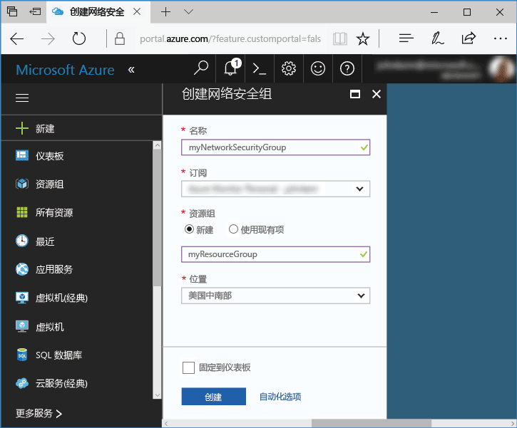
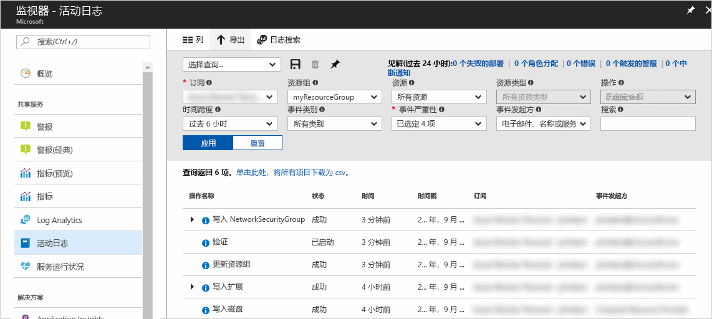
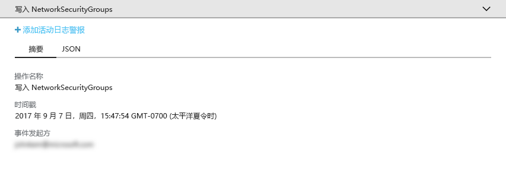
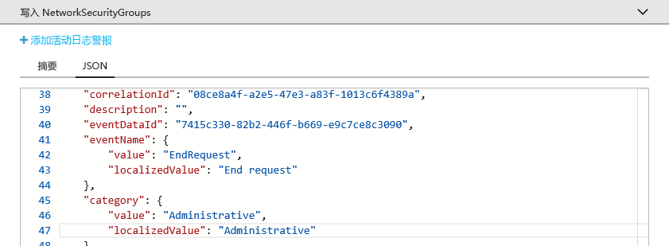
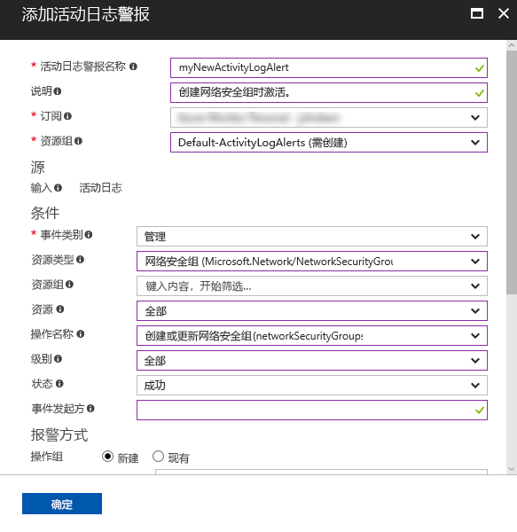
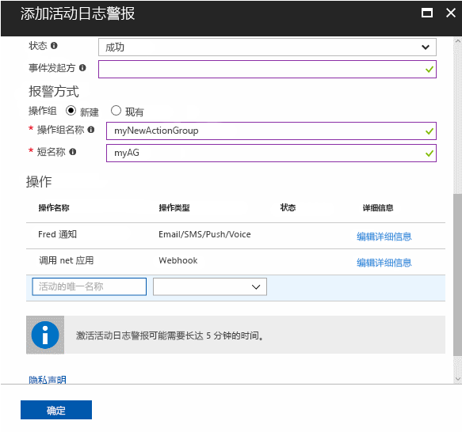

# 审核和接收关于 Azure 订阅中重要操作的通知

Azure 活动日志提供 Azure 中订阅级别事件的历史记录。 它提供有关由谁创建、更新或删除什么资源，以及何时进行操作的信息。 可创建活动日志警报，以便在发生与警报条件匹配的活动时接收电子邮件、短信或 webhook 通知。 此快速入门逐步介绍如何创建简单的网络安全组、浏览活动日志了解发生的事件，然后创建活动日志警报，以便在将来创建任何网络安全组时收到通知。

如果你还没有 Azure 订阅，可以在开始前创建一个[免费](https://azure.microsoft.com/free/)帐户。

## 登录到 Azure 门户

登录到 [Azure 门户](https://portal.azure.com/)。

## 创建网络安全组

1. 单击 Azure 门户左上角的“创建资源”按钮。

2. 选择“网络”、“网络安全组”。

3. 输入“myNetworkSG”作为“名称”，并创建名为“myResourceGroup”的新资源组。 单击“创建”  按钮。

    

## 在门户中浏览活动日志

活动日志中现已添加了一个事件，它描述了网络安全组的创建。 请参考以下说明来识别该事件。

1. 单击左侧导航列表中的“监视器”按钮。 随即打开“活动日志”部分。 此部分包含用户对订阅中资源执行的所有操作的历史记录，可按多个属性（如“资源组”、“时间范围”和“类别”）进行筛选。

2. 在“活动日志”部分，单击“资源组”下拉列表并选择“myResourceGroup”。 将“时间范围”下拉列表更改为“最近 1 个小时”。 单击“应用” 。

    

3. 在显示的事件表中，单击“Write NetworkSecurityGroups”事件。

## 在活动日志中浏览事件

出现的部分包含已执行操作的基本详细信息，包括名称、时间戳以及执行该操作的用户或应用程序。

单击“JSON”选项卡查看完整事件详细信息。 这包括用户或应用程序执行操作的授权方式、事件类别和级别，以及操作状态的详细信息。

## 创建活动日志警报

1. 单击“摘要”选项卡返回事件摘要。

2. 在出现的摘要部分，单击“添加活动日志警报”。

    

3. 在出现的部分，为活动日志警报添加名称和说明。

4. 在“条件”下，确保将“事件类别”设置为“管理”，“资源类型”设置为“网络安全组”，“操作名称”设置为“创建或更新网络安全组”，“状态”设置为“成功”，并将所有其他条件字段留空或设置为“全部”。 条件定义了用于确定在活动日志中出现新事件时是否应激活警报的规则。

    

5. 在“警报方式”下，选择“新建”操作组，并为操作组提供“名称”和“短名称”。 操作组定义警报被激活（如果条件匹配新事件）时采取的一系列操作。

6. 在“操作”下，通过提供操作的“名称”、“操作类型”（例如，电子邮件或短信）和该特定操作类型的“详细信息”（例如，webhook URL、电子邮件地址或短信号码）来添加一个或多个操作。

    

7. 单击“确定”保存活动日志警报。

## 测试活动日志警报

> [!NOTE]
> 需要大约 10 分钟才能完全启用活动日志警报。 在活动日志警报完全启用之前发生的新事件不会生成通知。
>
>

若要测试警报，请重复上述部分至“创建网络安全组”，但为该网络安全组提供不同的名称，并重复使用现有资源组。 几分钟后，你将收到网络安全组已创建的通知。

## 清理资源

不再需要资源组和网络安全组时，可将其删除。 为此，请在门户顶部的搜索框中键入已创建资源组的名称，然后单击该资源组名称。 在显示的部分，单击“删除资源组”按钮，键入资源组名称，然后单击“删除”。

## 后续步骤

在本快速入门中，用户执行了生成活动日志事件的操作，然后创建了活动日志警报，以便在将来再次发生此操作时收到通知。 然后再次执行该操作来测试警报。 Azure 可以提供过去 90 天内的活动日志事件。 如果需要保留超过 90 天的事件，请尝试将活动日志数据与其他监视数据一并存档。

> [!div class="nextstepaction"]
> [存档监视数据](./monitor-tutorial-archive-monitoring-data.md)
