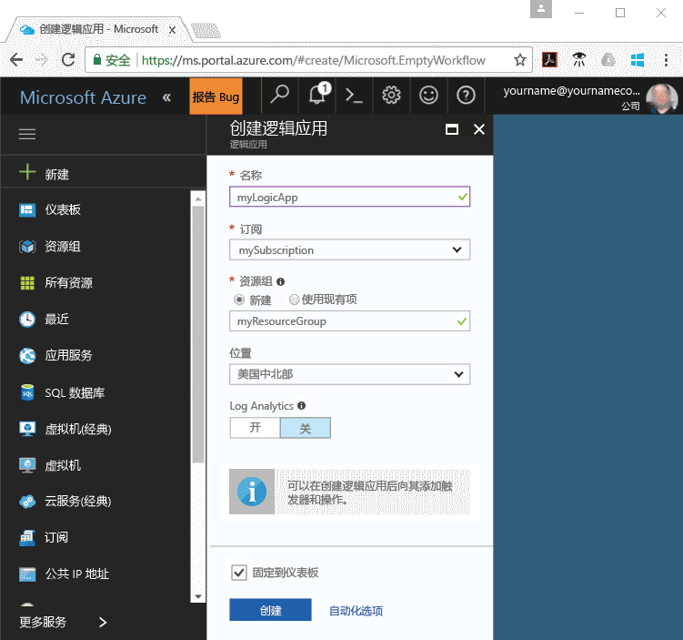
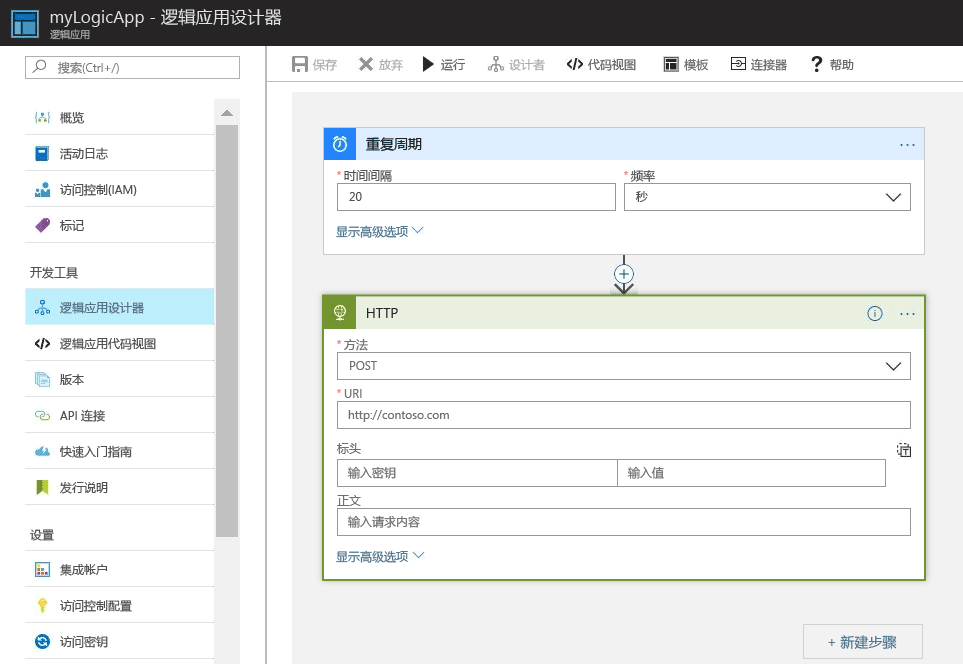
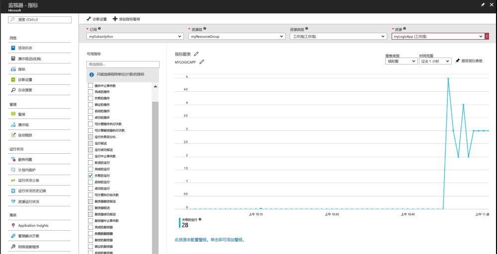
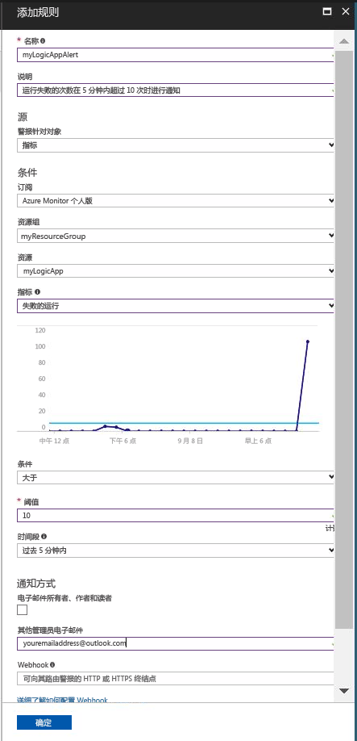

# 当指标值满足条件时接收通知

Azure Monitor 使指标可用于许多 Azure 资源。 这些指标传达相关资源的性能和运行状况。 在许多情况下，指标值可以指出某个资源发生错误。 可以创建指标警报以监视异常行为，并在异常行为发生时收到通知。 本快速入门分步介绍了如何创建逻辑应用、创建作业，并使逻辑应用的指标可视化。 然后，它将完成创建警报，并接收逻辑应用资源的指标的通知。

有关指标和指标警报的详细信息，请参阅 [Azure Monitor 指标概述](./monitoring-overview-metrics.md)和 [Azure Monitor 警报概述](./monitoring-overview-alerts.md)。 

如果你还没有 Azure 订阅，可以在开始前创建一个[免费](https://azure.microsoft.com/free/)帐户。

## 登录到 Azure 门户

登录到 [Azure 门户](https://portal.azure.com/)。

## 创建逻辑应用

1. 单击 Azure 门户左上角的“新建”按钮。

2. 搜索并选择“逻辑应用”。 创建名为“myResourceGroup”的新资源组。使用默认位置。 单击“创建”  按钮。

3. 输入逻辑应用信息，并选中“固定到仪表板”选项。 完成后，单击“创建”。

      

4. 逻辑应用应固定到仪表板。 通过单击导航到逻辑应用。

5. 在“逻辑应用”面板中，选择“逻辑应用设计器”

       

6. 按下图所示设置值。

    。 

7. 在设计器中，选择“重复”触发器。

8. 设置值为 20 且频率为秒的间隔，确保逻辑应用每 20 秒触发一次。

9. 单击“新建步骤”按钮，然后选择“添加操作”。

10. 选择“HTTP”选项，然后选择“HTTP-HTTP”。

11. 将“方法”设置为 POST，并将“Uri”设置为所选的 Web 地址。

12. 单击“保存” 。

## 查看逻辑应用的指标

1. 单击左侧导航窗格中的“监视”选项。

2. 选择“指标”选项卡，填写逻辑应用的“订阅”、“资源组”、“资源类型”和“资源”信息。

3. 在指标列表中，选择“启动的运行数”。

4. 修改图表的“时间范围”，以显示过去一小时的数据。

5. 此时应该可以看到一张图表，上面绘制了逻辑应用在过去一小时启动的运行总数。

    

## 为逻辑应用创建指标警报

1.  在指标面板的右上角部分中，单击“添加指标警报”按钮。

2. 将指标警报命名为“myLogicAppAlert”，并为警报提供简短介绍。

3. 将指标警报的“条件”设置为“大于”，将“阈值”设置为“10”，并将“时段”设置为“过去 5 分钟”。

4. 最后，在“其他管理员电子邮件”下输入你的电子邮件地址。 此警报确保当逻辑应用在 5 分钟内出现超过 10 次失败的运行时，你将收到电子邮件。

    

## 接收逻辑应用的指标警报通知
1. 不久之后，就会收到来自“Microsoft Azure 警报”的电子邮件，通知你警报“已激活”。

2. 返回逻辑应用，将重复触发器修改为间隔为 1 且频率为小时。

3. 不久之后，就会收到来自“Microsoft Azure 警报”的电子邮件，通知你警报“已解决”。

## 清理资源

本教程系列中的其他快速入门基于本快速入门。 如果计划继续使用后续的快速入门或相关教程，请勿清除在本快速入门中创建的资源。 如果不打算继续，请在 Azure 门户中执行以下步骤来删除此快速入门创建的所有资源。

1. 在 Azure 门户的左侧菜单中，单击“监视”。

2. 选择“警报”选项卡，查找在本快速入门指南中创建的警报，然后单击它。

3. 在指标警报面板中，单击“删除”。

4. 在 Azure 门户的左侧菜单中，搜索“逻辑应用”，然后单击“逻辑应用”。

5. 在面板上的文本框中，单击在本快速入门指南中创建的逻辑应用，然后单击“删除”。

## 后续步骤

在本快速入门中，已了解如何为资源创建指标警报。 有关指标警报的详细信息，请单击查看我们关于警报的概述。

> [!div class="nextstepaction"]
> [Azure Monitor 订阅操作警报](./monitor-quick-audit-notify-action-in-subscription.md )

