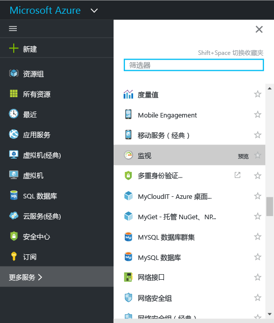
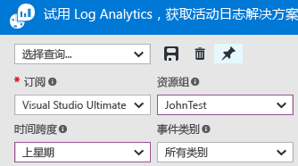
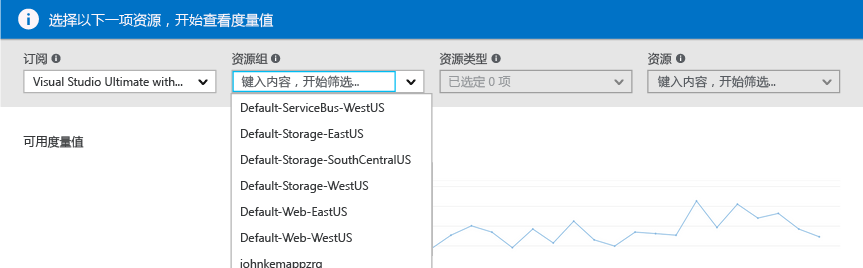
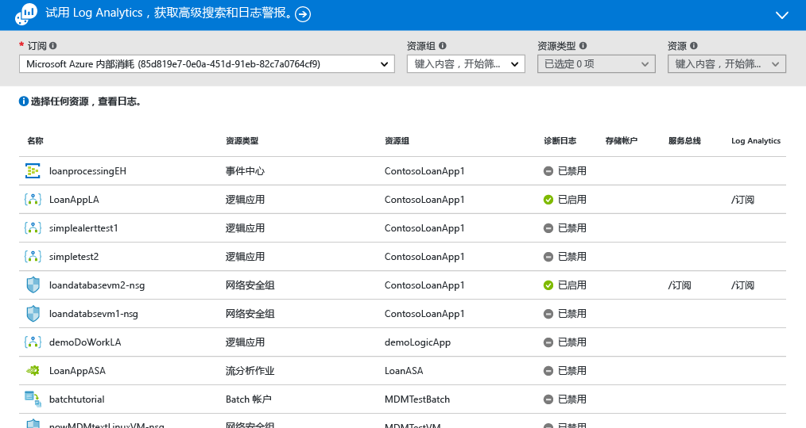
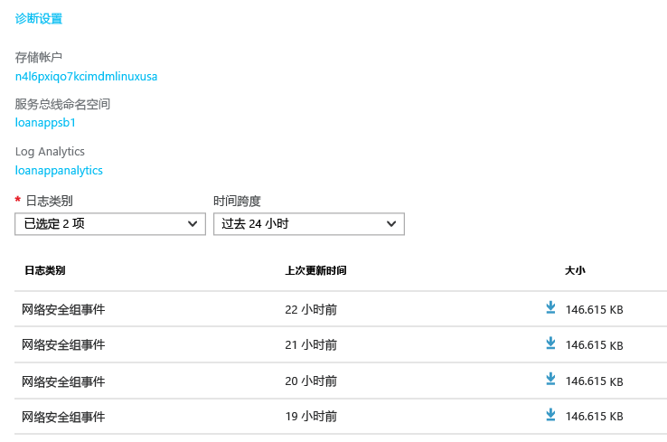
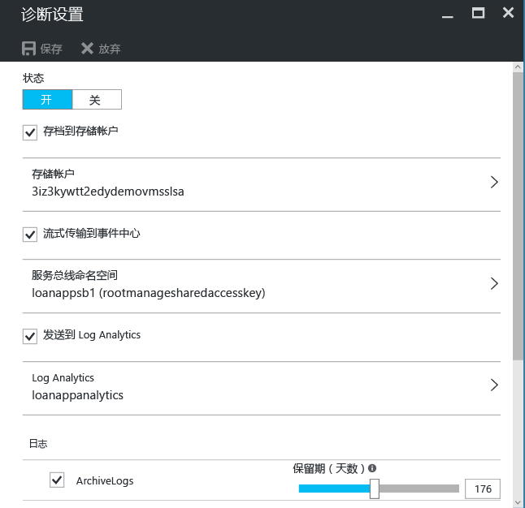
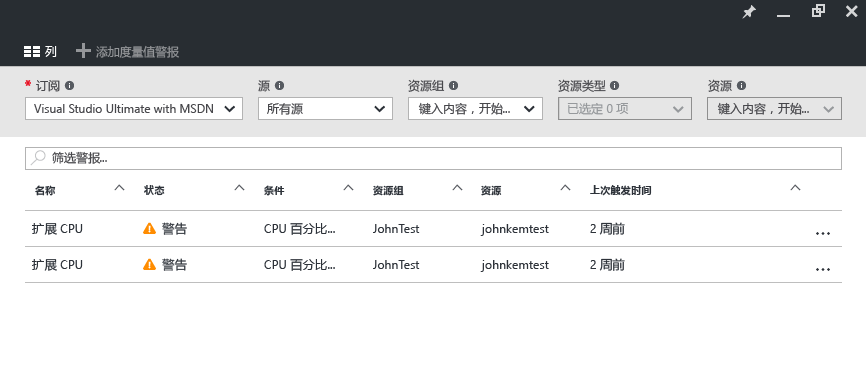
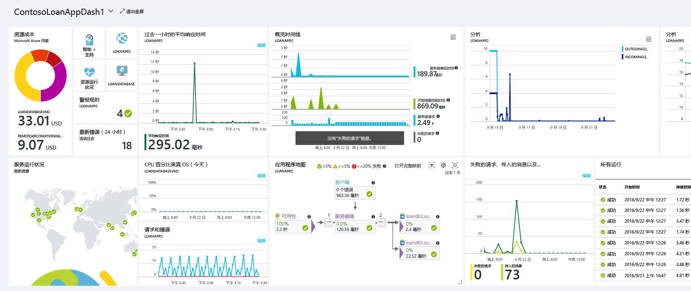

# Azure 监视器入门
Azure 监视器是一款平台服务，提供了用于监视 Azure 资源的单一源。 通过 Azure 监视器，可直观显示、查询、路由和存档来自 Azure 内部资源的度量和日志并对其采取操作。 可使用监视器门户边栏选项卡、[监视器 PowerShell Cmdlet](insights-powershell-samples.md)、[跨平台 CLI](insights-cli-samples.md) 或 [Azure 监视器 REST API](https://msdn.microsoft.com/library/dn931943.aspx) 来处理此数据。 在本文中，我们将使用门户进行演示，了解 Azure 监视器的几个关键组件。

## 演练
1. 在门户中，导航到“更多服务”并找到“监视器”选项。 单击星型图标将此选项添加到收藏夹列表中，以便可始终从左侧导航栏轻松访问此选项。

    
2. 单击“监视器”选项打开“监视器”边栏选项卡。 此边栏选项卡将所有监视设置和数据汇聚到一个合并视图中。 首次打开的是“活动日志”部分。

    

    Azure 监视器有 3 个基本类别的监视数据：**活动日志**、**度量**和**诊断日志**。
3. 单击“活动日志”，确保显示活动日志部分。

    

    [活动日志](monitoring-overview-activity-logs.md)描述了对订阅资源执行的所有操作。 通过活动日志，可确定对于订阅资源上的任何创建、更新或删除操作，“谁何时执行什么操作”。 例如，活动日志会显示某 Web 应用何时停止以及谁停止了该应用。 活动日志事件存储在平台中，可在 90 天内进行查询。

    可创建并保存常见筛选器的查询，然后将最重要的查询固定到门户仪表板中，便于始终了解是否出现了符合条件的事件。
4. 将视图筛选范围定为上周的特定资源组，然后单击“保存”按钮。

    
5. 现在，单击“大头针”按钮。

    

    本演练中的大部分视图均可固定到仪表板中。 这有助于为服务上的操作数据创建单一信息源。
6. 返回到仪表板。 现在可看到仪表板中显示了查询（及结果数）。 如果想快速查看订阅中最近发生的任何重大操作（例如，分配了新角色或删除了 VM），这非常有用。

    
7. 返回到“监视器”磁贴并单击“度量”部分。 首先需要使用边栏选项卡顶部的下拉选项进行筛选和选择，选择一个资源。

    

    所有 Azure 资源都会发出[**度量**](monitoring-overview-metrics.md)。 该视图将所有度量汇聚在单个面板中，便于轻松了解当前资源的执行方式。 此外，请单击“指标(预览版)”选项卡，查看我们[全新的指标图表体验](https://aka.ms/azuremonitor/new-metrics-charts)。
8. 选中某项资源后，边栏选项卡左侧会立即显示所有可用度量。 可以选择指标来立即绘制多个指标的图，并修改图类型和时间范围。 还可以查看在此资源上设置的所有指标警报。

    

   > [!NOTE]
   > 某些度量仅可通过在资源上启用 [Application Insights](../application-insights/app-insights-overview.md) 和/或 Microsoft/Linux Azure 诊断进行使用。
   >
   >
9. 如果图表令你满意，可使用“大头针”按钮将其固定到仪表板。
10. 返回到“监视器”边栏选项卡并单击“诊断日志”。

    

    [诊断日志](monitoring-overview-of-diagnostic-logs.md)是资源发出的日志，提供与该特定资源的操作相关的数据。 例如，网络安全组规则计数器和逻辑应用工作流日志是诊断日志的两种类型。 这些日志可存储在存储帐户中，流式传输到事件中心，并/或可发送到 [Log Analytics](../log-analytics/log-analytics-overview.md)。 Log Analytics 是 Microsoft 的操作智能产品，用于高级搜索和警报。

    在门户中，可查看和筛选订阅中所有资源的列表，确定其是否启用了诊断日志。
11. 单击诊断日志边栏选项卡中的资源。 如果诊断日志当前存储在存储帐户中，则会显示可直接下载的每小时日志的列表。

    

    还可单击“诊断设置”，由此设置或修改到存储帐户的存档设置、流式处理到事件中心，或者发送到 Log Analytics 工作区。

    

    如果已将诊断日志设置发到 Log Analytics，则可在门户的“日志搜索”部分中搜索它们。
12. 导航到“监视器”边栏选项卡的“警报”部分。

    

    可在此处管理 Azure 资源上的所有[**警报**](monitoring-overview-alerts.md)。 这些警报包括与指标、活动日志事件、Application Insights Web 测试（位置）和 Application Insights 主动诊断相关的警报。 警报还会触发电子邮件发送，或者将 HTTP POST 发送到 webhook URL。
13. 单击“添加度量警报”以创建警报。

    

    然后可将警报固定到仪表板，便于随时轻松查看其状态。

    Azure Monitor 现还具有[准实时指标警报](https://aka.ms/azuremonitor/near-real-time-alerts)（预览版），最低可按每分钟的频率进行评估！
    
14. “监视器”部分还包括指向 [Application Insights](../application-insights/app-insights-overview.md) 应用程序和 [Log Analytics](../log-analytics/log-analytics-overview.md) 管理解决方案的链接。 此外的这些 Microsoft 产品均与 Azure 监视器紧密集成。
15. 如果当前未使用 Application Insights 或 Log Analytics，则 Azure 监视器可能与你当前的监视、日志记录和警报产品建立了合作关系。 请参阅[合作伙伴页面](monitoring-partners.md)，了解集成方式的完整列表和说明。

通过按照上述步骤操作并将所有相关磁贴固定到仪表板，可创建应用程序和基础结构的综合视图，如下所示：

## 后续步骤
* 请参阅 [Azure 监视器概述](monitoring-overview.md)
