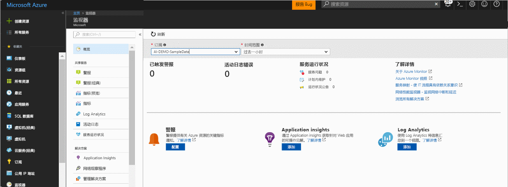
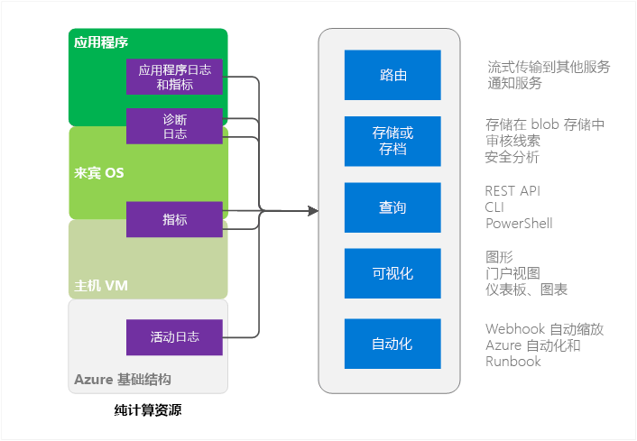
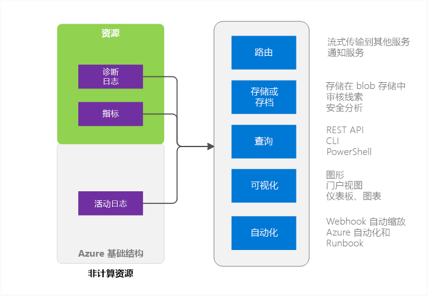

# Azure Monitor 概述
本文概述了 Microsoft Azure 中的 Azure Monitor 服务。 它讨论了 Azure Monitor 可以执行的工作并指出了可以在哪里找到有关如何使用 Azure Monitor 的其他信息。  如果喜欢观看视频介绍，请参阅本文底部“后续步骤”部分中的链接。 

## Azure Monitor 和 Microsoft 的其他监视产品
Azure Monitor 针对 Microsoft Azure 中的大多数服务提供基本级别的基础结构指标和日志。 如果 Azure 服务尚未将数据置于 Azure Monitor 中，今后将会把数据置于其中。

Microsoft 还提供了其他产品和服务，用以为还具有本地安装的开发人员、DevOps 或 IT 运营人员提供其他监视功能。 若要了解这些不同的产品和服务以及它们如何协作，请参阅 [Microsoft Azure 中的监视功能](monitoring-overview.md)。

## 门户概述页

Azure Monitor 的登录页有助于用户： 
- 了解 Azure 提供的监视功能。
- 发现、配置和载入 Azure 的平台和高级监视功能。

虽然 Azure Monitor 服务已发布，登录概述页仍处于预览状态。 

此页是导航的起点，包括载入。 该页显示来自不同服务且值得注意的特选问题，用户可在上下文中导航到这些问题。
 

打开页面时，可在有权读取的订阅之间进行选择。 对于所选订阅，可看到：

- 已触发的警报和警报源 - 此表显示摘要计数、警报源以及所选时间段触发的警报次数。 它同时适用于指标警报和活动日志警报。
- 活动日志错误 - 如果任何 Azure 资源日志事件具有严重错误级别，可查看高级计数并单击进入活动日志页来调查每个事件。
- Azure 服务运行状况 - 可查看服务运行状况服务问题、计划内维护事件和运行状况咨询数。 当 Azure 基础结构中的问题影响到个人的服务时，Azure 服务运行状况会提供个性化的信息。  有关详细信息，请参阅 [Azure 服务运行状况](../service-health/service-health-overview.md)。  
- Application Insights - 查看当前订阅中每个 AppInsights 资源的 KPI。 KPI 进行了优化，用于在 ASP.NET Web 应用、Java、节点和常规跨应用程序类型间进行服务器端应用程序监视。 KPI 包括请求速率、响应持续时间、故障率和可用性 % 的指标。 

如果尚未载入 Log Analytics 或 Application Insights，或者如果当前订阅中尚未配置任何 Azure 警报，此页面会提供链接以开始载入过程。

## Azure Monitor 源 - 计算子集

此处的计算服务包括 
- 云服务 
- 虚拟机 
- 虚拟机规模集 
- Service Fabric

### 应用程序 - 诊断日志、应用程序日志和指标
在计算模型中，应用程序可以基于来宾 OS 运行。 应用程序会发出自己的日志和指标集。 Azure Monitor 依赖于 Azure 诊断扩展（Windows 或 Linux）来收集大多数应用程序级指标和日志。 类型包括

* 性能计数器
* 应用程序日志
* Windows 事件日志
* .NET 事件源
* IIS Logs
* 基于清单的 ETW
* 故障转储
* 客户错误日志

如果没有诊断扩展，则只有少数指标（例如 CPU 使用率）可用。 

### 宿主和来宾 VM 指标
前面列出的计算资源具有它们与之交互的专用宿主 VM 和来宾 OS。 宿主 VM 和来宾 OS 是 Hyper-V 虚拟机监控程序模型中的根 VM 和来宾 VM 的等效项。 可以收集关于这两者的指标。 还可以收集关于来宾 OS 的诊断日志。   

### 活动日志
可以在活动日志（以前称为操作日志或审核日志）中搜索 Azure 基础结构所看到的资源的信息。 日志包含多种信息，例如创建或销毁资源的时间。  有关详细信息，请参阅[活动日志概述](monitoring-overview-activity-logs.md)。 

## Azure Monitor 源 - 所有其他项

### 资源 - 指标和诊断日志
可收集的指标和诊断日志因资源类型而异。 例如，Web 应用提供有关磁盘 IO 和 CPU 百分比的统计信息。 对于服务总线队列来说，这些统计信息不存在，该队列提供的是队列大小和消息吞吐量之类的指标。 [支持的指标](monitoring-supported-metrics.md)中提供了每种资源的可收集指标的列表。 

### 宿主和来宾 VM 指标
因为在资源与特定宿主 VM 或来宾 VM 之间不一定存在 1:1 映射关系，因此，这些指标不可用。

### 活动日志
活动日志与针对计算资源的活动日志相同。  

## 用于监视数据
在收集数据后，可以使用该数据在 Azure Monitor 中执行以下操作。

### 路由
可以将监视数据流式传输到其他位置。 

示例包括：

- 发送到 Application Insights，以便使用其更加丰富的可视化和分析工具。
- 发送到事件中心，以便将其路由到第三方工具。 

### 存储和存档
某些监视数据已存储并且在设定的时间段内在 Azure Monitor 中可用。 
- 指标存储 30 天。 
- 活动日志条目存储 90 天。 
- 诊断日志根本不存储。 

如果希望将数据存储比上面列出的时间段更长的时间，可以使用 Azure 存储。 监视数据根据你设置的保留策略保留在存储帐户中。 不需要为数据在 Azure 存储中占用的空间付款。 

可以通过多种方式使用该数据：

- 写入以后，即可让 Azure 内外的其他工具读取和处理该数据。
- 可以将该数据下载到本地进行本地存档，也可以更改云中的保留策略，让数据保留更长的时间。  
- 可以无限期地将数据保留在 Azure 存储中以进行存档。 

### 查询
可以使用 Azure Monitor REST API、跨平台的命令行接口 (CLI) 命令、PowerShell cmdlet 或 .NET SDK 访问系统或 Azure 存储中的数据

示例包括：

* 获取所编写的自定义监视应用程序的数据
* 创建自定义查询，将数据发送到第三方应用程序。

### 可视化
以图形和图表形式将监视数据可视化可以帮助你更快地查明趋势，其速度远非单纯查看数据可比。  

可视化方法包括：

* 使用 Azure 门户
* 将数据路由到 Azure Application Insights
* 将数据路由到 Microsoft PowerBI
* 通过实时数据流将数据路由到第三方可视化工具，或者让第三方可视化工具从 Azure 存储中读取存档。

### 自动化
可以使用监视数据触发警报甚至整个过程。 示例包括：

* 使用数据根据应用程序负载自动缩放计算实例数。
* 当某个指标超出预定阈值时发送电子邮件。
* 调用 Web URL (webhook)，在 Azure 外部系统中执行操作。
* 在 Azure 自动化中启动 Runbook，执行各种任务

## 访问 Azure Monitor 的方法
一般情况下，可以使用下述方法之一操作数据的跟踪、路由和检索。 并非所有方法都适用于所有操作或数据类型。

* [Azure 门户](https://portal.azure.com)
* [PowerShell](insights-powershell-samples.md)  
* [跨平台的命令行接口 (CLI)](insights-cli-samples.md)
* [REST API](https://docs.microsoft.com/rest/api/monitor/)
* [.NET SDK](http://www.nuget.org/packages/Microsoft.Azure.Management.Monitor)

## 后续步骤
详细了解以下内容
- Azure Monitor 的视频演练位于  
[Azure Monitor 入门](https://channel9.msdn.com/Blogs/Azure-Monitoring/Get-Started-with-Azure-Monitor)。 
- [探索 Microsoft Azure 监视和诊断](https://channel9.msdn.com/events/Ignite/2016/BRK2234)和[来自 Ignite 2016 的视频中的 Azure Monitor](https://myignite.microsoft.com/videos/4977) 提供了介绍可使用 Azure Monitor 的方案的视频。
- 根据 [Azure Monitor 入门](monitoring-get-started.md)中的说明浏览 Azure Monitor 界面
- 如果要尝试诊断云服务、虚拟机、虚拟机规模集或 Service Fabric 应用程序中的问题，请设置 [Azure 诊断扩展](../azure-diagnostics.md)。
- [Application Insights](https://azure.microsoft.com/documentation/services/application-insights/) 如果要尝试诊断应用服务 Web 应用中的问题。
- [Azure 存储故障诊断](../storage/common/storage-e2e-troubleshooting.md) 在使用存储 Blob、表或队列的情况下。
- [Log Analytics](https://azure.microsoft.com/documentation/services/log-analytics/) 和 [Operations Management Suite](https://www.microsoft.com/oms/)
