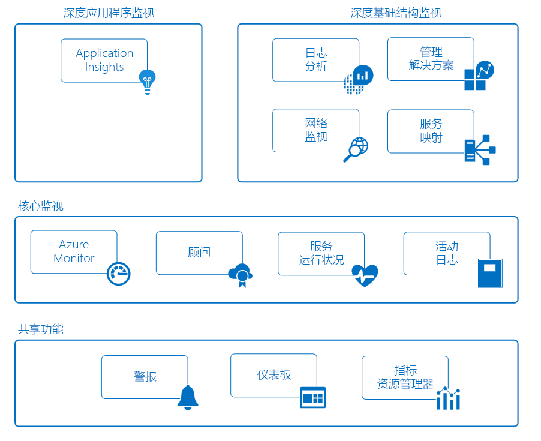

# 监视 Azure 应用程序和资源

监视是一种数据收集和分析操作，用于确定商业应用程序及其所依赖资源的性能、运行状况和可用性。 有效的监视策略有助于了解应用程序组件的详细运行状况， 并且还可以主动向你发送关键情况的通知，让你在这些情况成为问题之前解决它们，从而提高运行时间。

Azure 包括多项可以在监视空间单独执行特定角色或任务的服务。 这些服务组合在一起就可以提供一个全面的解决方案，用于从应用程序以及支持应用程序的 Azure 资源收集遥测数据，对这些数据进行分析并执行操作。 这些服务还监视关键的本地资源，以提供混合监视环境。 为应用程序开发完整监视策略的第一步是了解可用的工具和数据。

下图显示的是这些组件的概念视图，它们共同作用，对 Azure 资源进行监视。 以下部分介绍这些组件，并提供了详细技术信息的链接。

## 共享功能
核心监视服务与深度监视服务共享功能，从而提供以下功能。

### 警报
[Azure 警报](../monitoring-and-diagnostics/monitoring-overview-alerts.md)会主动发送有关关键情况的通知，并可能采取纠正措施。 警报规则可使用来自多个源（包括指标和日志）的数据。 它们使用[操作组](../monitoring-and-diagnostics/monitoring-action-groups.md)，其中包含唯一的收件人集合，以及用于响应警报的操作。 根据自身需求，可使用 Webhook 让警报启动外部操作，并将其与 ITSM 工具集成。

### 仪表板
可以使用 [Azure 仪表板](../azure-portal/azure-portal-dashboards.md)，将不同类型的数据合并到 [Azure 门户](https://portal.azure.com)的单个窗格中， 然后将仪表板与其他 Azure 用户共享。

例如，可以创建一个组合了以下元素的仪表板：
- 用于显示指标图的磁贴
- 包含活动日志的表
- 由 Application Insights 提供的使用情况图表
- Log Analytics 中的日志搜索的输出

还可以将 Log Analytics 数据导出到 [Power BI](https://docs.microsoft.com/power-bi/)。 可以在其中利用其他可视化效果。 也可将数据提供给组织内外的其他人。

### 指标资源管理器
[指标](../monitoring-and-diagnostics/monitoring-overview-metrics.md)是由 Azure 资源生成的数值，用于了解资源的操作情况和性能。 可以通过指标资源管理器向 Log Analytics 发送指标，以便使用来自其他源的数据进行分析。

## 核心监视
核心监视提供对 Azure 资源的基本必要的监视。 这些服务有一个最低配置要求，并收集高级监视服务所使用的核心遥测数据。    

### Azure 监视器
使用 [Azure Monitor](../monitoring-and-diagnostics/monitoring-overview-azure-monitor.md) 可收集[指标](../monitoring-and-diagnostics/monitoring-overview-metrics.md)、[活动日志](../monitoring-and-diagnostics/monitoring-overview-activity-logs.md)和[诊断日志](../monitoring-and-diagnostics/monitoring-overview-of-diagnostic-logs.md)，为 Azure 服务启用核心监视。 例如，可以通过活动日志了解新资源的创建或修改时间。

可通过指标获取不同资源（甚至包括虚拟机中的操作系统）的性能统计信息。 可以使用 Azure 门户中的某个资源管理器查看此数据，还可以基于这些指标创建警报。 Azure Monitor 提供最快的指标管道（5 分钟乃至 1 分钟），因此应将其用于时间关键型警报和通知。

还可将这些指标和日志发送至 Azure Log Analytics 进行趋势分析和详细分析，或创建其他警报规则以主动通知你由该分析得出的关键问题。  

> [!NOTE]
> 当前不支持通过诊断设置将多维指标发送到 Log Analytics。 多维指标将按平展后的单维指标导出，并跨维值聚合。
>
> *例如*：可以基于每个队列级别浏览和绘制事件中心上的“传入消息”指标。 但是，当导出到 Log Analytics 时，该指标将表示为事件中心的所有队列中的所有传入消息。
>
>

### Azure 顾问
[Azure 顾问](../advisor/advisor-overview.md)可持续监视资源配置和使用情况遥测。 然后，它会根据最佳做法提供个性化的建议。 采纳这些建议有助于改善支持应用程序的资源的性能、安全性和可用性。

### 服务运行状况
应用程序的运行状况取决于其所依赖的 Azure 服务。 [Azure 服务运行状况](../service-health/service-health-overview.md)可以标识 Azure 服务存在的可能影响应用程序的任何问题。 服务运行状况还有助于对计划性维护进行计划。

### 活动日志
[活动日志](../monitoring-and-diagnostics/monitoring-overview-activity-logs.md)提供有关 Azure 资源操作的数据。 此信息包括：
- 对资源进行的配置更改。
- 服务运行状况事件。
- 关于如何更好地利用资源的建议。
- 与自动缩放操作相关的信息。

在 Azure 门户中，可以在特定资源的页面上查看该资源的日志。 也可在活动日志资源管理器中查看多个资源提供的日志。

还可向 Log Analytics 发送活动日志条目。 可以在其中使用数据来分析日志。这些数据是通过管理解决方案、虚拟机上的代理和其他源收集的。

## 深度监视服务
下列 Azure 服务提供丰富的功能，用于在更深的层次收集和分析监视数据。 这些服务基于核心监视功能构建，并可利用 Azure 中的常用功能。 它们可以对收集的数据进行深入的分析，并提供有关应用程序和基础结构的独特见解。 它们在面向不同受众的方案上下文中呈现数据。

## 深度应用程序监视
### Application Insights
可以使用 [Azure Application Insights](http://azure.microsoft.com/documentation/services/application-insights) 监视应用程序的可用性、性能和使用情况，不管其是托管在云中还是在本地。

可以通过检测与 Application Insights 配合使用的应用程序来获得深入的见解和实现 DevOps 方案。 可快速确定并诊断错误，无需等待用户报告这些错误。 利用所收集的信息，可作出有关应用程序维护和优化的明智抉择。

Application Insights 提供各种可以与所收集的数据交互的工具。 Application Insights 在公用存储库中存储其数据。 它可以通过 Log Analytics 查询语言充分利用各种共享功能，例如警报、仪表板和深入分析。

## 深度基础结构监视
### Log Analytics
[Log Analytics](http://azure.microsoft.com/documentation/services/log-analytics) 在 Azure 监视中起着核心作用，它可以将来自不同资源（包括非 Microsoft 工具）的数据收集到一个存储库中。 你可以使用强大的查询语言对其中的数据进行分析。

Application Insights 和 Azure 安全中心将数据存储在 Log Analytics 数据存储中，并使用其分析引擎。 数据也是从 Azure Monitor、管理解决方案以及安装在虚拟机（云中或本地）上的代理收集的数据。 可以通过此共享功能全面了解自己的环境。

### 管理解决方案
[管理解决方案](../log-analytics/log-analytics-add-solutions.md)是打包的逻辑集，它提供有关特定应用程序或服务的见解。 它们依赖于 Log Analytics 来存储和分析所收集的监视数据。

管理解决方案可从 Microsoft 或合作伙伴处获得，可用于为各种 Azure 服务和第三方服务提供监视。 监视解决方案的示例包括：
* [容器监视](../log-analytics/log-analytics-containers.md)：有助于查看和管理容器主机。
* [Azure SQL Analytics](../log-analytics/log-analytics-azure-sql.md)：为 Azure SQL 数据库收集和可视化性能指标。

可以在 Azure 门户中的“监视”屏幕下查看所有可用的管理解决方案。

### 网络监视
有几种工具可协同工作监视网络（无论在 Azure 中还是在本地）的各个方面。  

[网络观察程序](../network-watcher/network-watcher-monitoring-overview.md)为 Azure 中的不同网络方案提供基于方案的监视和诊断。 它将数据存储在 Azure 指标和诊断中，供将来进行分析。 它可以与以下解决方案配合使用，监视网络的各个方面。

[网络性能监视器 (NPM)](https://blogs.msdn.microsoft.com/azuregov/2017/09/05/network-performance-monitor-general-availability/) 是一种基于云的网络监视解决方案，用于监视公有云、数据中心和本地环境之间的连接。

[ExpressRoute 监视器](https://azure.microsoft.com/en-in/blog/monitoring-of-azure-expressroute-in-preview/)是一种 NPM 功能，用于通过 Azure ExpressRoute 线路监视端到端连接和性能。

[DNS Analytics](../log-analytics/log-analytics-dns.md) 是一种解决方案，可以根据 DNS 服务器提供与安全、性能和操作相关的见解。

[服务终结点监视](../networking/network-monitoring-overview.md)可以在本地、运营商网络和云/专用数据中心测试应用程序的可访问性并检测性能瓶颈。

### 服务映射
[服务映射](../operations-management-suite/operations-management-suite-service-map.md)通过分析具有不同进程和在其他计算机和外部进程中具有依赖项的虚拟机，提供有关 IaaS 环境的深入见解。 它将事件、性能数据和管理解决方案集成到 Log Analytics 中。 然后，你就可以在每个计算机的上下文中查看该数据及其与环境的其余部分的关系。

服务映射类似于 [Application Insights 中的应用程序映射](../application-insights/app-insights-app-map.md)。 它着重于支持应用程序的基础结构组件。

## 示例方案
以下是高级示例，介绍如何在 Azure 中针对不同的方案使用相应的监视工具。

### 监视 Web 应用程序
可设想一个通过 Azure 应用服务、Azure 存储 和 SQL 数据库在 Azure 中部署的 Web 应用程序。 首先，可在 Azure 门户中找到这些资源的相应页面，然后访问它们的[指标](../monitoring-and-diagnostics/monitoring-overview-metrics.md)和[活动日志](../monitoring-and-diagnostics/monitoring-overview-activity-logs.md)。 请查找关键信息，例如向应用程序发出的请求数和平均响应时间。 另请标识任何配置更改。

然后，请转到门户中的“监视”，同时查看不同资源的指标和日志。 确定这些指标的标准参数以后，请[创建警报规则](../monitoring-and-diagnostics/monitoring-overview-unified-alerts.md)。 当遇到异常情况时（例如，平均响应时间超出阈值），这些规则会主动通知你。 为快速一览应用程序的每日性能，请创建 Azure 仪表板，以便显示代表关键 KPI 的指标图。

要更深入地监视应用程序，请[为应用程序配置 Application Insights](../application-insights/quick-monitor-portal.md)。 现在可以收集更多数据，获取有关应用程序操作和性能的更深入的见解。 Application Insights 可以检测应用组件之间的基础关系， 并可通过[应用程序映射](../application-insights/app-insights-app-map.md)以视觉方式呈现这种关系，同时结合使用[端到端跟踪](../application-insights/app-insights-transaction-diagnostics.md)，精确地对出现问题的组件、依赖项或异常进行诊断。

创建[可用性测试](../application-insights/app-insights-monitor-web-app-availability.md)，主动从不同区域测试应用程序。 为帮助开发者，请[启用 Profiler](../application-insights/enable-profiler-compute.md)，以便跟踪请求和任何细化至特定代码行的异常。 为深入了解应用程序中使用的服务，可添加 [SQL 分析解决方案](../log-analytics/log-analytics-azure-sql.md)，将更多数据收集至 Log Analytics。

如果一段时间后，你决定调查某些时间段网站性能低于阈值的根本原因， 可使用 Log Analytics 编写查询， 将 Application Insights 收集的使用情况和性能数据与支持应用程序的各 Azure 资源的配置和执行数据相关联。

### 监视虚拟机
Azure 中同时运行有 Windows 和 Linux 虚拟机。 可以使用 Azure Monitor 来查看[活动日志](../monitoring-and-diagnostics/monitoring-overview-activity-logs.md)和[主机级别指标](../monitoring-and-diagnostics/monitoring-overview-metrics.md)。 可以向虚拟机添加 [Azure 诊断扩展](../virtual-machines/linux/tutorial-monitoring.md#install-diagnostics-extension)，以便从来宾操作系统收集指标。 然后创建[警报规则](../monitoring-and-diagnostics/monitoring-overview-unified-alerts.md)，以便在基本指标（如处理器利用率和内存）超过阈值时，主动发送通知。

为收集运行有商业应用程序的虚拟机的详细信息，请在每台计算机上[创建 Log Analytics 工作区并启用 VM 扩展](../log-analytics/log-analytics-quick-collect-azurevm.md)。 为应用程序配置[不同数据源的集合](../log-analytics/log-analytics-data-sources.md)，然后[创建视图](../log-analytics/log-analytics-view-designer.md)，以便报告其日常操作和性能。 接着[创建警报规则](../monitoring-and-diagnostics/monitoring-overview-unified-alerts.md)，以便在接收到特定错误事件时，发出通知。

为持续监视已安装代理的运行状况，请添加[代理运行状况管理解决方案](../operations-management-suite/oms-solution-agenthealth.md)。 若要深入了解应用程序，请向虚拟机[添加依赖项代理](../operations-management-suite/operations-management-suite-service-map-configure.md)，以便将虚拟机添加至[服务映射](../operations-management-suite/operations-management-suite-service-map.md)。 服务映射用于发现关键进程，并标识计算机与其他服务之间的连接。

在报告故障后，使用服务映射进行取证，以标识出现问题的特定计算机。 然后创建[针对 Log Analytics 数据的查询](../log-analytics/log-analytics-log-search-new.md)，以便在将来确定问题。 请创建一项警报规则，在检测到相关条件时主动通知你。

## 后续步骤
了解有关以下方面的详细信息：

* [Azure Monitor](https://azure.microsoft.com/en-us/services/monitor/)，以便开始使用核心监视指标和警报。
* [Application Insights](https://azure.microsoft.com/documentation/services/application-insights/)：如果要尝试诊断应用服务 Web 应用中的问题。
* [Log Analytics](https://azure.microsoft.com/documentation/services/log-analytics/)，以便分析所收集的监视数据和日志。
