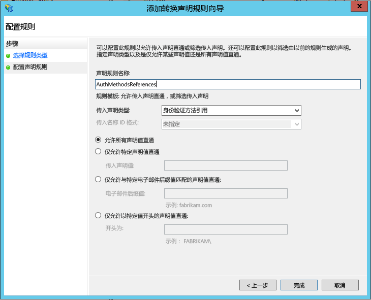

# 将 Azure 多重身份验证服务器与 Windows Server 2012 R2 中的 AD FS 配合使用来保护云资源和本地资源
如果使用 Active Directory 联合身份验证服务 (AD FS)，同时想要保护云或本地资源，则可以将 Azure 多重身份验证服务器配置为与 AD FS 配合使用。 此配置将为重要的终结点触发双重验证。

本文介绍如何将 Azure 多重身份验证服务器与 Windows Server 2012 R2 中的 AD FS 配合使用。 请阅读如何 [将 Azure 多重身份验证服务器与 AD FS 2.0 配合使用来保护云资源和本地资源](multi-factor-authentication-get-started-adfs-adfs2.md)，了解详细信息。

## 使用 Azure 多重身份验证服务器保护 Windows Server 2012 R2 AD FS
安装 Azure 多重身份验证服务器时，可以使用以下选项：

* 在与 AD FS 所在的同一台服务器上本地安装 Azure 多重身份验证服务器
* 在 AD FS 服务器上本地安装 Azure 多重身份验证适配器，在另一台计算机上安装多重身份验证服务器

在开始之前，请注意以下信息：

* 不需要在 AD FS 服务器上安装 Azure 多重身份验证服务器。 但是，必须在运行 AD FS 的 Windows Server 2012 R2 上安装用于 AD FS 的多重身份验证适配器。 可以将服务器安装在其他计算机上（如果支持该服务器版本），将 AD FS 适配器单独安装在 AD FS 联合服务器上。 请参阅以下过程，了解如何单独安装适配器。
* 设计 MFA 服务器 AD FS 适配器时，预期的是 AD FS 可以将信赖方的名称传递给适配器。 然后，可以将信赖方的名称用作应用程序名称。 但是，结果并非如此。 如果组织使用短信或移动应用验证方法，“公司设置”中定义的字符串将包含占位符 <$*application_name*$>。 使用 AD FS 适配器时不会自动替换此占位符。 因此，建议在保护 AD FS 时，从相应的字符串中删除此占位符。
* 用于登录的帐户必须拥有在 Active Directory 服务中创建安全组的用户权限。
* 多重身份验证 AD FS 适配器安装向导将在 Active Directory 的实例中创建名为 PhoneFactor Admins 的安全组。 然后将联合身份验证服务的 AD FS 服务帐户添加到此组。 建议在域控制器上检查是否确实创建了 PhoneFactor Admins 组，以及 AD FS 服务帐户是否是此组的成员。 如果需要，请在域控制器上手动将 AD FS 服务帐户添加到 PhoneFactor Admins 组。
* 请阅读如何 [为 Azure 多重身份验证服务器部署用户门户](multi-factor-authentication-get-started-portal.md)

### 在 AD FS 服务器上本地安装 Azure 多重身份验证服务器
1. 在 AD FS 服务器上下载并安装 Azure 多重身份验证服务器。 请阅读 [Azure 多重身份验证服务器入门](multi-factor-authentication-get-started-server.md)，了解详细信息。
2. 在 Azure 多重身份验证服务器管理控制台中单击“AD FS”图标，然后选择“允许用户注册”和“允许用户选择方法”选项。
3. 选择要为组织指定的其他任何选项。
4. 单击“安装 AD FS 适配器”。
   

5. 如果显示“Active Directory”窗口，则表示两点。 计算机已加入域，但保护 AD FS 适配器与多重身份验证服务之间通信的 Active Directory 配置并未完成。 单击“下一步”自动完成此配置，或者选中“跳过自动 Active Directory 配置并手动配置设置”复选框，然后单击“下一步”。
6. 如果显示“本地组”窗口，则表示两点。 计算机尚未加入域，且保护 AD FS 适配器与多重身份验证服务之间通信的本地组配置未完成。 单击“下一步”自动完成此配置，或者选中“跳过自动本地组配置并手动配置设置”复选框，然后单击“下一步”。
7. 在安装向导中单击“下一步”。 Azure 多重身份验证服务器将创建 PhoneFactor Admins 组，并将 AD FS 服务帐户添加到 PhoneFactor Admins 组。
   

8. 在“启动安装程序”页中单击“下一步”。
9. 在多重身份验证 AD FS 适配器安装程序中，单击“下一步”。
10. 安装完成后，单击“关闭”。
11. 安装适配器后，必须将它注册到 AD FS。 打开 Windows PowerShell 并运行以下命令： 
    `C:\Program Files\Multi-Factor Authentication Server\Register-MultiFactorAuthenticationAdfsAdapter.ps1`
    

12. 若要使用新注册的适配器，请在 AD FS 中编辑全局身份验证策略。 在 AD FS 管理控制台中，转到“身份验证策略”节点。 在“多重身份验证”部分中，单击“全局设置”部分旁边的“编辑”链接。 在“编辑全局身份验证策略”窗口中，选择“多重身份验证”作为其他身份验证方法，然后单击“确定”。 适配器已注册为 WindowsAzureMultiFactorAuthentication。 重新启动 AD FS 服务使注册生效。

现在，多重身份验证服务器已设置为与 AD FS 配合使用的附加身份验证提供程序。

## 使用 Web 服务 SDK 安装 AD FS 适配器的独立实例
1. 在运行多重身份验证服务器的服务器上安装 Web 服务 SDK。
2. 将以下文件从 \Program Files\Multi-Authentication Server 目录复制到要在其上安装 AD FS 适配器的服务器：
   * MultiFactorAuthenticationAdfsAdapterSetup64.msi
   * Register-MultiFactorAuthenticationAdfsAdapter.ps1
   * Unregister-MultiFactorAuthenticationAdfsAdapter.ps1
   * MultiFactorAuthenticationAdfsAdapter.config
3. 运行 MultiFactorAuthenticationAdfsAdapterSetup64.msi 安装文件。
4. 在多重身份验证 AD FS 适配器安装程序中，单击“下一步”开始安装。
5. 安装完成后，单击“关闭”。

## 编辑 MultiFactorAuthenticationAdfsAdapter.config 文件
按照以下步骤编辑 MultiFactorAuthenticationAdfsAdapter.config 文件：

1. 将“UseWebServiceSdk”节点设置为“true”。  
2. 将“WebServiceSdkUrl”的值设置为多重身份验证 Web 服务 SDK 的 URL。 例如：*https://contoso.com/&lt;certificatename&gt;/MultiFactorAuthWebServicesSdk/PfWsSdk.asmx*，其中 certificatename 是证书的名称。  
3. 编辑 Register-MultiFactorAuthenticationAdfsAdapter.ps1 脚本，将 *-ConfigurationFilePath &lt;path&gt;* 添加到 `Register-AdfsAuthenticationProvider` 命令的末尾，其中 *&lt;path&gt;* 是 MultiFactorAuthenticationAdfsAdapter.config 文件的完整路径。

### 使用用户名和密码配置 Web 服务 SDK
有两个选项用于配置 Web 服务 SDK。 第一个选项是使用用户名和密码，第二个选项是使用客户端证书。 有关使用第一个选项，请参阅以下步骤，或跳转到使用第二个选项的步骤。  

1. 将“WebServiceSdkUsername”的值设置为 PhoneFactor Admins 安全组的成员帐户。 使用 &lt;domain&gt;&#92;&lt;user name&gt; 格式。  
2. 将“WebServiceSdkPassword”的值设置为相应的帐户密码。

### 使用客户端证书配置 Web 服务 SDK
如果不想使用用户名和密码，请按照以下步骤来使用客户端证书配置 Web 服务 SDK。

1. 从证书颁发机构为运行 Web 服务 SDK 的服务器获取客户端证书。 了解如何[获取客户端证书](https://technet.microsoft.com/library/cc770328.aspx)。  
2. 将客户端证书导入运行 Web 服务 SDK 的服务器上的本地计算机个人证书存储中。 请确保证书颁发机构的公共证书位于“受信任的根证书”证书存储中。  
3. 将客户端证书的公钥和私钥导出到 .pfx 文件。  
4. 将 Base64 格式的公钥导出到 .cer 文件。  
5. 在服务器管理器中，确认已安装了 Web 服务器 (IIS)\Web 服务器\安全\IIS 客户端证书映射身份验证功能。 如果尚未安装，请选择“添加角色和功能”添加此功能。  
6. 在 IIS Manager 中，在包含 Web 服务 SDK 虚拟目录的网站中单击“配置编辑器”。 请务必选择网站，而不是虚拟目录。  
7. 转到 **system.webServer/security/authentication/iisClientCertificateMappingAuthentication** 部分。  
8. 将“已启用”更改为“true”。  
9. 将 oneToOneCertificateMappingsEnabled 更改为“true”。  
10. 单击 oneToOneMappings 旁的“...”按钮，然后单击“添加”链接。  
11. 打开之前导出的 Base64 .cer 文件。 删除 *-----BEGIN CERTIFICATE-----*、*-----END CERTIFICATE-----* 以及所有换行符。 复制生成的字符串。  
12. 将证书设置为在上一步中复制的字符串。  
13. 将“已启用”更改为“true”。  
14. 将 userName 设置为 PhoneFactor Admins 安全组成员的帐户。 使用 &lt;domain&gt;&#92;&lt;user name&gt; 格式。  
15. 将密码设置为相应的帐户密码，然后关闭“配置编辑器”。  
16. 单击“应用”连接。  
17. 在 Web 服务 SDK 虚拟目录中，双击“身份验证”。  
18. 确认已将 ASP.NET 模拟和基本身份验证设置为“已启用”，并且已将所有其他项设置为“禁用”。  
19. 在 Web 服务器 SDK 虚拟目录中，双击“SSL 设置”。  
20. 将客户端证书设置为“已接受”，然后单击“应用”。  
21. 将之前导出的 .pfx 文件复制到运行 AD FS 适配器的服务器。  
22. 将 .pfx 文件导入本地计算机个人证书存储中。  
23. 右键单击，选择“管理私钥”，然后授予对用于登录到 AD FS 服务的帐户的读取权限。  
24. 打开客户端证书，然后从“详细信息”选项卡中复制指纹。  
25. 在 MultiFactorAuthenticationAdfsAdapter.config 文件中，将“WebServiceSdkCertificateThumbprint”设置为在上一步中复制的字符串。  

最后，若要注册适配器，请在 PowerShell 中运行 \Program Files\Multi-Factor Authentication Server\Register-MultiFactorAuthenticationAdfsAdapter.ps1 脚本。 适配器已注册为 WindowsAzureMultiFactorAuthentication。 重新启动 AD FS 服务使注册生效。

## 使用 AD FS 保护 Azure AD 资源
若要保护云资源，请设置声明规则，以便在用户成功执行双重验证之后，Active Directory 联合身份验证服务能够发出多重身份验证声明。 此声明将传递到 Azure AD。 按照以下过程完成各步骤：

1. 打开“AD FS 管理”。
2. 在左侧选择“信赖方信任”。
3. 右键单击“Microsoft Office 365 标识平台”，然后选择“编辑声明规则...”

   

4. 在“颁发转换规则”上，单击“添加规则”。

   

5. 在“添加转换声明规则向导”上，从下拉列表中选择“传递或筛选传入声明”，然后单击“下一步”。

   

6. 为规则提供一个名称。 
7. 选择“身份验证方法引用”作为传入声明类型。
8. 选择“传递所有声明值”。
    
9. 单击“完成” 。 关闭 AD FS 管理控制台。

## 相关主题
有关疑难解答帮助，请参阅 [ Azure 多重身份验证常见问题](multi-factor-authentication-faq.md)

<!--HONumber=Feb17_HO2-->

