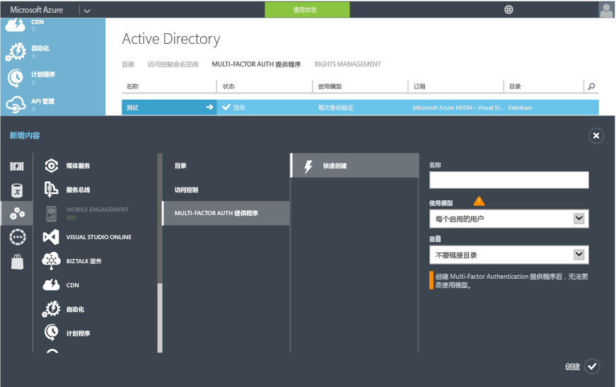

<properties 
	pageTitle="云中的 Azure Multi-Factor Authentication 入门" 
	description="这是与 Azure Multi-Factor Authentication 相关的页面，介绍如何在云中开始使用 Azure MFA。" 
	services="multi-factor-authentication" 
	documentationCenter="" 
	authors="billmath" 
	manager="swadhwa" 
	editor="curtand"/>

<tags 
	ms.service="multi-factor-authentication" 
	ms.date="07/02/2015" 
	wacn.date=""/>

# 云中的 Azure Multi-Factor Authentication 入门

既然我们已经决定要在云中使用 Multi-Factor Authentication，那么现在就开始吧！ 请注意，如果你对 Office 365 使用 Multi-Factor Authentication 或者对 Azure 管理员使用 Multi-Factor Authentication，则可以跳到步骤 3。本文还将说明

1. **注册 Azure 订阅**
	- 如果你还没有 Azure 订阅，需要注册一个订阅。如果你是新手，只是在摸索如何使用 Azure MFA，你可以使用试用版订阅
2. **创建 Multi-Factor Auth 提供程序，或者将 Azure AD Premium 或企业移动套件许可证分配给用户**
	- 你需要创建 Azure Multi-Factor Auth 提供程序并将它分配给目录，或将许可证分配给 Azure AD Premium 或 EMS 用户。Azure Multi-Factor Authentication 已随附在 Active Directory Premium 中，因此也随附在企业移动套件中。如果你有 Azure AD Premium 或 EMS，则不需要创建 Multi-Factor Auth 提供程序，而是要为 Azure AD Premium 或 EMS 用户启用 MFA。需要将 Azure AD Premium 或 EMS 许可证分配给用户，管理员才可以通过管理门户将 MFA 分配给用户。有关将许可证分配给用户的方式，请参阅后面的部分。
3. **为用户启用 Multi-Factor Authentication** 
	- 通过 Office 365 或 Azure 门户为用户启用 Azure MFA。有关操作方法的信息，请参阅后面的部分。
4. **向用户发送电子邮件户，以通知他们有关 MFA 的信息**
	- 在用户为其帐户启用 Multi-Factor Authentication 后，建议你向他们发送一封电子邮件，以通知相关的操作。系统将在用户下次登录时提示完成相应的过程，因此这样能让他们做好心理准备。有关示例电子邮件模板，请参阅后面的部分。

## 创建 Azure Multi-Factor Auth 提供程序
默认情况，具有 Azure Active Directory 租户的全局管理员可以使用 Multi-Factor Authentication。但是，如果要将 Multi-Factor Authentication 扩展到你的所有用户，并且/或者希望全局管理员能够利用管理门户、自定义问候语和报告等功能，你必须购买并配置 Multi-Factor Authentication 提供程序。

### 创建 Multi-Factor Auth 提供程序
--------------------------------------------------------------------------------

1. 以管理员身份登录到 Azure 门户。
2. 在左侧选择“Active Directory”。
3. 在“Active Directory”页的顶部，选择“Multi-Factor Authentication 提供程序”。然后，在底部单击“新建”。
4. 在“应用服务”下选择“Active Auth 提供程序”，然后选择“快速创建”。
5. 填写以下字段，然后选择“创建”。
	1. 名称 - Active Auth 提供程序的名称。
	2. 使用模型 - Multi-Factor Authentication 提供程序的使用模型。
		- 按身份验证 - 购买按身份验证收费的模型。通常用于在应用程序中使用 Azure Multi-Factor Authentication 的方案。
		- 按启用的用户 - 购买按每个启用的用户收费的模型。通常用于 Office 365 等方案。
	2. 目录 - 与 Multi-Factor Authentication 提供程序关联的 Azure Active Directory 租户。请注意以下事项：
		- 无需 Azure AD 目录即可创建 Multi-Factor Auth 提供程序。如果计划仅使用 Azure Multi-Factor Authentication 服务器或 SDK，则此项可以保留为空。
		- 如果你想要将 Multi-Factor Authentication扩展到你的所有用户和/或希望全局管理员能够利用管理门户、自定义问候语和报告等功能，则需要将 Multi-Factor Authentication 提供程序与 Azure AD 目录关联。
		- 仅当要将本地 Active Directory 环境与 Azure AD 目录同步时，才需要 DirSync 或 AAD 同步。如果你只使用不与 Active Directory 的本地实例同步的 Azure AD 目录，则不需要 DirSync 或 AAD 同步。
		

5. 单击“创建”后，将创建 Multi-Factor Authentication 提供程序，此时你会看到以下消息：已成功创建 Multi-Factor Authentication 提供程序。单击“确定”。

## 向用户分配 Azure AD Premium 或企业移动套件许可证

如果你拥有 Azure AD Premium 或企业移动套件，则不需要创建 Multi-Factor Auth 提供程序。你只需将许可证分配给用户，然后就可以开始为用户启用 MFA。

### 分配 Azure AD Premium 或企业移动套件许可证
--------------------------------------------------------------------------------
<ol>

<li>以管理员身份登录到 Azure 门户。</li>
<li>在左侧选择“Active Directory”。</li>
<li>在“Active Directory”页上，双击包含你要启用的用户的目录。</li>
<li>在“目录”页的顶部，选择“许可证”。</li>
<li>在“许可证”页上，选择“Active Directory Premium”或“企业移动套件”，然后单击“分配”。</li>

<li>在对话框中，选择要向其分配许可证的用户，然后单击复选标记图标以保存更改。</li>

## 为用户启用 Multi-Factor Authentication

Azure Multi-Factor Authentication 中的用户帐户具有以下三种不同状态：

状态 | 说明 |受影响的非浏览器应用| 说明 
:-------------: | :-------------: |:-------------: |:-------------: |
已禁用 | 未加入 Multi-Factor Authentication 的新用户的默认状态。|否|用户当前未使用 Multi-Factor Authentication。
Enabled |用户已加入 Multi-Factor Authentication。|否。它们将继续工作，直到注册过程完成。|用户已启用 Multi-Factor Authentication，但尚未完成注册过程。这些用户在下次登录时，系统将提示其完成注册过程。
强制|用户已加入，并已完成使用 Multi-Factor Authentication 前的注册过程。|是的。除非创建及使用应用密码，否则将无法工作。 | 用户不一定完成了注册。如果他们已完成注册过程，表示他们正在使用 Multi-Factor Authentication。否则，在他们下次登录时，系统将提示其完成注册过程
创建身份验证提供程序或者将许可证分配给用户后，接下来我们要为目录中的用户启用 MFA。可以使用以下过程为用户启用 MFA。

### 启用 Multi-Factor Authentication
--------------------------------------------------------------------------------
1.  以管理员身份登录 Azure 管理门户。
2.  在左侧单击“Active Directory”。
3.  在“目录”下单击要为其启用此功能的用户的目录。
4.  在顶部单击“用户”。
5.  在页面底部，单击“管理 Multi-Factor Auth”。
6.  找到要为其启用 Multi-Factor Authentication 的用户。你可能需要在顶部切换视图。确保用户的状态为“已禁用”，并勾选其名称旁边的框。
7.  此时将在右侧显示两个选项：“启用”和“管理用户设置”。单击“启用”。此时将显示一个弹出窗口，其中指定你需要对用户执行的后续步骤。单击“启用 Multi-Factor Auth”。
8.  启用用户后，建议你向这些用户发送一封电子邮件，告知他们如何使用非浏览器应用而不会被锁定。

若要使用 Windows PowerShell 更改用户的状态，可以使用以下代码。你可以将 `$st.State` 更改为前述任一状态。

		$st = New-Object -TypeName Microsoft.Online.Administration.StrongAuthenticationRequirement
		$st.RelyingParty = "*"
		$st.State = “Enabled”
		$sta = @($st)
		Set-MsolUser -UserPrincipalName bsimon@contoso.com -StrongAuthenticationRequirements $sta

## 向最终用户发送电子邮件

启用用户后，建议发送电子邮件给用户，通知他们需要提供联系信息。以下是可以使用的电子邮件模板，其中包含供用户观看的视频链接。

		Subject: ACTION REQUIRED: Your password for Outlook and other apps needs updated

		Body:

		For added security, we have enabled multi-factor authentication for your account. 

		Action Required: You will need to complete the enrollment steps below to make your account secure with multi-factor authentication.  

		What to expect once MFA is enabled:

		Multi-factor authentication requires a password that you know and a phone that you have in order to sign into browser applications and to access Office 365, Azure portals.

		For Office 365 non-browser applications such as outlook, lync, a mail client on your mobile device etc, a special password called an app password is required instead of your account password to sign in. App passwords are different than your account password, and are generated during the multi-factor authentication set up process. 

		Please follow these enrollment steps to avoid interruption of your Office 365 service:

			1.  Sign in to the Office 365 Portal at http://portal.microsoftonline.com.
			2.  Follow the instructions to set up your preferred multi-factor authentication method when signing into Office 365 using a web browser. 
			3.  Create one app password for each device.
			4.  Enter the same app password in all applicable apps on that device e.g. Outlook, Mail client, Lync, Word, Powerpoint, Excel, CRM etc. 
			5.  Update your Office client applications or other mobile applications to use an app password.

		You can visit http://aka.ms/mfasetup to create app passwords or change your MFA Setting.  Please bookmark this.

		NOTE: Before entering an app password, you will need to clear the sign-in information (delete sign-in info), restart the application,   and sign-in with the username and app password. Follow the steps documented : http://technet.microsoft.com/library/dn270518.aspx#apppassword.

		Watch a video showing these steps at http://g.microsoftonline.com/1AX00en/175.

		Best Regards,
		Your Administrator

## 后续步骤
在云中设置 Multi-Factor Authentication 后，接下来可以转到[配置 Azure Multi-Factor Authentication](/documentation/articles/multi-factor-authentication-whats-next) 以继续执行后续步骤。 你可以在其中了解有关报告、欺诈警报、自定义语音消息，以及 Azure Multi-Factor Authentication 提供的所有功能的信息。

<!---HONumber=69-->