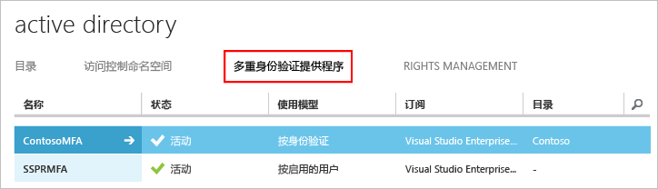
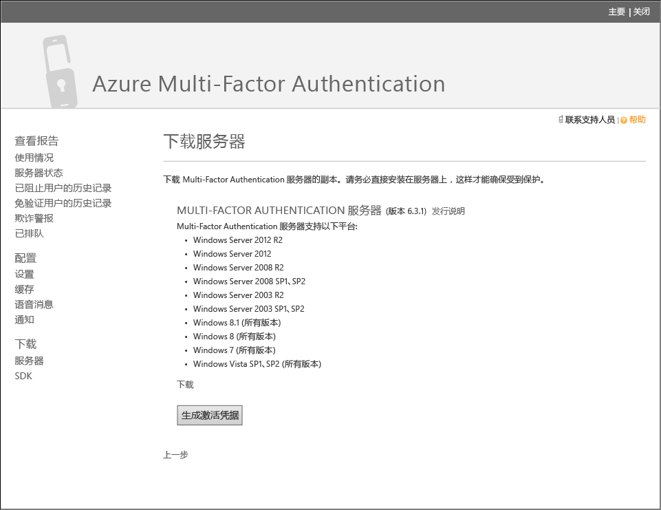
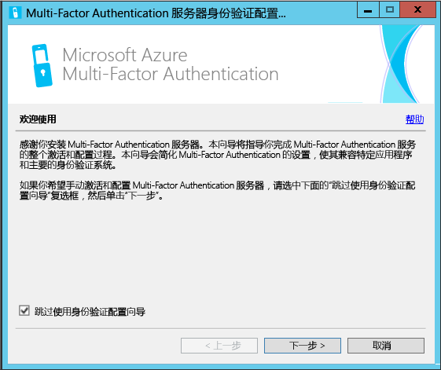
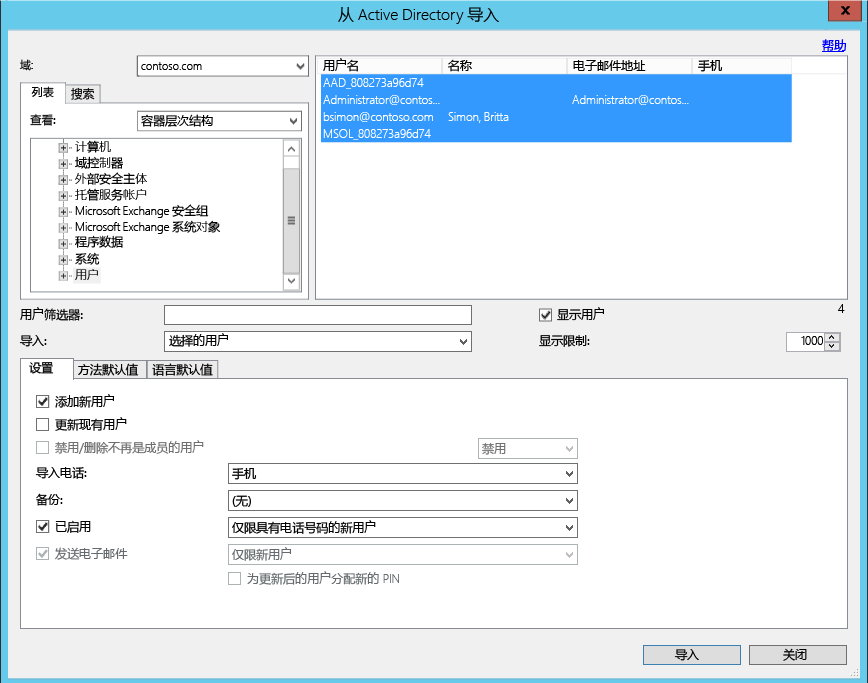
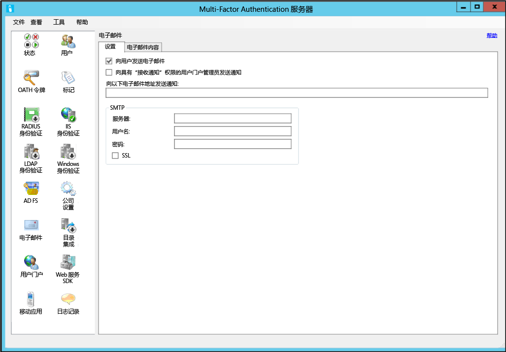
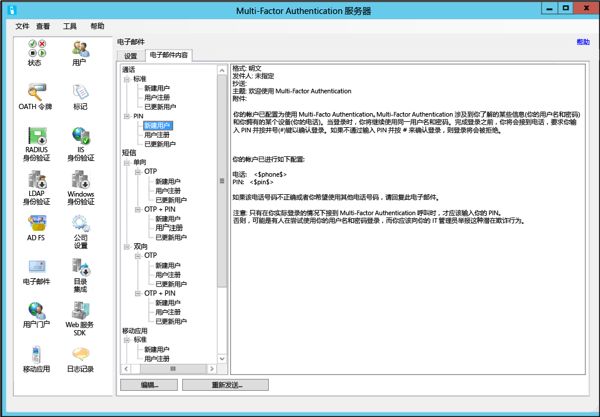

# Azure Multi-Factor Authentication 服务器入门

决定使用本地多重身份验证服务器后，让我们继续下一步。 本页介绍如何全新安装服务器，以及在本地 Active Directory 上对它进行设置。 如果已安装 PhoneFactor 服务器，并正在寻求升级的方法，请参阅[升级到 Azure 多重身份验证服务器](multi-factor-authentication-get-started-server-upgrade.md)；如果你正在寻找有关只安装 Web 服务的信息，请参阅[部署 Azure 多重身份验证服务器移动应用 Web 服务](multi-factor-authentication-get-started-server-webservice.md)。

## 下载 Azure Multi-Factor Authentication 服务器
可以使用两种不同的方法下载 Azure Multi-Factor Authentication 服务器。 两种方法都是通过 Azure 门户进行的。 第一种方法是直接管理 Multi-Factor Auth 提供程序。 第二种方法是通过服务设置。 第二个选项需要多重身份验证提供程序或 Azure MFA、Azure AD Premium 或 Enterprise Mobility Suite 许可证。

> [!Important]
> 这两个选项看上去相似，但必须知道要使用哪一个。 如果用户具有附带 MFA 的许可证，请不要创建多重身份验证提供程序来下载服务器。 而是使用选项 2 从服务设置页下载服务器。 

### 选项 1：从 Azure 经典门户下载 Azure 多重身份验证服务器

如果已有多重身份验证提供程序（因为根据启用的用户或身份验证支付 MFA 费用），请使用此下载选项。 

1. 以管理员身份登录到 [Azure 经典门户](https://manage.windowsazure.com)。
2. 在左侧选择“Active Directory”。
3. 在“Active Directory”页上，单击“多重身份验证提供程序”
   “多重身份验证提供程序”**** 
4. 在底部单击“管理”。 此时将打开一个新页面。
5. 单击“下载”。
6. 单击“生成激活凭据”上面的“下载”链接。
   
7. 保存下载的内容。

### 选项 2：通过服务设置下载 Azure 多重身份验证服务器

如果拥有 Enterprise Mobility Suite、Azure AD Premium 或 Enterprise Cloud Suite 许可证，请使用此下载选项。 

1. 以管理员身份登录到 [Azure 经典门户](https://manage.windowsazure.com)。
2. 在左侧选择“Active Directory”。
3. 双击 Azure AD 的实例。
4. 在顶部单击“配置”
5. 向下滚动到“多重身份验证”部分，单击“管理服务设置”。
6. 在“服务设置”页上的屏幕底部单击“转到门户” 。 此时将打开一个新页面。
   
7. 单击“下载” 
8. 单击“生成激活凭据”上面的“下载”链接。
    
9. 保存下载的内容。

## 安装和配置 Azure Multi-Factor Authentication 服务器
下载服务器后，可以进行安装和配置。  请确保用于安装的服务器符合以下要求：

| Azure Multi-Factor Authentication 服务器要求 | 说明 |
|:--- |:--- |
| 硬件 |<li>200 MB 硬盘空间</li><li>有 x32 或 x64 功能的处理器</li><li>1 GB 或更大的 RAM</li> |
| 软件 |<li>Windows Server 2008 或更高版本（如果主机是服务器 OS）</li><li>Windows 7 或更高版本（如果主机是客户端 OS）</li><li>Microsoft .NET 4.0 Framework</li><li>IIS 7.0 或更高版本（如果要安装用户门户或 Web 服务 SDK）</li> |

### Azure Multi-Factor Authentication 服务器防火墙要求
- - -
每个 MFA 服务器都必须能够通过端口 443 与以下地址进行出站通信：

* https://pfd.phonefactor.net
* https://pfd2.phonefactor.net
* https://css.phonefactor.net

如果端口 443 上限制了出站防火墙，请打开以下 IP 地址范围：

| IP 子网 | 网络掩码 | IP 范围 |
|:--- |:--- |:--- |
| 134.170.116.0/25 |255.255.255.128 |134.170.116.1 – 134.170.116.126 |
| 134.170.165.0/25 |255.255.255.128 |134.170.165.1 – 134.170.165.126 |
| 70.37.154.128/25 |255.255.255.128 |70.37.154.129 – 70.37.154.254 |

如果你不使用“事件确认”功能，并且用户也不在企业网络中的设备上使用移动应用进行验证，则 IP 地址可缩减为以下范围：

| IP 子网 | 网络掩码 | IP 范围 |
|:--- |:--- |:--- |
| 134.170.116.72/29 |255.255.255.248 |134.170.116.72 – 134.170.116.79 |
| 134.170.165.72/29 |255.255.255.248 |134.170.165.72 – 134.170.165.79 |
| 70.37.154.200/29 |255.255.255.248 |70.37.154.201 – 70.37.154.206 |

### 安装和配置 Azure 多重身份验证服务器

1. 双击可执行文件。 随即将开始安装。
2. 在“选择安装文件夹”屏幕中，确保文件夹正确，然后单击“下一步”。
3. 安装完成后，单击“完成”。  此时将启动配置向导。
4. 在配置向导欢迎屏幕上，选中“跳过使用身份验证配置向导”，然后单击“下一步”。  这会关闭向导并启动服务器。
    
5. 返回下载服务器的页面，单击“生成激活凭据”按钮  。 在提供的框中，将此信息复制到“Azure MFA 服务器”，然后单击“激活” 。

上述步骤说明了使用配置向导快速进行设置的过程。  可以通过从服务器上的“工具”菜单选择身份验证向导来重新运行该向导。

## 从 Active Directory 导入用户
安装并配置服务器后，你可以快速地将用户导入 Azure MFA 服务器。

1. 在“Azure MFA 服务器”的左侧选择“用户” 。
2. 在底部选择“从 Active Directory 导入” 。
3. 现在，你可以搜索单个用户，或在 AD 中搜索包含用户的 OU（组织单位）。  在本例中，我们将指定用户 OU。
4. 突出显示右侧的所有用户，然后单击“导入”。。  此时应会显示一个弹出窗口，指出操作已成功。  关闭导入窗口。

## 向用户发送电子邮件
将用户导入 MFA 服务器后，建议向用户发送一封电子邮件，告知已经为他们注册了双步验证。

应该根据为用户配置双步验证的方式来确定该电子邮件的内容。 例如，如果可以从公司目录导入用户的电话号码，则电子邮件中应该包含默认电话号码，使用户知道预期会发生什么。 同样，如果未导入用户的电话号码，或者用户配置为使用移动应用，则发送的电子邮件应该指导用户通过 Azure 多重身份验证用户门户的超链接完成帐户注册。

此外，电子邮件的内容根据为用户设置的验证方法（电话呼叫、短信或移动应用）的不同而异。  例如，如果要求用户在身份验证时使用 PIN 码，则该电子邮件将告诉用户其初始 PIN 码的设置。  要求用户在首次验证期间更改其 PIN 码。

### 配置电子邮件和电子邮件模板
单击左侧的电子邮件图标，设置用于发送这些电子邮件的设置。 可以在此处输入邮件服务器的 SMTP 信息，并通过选中“向用户发送电子邮件”复选框来发送电子邮件。

在“电子邮件内容”选项卡中，可以看到可供选择的电子邮件模板。 根据为用户配置的执行双步验证的方式，选择最合适的模板。

## Azure Multi-Factor Authentication 服务器如何处理用户数据
如果你在本地使用 Multi-Factor Authentication (MFA) 服务器，用户的数据将存储在本地服务器中。 云中不会持久存储任何用户数据。 当用户执行双步验证时，MFA 服务器会将数据发送到 Azure MFA 云服务，以执行验证。 将这些身份验证请求发送到云服务时，会在请求和日志中发送以下字段，以便在客户的身份验证/使用情况报告中使用。 某些字段是可选的，可以在 Multi-Factor Authentication 服务器中启用或禁用。 从 MFA 服务器到 MFA 云服务的通信使用基于出站端口 443 的 SSL/TLS。 这些字段是：

* 唯一 ID - 用户名或内部 MFA 服务器 ID
* 名字和姓名（可选）
* 电子邮件地址（可选）
* 电话号码 - 用于语音通话或短信身份验证
* 设备令牌 - 用于移动应用身份验证
* 身份验证模式
* 身份验证结果
* MFA 服务器名称
* MFA 服务器 IP
* 客户端 IP – 如果可用

除了上述字段，验证结果（成功/拒绝）和任何拒绝的原因还与身份验证数据一起存储，可通过身份验证/使用情况报告获取。

## 后续步骤
有关高级设置的详细信息和配置信息，请单击下表中的链接：

| 方法 | 说明 |
|:--- |:--- |
| [用户门户](multi-factor-authentication-get-started-portal.md) |有关设置和配置用户门户的信息，包括部署和用户自助服务。 |
| [Active Directory 联合身份验证服务](multi-factor-authentication-get-started-adfs.md) |有关设置使用 AD FS 的 Azure 多重身份验证的信息。 |
| [RADIUS 身份验证](multi-factor-authentication-get-started-server-radius.md) |有关设置和配置使用 RADIUS 的 Azure MFA 服务器的信息。 使用 RADIUS 可将各种第三方系统与 Azure MFA 服务器集成。 |
| [IIS 身份验证](multi-factor-authentication-get-started-server-iis.md) |有关设置和配置使用 IIS 的 Azure MFA 服务器的信息。 使用 IIS 可将各种第三方系统与 Azure MFA 服务器集成。 |
| [Windows 身份验证](multi-factor-authentication-get-started-server-windows.md) |有关设置和配置使用 Windows 身份验证的 Azure MFA 服务器的信息。 |
| [LDAP 身份验证](multi-factor-authentication-get-started-server-ldap.md) |有关设置和配置使用 LDAP 身份验证的 Azure MFA 服务器的信息。 使用 LDAP 可将各种第三方系统与 Azure MFA 服务器集成。 |
| [使用 RADIUS 的远程桌面网关和 Azure 多重身份验证服务器](multi-factor-authentication-get-started-server-rdg.md) |有关设置和配置使用 RADIUS 的、具有远程桌面网关的 Azure MFA 服务器的信息。 |
| [与 Windows Server Active Directory 同步](multi-factor-authentication-get-started-server-dirint.md) |有关在 Active Directory 与 Azure MFA 服务器之间设置和配置同步的信息。 |
| [部署 Azure 多重身份验证服务器移动应用 Web 服务](multi-factor-authentication-get-started-server-webservice.md) |有关设置和配置 Azure MFA 服务器 Web 服务的信息。 |
| [使用 Azure 多重身份验证与第三方 VPN 的高级方案](multi-factor-authentication-advanced-vpn-configurations.md) | Cisco、Citrix 和 Juniper VPN 设备的分步配置指南。 |

<!--HONumber=Feb17_HO3-->

