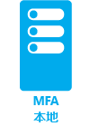

<properties 
	pageTitle="Azure Multi-Factor Authentication - 入门" 
	description="通过询问自己想要保护什么以及用户的位置，选择适合你的 Multi-Factor Authentication 安全解决方案。然后选择云、MFA 服务器或 AD FS。" 
	services="multi-factor-authentication" 
	documentationCenter="" 
	authors="billmath" 
	manager="stevenpo" 
	editor="curtland"/>

<tags 
	ms.service="multi-factor-authentication" 
	ms.date="11/19/2015" 
	wacn.date=""/>

#选择适合自己的多因素安全解决方案

因为 Azure Multi-Factor Authentication 的种类繁多，我们必须从几个重点来判断，以便找出最合适的版本。这些重点包括：

-	[我要保护什么](#what-am-i-trying-to-secure)
-	[用户位于何处](#where-are-the-users-located)

以下部分将提供有关如何做出判断的指导。

## 我要保护什么？

为了确定适当的 Multi-Factor Authentication 解决方案，首先我们必须回答一个问题：试图使用第二种身份验证方法来保护什么？它是 Azure 中的应用程序， 还是远程访问系统之类的系统？通过判断我们尝试保护的项目，就可以找出要在何处启用 Multi-Factor Authentication 这个问题的答案。

你想要保护什么| 云中的 Multi-Factor Authentication|Multi-Factor Authentication 服务器 
------------- | :-------------: | :-------------: |
第一方 Microsoft 应用|* |* |
应用库中的 Saas 应用|* |* |
通过 Azure AD 应用代理发布的 IIS 应用程序|* |* |
不是通过 Azure AD 应用代理发布的 IIS 应用程序 | |* |
VPN、RDG 等远程访问系统| |* |

## 用户位于何处

接下来，不论是云中的 Multi-Factor Authentication 还使用 MFA 服务器的本地 Multi-Factor Authentication，只要根据用户的所在位置，我们就能确定合适的解决方案。

用户位置| 解决方案
------------- | :------------- | 
Azure Active Directory| 云中的 Multi-Factor Authentication|
Azure AD 和使用 AD FS 联合身份验证的本地 AD| 云中的 MFA 和 MFA 服务器都是可用选项 
Azure AD 和使用 DirSync、Azure AD Sync、Azure AD Connect 的本地 AD - 没有密码同步|云中的 MFA 和 MFA 服务器都是可用选项 
Azure AD 和使用 DirSync、Azure AD Sync、Azure AD Connect 的本地 AD - 包含密码同步|云中的 Multi-Factor Authentication
本地 Active Directory|Multi-Factor Authentication 服务器

下表是云中 Multi-Factor Authentication 和 Multi-Factor Authentication 服务器的功能比较。

 | 云中的 Multi-Factor Authentication | Multi-Factor Authentication 服务器
------------- | :-------------: | :-------------: |
将移动应用通知用作第二个因素 | ● | ● |
将移动应用验证码用作第二个因素 | ● | ●
将电话呼叫用作第二个因素 | ● | ● 
将单向短信用作第二个因素 | ● | ●
将双向短信用作第二个因素 | | ● 
将硬件令牌用作第二个因素 | | ● 
不支持 MFA 的客户端的应用密码 | ● |  
管理员控制身份验证方法 | | ● 
PIN 模式 | | ●
欺诈警报 | ● | ●
MFA 报告 | ● | ● 
一次性跳过 | ● | ● 
通话的自定义问候语 | ● | ● 
可自定义的来电者 ID | ● | ● 
受信任的 IP | ● | ● 
暂停对已记住的设备进行 MFA（公共预览版） | ● |  
条件性访问 | ● | ● 
缓存 | ● | ● 

在确定是要使用云 Multi-Factor Authentication 还是本地 MFA 服务器后，接下来可以开始设置并使用 Azure Multi-Factor Authentication。**选择代表你的方案的图标！**

  &#160;&#160;&#160;&#160;&#160;&#160;&#160;&#160;&#160;&#160;&#160;&#160;&#160;&#160;&#160;&#160;&#160;&#160;&#160;&#160;&#160;&#160;&#160;&#160;&#160; &#160;&#160;&#160;&#160;&#160;

<!---HONumber=Mooncake_0307_2016-->