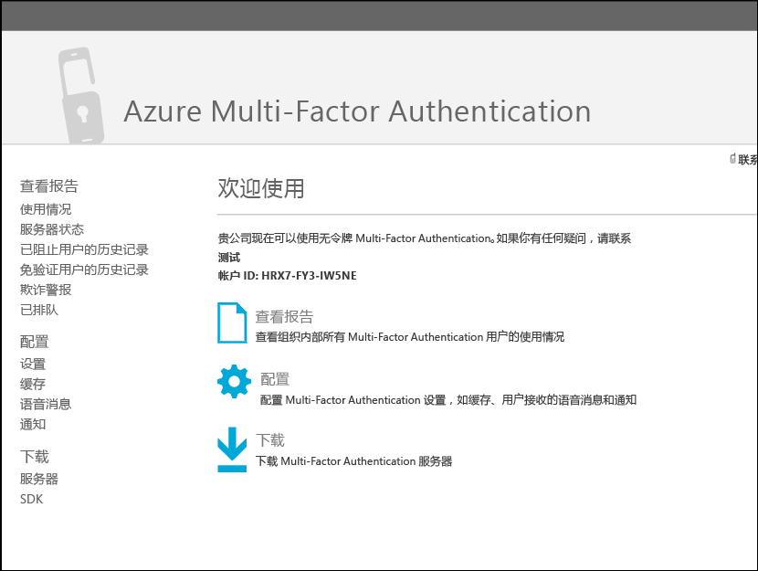
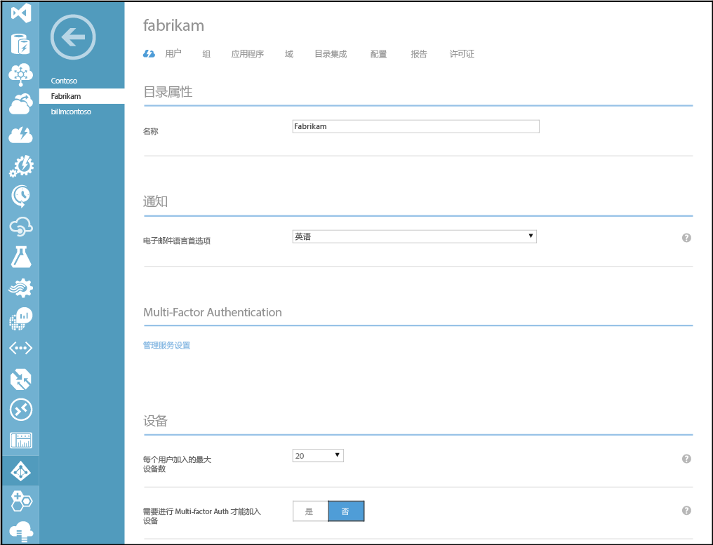

# 将多重身份验证构建到自定义应用程序中 (SDK)

使用 Azure 多重身份验证软件开发工具包 (SDK)，可将双重验证直接内置于 Azure AD 租户的应用程序登录或事务处理流程中。

多重身份验证 SDK 可用于 C#、Visual Basic (.NET)、Java、Perl、PHP 和 Ruby。 该 SDK 围绕双重验证提供了一个精简包装。 它包含编写代码所需的所有内容，包括带注释的源代码文件、示例文件和详细的自述文件。 每个 SDK 还包括证书和私钥，用于加密多重身份验证提供程序独有的事务处理。 只要有提供程序，即可根据需要下载任意多种语言和格式的 SDK。

多重身份验证 SDK 的 API 结构很简单。 可使用多重身份验证选项参数（如验证模式）和用户数据（如要呼叫的电话号码或要验证的 PIN 号码）对 API 进行单函数调用。 API 将函数调用转换成对基于云的 Azure 多重身份验证服务的 Web 服务请求。 所有调用都必须包括对每个 SDK 中包含的私有证书的引用。

由于这些 API 无法访问 Azure Active Directory 中注册的用户，必须在文件或数据库中提供用户信息。 另外，这些 API 也未提供注册或用户管理功能，因此需要将这些流程内置于应用程序中。

> [!IMPORTANT]
> 即使拥有 Azure MFA、AAD 高级版或 EMS 许可证，若要下载 SDK，也需要创建 Azure 多重身份验证提供程序。 如果出于此目的而创建 Azure 多重身份验证提供程序且已拥有许可证，请务必使用**按启用的用户**模型创建提供程序。 然后，将该提供程序链接到包含 Azure MFA、Azure AD Premium 或 EMS 许可证的目录。 该配置将确保仅当使用 SDK 的唯一用户数大于所拥有的许可证数时才进行计费。

## 下载该 SDK
下载 Azure 多重身份验证 SDK 需要 [Azure 多重身份验证提供程序](multi-factor-authentication-get-started-auth-provider.md)。  即使拥有 Azure MFA、Azure AD Premium 或企业移动性套件许可证，这还需要一个完整的 Azure 订阅。  若要下载 SDK，请导航到多重管理门户。 可以通过直接管理多重身份验证提供程序，或单击 MFA 服务设置页上的**“转到门户”**链接，导航到多重管理门户。

### 从 Azure 经典门户下载
1. 以管理员身份登录到 [Azure 经典门户](https://manage.windowsazure.com) 。
2. 在左侧选择“Active Directory”。
3. 在“Active Directory”页的顶部，单击“**多重身份验证提供程序**”
4. 在底部选择“**管理**”。 此时会打开一个新页面。
5. 在左下方单击 **SDK**。
   

6. 选择所需的语言，并单击一个关联的下载链接。
7. 保存下载的内容。

### 从服务设置下载
1. 以管理员身份登录到 [Azure 经典门户](https://manage.windowsazure.com) 。
2. 在左侧选择“Active Directory”。
3. 双击 Azure AD 的实例。
4. 在顶部单击“配置”
5. 在“多重身份验证”下选择“**管理服务设置**”
   “”
6. 在“服务设置”页上的屏幕底部单击“转到门户” 。 此时会打开一个新页面。
   
7. 在左下方单击 **SDK**。
8. 选择所需的语言，并单击一个关联的下载链接。
9. 保存下载的内容。

## SDK 包括哪些内容？
SDK 包括以下项：

* **自述文件**。 解释如何在新应用程序或现有应用程序中使用多重身份验证 API。
* 用于多重身份验证的**源文件**
* 用来与多重身份验证服务通信的**客户端证书**
* 证书的**私钥**
* **调用结果**。 调用结果代码列表。 若要打开此文件，请使用支持文本格式的应用程序，例如 WordPad。 使用调用结果代码可测试多重身份验证在应用程序中的实现及进行故障排除。 它们不是身份验证状态代码。
* **示例**。 多重身份验证的基本工作实现的示例代码。

> [!WARNING]
> 客户端证书是专门生成的唯一私有证书。 请不要共享或丢失此文件。 它是确保与多重身份验证服务的通信安全的关键。

## 代码示例
此代码示例演示如何使用 Azure 多重身份验证 SDK 中的 API，为应用程序添加标准模式语音呼叫验证。 标准模式是用户通过按 # 键响应的电话呼叫。

本例在包含 C# 服务器端逻辑的基本 ASP.NET 应用程序中使用了 C# .NET 2.0 多重身份验证 SDK，但此过程与其他语言相似。 由于该 SDK 包括源文件而非可执行文件，因此可以生成并引用文件，或将文件直接包括在应用程序中。

> [!NOTE]
> 实现多重身份验证时，将使用附加方法（电话呼叫或短信）作为第二方法或第三方法验证来补充主要身份验证方法（用户名和密码）。 这些方法不设计用作主要身份验证方法。

### 代码示例概述
这段示例代码用于简单的 Web 演示应用程序，它使用以 # 键响应的电话呼叫来完成用户的身份验证。 此电话呼叫因素在多重身份验证中称为标准模式。

客户端代码不包括任何专用于多重身份验证的元素。 由于其他身份验证因素是独立于主身份验证的，因此，可在不更改现有登录接口的情况下添加这些因素。 通过 Multi-Factor Authentication SDK 中的 API，可以自定义用户体验，但也可能根本不需要进行任何更改。

服务器端代码在步骤 2 中添加了标准模式身份验证。 它创建一个 PfAuthParams 对象，带有标准模式验证必需的参数：用户名、电话号码、模式及客户端证书路径 (CertFilePath)，这是每个调用所必需的。 有关 PfAuthParams 中的所有参数的演示，请参阅 SDK 中的示例文件。

接下来，代码将 PfAuthParams 对象传递给 pf_authenticate() 函数。 返回值指示身份验证成功或失败。 out 参数 callStatus 和 errorID 包含其他调用结果信息。 调用结果代码记录在 SDK 中的调用结果文件中。

最小实现只需编写几行代码。 但在生产代码中，会包括更加复杂的错误处理、其他数据库代码和增强型用户体验。

### Web 客户端代码
以下是演示页的 Web 客户端代码。

    <%@ Page Language="C#" AutoEventWireup="true" CodeFile="Default.aspx.cs" Inherits="\_Default" %>

    <!DOCTYPE html>

    <html xmlns="http://www.w3.org/1999/xhtml">
    <head runat="server">
    <title>Multi-Factor Authentication Demo</title>
    </head>
    <body>
    <h1>Azure Multi-Factor Authentication Demo</h1>
    <form id="form1" runat="server">

    

    Username:&nbsp; 
    Password:&nbsp; 
    

    <div">
    <asp:TextBox id="username" runat="server" width="100px"/> 
    <asp:Textbox id="password" runat="server" width="100px" TextMode="password" /> 
    

    <asp:Button id="btnSubmit" runat="server" Text="Log in" onClick="btnSubmit_Click"/>

    
<asp:Label ID="lblResult" runat="server"></asp:Label>

    </form>
    </body>
    </html>

### 服务器端代码
在以下服务器端代码中，多重身份验证在步骤 2 中配置和运行。 标准模式 (MODE_STANDARD) 是用户通过按 # 键响应的电话呼叫。

    using System;
    using System.Collections.Generic;
    using System.Linq;
    using System.Web;
    using System.Web.UI;
    using System.Web.UI.WebControls;

    public partial class \_Default : System.Web.UI.Page
    {
        protected void Page_Load(object sender, EventArgs e)
        {
        }

        protected void btnSubmit_Click(object sender, EventArgs e)
        {
            // Step 1: Validate the username and password
            if (username.Text != "Contoso" || password.Text != "password")
            {
                lblResult.ForeColor = System.Drawing.Color.Red;
                lblResult.Text = "Username or password incorrect.";
            }
            else
            {
                // Step 2: Perform multi-factor authentication

                // Add call details from the user database.
                PfAuthParams pfAuthParams = new PfAuthParams();
                pfAuthParams.Username = username.Text;
                pfAuthParams.Phone = "5555555555";
                pfAuthParams.Mode = pf_auth.MODE_STANDARD;

                // Specify a client certificate
                // NOTE: This file contains the private key for the client
                // certificate. It must be stored with appropriate file
                // permissions.
                pfAuthParams.CertFilePath = "c:\\cert_key.p12";

                // Perform phone-based authentication
                int callStatus;
                int errorId;

                if(pf_auth.pf_authenticate(pfAuthParams, out callStatus, out errorId))
                {
                    lblResult.ForeColor = System.Drawing.Color.Green;
                    lblResult.Text = "Multi-Factor Authentication succeeded.";
                }
                else
                {
                    lblResult.ForeColor = System.Drawing.Color.Red;
                    lblResult.Text = "Multi-Factor Authentication failed.";
                }
            }

        }
    }
