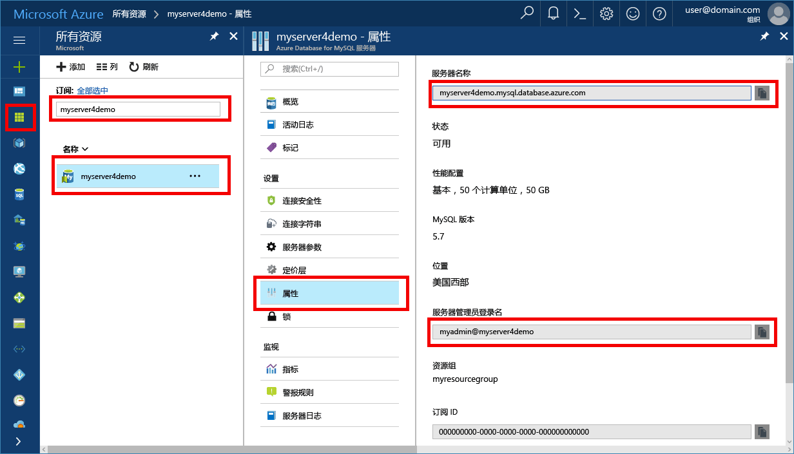

# <a name="migrate-your-mysql-database-by-using-import-and-export"></a>使用导入和导出迁移 MySQL 数据库
本文介绍通过使用 MySQL Workbench 将数据导入和导出到 Azure Database for MySQL 服务器的两种常用方法。 

## <a name="before-you-begin"></a>开始之前
若要逐步执行本操作方法指南，需要：
- 按照[使用 Azure 门户创建 Azure Database for MySQL 服务器](quickstart-create-mysql-server-database-using-azure-portal.md)所述创建的 Azure Database for MySQL 服务器。
- [下载的](https://dev.mysql.com/downloads/workbench/) MySQL Workbench，或用于导入和导出的其他 MySQL 工具。

## <a name="use-common-tools"></a>使用常用工具
使用常用工具（例如 MySQL Workbench、Toad 或 Navicat）进行远程连接，并将数据导入或导出到 Azure Database for MySQL。 

在具有 Internet 连接的客户端计算机上使用此类工具连接到 Azure Database for MySQL。 如[在 Azure Database for MySQL 中配置 SSL 连接](concepts-ssl-connection-security.md)中所述，使用具有 SSL 加密的连接是最安全的做法。

迁移到 Azure Database for MySQL 时，无需将导入和导出文件移到任何特殊的云位置。 

## <a name="create-a-database-on-the-azure-database-for-mysql-server"></a>在 Azure Database for MySQL 服务器上创建数据库
在要迁移数据的 Azure Database for MySQL 服务器上创建空数据库。 使用 MySQL Workbench、Toad 或 Navicat 等工具创建数据库。 数据库名称可与包含转储数据的数据库名称相同，或可以创建一个不同名称的数据库。

若要获取连接，请在 Azure Database for MySQL 的“属性”窗格中找到连接信息。



将连接信息添加到 MySQL Workbench。


## <a name="determine-when-to-use-import-and-export-techniques-instead-of-a-dump-and-restore"></a>确定何时使用导入和导出技术（而不是转储和还原技术）
在以下情况下，使用 MySQL 工具将数据库导入和导出到 Azure MySQL 数据库中。 而在其他情况下，使用[转储和还原](concepts-migrate-dump-restore.md)可能更有益。 

- 需要有选择性地选择要从现有 MySQL 数据库导入到 Azure MySQL 数据库的几个表时，最好使用导入和导出技术。  这样做，可以在迁移过程中省略任何不需要的表，从而节省时间和资源。 例如，使用带有 [mysqlpump](https://dev.mysql.com/doc/refman/5.7/en/mysqlpump.html#option_mysqlpump_include-tables) 的 `--include-tables` 或 `--exclude-tables` switch 语句以及带有 [mysqldump](https://dev.mysql.com/doc/refman/5.7/en/mysqldump.html#option_mysqldump_tables) 的 `--tables` switch 语句。
- 移动表以外的数据库对象时，显式创建这些对象。 包括约束（主键、外键、索引）、视图、函数、过程、触发器和想要迁移的任何其他数据库对象。
- 从 MySQL 数据库以外的外部数据源迁移数据时，使用 [mysqlimport](https://dev.mysql.com/doc/refman/5.7/en/mysqlimport.html) 创建平面文件并导入它们。

将数据加载到 Azure Database for MySQL 时，请确保数据库中的所有表都使用 InnoDB 存储引擎。 Azure Database for MySQL 仅支持 InnoDB 存储引擎，因此不支持备选存储引擎。 如果你的表需要备选存储引擎，确保先将它们转换为使用 InnoDB 引擎格式，再迁移到 Azure Database for MySQL。 

例如，如果你有使用 MyISAM 引擎的 WordPress 或 Web 应用，需首先通过将数据迁移到 InnoDB 表中的方式来转换表。 然后还原到 Azure Database for MySQL。 使用子句 `ENGINE=INNODB` 设置用于创建表的引擎，然后在迁移之前将数据传输到兼容表中。 

   ```sql
   INSERT INTO innodb_table SELECT * FROM myisam_table ORDER BY primary_key_columns
   ```

## <a name="performance-recommendations-for-import-and-export"></a>导入和导出的性能建议
-   加载数据之前创建聚集索引和主键。 以主键顺序加载数据。 
-   延迟创建辅助索引，直到数据加载完毕。 加载后创建所有辅助索引。 
-   加载前禁用外键约束。 禁用外键检查可以显著提高性能。 启用约束并在加载后验证数据，确保引用完整性。
-   并行加载数据。 避免太多将导致达到资源限制的并行度，并通过使用 Azure 门户中提供的指标监视资源。 
-   适当时使用已分区表。

## <a name="import-and-export-by-using-mysql-workbench"></a>使用 MySQL Workbench 进行导入和导出
在 MySQL Workbench 中导入和导出数据有两种方法。 每种方法的用途不同。 

### <a name="table-data-export-and-import-wizards-from-the-object-browsers-context-menu"></a>对象浏览器上下文菜单中的表数据导出和导入向导


表数据向导支持使用 CSV 和 JSON 文件的导入和导出操作。 它们包括多个配置选项，如分隔符、列选择和编码选择。 可以对本地或远程连接的 MySQL 服务器执行每个向导。 导入操作包括表、列和类型映射。 

右键单击表，便可以从对象浏览器的上下文菜单中访问这些向导。 然后选择“表数据导出向导”或“表数据导入向导”。 

#### <a name="table-data-export-wizard"></a>表数据导出向导
下面的示例将表导出到 CSV 文件： 
1. 右键单击要导出的数据库的表。 
2. 选择“表数据导出向导”。 选择要导出的列、行偏移量（如果存在）、计数（如果存在）。 
3. 在“选择要导出的数据”页上，单击“下一步”。 选择文件路径、CSV 或 JSON 文件类型。 此外选择行分隔符、封闭字符串的方法和字段分隔符。 
4. 在“选择输出文件位置”页上，单击“下一步”。 
5. 在“导出数据”页上，单击“下一步”。

#### <a name="table-data-import-wizard"></a>表数据导入向导
下面的示例将从 CSV 文件导入表：
1. 右键单击要导入的数据库的表。 
2. 浏览要导入的 CSV 文件并选择它，然后单击“下一步” 。 
3. 选择目标表（新的或现有的），然后选择或取消选择“导入前截断表” 复选框。 单击“下一步”。
4. 选择编码和要导入的列，然后单击“下一步”。 
5. 在“导入数据”页上，单击“下一步”。 向导相应地导入数据。

### <a name="sql-data-export-and-import-wizards-from-the-navigator-pane"></a>导航器窗格中的 SQL 数据导出和导入向导
使用向导导出或导入从 MySQL Workbench 或从 mysqldump 命令生成的 SQL。 从“导航器”窗格或通过从主菜单中选择“服务器”访问这些向导。 然后选择“数据导出”或“数据导入”。 

#### <a name="data-export"></a>数据导出


可以使用“数据导出”选项卡导出 MySQL 数据。 
1. 选择想导出的每个架构，根据需要从每个架构中选择特定的架构对象/表，并生成导出。 配置选项包括导出到项目文件夹或自包含的 SQL 文件、转储存储的例程和事件，或跳过表数据。 
 
   或者，使用“导出结果集”将 SQL 编辑器中的特定结果集导出为其他格式，例如 CSV、JSON、HTML 和 XML。 
3. 选择要导出的数据库对象，并配置相关选项。
4. 单击“刷新”加载当前对象。
5. 或者，打开可以完善导出操作的“高级选项”选项卡。 例如，添加表锁、使用 replace 而不是 insert 语句、使用反撇号字符将标识符括起来。
6. 单击“开始导出”开始导出过程。


#### <a name="data-import"></a>数据导入


使用“数据导入”选项卡能够从数据导出操作或从 mysqldump 命令中导入或还原导出的数据。 
1. 选择项目文件夹或自包含的 SQL 文件，选择要向其中进行导入的架构，或选择“新建”定义新架构。 
2. 单击“开始导入”开始导入过程。

## <a name="next-steps"></a>后续步骤
另一种迁移方法，请参阅[在 Azure Database for MySQL 中使用转储和还原来迁移 MySQL 数据库](concepts-migrate-dump-restore.md)。 
