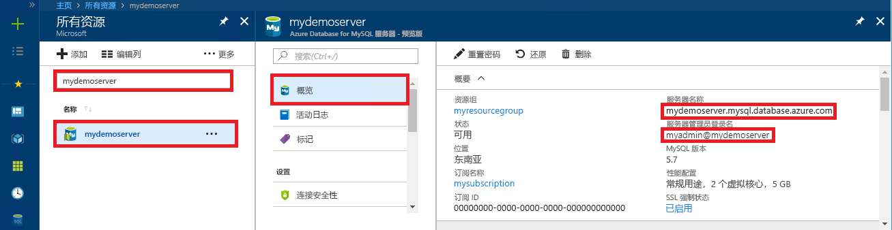

# <a name="azure-database-for-mysql-use-connectorc-to-connect-and-query-data"></a>Azure Database for MySQL：使用 Connector/C++ 连接和查询数据
本快速入门演示如何使用 C++ 应用程序连接到 Azure Database for MySQL。 同时还介绍了如何使用 SQL 语句在数据库中查询、插入、更新和删除数据。 本主题假设你熟悉如何使用 C++ 进行开发，但不太熟悉 Azure Database for MySQL 的用法。

## <a name="prerequisites"></a>先决条件
此快速入门使用以下任意指南中创建的资源作为起点：
- [使用 Azure 门户创建用于 MySQL 服务器的 Azure 数据库](./quickstart-create-mysql-server-database-using-azure-portal.md)
- [使用 Azure CLI 创建用于 MySQL 服务器的 Azure 数据库](./quickstart-create-mysql-server-database-using-azure-cli.md)

还需要：
- 安装 [.NET Framework](https://www.microsoft.com/net/download)
- 安装 [Visual Studio](https://www.visualstudio.com/downloads/)
- 安装 [MySQL Connector/C++](https://dev.mysql.com/downloads/connector/cpp/) 
- 安装 [Boost](https://www.boost.org/)

## <a name="install-visual-studio-and-net"></a>安装 Visual Studio 和 .NET
本部分的步骤假定你熟悉如何使用 .NET 进行开发。

### <a name="windows"></a>**Windows**
- 安装 Visual Studio 2019 Community。 Visual Studio 2019 Community 是一个功能齐全、可扩展的免费 IDE。 使用此 IDE，你可以为 Android、iOS、Windows、Web 和数据库应用程序以及云服务创建新式应用程序。 可安装完整的 .NET Framework 或仅 .NET Core：快速入门中的代码片段二者都可以使用。 如果已在计算机上安装了 Visual Studio，请跳过下面两个步骤。
   1. 下载 [Visual Studio 2019 安装程序](https://www.visualstudio.com/thank-you-downloading-visual-studio/?sku=Community&rel=15)。 
   2. 运行该安装程序，并遵照安装提示完成安装。

### <a name="configure-visual-studio"></a> 配置 Visual Studio
1. 从 Visual Studio 的“项目”->“属性”->“链接器”->“常规”>“其他库目录”中，添加 C++ 连接器的“lib\opt”目录（例如：C:\Program Files (x86)\MySQL\MySQL Connector C++ 1.1.9\lib\opt）。
2. 在 Visual Studio 的“项目”->“属性”->“C/C++”->“常规”->“其他 Include 目录”中：
   - 添加 c++ 连接器的“\include”目录（例如：C:\Program Files (x86)\MySQL\MySQL Connector C++ 1.1.9\include\)）。
   - 添加 Boost 库的根目录（例如：C:\boost_1_64_0\)）。
3. 在 Visual Studio 的“项目”->“属性”->“链接器”->“输入”->“其他依赖项”中，将 **mysqlcppconn.lib** 添加到文本字段。
4. 将 **mysqlcppconn.dll** 从步骤 3 中的 C++ 连接器库文件夹复制到应用程序可执行文件所在的目录，或者将其添加到环境变量，方便应用程序找到它。

## <a name="get-connection-information"></a>获取连接信息
获取连接到 Azure Database for MySQL 所需的连接信息。 需要完全限定的服务器名称和登录凭据。

1. 登录 [Azure 门户](https://portal.azure.com/)。
2. 在 Azure 门户的左侧菜单中，单击“所有资源”  ，然后搜索已创建的服务器（例如 mydemoserver  ）。
3. 单击服务器名称。
4. 从服务器的“概览”面板中记下“服务器名称”和“服务器管理员登录名”。    如果忘记了密码，也可通过此面板来重置密码。
 

## <a name="connect-create-table-and-insert-data"></a>进行连接，创建表，然后插入数据
通过以下代码进行连接，然后使用 CREATE TABLE  和 INSERT INTO  SQL 语句加载数据。 代码使用 sql::Driver 类，通过 connect() 方法建立到 MySQL 的连接。 然后，代码使用 createStatement() 和 execute() 方法运行数据库命令。 

替换 Host、DBName、User 和 Password 参数。 可以将这些参数替换为你在创建服务器和数据库时指定的值。 

```c++
#include <stdlib.h>
#include <iostream>
#include "stdafx.h"

#include "mysql_connection.h"
#include <cppconn/driver.h>
#include <cppconn/exception.h>
#include <cppconn/prepared_statement.h>
using namespace std;

//for demonstration only. never save your password in the code!
const string server = "tcp://yourservername.mysql.database.azure.com:3306";
const string username = "username@servername";
const string password = "yourpassword";

int main()
{
    sql::Driver *driver;
    sql::Connection *con;
    sql::Statement *stmt;
    sql::PreparedStatement *pstmt;

    try
    {
        driver = get_driver_instance();
        con = driver->connect(server, username, password);
    }
    catch (sql::SQLException e)
    {
        cout << "Could not connect to server. Error message: " << e.what() << endl;
        system("pause");
        exit(1);
    }

    //please create database "quickstartdb" ahead of time
    con->setSchema("quickstartdb");

    stmt = con->createStatement();
    stmt->execute("DROP TABLE IF EXISTS inventory");
    cout << "Finished dropping table (if existed)" << endl;
    stmt->execute("CREATE TABLE inventory (id serial PRIMARY KEY, name VARCHAR(50), quantity INTEGER);");
    cout << "Finished creating table" << endl;
    delete stmt;

    pstmt = con->prepareStatement("INSERT INTO inventory(name, quantity) VALUES(?,?)");
    pstmt->setString(1, "banana");
    pstmt->setInt(2, 150);
    pstmt->execute();
    cout << "One row inserted." << endl;

    pstmt->setString(1, "orange");
    pstmt->setInt(2, 154);
    pstmt->execute();
    cout << "One row inserted." << endl;

    pstmt->setString(1, "apple");
    pstmt->setInt(2, 100);
    pstmt->execute();
    cout << "One row inserted." << endl;

    delete pstmt;
    delete con;
    system("pause");
    return 0;
}
```

## <a name="read-data"></a>读取数据

使用以下代码进行连接，并使用 SELECT  SQL 语句读取数据。 代码使用 sql::Driver 类，通过 connect() 方法建立到 MySQL 的连接。 然后，代码使用 prepareStatement() 和 executeQuery() 方法运行 select 命令。 然后，代码使用 next() 转到结果中的记录。 最后，代码使用 getInt() 和 getString() 分析记录中的值。

替换 Host、DBName、User 和 Password 参数。 可以将这些参数替换为你在创建服务器和数据库时指定的值。 

```c++
#include <stdlib.h>
#include <iostream>
#include "stdafx.h"

#include "mysql_connection.h"
#include <cppconn/driver.h>
#include <cppconn/exception.h>
#include <cppconn/resultset.h>
#include <cppconn/prepared_statement.h>
using namespace std;

//for demonstration only. never save your password in the code!
const string server = "tcp://yourservername.mysql.database.azure.com:3306";
const string username = "username@servername";
const string password = "yourpassword";

int main()
{
    sql::Driver *driver;
    sql::Connection *con;
    sql::PreparedStatement *pstmt;
    sql::ResultSet *result;

    try
    {
        driver = get_driver_instance();
        //for demonstration only. never save password in the code!
        con = driver->connect(server, username, password);
    }
    catch (sql::SQLException e)
    {
        cout << "Could not connect to server. Error message: " << e.what() << endl;
        system("pause");
        exit(1);
    }

    con->setSchema("quickstartdb");

    //select  
    pstmt = con->prepareStatement("SELECT * FROM inventory;");
    result = pstmt->executeQuery();

    while (result->next())
        printf("Reading from table=(%d, %s, %d)\n", result->getInt(1), result->getString(2).c_str(), result->getInt(3));

    delete result;
    delete pstmt;
    delete con;
    system("pause");
    return 0;
}
```

## <a name="update-data"></a>更新数据
使用以下代码进行连接，并使用 UPDATE  SQL 语句读取数据。 代码使用 sql::Driver 类，通过 connect() 方法建立到 MySQL 的连接。 然后，代码使用 prepareStatement() 和 executeQuery() 方法运行 update 命令。 

替换 Host、DBName、User 和 Password 参数。 可以将这些参数替换为你在创建服务器和数据库时指定的值。 

```c++
#include <stdlib.h>
#include <iostream>
#include "stdafx.h"

#include "mysql_connection.h"
#include <cppconn/driver.h>
#include <cppconn/exception.h>
#include <cppconn/resultset.h>
#include <cppconn/prepared_statement.h>
using namespace std;

//for demonstration only. never save your password in the code!
const string server = "tcp://yourservername.mysql.database.azure.com:3306";
const string username = "username@servername";
const string password = "yourpassword";

int main()
{
    sql::Driver *driver;
    sql::Connection *con;
    sql::PreparedStatement *pstmt;

    try
    {
        driver = get_driver_instance();
        //for demonstration only. never save password in the code!
        con = driver->connect(server, username, password);
    }
    catch (sql::SQLException e)
    {
        cout << "Could not connect to server. Error message: " << e.what() << endl;
        system("pause");
        exit(1);
    }
    
    con->setSchema("quickstartdb");

    //update
    pstmt = con->prepareStatement("UPDATE inventory SET quantity = ? WHERE name = ?");
    pstmt->setInt(1, 200);
    pstmt->setString(2, "banana");
    pstmt->executeQuery();
    printf("Row updated\n");

    delete con;
    delete pstmt;
    system("pause");
    return 0;
}
```


## <a name="delete-data"></a>删除数据
使用以下代码进行连接，并使用 DELETE  SQL 语句读取数据。 代码使用 sql::Driver 类，通过 connect() 方法建立到 MySQL 的连接。 然后，代码使用 prepareStatement() 和 executeQuery() 方法运行 delete 命令。

替换 Host、DBName、User 和 Password 参数。 可以将这些参数替换为你在创建服务器和数据库时指定的值。 

```c++
#include <stdlib.h>
#include <iostream>
#include "stdafx.h"

#include "mysql_connection.h"
#include <cppconn/driver.h>
#include <cppconn/exception.h>
#include <cppconn/resultset.h>
#include <cppconn/prepared_statement.h>
using namespace std;

//for demonstration only. never save your password in the code!
const string server = "tcp://yourservername.mysql.database.azure.com:3306";
const string username = "username@servername";
const string password = "yourpassword";

int main()
{
    sql::Driver *driver;
    sql::Connection *con;
    sql::PreparedStatement *pstmt;
    sql::ResultSet *result;

    try
    {
        driver = get_driver_instance();
        //for demonstration only. never save password in the code!
        con = driver->connect(server, username, password);
    }
    catch (sql::SQLException e)
    {
        cout << "Could not connect to server. Error message: " << e.what() << endl;
        system("pause");
        exit(1);
    }
    
    con->setSchema("quickstartdb");
        
    //delete
    pstmt = con->prepareStatement("DELETE FROM inventory WHERE name = ?");
    pstmt->setString(1, "orange");
    result = pstmt->executeQuery();
    printf("Row deleted\n");    
    
    delete pstmt;
    delete con;
    delete result;
    system("pause");
    return 0;
}
```

## <a name="next-steps"></a>后续步骤
> [!div class="nextstepaction"]
> [使用转储和还原将 MySQL 数据库迁移到 Azure Database for MySQL](concepts-migrate-dump-restore.md)
