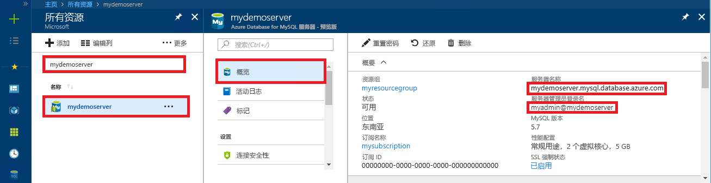

# <a name="azure-database-for-mysql-use-net-c-to-connect-and-query-data"></a>适用于 MySQL 的 Azure 数据库：使用 .NET (C#) 进行连接并查询数据
本快速入门演示如何使用 C# 应用程序连接到 Azure Database for MySQL。 同时还介绍了如何使用 SQL 语句在数据库中查询、插入、更新和删除数据。 本主题假设你熟悉如何使用 C# 进行开发，但不太熟悉 Azure Database for MySQL 的用法。

## <a name="prerequisites"></a>先决条件
此快速入门使用以下任意指南中创建的资源作为起点：
- [使用 Azure 门户创建用于 MySQL 服务器的 Azure 数据库](./quickstart-create-mysql-server-database-using-azure-portal.md)
- [使用 Azure CLI 创建用于 MySQL 服务器的 Azure 数据库](./quickstart-create-mysql-server-database-using-azure-cli.md)

还需要：
- 安装 [.NET](https://www.microsoft.com/net/download)。 按照链接文章中的步骤来安装专用于平台（Windows、Ubuntu Linux 或 macOS）的 .NET。 
- 安装 [Visual Studio](https://www.visualstudio.com/downloads/)。

## <a name="create-a-c-project"></a>创建一个 C# 项目
在命令提示符处运行以下命令：

```
mkdir AzureMySqlExample
cd AzureMySqlExample
dotnet new console
dotnet add package MySqlConnector
```

## <a name="get-connection-information"></a>获取连接信息
获取连接到 Azure Database for MySQL 所需的连接信息。 需要完全限定的服务器名称和登录凭据。

1. 登录到 [Azure 门户](https://portal.azure.com/)。
2. 在 Azure 门户的左侧菜单中，单击“所有资源”，然后搜索已创建的服务器（例如 mydemoserver）。
3. 单击服务器名称。
4. 从服务器的“概览”面板中记下“服务器名称”和“服务器管理员登录名”。 如果忘记了密码，也可通过此面板来重置密码。
 

## <a name="connect-create-table-and-insert-data"></a>进行连接，创建表，然后插入数据
通过以下代码来连接和加载数据，只需使用 `CREATE TABLE` 和 `INSERT INTO` SQL 语句即可。 代码使用 `MySqlConnection` 类，通过 [OpenAsync()](https://docs.microsoft.com/dotnet/api/system.data.common.dbconnection.openasync#System_Data_Common_DbConnection_OpenAsync) 方法与 MySQL 建立连接。 然后，代码使用 [CreateCommand()](https://docs.microsoft.com/dotnet/api/system.data.common.dbconnection.createcommand) 方法，设置 CommandText 属性，再调用 [ExecuteNonQueryAsync()](https://docs.microsoft.com/dotnet/api/system.data.common.dbcommand.executenonqueryasync) 方法来运行数据库命令。 

将 `Server`、`Database`、`UserID`、`Password` 参数替换为你在创建服务器和数据库时指定的值。 

```csharp
using System;
using System.Threading.Tasks;
using MySql.Data.MySqlClient;

namespace AzureMySqlExample
{
    class MySqlCreate
    {
        static async Task Main(string[] args)
        {
            var builder = new MySqlConnectionStringBuilder
            {
                Server = "YOUR-SERVER.mysql.database.azure.com",
                Database = "YOUR-DATABASE",
                UserID = "USER@YOUR-SERVER",
                Password = "PASSWORD",
                SslMode = MySqlSslMode.Required,
            };

            using (var conn = new MySqlConnection(builder.ConnectionString))
            {
                Console.WriteLine("Opening connection");
                await conn.OpenAsync();

                using (var command = conn.CreateCommand())
                {
                    command.CommandText = "DROP TABLE IF EXISTS inventory;";
                    await command.ExecuteNonQueryAsync();
                    Console.WriteLine("Finished dropping table (if existed)");

                    command.CommandText = "CREATE TABLE inventory (id serial PRIMARY KEY, name VARCHAR(50), quantity INTEGER);";
                    await command.ExecuteNonQueryAsync();
                    Console.WriteLine("Finished creating table");

                    command.CommandText = @"INSERT INTO inventory (name, quantity) VALUES (@name1, @quantity1),
                        (@name2, @quantity2), (@name3, @quantity3);";
                    command.Parameters.AddWithValue("@name1", "banana");
                    command.Parameters.AddWithValue("@quantity1", 150);
                    command.Parameters.AddWithValue("@name2", "orange");
                    command.Parameters.AddWithValue("@quantity2", 154);
                    command.Parameters.AddWithValue("@name3", "apple");
                    command.Parameters.AddWithValue("@quantity3", 100);

                    int rowCount = await command.ExecuteNonQueryAsync();
                    Console.WriteLine(String.Format("Number of rows inserted={0}", rowCount));
                }

                // connection will be closed by the 'using' block
                Console.WriteLine("Closing connection");
            }

            Console.WriteLine("Press RETURN to exit");
            Console.ReadLine();
        }
    }
}
```

## <a name="read-data"></a>读取数据

使用以下代码进行连接，并使用 `SELECT` SQL 语句读取数据。 代码使用 `MySqlConnection` 类，通过 [OpenAsync()](https://docs.microsoft.com/dotnet/api/system.data.common.dbconnection.openasync#System_Data_Common_DbConnection_OpenAsync) 方法与 MySQL 建立连接。 然后，代码使用 [CreateCommand()](https://docs.microsoft.com/dotnet/api/system.data.common.dbconnection.createcommand) 方法和 [ExecuteReaderAsync()](https://docs.microsoft.com/dotnet/api/system.data.common.dbcommand.executereaderasync) 方法运行数据库命令。 接下来，代码使用 [ReadAsync()](https://docs.microsoft.com/dotnet/api/system.data.common.dbdatareader.readasync#System_Data_Common_DbDataReader_ReadAsync) 转到结果中的记录。 然后，代码使用 GetInt32 和 GetString 分析记录中的值。

将 `Server`、`Database`、`UserID`、`Password` 参数替换为你在创建服务器和数据库时指定的值。 

```csharp
using System;
using System.Threading.Tasks;
using MySql.Data.MySqlClient;

namespace AzureMySqlExample
{
    class MySqlRead
    {
        static async Task Main(string[] args)
        {
            var builder = new MySqlConnectionStringBuilder
            {
                Server = "YOUR-SERVER.mysql.database.azure.com",
                Database = "YOUR-DATABASE",
                UserID = "USER@YOUR-SERVER",
                Password = "PASSWORD",
                SslMode = MySqlSslMode.Required,
            };

            using (var conn = new MySqlConnection(builder.ConnectionString))
            {
                Console.WriteLine("Opening connection");
                await conn.OpenAsync();

                using (var command = conn.CreateCommand())
                {
                    command.CommandText = "SELECT * FROM inventory;";

                    using (var reader = await command.ExecuteReaderAsync())
                    {
                        while (await reader.ReadAsync())
                        {
                            Console.WriteLine(string.Format(
                                "Reading from table=({0}, {1}, {2})",
                                reader.GetInt32(0),
                                reader.GetString(1),
                                reader.GetInt32(2)));
                        }
                    }
                }

                Console.WriteLine("Closing connection");
            }

            Console.WriteLine("Press RETURN to exit");
            Console.ReadLine();
        }
    }
}
```

## <a name="update-data"></a>更新数据
使用以下代码进行连接，并使用 `UPDATE` SQL 语句读取数据。 代码使用 `MySqlConnection` 类，通过 [OpenAsync()](https://docs.microsoft.com/dotnet/api/system.data.common.dbconnection.openasync#System_Data_Common_DbConnection_OpenAsync) 方法与 MySQL 建立连接。 然后，代码使用 [CreateCommand()](https://docs.microsoft.com/dotnet/api/system.data.common.dbconnection.createcommand) 方法，设置 CommandText 属性，再调用 [ExecuteNonQueryAsync()](https://docs.microsoft.com/dotnet/api/system.data.common.dbcommand.executenonqueryasync) 方法来运行数据库命令。 

将 `Server`、`Database`、`UserID`、`Password` 参数替换为你在创建服务器和数据库时指定的值。 

```csharp
using System;
using System.Threading.Tasks;
using MySql.Data.MySqlClient;

namespace AzureMySqlExample
{
    class MySqlUpdate
    {
        static async Task Main(string[] args)
        {
            var builder = new MySqlConnectionStringBuilder
            {
                Server = "YOUR-SERVER.mysql.database.azure.com",
                Database = "YOUR-DATABASE",
                UserID = "USER@YOUR-SERVER",
                Password = "PASSWORD",
                SslMode = MySqlSslMode.Required,
            };

            using (var conn = new MySqlConnection(builder.ConnectionString))
            {
                Console.WriteLine("Opening connection");
                await conn.OpenAsync();

                using (var command = conn.CreateCommand())
                {
                    command.CommandText = "UPDATE inventory SET quantity = @quantity WHERE name = @name;";
                    command.Parameters.AddWithValue("@quantity", 200);
                    command.Parameters.AddWithValue("@name", "banana");

                    int rowCount = await command.ExecuteNonQueryAsync();
                    Console.WriteLine(String.Format("Number of rows updated={0}", rowCount));
                }

                Console.WriteLine("Closing connection");
            }

            Console.WriteLine("Press RETURN to exit");
            Console.ReadLine();
        }
    }
}
```

## <a name="delete-data"></a>删除数据
使用以下代码进行连接，并使用 `DELETE` SQL 语句删除数据。 

代码使用 `MySqlConnection` 类，通过 [OpenAsync()](https://docs.microsoft.com/dotnet/api/system.data.common.dbconnection.openasync#System_Data_Common_DbConnection_OpenAsync) 方法与 MySQL 建立连接。 然后，代码使用 [CreateCommand()](https://docs.microsoft.com/dotnet/api/system.data.common.dbconnection.createcommand) 方法，设置 CommandText 属性，再调用 [ExecuteNonQueryAsync()](https://docs.microsoft.com/dotnet/api/system.data.common.dbcommand.executenonqueryasync) 方法来运行数据库命令。 

将 `Server`、`Database`、`UserID`、`Password` 参数替换为你在创建服务器和数据库时指定的值。 

```csharp
using System;
using System.Threading.Tasks;
using MySql.Data.MySqlClient;

namespace AzureMySqlExample
{
    class MySqlDelete
    {
        static async Task Main(string[] args)
        {
            var builder = new MySqlConnectionStringBuilder
            {
                Server = "YOUR-SERVER.mysql.database.azure.com",
                Database = "YOUR-DATABASE",
                UserID = "USER@YOUR-SERVER",
                Password = "PASSWORD",
                SslMode = MySqlSslMode.Required,
            };

            using (var conn = new MySqlConnection(builder.ConnectionString))
            {
                Console.WriteLine("Opening connection");
                await conn.OpenAsync();

                using (var command = conn.CreateCommand())
                {
                    command.CommandText = "DELETE FROM inventory WHERE name = @name;";
                    command.Parameters.AddWithValue("@name", "orange");

                    int rowCount = await command.ExecuteNonQueryAsync();
                    Console.WriteLine(String.Format("Number of rows deleted={0}", rowCount));
                }

                Console.WriteLine("Closing connection");
            }

            Console.WriteLine("Press RETURN to exit");
            Console.ReadLine();
        }
    }
}
```

## <a name="next-steps"></a>后续步骤
> [!div class="nextstepaction"]
> [使用转储和还原将 MySQL 数据库迁移到 Azure Database for MySQL](concepts-migrate-dump-restore.md)
