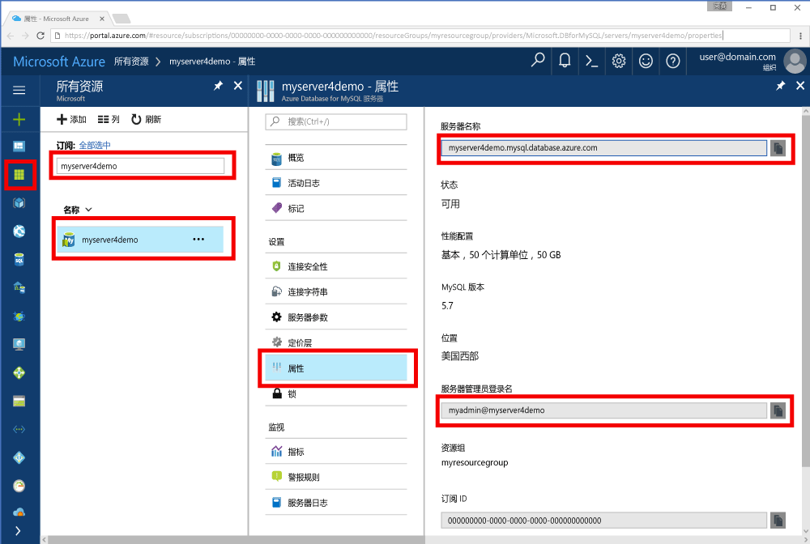

# <a name="azure-database-for-mysql-use-go-language-to-connect-and-query-data"></a>Azure Database for MySQL：使用 Go 语言进行连接并查询数据
本快速入门演示如何在 Windows、Ubuntu Linux 和 Apple macOS 平台中使用以 [Go](https://golang.org/) 语言编写的代码连接到 Azure Database for MySQL。 同时还介绍了如何使用 SQL 语句在数据库中查询、插入、更新和删除数据。 本文假设你熟悉如何使用 Go 进行开发，但不太熟悉 Azure Database for MySQL 的用法。

## <a name="prerequisites"></a>先决条件
此快速入门使用以下任意指南中创建的资源作为起点：
- [使用 Azure 门户创建用于 MySQL 服务器的 Azure 数据库](./quickstart-create-mysql-server-database-using-azure-portal.md)
- [使用 Azure CLI 创建用于 MySQL 服务器的 Azure 数据库](./quickstart-create-mysql-server-database-using-azure-cli.md)

## <a name="install-go-and-mysql-connector"></a>安装 Go 和 MySQL 连接器
在自己的计算机上安装 [Go](https://golang.org/doc/install) 和不低于 1.3 版的[适用于 MySQL 的 go-sql-driver](https://github.com/go-sql-driver/mysql#installation)。 根据自己的平台执行相应部分中的步骤：

### <a name="windows"></a>Windows
1. 根据[安装说明](https://golang.org/doc/install)[下载](https://golang.org/dl/)和安装用于 Microsoft Windows 的 Go。
2. 从开始菜单启动命令提示符。
3. 为项目创建一个文件夹，例如 `mkdir  %USERPROFILE%\go\src\mysqlgo`。
4. 将目录转到项目文件夹，例如 `cd %USERPROFILE%\go\src\mysqlgo`。
5. 设置 GOPATH 的环境变量，使之指向源代码目录。 `set GOPATH=%USERPROFILE%\go`。
6. 通过运行 `go get github.com/go-sql-driver/mysql` 命令安装[用于 MySQL 的 go-sql-driver](https://github.com/go-sql-driver/mysql#installation)。 需要不低于 1.3 版的版本。

   总起来说就是，安装 Go，然后在命令提示符处运行以下命令：
   ```cmd
   mkdir  %USERPROFILE%\go\src\mysqlgo
   cd %USERPROFILE%\go\src\mysqlgo
   set GOPATH=%USERPROFILE%\go
   go get github.com/go-sql-driver/mysql
   ```

### <a name="linux-ubuntu"></a>Linux (Ubuntu)
1. 启动 Bash Shell。 
2. 通过运行 `sudo apt-get install golang-go` 来安装 Go。
3. 在主目录中为项目创建一个文件夹，例如 `mkdir -p ~/go/src/mysqlgo/`。
4. 将目录转到该文件夹，例如 `cd ~/go/src/mysqlgo/`。
5. 设置 GOPATH 环境变量，使之指向有效的源目录，例如当前主目录的 Go 文件夹。 在 Bash shell 中运行 `export GOPATH=~/go`，将 Go 目录添加为当前 Shell 会话的 GOPATH。
6. 通过运行 `go get github.com/go-sql-driver/mysql` 命令安装[用于 MySQL 的 go-sql-driver](https://github.com/go-sql-driver/mysql#installation)。 需要不低于 1.3 版的版本。

   总起来说就是，运行以下 bash 命令：
   ```bash
   sudo apt-get install golang-go
   mkdir -p ~/go/src/mysqlgo/
   cd ~/go/src/mysqlgo/
   export GOPATH=~/go/
   go get github.com/go-sql-driver/mysql
   ```

### <a name="apple-macos"></a>Apple macOS
1. 下载 Go，然后根据与平台相对应的[安装说明](https://golang.org/doc/install)进行安装。 
2. 启动 Bash Shell。
3. 在主目录中为项目创建一个文件夹，例如 `mkdir -p ~/go/src/mysqlgo/`。
4. 将目录转到该文件夹，例如 `cd ~/go/src/mysqlgo/`。
5. 设置 GOPATH 环境变量，使之指向有效的源目录，例如当前主目录的 Go 文件夹。 在 Bash shell 中运行 `export GOPATH=~/go`，将 Go 目录添加为当前 Shell 会话的 GOPATH。
6. 通过运行 `go get github.com/go-sql-driver/mysql` 命令安装[用于 MySQL 的 go-sql-driver](https://github.com/go-sql-driver/mysql#installation)。 需要不低于 1.3 版的版本。

   总起来说就是，安装 Go，然后运行以下 bash 命令：
   ```bash
   mkdir -p ~/go/src/mysqlgo/
   cd ~/go/src/mysqlgo/
   export GOPATH=~/go/
   go get github.com/go-sql-driver/mysql
   ```

## <a name="get-connection-information"></a>获取连接信息
获取连接到 Azure Database for MySQL 所需的连接信息。 需要完全限定的服务器名称和登录凭据。

1. 登录到 [Azure 门户](https://portal.azure.com/)。
2. 在 Azure 门户的左侧菜单中，单击“所有资源”，然后搜索已创建的服务器（例如 myserver4demo）。
3. 单击服务器名称“myserver4demo”。
4. 选择服务器的“属性”页，然后记下“服务器名称”和“服务器管理员登录名”。
 
5. 如果忘了服务器的登录信息，请导航到“概览”页，查看服务器管理员登录名并重置密码（如果需要）。
   

## <a name="build-and-run-go-code"></a>生成和运行 Go 代码 
1. 若要编写 Golang 代码，可以使用简单的文本编辑器，例如 Microsoft Windows 中的记事本、Ubuntu 中的 [vi](http://manpages.ubuntu.com/manpages/xenial/man1/nvi.1.html#contenttoc5) 或 [Nano](https://www.nano-editor.org/)，或者 macOS 中的 TextEdit。 如果偏好功能更丰富的交互式开发环境 (IDE)，可尝试 Jetbrains 推出的 [Gogland](https://www.jetbrains.com/go/)、Microsoft 推出的 [Visual Studio Code](https://code.visualstudio.com/)，或者 [Atom](https://atom.io/)。
2. 将以下部分中的 Go 代码粘贴到文本文件中，再使用文件扩展名 \*.go 将这些文件保存到项目文件夹中（例如 Windows 路径 `%USERPROFILE%\go\src\mysqlgo\createtable.go` 或 Linux 路径 `~/go/src/mysqlgo/createtable.go`）。
3. 在代码中找到 `HOST`、`DATABASE`、`USER` 和 `PASSWORD` 常量，然后将示例值替换为自己的值。 
4. 启动命令提示符或 Bash shell。 将目录转到项目文件夹。 例如，在 Windows 上使用 `cd %USERPROFILE%\go\src\mysqlgo\`。 在 Linux 上使用 `cd ~/go/src/mysqlgo/`。  提到的某些 IDE 编辑器提供不需 shell 命令的调试和运行时功能。
5. 通过键入命令 `go run createtable.go` 来运行代码，编译并运行应用程序。 
6. 另外，若要将代码内建到本机应用程序中，请键入命令 `go build createtable.go`，再启动 `createtable.exe` 来运行该应用程序。

## <a name="connect-create-table-and-insert-data"></a>进行连接，创建表，然后插入数据
通过以下代码连接到服务器，创建一个表，然后使用 INSERT SQL 语句加载数据。 

代码导入三个包：[sql 包](https://golang.org/pkg/database/sql/)、[适用于 mysql 的 go sql driver](https://github.com/go-sql-driver/mysql#installation)（充当与 Azure Database for MySQL 通信所需的驱动程序），以及 [fmt 包](https://golang.org/pkg/fmt/)（适用于在命令行中列显的输入和输出）。

代码通过调用 [sql.Open()](http://go-database-sql.org/accessing.html) 方法来连接到 Azure Database for MySQL，并使用 [db.Ping()](https://golang.org/pkg/database/sql/#DB.Ping) 方法来检查连接。 将始终使用[数据库句柄](https://golang.org/pkg/database/sql/#DB)来存储数据库服务器的连接池。 代码多次调用 [Exec()](https://golang.org/pkg/database/sql/#DB.Exec) 方法来运行多个 DDL 命令。 代码还使用 [Prepare()](http://go-database-sql.org/prepared.html) 和 Exec() 来运行准备的语句，通过不同的参数插入三行。 每次都会使用自定义 checkError() 方法来检查是否发生错误，以及是否死机退出。

将 `host`、`database`、`user`、`password` 常量替换为自己的值。 

```Go
package main

import (
    "database/sql"
    "fmt"

    _ "github.com/go-sql-driver/mysql"
)

const (
    host     = "myserver4demo.mysql.database.azure.com"
    database = "quickstartdb"
    user     = "myadmin@myserver4demo"
    password = "yourpassword"
)

func checkError(err error) {
    if err != nil {
        panic(err)
    }
}

func main() {

    // Initialize connection string.
    var connectionString = fmt.Sprintf("%s:%s@tcp(%s:3306)/%s?allowNativePasswords=true", user, password, host, database)

    // Initialize connection object.
    db, err := sql.Open("mysql", connectionString)
    checkError(err)
    defer db.Close()

    err = db.Ping()
    checkError(err)
    fmt.Println("Successfully created connection to database.")

    // Drop previous table of same name if one exists.
    _, err = db.Exec("DROP TABLE IF EXISTS inventory;")
    checkError(err)
    fmt.Println("Finished dropping table (if existed).")

    // Create table.
    _, err = db.Exec("CREATE TABLE inventory (id serial PRIMARY KEY, name VARCHAR(50), quantity INTEGER);")
    checkError(err)
    fmt.Println("Finished creating table.")

    // Insert some data into table.
    sqlStatement, err := db.Prepare("INSERT INTO inventory (name, quantity) VALUES (?, ?);")
    res, err := sqlStatement.Exec("banana", 150)
    checkError(err)
    rowCount, err := res.RowsAffected()
    fmt.Printf("Inserted %d row(s) of data.\n", rowCount)

    res, err = sqlStatement.Exec("orange", 154)
    checkError(err)
    rowCount, err = res.RowsAffected()
    fmt.Printf("Inserted %d row(s) of data.\n", rowCount)

    res, err = sqlStatement.Exec("apple", 100)
    checkError(err)
    rowCount, err = res.RowsAffected()
    fmt.Printf("Inserted %d row(s) of data.\n", rowCount)
    fmt.Println("Done.")
}

```

## <a name="read-data"></a>读取数据
使用以下代码进行连接，并使用 SELECT SQL 语句读取数据。 

代码导入三个包：[sql 包](https://golang.org/pkg/database/sql/)、[适用于 mysql 的 go sql driver](https://github.com/go-sql-driver/mysql#installation)（充当与 Azure Database for MySQL 通信所需的驱动程序），以及 [fmt 包](https://golang.org/pkg/fmt/)（适用于在命令行中列显的输入和输出）。

代码通过调用 [sql.Open()](http://go-database-sql.org/accessing.html) 方法来连接到 Azure Database for MySQL，并使用 [db.Ping()](https://golang.org/pkg/database/sql/#DB.Ping) 方法来检查连接。 将始终使用[数据库句柄](https://golang.org/pkg/database/sql/#DB)来存储数据库服务器的连接池。 代码调用 [Query()](https://golang.org/pkg/database/sql/#DB.Query) 方法来运行 select 命令。 接下来，代码运行 [Next()](https://golang.org/pkg/database/sql/#Rows.Next) 来循环访问结果集，再运行 [Scan()](https://golang.org/pkg/database/sql/#Rows.Scan) 来分析列值，将值保存到变量中。 每次都会使用自定义 checkError() 方法来检查是否发生错误，以及是否死机退出。

将 `host`、`database`、`user`、`password` 常量替换为自己的值。 

```Go
package main

import (
    "database/sql"
    "fmt"

    _ "github.com/go-sql-driver/mysql"
)

const (
    host     = "myserver4demo.mysql.database.azure.com"
    database = "quickstartdb"
    user     = "myadmin@myserver4demo"
    password = "yourpassword"
)

func checkError(err error) {
    if err != nil {
        panic(err)
    }
}

func main() {

    // Initialize connection string.
    var connectionString = fmt.Sprintf("%s:%s@tcp(%s:3306)/%s?allowNativePasswords=true", user, password, host, database)

    // Initialize connection object.
    db, err := sql.Open("mysql", connectionString)
    checkError(err)
    defer db.Close()

    err = db.Ping()
    checkError(err)
    fmt.Println("Successfully created connection to database.")

    // Variables for printing column data when scanned.
    var (
        id       int
        name     string
        quantity int
    )

    // Read some data from the table.
    rows, err := db.Query("SELECT id, name, quantity from inventory;")
    checkError(err)
    defer rows.Close()
    fmt.Println("Reading data:")
    for rows.Next() {
        err := rows.Scan(&id, &name, &quantity)
        checkError(err)
        fmt.Printf("Data row = (%d, %s, %d)\n", id, name, quantity)
    }
    err = rows.Err()
    checkError(err)
    fmt.Println("Done.")
}
```

## <a name="update-data"></a>更新数据
使用以下代码进行连接，并使用 **UPDATE** SQL 语句更新数据。 

代码导入三个包：[sql 包](https://golang.org/pkg/database/sql/)、[适用于 mysql 的 go sql driver](https://github.com/go-sql-driver/mysql#installation)（充当与 Azure Database for MySQL 通信所需的驱动程序），以及 [fmt 包](https://golang.org/pkg/fmt/)（适用于在命令行中列显的输入和输出）。

代码通过调用 [sql.Open()](http://go-database-sql.org/accessing.html) 方法来连接到 Azure Database for MySQL，并使用 [db.Ping()](https://golang.org/pkg/database/sql/#DB.Ping) 方法来检查连接。 将始终使用[数据库句柄](https://golang.org/pkg/database/sql/#DB)来存储数据库服务器的连接池。 代码调用 [Exec()](https://golang.org/pkg/database/sql/#DB.Exec) 方法来运行 update 命令。 每次都会使用自定义 checkError() 方法来检查是否发生错误，以及是否死机退出。

将 `host`、`database`、`user`、`password` 常量替换为自己的值。 

```Go
package main

import (
    "database/sql"
    "fmt"

    _ "github.com/go-sql-driver/mysql"
)

const (
    host     = "myserver4demo.mysql.database.azure.com"
    database = "quickstartdb"
    user     = "myadmin@myserver4demo"
    password = "yourpassword"
)

func checkError(err error) {
    if err != nil {
        panic(err)
    }
}

func main() {

    // Initialize connection string.
    var connectionString = fmt.Sprintf("%s:%s@tcp(%s:3306)/%s?allowNativePasswords=true", user, password, host, database)

    // Initialize connection object.
    db, err := sql.Open("mysql", connectionString)
    checkError(err)
    defer db.Close()

    err = db.Ping()
    checkError(err)
    fmt.Println("Successfully created connection to database.")

    // Modify some data in table.
    rows, err := db.Exec("UPDATE inventory SET quantity = ? WHERE name = ?", 200, "banana")
    checkError(err)
    rowCount, err := rows.RowsAffected()
    fmt.Printf("Deleted %d row(s) of data.\n", rowCount)
    fmt.Println("Done.")
}
```

## <a name="delete-data"></a>删除数据
使用以下代码进行连接，并使用 **DELETE** SQL 语句删除数据。 

代码导入三个包：[sql 包](https://golang.org/pkg/database/sql/)、[适用于 mysql 的 go sql driver](https://github.com/go-sql-driver/mysql#installation)（充当与 Azure Database for MySQL 通信所需的驱动程序），以及 [fmt 包](https://golang.org/pkg/fmt/)（适用于在命令行中列显的输入和输出）。

代码通过调用 [sql.Open()](http://go-database-sql.org/accessing.html) 方法来连接到 Azure Database for MySQL，并使用 [db.Ping()](https://golang.org/pkg/database/sql/#DB.Ping) 方法来检查连接。 将始终使用[数据库句柄](https://golang.org/pkg/database/sql/#DB)来存储数据库服务器的连接池。 代码调用 [Exec()](https://golang.org/pkg/database/sql/#DB.Exec) 方法来运行 delete 命令。 每次都会使用自定义 checkError() 方法来检查是否发生错误，以及是否死机退出。

将 `host`、`database`、`user`、`password` 常量替换为自己的值。 

```Go
package main

import (
    "database/sql"
    "fmt"
    _ "github.com/go-sql-driver/mysql"
)

const (
    host     = "myserver4demo.mysql.database.azure.com"
    database = "quickstartdb"
    user     = "myadmin@myserver4demo"
    password = "yourpassword"
)

func checkError(err error) {
    if err != nil {
        panic(err)
    }
}

func main() {

    // Initialize connection string.
    var connectionString = fmt.Sprintf("%s:%s@tcp(%s:3306)/%s?allowNativePasswords=true", user, password, host, database)

    // Initialize connection object.
    db, err := sql.Open("mysql", connectionString)
    checkError(err)
    defer db.Close()

    err = db.Ping()
    checkError(err)
    fmt.Println("Successfully created connection to database.")

    // Modify some data in table.
    rows, err := db.Exec("DELETE FROM inventory WHERE name = ?", "orange")
    checkError(err)
    rowCount, err := rows.RowsAffected()
    fmt.Printf("Deleted %d row(s) of data.\n", rowCount)
    fmt.Println("Done.")
}
```

## <a name="next-steps"></a>后续步骤
> [!div class="nextstepaction"]
> [使用导出和导入功能迁移数据库](./concepts-migrate-import-export.md)
