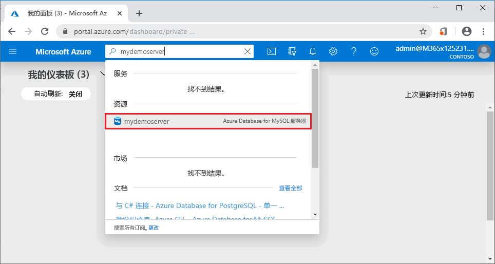
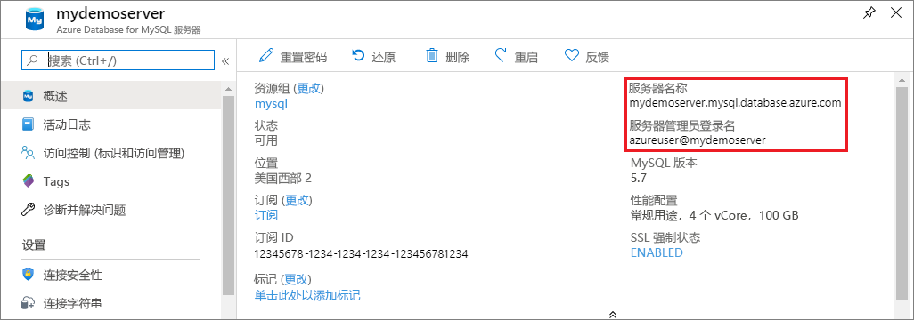

# <a name="quickstart-use-python-to-connect-and-query-data-with-azure-database-for-mysql"></a>快速入门：使用 Python 通过 Azure Database for MySQL 连接并查询数据

在本快速入门中，你将使用 Python 连接到 Azure Database for MySQL。 然后使用 SQL 语句在 Mac、Ubuntu Linux 和 Windows 平台的数据库中查询、插入、更新和删除数据。 

本主题假设你熟悉如何使用 Python 进行开发，但不熟悉 Azure Database for MySQL 的用法。

## <a name="prerequisites"></a>必备条件

- 具有活动订阅的 Azure 帐户。 [免费创建帐户](https://azure.microsoft.com/free/?ref=microsoft.com&utm_source=microsoft.com&utm_medium=docs&utm_campaign=visualstudio)。
- Azure Database for MySQL 服务器。 [使用 Azure 门户创建 Azure Database for MySQL 服务器](quickstart-create-mysql-server-database-using-azure-portal.md)或[使用 Azure CLI 创建 Azure Database for MySQL 服务器](quickstart-create-mysql-server-database-using-azure-cli.md)。

## <a name="install-python-and-the-mysql-connector"></a>安装 Python 和 MySQL 连接器

使用以下步骤在计算机上安装 Python 和用于 Python 的 MySQL 连接器： 

> [!NOTE]
> 本快速入门使用原始 SQL 查询方法连接到 MySQL。 如果使用的是 Web 框架，请对此框架使用建议的连接器，例如 [mysqlclient](https://pypi.org/project/mysqlclient/) for Django。

1. 下载并安装适合自己 OS 的 [Python 3.7 或更高版本](https://www.python.org/downloads/)。 请确保将 Python 添加到 `PATH`，因为 MySQL 连接器需要它。
   
1. 打开命令提示符或 `bash` shell，使用大写 V 开关运行 `python -V`，以便检查 Python 版本。
   
1. 最新版本的 Python 中包含 `pip` 包安装程序。 通过运行 `pip install -U pip` 将 `pip` 更新为最新版本。 
   
   如果未安装 `pip`，则可使用 `get-pip.py` 下载并安装它。 有关详细信息，请参阅[安装](https://pip.pypa.io/en/stable/installing/)。 
   
1. 使用 `pip`，安装用于 Python 的 MySQL 连接器及其依赖项：
   
   ```bash
   pip install mysql-connector-python
   ```
   
   还可以从 [mysql.com](https://dev.mysql.com/downloads/connector/python/) 安装用于 MySQL 的 Python 连接器。 有关用于 Python 的 MySQL 连接器的详细信息，请参阅 [MySQL Connector/Python Developer Guide](https://dev.mysql.com/doc/connector-python/en/)（MySQL 连接器/Python 开发人员指南）。 

## <a name="get-connection-information"></a>获取连接信息

从 Azure 门户获取连接到 Azure Database for MySQL 所需的连接信息。 需要服务器名称、数据库名称和登录凭据。

1. 登录 [Azure 门户](https://portal.azure.com/)。
   
1. 在门户搜索栏中，搜索并选择创建的 Azure Database for MySQL 服务器，如 **mydemoserver**。
   
   
   
1. 从服务器的“概览”页中记下“服务器名称”和“服务器管理员登录名”。    如果忘记了密码，也可通过此页重置密码。
   
   

## <a name="run-the-python-examples"></a>运行 Python 示例

对于本文中的每个代码示例：

1. 在文本编辑器中创建新的文件。
1. 将代码示例添加到文件。 在代码中，将 `<mydemoserver>`、`<myadmin>`、`<mypassword>` 和 `<mydatabase>` 占位符替换为 MySQL 服务器和数据库的值。
1. 将文件保存在项目文件夹中，扩展名为 *.py*，例如 *C:\pythonmysql\createtable.py* 或 */home/username/pythonmysql/createtable.py*。
1. 若要运行代码，请打开命令提示符或 `bash` shell，将目录更改为项目文件夹，例如 `cd pythonmysql`。 键入 `python` 命令，后跟文件名，例如 `python createtable.py`，然后按 Enter。 
   
   > [!NOTE]
   > 在 Windows 上，如果找不到 *python.exe*，则可能需要将 Python 路径添加到 PATH 环境变量中，或提供 *python.exe* 的完整路径，例如 `C:\python27\python.exe createtable.py`。

## <a name="create-a-table-and-insert-data"></a>创建表并插入数据

通过以下代码连接到服务器和数据库，创建一个表，然后使用  INSERT SQL 语句加载数据。 

该代码将导入 mysql.connector 库，并使用 [connect()](https://dev.mysql.com/doc/connector-python/en/connector-python-api-mysql-connector-connect.html) 函数连接到 Azure Database for MySQL，使用配置集合中的[参数](https://dev.mysql.com/doc/connector-python/en/connector-python-connectargs.html)。 该代码对连接使用游标，并通过 [cursor.execute()](https://dev.mysql.com/doc/connector-python/en/connector-python-api-mysqlcursor-execute.html) 方法对 MySQL 数据库执行 SQL 查询。 

```python
import mysql.connector
from mysql.connector import errorcode

# Obtain connection string information from the portal
config = {
  'host':'<mydemoserver>.mysql.database.azure.com',
  'user':'<myadmin>@<mydemoserver>',
  'password':'<mypassword>',
  'database':'<mydatabase>'
}

# Construct connection string
try:
   conn = mysql.connector.connect(**config)
   print("Connection established")
except mysql.connector.Error as err:
  if err.errno == errorcode.ER_ACCESS_DENIED_ERROR:
    print("Something is wrong with the user name or password")
  elif err.errno == errorcode.ER_BAD_DB_ERROR:
    print("Database does not exist")
  else:
    print(err)
else:
  cursor = conn.cursor()

  # Drop previous table of same name if one exists
  cursor.execute("DROP TABLE IF EXISTS inventory;")
  print("Finished dropping table (if existed).")

  # Create table
  cursor.execute("CREATE TABLE inventory (id serial PRIMARY KEY, name VARCHAR(50), quantity INTEGER);")
  print("Finished creating table.")

  # Insert some data into table
  cursor.execute("INSERT INTO inventory (name, quantity) VALUES (%s, %s);", ("banana", 150))
  print("Inserted",cursor.rowcount,"row(s) of data.")
  cursor.execute("INSERT INTO inventory (name, quantity) VALUES (%s, %s);", ("orange", 154))
  print("Inserted",cursor.rowcount,"row(s) of data.")
  cursor.execute("INSERT INTO inventory (name, quantity) VALUES (%s, %s);", ("apple", 100))
  print("Inserted",cursor.rowcount,"row(s) of data.")

  # Cleanup
  conn.commit()
  cursor.close()
  conn.close()
  print("Done.")
```

## <a name="read-data"></a>读取数据

使用以下代码进行连接，并使用 SELECT  SQL 语句读取数据。 

该代码将导入 mysql.connector 库，并使用 [connect()](https://dev.mysql.com/doc/connector-python/en/connector-python-api-mysql-connector-connect.html) 函数连接到 Azure Database for MySQL，使用配置集合中的[参数](https://dev.mysql.com/doc/connector-python/en/connector-python-connectargs.html)。 该代码对连接使用游标，并通过 [cursor.execute()](https://dev.mysql.com/doc/connector-python/en/connector-python-api-mysqlcursor-execute.html) 方法对 MySQL 数据库执行 SQL 查询。 

代码使用 [fetchall()](https://dev.mysql.com/doc/connector-python/en/connector-python-api-mysqlcursor-fetchall.html) 方法读取数据行，将结果集保留在集合行中，并使用 `for` 迭代器对行进行循环操作。

```python
import mysql.connector
from mysql.connector import errorcode

# Obtain connection string information from the portal
config = {
  'host':'<mydemoserver>.mysql.database.azure.com',
  'user':'<myadmin>@<mydemoserver>',
  'password':'<mypassword>',
  'database':'<mydatabase>'
}

# Construct connection string
try:
   conn = mysql.connector.connect(**config)
   print("Connection established")
except mysql.connector.Error as err:
  if err.errno == errorcode.ER_ACCESS_DENIED_ERROR:
    print("Something is wrong with the user name or password")
  elif err.errno == errorcode.ER_BAD_DB_ERROR:
    print("Database does not exist")
  else:
    print(err)
else:
  cursor = conn.cursor()

  # Read data
  cursor.execute("SELECT * FROM inventory;")
  rows = cursor.fetchall()
  print("Read",cursor.rowcount,"row(s) of data.")

  # Print all rows
  for row in rows:
    print("Data row = (%s, %s, %s)" %(str(row[0]), str(row[1]), str(row[2])))

  # Cleanup
  conn.commit()
  cursor.close()
  conn.close()
  print("Done.")
```

## <a name="update-data"></a>更新数据

使用以下代码进行连接，并使用 UPDATE  SQL 语句更新数据。 

该代码将导入 mysql.connector 库，并使用 [connect()](https://dev.mysql.com/doc/connector-python/en/connector-python-api-mysql-connector-connect.html) 函数连接到 Azure Database for MySQL，使用配置集合中的[参数](https://dev.mysql.com/doc/connector-python/en/connector-python-connectargs.html)。 该代码对连接使用游标，并通过 [cursor.execute()](https://dev.mysql.com/doc/connector-python/en/connector-python-api-mysqlcursor-execute.html) 方法对 MySQL 数据库执行 SQL 查询。 

```python
import mysql.connector
from mysql.connector import errorcode

# Obtain connection string information from the portal
config = {
  'host':'<mydemoserver>.mysql.database.azure.com',
  'user':'<myadmin>@<mydemoserver>',
  'password':'<mypassword>',
  'database':'<mydatabase>'
}

# Construct connection string
try:
   conn = mysql.connector.connect(**config)
   print("Connection established")
except mysql.connector.Error as err:
  if err.errno == errorcode.ER_ACCESS_DENIED_ERROR:
    print("Something is wrong with the user name or password")
  elif err.errno == errorcode.ER_BAD_DB_ERROR:
    print("Database does not exist")
  else:
    print(err)
else:
  cursor = conn.cursor()

  # Update a data row in the table
  cursor.execute("UPDATE inventory SET quantity = %s WHERE name = %s;", (200, "banana"))
  print("Updated",cursor.rowcount,"row(s) of data.")

  # Cleanup
  conn.commit()
  cursor.close()
  conn.close()
  print("Done.")
```

## <a name="delete-data"></a>删除数据

使用以下代码进行连接，并使用 **DELETE** SQL 语句删除数据。 

该代码将导入 mysql.connector 库，并使用 [connect()](https://dev.mysql.com/doc/connector-python/en/connector-python-api-mysql-connector-connect.html) 函数连接到 Azure Database for MySQL，使用配置集合中的[参数](https://dev.mysql.com/doc/connector-python/en/connector-python-connectargs.html)。 该代码对连接使用游标，并通过 [cursor.execute()](https://dev.mysql.com/doc/connector-python/en/connector-python-api-mysqlcursor-execute.html) 方法对 MySQL 数据库执行 SQL 查询。 

```python
import mysql.connector
from mysql.connector import errorcode

# Obtain connection string information from the portal
config = {
  'host':'<mydemoserver>.mysql.database.azure.com',
  'user':'<myadmin>@<mydemoserver>',
  'password':'<mypassword>',
  'database':'<mydatabase>'
}

# Construct connection string
try:
   conn = mysql.connector.connect(**config)
   print("Connection established.")
except mysql.connector.Error as err:
  if err.errno == errorcode.ER_ACCESS_DENIED_ERROR:
    print("Something is wrong with the user name or password.")
  elif err.errno == errorcode.ER_BAD_DB_ERROR:
    print("Database does not exist.")
  else:
    print(err)
else:
  cursor = conn.cursor()

  # Delete a data row in the table
  cursor.execute("DELETE FROM inventory WHERE name=%(param1)s;", {'param1':"orange"})
  print("Deleted",cursor.rowcount,"row(s) of data.")

  # Cleanup
  conn.commit()
  cursor.close()
  conn.close()
  print("Done.")
```

## <a name="next-steps"></a>后续步骤

> [!div class="nextstepaction"]
> [使用导出和导入功能迁移数据库](./concepts-migrate-import-export.md)
