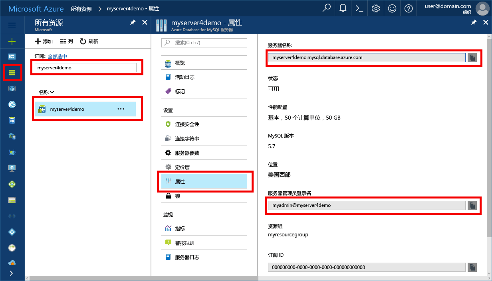

# <a name="azure-database-for-mysql-use-mysql-workbench-to-connect-and-query-data"></a>Azure Database for MySQL：使用 MySQL Workbench 进行连接并查询数据
本快速入门演示如何使用 MySQL Workbench 应用程序连接到 Azure Database for MySQL。 

## <a name="prerequisites"></a>先决条件
此快速入门使用以下任意指南中创建的资源作为起点：
- [使用 Azure 门户创建用于 MySQL 服务器的 Azure 数据库](./quickstart-create-mysql-server-database-using-azure-portal.md)
- [使用 Azure CLI 创建用于 MySQL 服务器的 Azure 数据库](./quickstart-create-mysql-server-database-using-azure-cli.md)

## <a name="install-mysql-workbench"></a>安装 MySQL Workbench
在计算机上从 [MySQL 网站](https://dev.mysql.com/downloads/workbench/)下载并安装 MySQL Workbench。

## <a name="get-connection-information"></a>获取连接信息
获取连接到 Azure Database for MySQL 所需的连接信息。 需要完全限定的服务器名称和登录凭据。

1. 登录到 [Azure 门户](https://portal.azure.com/)。

2. 在 Azure 门户的左侧菜单中，单击“所有资源”，然后搜索已创建的服务器（例如 myserver4demo）。

3. 单击服务器名称。

4. 选择服务器的“属性”页，然后记下“服务器名称”和“服务器管理员登录名”。

 
 
5. 如果忘了服务器的登录信息，请导航到“概览”页，查看服务器管理员登录名并重置密码（如果需要）。

## <a name="connect-to-the-server-by-using-mysql-workbench"></a>使用 MySQL Workbench 连接服务器 
若要使用 GUI 工具 MySQL Workbench 连接到 Azure MySQL 服务器，请执行以下操作：

1.  启动计算机上的 MySQL Workbench 应用程序。 

2.  在“设置新连接”对话框的“参数”选项卡上，输入以下信息：

    

    | **设置** | 建议的值 | 字段说明 |
    |---|---|---|
    |   连接名称 | 演示连接 | 指定此连接的标签。 |
    | 连接方法 | 标准 (TCP/IP) | 标准 (TCP/IP) 就足够了。 |
    | 主机名 | 服务器名称 | 指定此前在创建 Azure Database for MySQL 时使用过的服务器名称值。 显示的示例服务器为 myserver4demo.mysql.database.azure.com。请使用完全限定的域名 (\*.mysql.database.azure.com)，如示例中所示。 如果记不起服务器名称，请按上一部分的步骤操作，以便获取连接信息。  |
    | 端口 | 3306 | 在连接到 Azure Database for MySQL 时，始终使用端口 3306。 |
    | 用户名 |  服务器管理员登录名 | 键入此前在创建 Azure Database for MySQL 时提供的服务器管理员登录用户名。 示例用户名为 myadmin@myserver4demo。 如果记不起用户名，请按上一部分的步骤操作，以便获取连接信息。 格式为 username@servername。
    | 密码 | 你的密码 | 单击“在保管库中存储...”按钮来保存密码。 |

3.   单击“测试连接”以测试是否所有参数均已正确配置。 

4.   单击“确定”保存连接。 

5.   在“MySQL 连接”列表中，单击与服务器对应的磁贴并等待建立连接。

        将打开一个新的 SQL 选项卡，该选项卡包含一个可在其中键入查询的空白编辑器。
    
        > [!NOTE]
        > 默认情况下，SSL 连接安全性是必需的，并且在 Azure Database for MySQL 服务器上强制执行。 虽然通常不需要对 SSL 证书进行额外的配置，MySQL Workbench 即可连接到服务器，但建议将 SSL CA 证书与 MySQL Workbench 绑定。 若要详细了解如何下载和绑定证书，请参阅[配置应用程序中的 SSL 连接性以安全连接到 Azure Database for MySQL](./howto-configure-ssl.md)。  如果需要禁用 SSL，请访问 Azure 门户，然后单击“连接安全性”页来禁用“强制实施 SSL 连接”切换按钮。

## <a name="create-a-table-insert-data-read-data-update-data-delete-data"></a>创建表、插入数据、读取数据、更新数据、删除数据
1. 将示例 SQL 代码复制并粘贴到一个空白 SQL 选项卡中，以阐释一些示例数据。

    此代码将创建名为 quickstartdb 的空数据库，然后创建名为清单的示例表。 它会插入一些行，然后读取这些行。 它通过更新语句更改数据，并再次读取这些行。 最后，它删除一个行，并再次读取这些行。
    
    ```sql
    -- Create a database
    -- DROP DATABASE IF EXISTS quickstartdb;
    CREATE DATABASE quickstartdb;
    USE quickstartdb;
    
    -- Create a table and insert rows
    DROP TABLE IF EXISTS inventory;
    CREATE TABLE inventory (id serial PRIMARY KEY, name VARCHAR(50), quantity INTEGER);
    INSERT INTO inventory (name, quantity) VALUES ('banana', 150);
    INSERT INTO inventory (name, quantity) VALUES ('orange', 154);
    INSERT INTO inventory (name, quantity) VALUES ('apple', 100);
    
    -- Read
    SELECT * FROM inventory;
    
    -- Update
    UPDATE inventory SET quantity = 200 WHERE id = 1;
    SELECT * FROM inventory;
    
    -- Delete
    DELETE FROM inventory WHERE id = 2;
    SELECT * FROM inventory;
    ```

    此屏幕快照显示 SQL Workbench 中的一个 SQL 代码示例以及运行该示例代码后的输出。
    
    

2. 若要运行示例 SQL 代码，请单击“SQL 文件”选项卡工具栏中的闪电图标。
3. 请注意页面中间“结果网格”部分中的三个选项卡式结果。 
4. 请注意页面底部的“输出”列表。 显示有每个命令的状态。 

现已使用 MySQL Workbench 连接到 Azure Database for MySQL，并已使用 SQL 语言查询数据。

## <a name="next-steps"></a>后续步骤
> [!div class="nextstepaction"]
> [使用导出和导入功能迁移数据库](./concepts-migrate-import-export.md)
