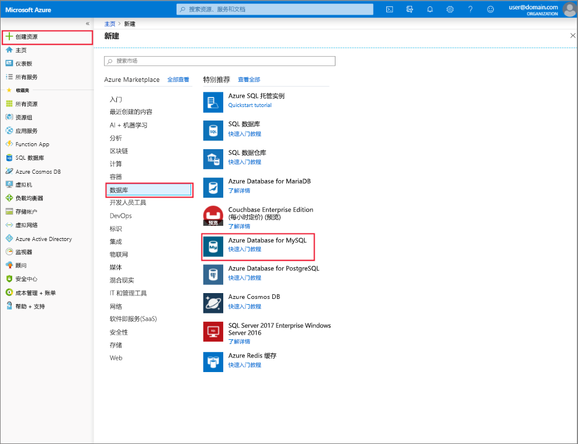

# 使用 Azure 门户创建和管理 Azure Database for MySQL 服务器
本主题介绍了如何快速创建新的 Azure Database for MySQL 服务器。 它还提供了有关如何使用 Azure 门户来管理服务器的信息。 服务器管理包括查看服务器详细信息和数据库、重置密码、缩放资源以及删除服务器。

## 登录到 Azure 门户
登录到 [Azure 门户](https://portal.azure.com)。

## 创建 Azure Database for MySQL 服务器
按照下列步骤，创建一个名为“mydemoserver”的 Azure Database for MySQL 服务器。

1. 单击 Azure 门户左上角的“创建资源”按钮。

2. 在“新建”页面上，选择“数据库”，然后在“数据库”页面上选择“Azure Database for MySQL”。

    > 创建的 Azure Database for MySQL 服务器中包含一组已定义的[计算和存储](./concepts-pricing-tiers.md)资源。 创建的数据库位于 Azure Database for MySQL 服务器的 Azure 资源组中。

   

3. 使用以下信息填写 Azure Database for MySQL 窗体：

    | **窗体字段** | **字段说明** |
    |----------------|-----------------------|
    | *服务器名称* | mydemoserver（服务器名称是全局唯一的） |
    | *订阅* | mysubscription（从下拉菜单中选择） |
    | *资源组* | myresourcegroup（新建一个资源组或使用现有资源组） |
    | *选择源* | 空白（创建一个空的 MySQL 服务器） |
    | 服务器管理员登录名 | myadmin（设置管理员帐户名称） |
    | *密码* | 设置管理员帐户密码 |
    | *确认密码* | 确认管理员帐户密码 |
    | *位置* | 东南亚（选择“北欧”或“美国西部”） |
    | *版本* | 5.7（选择 Azure Database for MySQL 服务器版本） |

4. 单击“定价层”，为新服务器指定服务层和性能级别。 选择“常规用途”选项卡。“第 4 代”、“2 个 vCore”、“5 GB”和“7 天”分别是“计算代”、“vCore”、“存储”和“备份保留期”的默认值。 可以将这些滑块保留原样。 若要在异地冗余存储中启用服务器备份，请从“备份冗余选项”中选择“异地冗余”。

   

5. 单击“创建”以预配服务器。 预配需要数分钟。

    > 选择“固定到仪表板”选项，以便轻松跟踪部署。

## 更新 Azure Database for MySQL 服务器
预配新服务器后，用户将具有用于配置现有服务器的多个选项，包括重置管理员密码以及通过更改 vCore 或存储来纵向扩展或收缩服务器。

### 更改管理员用户密码
1. 从服务器“概览”中，单击“重置密码”以显示密码重置窗口。

   

2. 在窗口中输入并确认新密码，如下所示：

   

3. 单击“确定”以保存新密码。

### 纵向扩展/收缩 vCore

1. 单击“设置”下的“定价层”。

2. 通过将滑块移动到所需的值来更改“vCore”设置。

    

3. 单击“确定”保存更改。

### 纵向扩展存储

1. 单击“设置”下的“定价层”。

2. 通过将滑块移动到所需的值来更改“存储”设置。

    

3. 单击“确定”保存更改。

## 删除 Azure Database for MySQL 服务器

1. 在服务器“概览”中，单击“删除”命令按钮以打开删除确认提示。

    

2. 在输入框中键入服务器名称以再次确认。

    

3. 单击“删除”按钮以确认删除服务器。 等待通知栏中显示“已成功删除 MySQL 服务器”弹出消息。

## 列出 Azure Database for MySQL 数据库
在服务器“概览”中，向下滚动，直到看到底部的数据库磁贴。 服务器中的所有数据库都在表中列出。

   

## 显示 Azure Database for MySQL 服务器的详细信息
单击“设置”下的“属性”以查看有关服务器的详细信息。

## 后续步骤

[快速入门：使用 Azure 门户创建 Azure Database for MySQL 服务器](./quickstart-create-mysql-server-database-using-azure-portal.md)