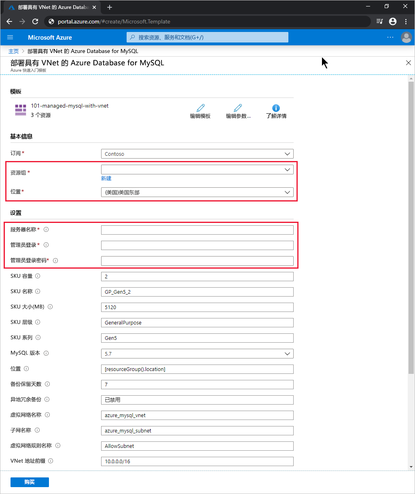

# <a name="quickstart-create-an-azure-database-for-mysql-server-by-using-the-arm-template"></a>快速入门：使用 ARM 模板创建 Azure Database for MySQL 服务器

Azure Database for MySQL 是一种托管服务，可用于在云中运行、管理和缩放具有高可用性的 MySQL 数据库。 本快速入门介绍了如何使用预定义的 Azure 资源管理器 (ARM) 模板创建集成了虚拟网络的 Azure Database for MySQL 服务器。 可以使用 Azure 门户、Azure CLI 或 Azure PowerShell 创建该服务器。

[!INCLUDE [About Azure Resource Manager](../../includes/resource-manager-quickstart-introduction.md)]

## <a name="prerequisites"></a>先决条件

# <a name="portal"></a>[门户](#tab/azure-portal)

具有活动订阅的 Azure 帐户。 [免费创建一个](https://azure.microsoft.com/free/)。

# <a name="powershell"></a>[PowerShell](#tab/PowerShell)

* 具有活动订阅的 Azure 帐户。 [免费创建一个](https://azure.microsoft.com/free/)。
* 若要在本地运行代码，请安装 [Azure PowerShell](/powershell/azure/)。

# <a name="cli"></a>[CLI](#tab/CLI)

* 具有活动订阅的 Azure 帐户。 [免费创建一个](https://azure.microsoft.com/free/)。
* 若要在本地运行代码，请安装 [Azure CLI](/cli/azure/)。

---

## <a name="create-an-azure-database-for-mysql-server"></a>创建 Azure Database for MySQL 服务器

你将使用所定义的一组计算和存储资源创建 Azure Database for MySQL 服务器。 若要了解详细信息，请参阅 [Azure Database for MySQL 定价层](concepts-pricing-tiers.md)。 请在 [Azure 资源组](../azure-resource-manager/management/overview.md)中创建该服务器。

### <a name="review-the-template"></a>查看模板

本快速入门中使用的模板来自 [Azure 快速入门模板](https://github.com/Azure/azure-quickstart-templates/tree/master/101-managed-mysql-with-vnet/)。

:::code language="json" source="~/quickstart-templates/101-managed-mysql-with-vnet/azuredeploy.json" range="001-231" highlight="149,162,176,199,213":::

该模板定义了五个 Azure 资源：

* [**Microsoft.Network/virtualNetworks**](/azure/templates/microsoft.network/virtualnetworks)
* [**Microsoft.Network/virtualNetworks/subnets**](/azure/templates/microsoft.network/virtualnetworks/subnets)
* [**Microsoft.DBforMySQL/servers**](/azure/templates/microsoft.dbformysql/servers)
* [**Microsoft.DBforMySQL/servers/virtualNetworkRules**](/azure/templates/microsoft.dbformysql/servers/virtualnetworkrules)
* [**Microsoft.DBforMySQL/servers/firewallRules**](/azure/templates/microsoft.dbformysql/servers/firewallrules)

可以在[快速入门模板库](https://azure.microsoft.com/resources/templates/?resourceType=Microsoft.Dbformysql&pageNumber=1&sort=Popular)中找到更多 Azure Database for MySQL 模板示例。

## <a name="deploy-the-template"></a>部署模板

# <a name="portal"></a>[门户](#tab/azure-portal)

选择以下链接以在 Azure 门户中部署 Azure Database for MySQL 服务器模板：

[](https://portal.azure.com/#create/Microsoft.Template/uri/https%3a%2f%2fraw.githubusercontent.com%2fAzure%2fazure-quickstart-templates%2fmaster%2f101-managed-mysql-with-vnet%2fazuredeploy.json)

在“部署具有 VNet 的 Azure Database for MySQL”页上  ：

1. 对于“资源组”，请选择“新建”，输入新资源组的名称，然后选择“确定”    。

2. 如果你创建了一个新资源组，请为该资源组和新服务器选择一个位置  。

3. 输入服务器名称、管理员登录名和管理员登录密码    。

    

4. 根据需要更改其他默认设置：

    * **订阅**：要用于服务器的 Azure 订阅。
    * **SKU 容量**：vCore 容量，值可以是 2（默认值）、4、8、16、32 或 64       。
    * **SKU 名称**：SKU 层前缀、SKU 系列和 SKU 容量，以下划线联接，例如 B_Gen5_1、GP_Gen5_2（默认值）或 MO_Gen5_32    。
    * **SKU 大小(MB)** ：Azure Database for MySQL 服务器的存储大小，以 MB 为单位（默认值为 5120）  。
    * **SKU 层**：部署层，例如“基本”、“常规用途”（默认值）或“内存优化”    。
    * **SKU 系列**：“Gen4”或“Gen5”（默认值），表示服务器部署的硬件代系   。
    * **Mysql 版本**：要部署的 MySQL 服务器版本，例如 5.6 或 5.7（默认值）   。
    * **备份保留天数**：异地冗余备份的所需保留期，以天为单位（默认值为 7）  。
    * **异地冗余备份**：“已启用”或“已禁用”（默认值），具体取决于异地灾难恢复 (Geo-DR) 要求   。
    * **虚拟网络名称**：虚拟网络的名称（默认值为 azure_mysql_vnet）  。
    * **子网名称**：子网的名称（默认值为 azure_mysql_subnet）  。
    * **虚拟网络规则名称**：允许子网的虚拟网络规则的名称（默认值为 AllowSubnet）  。
    * **VNet 地址前缀**：虚拟网络的地址前缀（默认值为 10.0.0.0/16）  。
    * **子网前缀**：子网的地址前缀（默认值为 10.0.0.0/16）  。

5. 阅读条款和条件，并选择“我同意上述条款和条件”。 

6. 选择“购买”。 

# <a name="powershell"></a>[PowerShell](#tab/PowerShell)

使用以下交互式代码通过模板创建新的 Azure Database for MySQL 服务器。 该代码会提示你输入新服务器名称、新资源组的名称和位置，以及管理员帐户名称和密码。

若要在 Azure Cloud Shell 中运行该代码，请在任何代码块的上角选择“尝试”  。

```azurepowershell-interactive
$serverName = Read-Host -Prompt "Enter a name for the new Azure Database for MySQL server"
$resourceGroupName = Read-Host -Prompt "Enter a name for the new resource group where the server will exist"
$location = Read-Host -Prompt "Enter an Azure region (for example, centralus) for the resource group"
$adminUser = Read-Host -Prompt "Enter the Azure Database for MySQL server's administrator account name"
$adminPassword = Read-Host -Prompt "Enter the administrator password" -AsSecureString

New-AzResourceGroup -Name $resourceGroupName -Location $location # Use this command when you need to create a new resource group for your deployment
New-AzResourceGroupDeployment -ResourceGroupName $resourceGroupName `
    -TemplateUri https://raw.githubusercontent.com/Azure/azure-quickstart-templates/master/101-managed-mysql-with-vnet/azuredeploy.json `
    -serverName $serverName `
    -administratorLogin $adminUser `
    -administratorLoginPassword $adminPassword

Read-Host -Prompt "Press [ENTER] to continue ..."
```

# <a name="cli"></a>[CLI](#tab/CLI)

使用以下交互式代码通过模板创建新的 Azure Database for MySQL 服务器。 该代码会提示你输入新服务器名称、新资源组的名称和位置，以及管理员帐户名称和密码。

若要在 Azure Cloud Shell 中运行该代码，请在任何代码块的右上角选择“尝试”  。

```azurecli-interactive
echo "Enter a name for the new Azure Database for MySQL server:" &&
read serverName &&
echo "Enter a name for the new resource group where the server will exist:" &&
read resourceGroupName &&
echo "Enter an Azure region (for example, centralus) for the resource group:" &&
read location &&
echo "Enter the Azure Database for MySQL server's administrator account name:" &&
read adminUser &&
echo "Enter the administrator password:" &&
read adminPassword &&
params='serverName='$serverName' administratorLogin='$adminUser' administratorLoginPassword='$adminPassword &&
az group create --name $resourceGroupName --location $location &&
az deployment group create --resource-group $resourceGroupName --parameters $params --template-uri https://raw.githubusercontent.com/Azure/azure-quickstart-templates/master/101-managed-mysql-with-vnet/azuredeploy.json &&
echo "Press [ENTER] to continue ..."
```

---

## <a name="review-deployed-resources"></a>查看已部署的资源

# <a name="portal"></a>[门户](#tab/azure-portal)

按照以下步骤查看新 Azure Database for MySQL 服务器的概览：

1. 在 [Azure 门户](https://portal.azure.com)中，搜索并选择“Azure Database for MySQL 服务器”  。

2. 在数据库列表中选择你的新服务器。 随后会显示新 Azure Database for MySQL 服务器的“概览”页  。

# <a name="powershell"></a>[PowerShell](#tab/PowerShell)

运行以下交互式代码来查看有关 Azure Database for MySQL 服务器的详细信息。 必须输入新服务器的名称。

```azurepowershell-interactive
$serverName = Read-Host -Prompt "Enter the name of your Azure Database for MySQL server"
Get-AzResource -ResourceType "Microsoft.DBforMySQL/servers" -Name $serverName | ft
Write-Host "Press [ENTER] to continue..."
```

# <a name="cli"></a>[CLI](#tab/CLI)

运行以下交互式代码来查看有关 Azure Database for MySQL 服务器的详细信息。 必须输入新服务器的名称和资源组。

```azurecli-interactive
echo "Enter your Azure Database for MySQL server name:" &&
read serverName &&
echo "Enter the resource group where the Azure Database for MySQL server exists:" &&
read resourcegroupName &&
az resource show --resource-group $resourcegroupName --name $serverName --resource-type "Microsoft.DbForMySQL/servers"
```

---

## <a name="clean-up-resources"></a>清理资源

如果不再需要该资源组，可以将其删除，这将删除资源组中的资源。

# <a name="portal"></a>[门户](#tab/azure-portal)

1. 在 [Azure 门户](https://portal.azure.com)中，搜索并选择“资源组”  。

2. 在资源组列表中，选择你的资源组的名称。

3. 在资源组的“概览”页中，选择“删除资源组”   。

4. 在确认对话框中，键入资源组的名称，然后选择“删除”  。

# <a name="powershell"></a>[PowerShell](#tab/PowerShell)

```azurepowershell-interactive
$resourceGroupName = Read-Host -Prompt "Enter the Resource Group name"
Remove-AzResourceGroup -Name $resourceGroupName
Write-Host "Press [ENTER] to continue..."
```

# <a name="cli"></a>[CLI](#tab/CLI)

```azurecli-interactive
echo "Enter the Resource Group name:" &&
read resourceGroupName &&
az group delete --name $resourceGroupName &&
echo "Press [ENTER] to continue ..."
```

---

## <a name="next-steps"></a>后续步骤

有关引导你完成模板创建过程的分步教程，请参阅：

> [!div class="nextstepaction"]
> [教程：创建和部署你的第一个 Azure 资源管理器模板](../azure-resource-manager/templates/template-tutorial-create-first-template.md)
