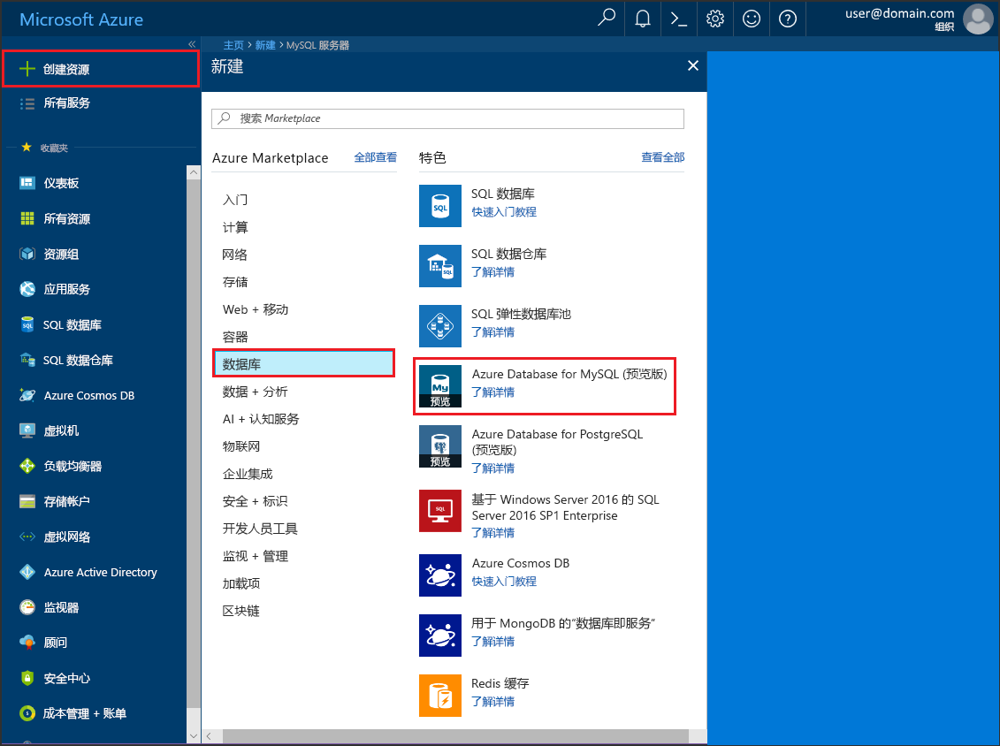
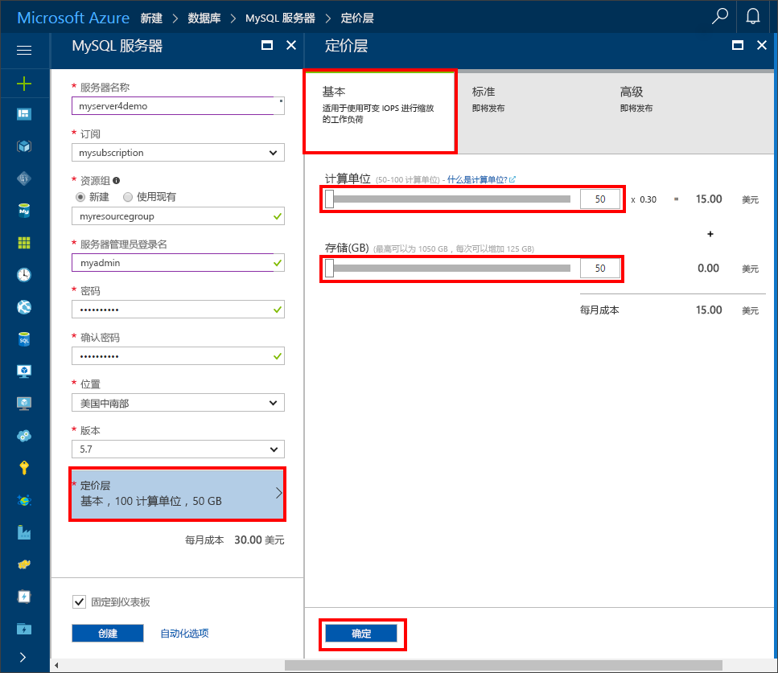

# <a name="create-an-azure-database-for-mysql-server-using-azure-portal"></a>使用 Azure 门户创建 Azure Database for MySQL 服务器

本文介绍如何使用 Azure 门户在大约五分钟内创建示例 Azure Database for MySQL 服务器。 

如果你还没有 Azure 订阅，可以在开始前创建一个[免费](https://azure.microsoft.com/free/)帐户。

## <a name="log-in-to-azure"></a>登录 Azure
打开 Web 浏览器，导航到 [Microsoft Azure 门户](https://portal.azure.com/)。 输入登录到门户所需的凭据。 默认视图是服务仪表板。


## <a name="create-azure-database-for-mysql-server"></a>创建 Azure Database for MySQL 服务器

1. 导航到“数据库” > “MySQL”。 如果在“数据库”类别下找不到 Azure Database for MySQL 服务器，请单击“查看全部”显示所有可用的数据库服务。 还可以在搜索框中键入“MySQL”快速查找该服务。


2. 单击“MySQL”图标，然后单击“创建”。
在示例中，用以下信息填写 Azure Database for MySQL 页：

| **窗体字段** | **字段说明** |
|----------------|-----------------------|
| *服务器名称* | mysqlserver4demo（服务器名称是全局唯一的） |
| *订阅* | MySQLaaS（从下拉列表中选择） |
| *资源组* | myresource（创建一个资源组或使用现有资源组） |
| 服务器管理员登录名 | myadmin（设置管理员帐户名称） |
| *密码* | 设置管理员帐户密码 |
| *确认密码* | 确认管理员帐户密码 |
| *位置* | 北欧（选择“北欧”或“美国西部”） |
| *版本* | 5.6（选择 MySQL 服务器版本） |
| 配置性能 | 基本（选择“性能层”、“计算单元”、“存储”，然后单击“确定”） |



几分钟后，Azure Database for MySQL 服务器就会预配好并运行。 可单击工具栏上的“通知”按钮（钟形图标）来监视部署过程。

> [!TIP]
> 建议将 Azure 服务放在同一区域，并选择离自己最近的位置。 此外，可勾选“固定到仪表板”选项，以便轻松跟踪部署。

## <a name="configure-the-firewall"></a>配置防火墙
首次从客户端连接到 Azure Database for MySQL 之前，必需配置防火墙并将客户端的公共网络 IP 地址（或 IP 地址范围）添加到允许列表。

1. 单击新创建的服务器，然后单击“设置”。
  

2. 在“常规”部分，单击“防火墙设置”。 可以通过单击“添加我的 IP”添加本地计算机的 IP 地址，也可配置 IP 地址范围。 创建规则后请记得单击“保存”。
  

## <a name="get-connection-information"></a>获取连接信息
在 Azure 门户中获取 Azure MySQL 服务器的完全限定域名。 请使用 **mysql.exe** 命令行工具通过完全限定的域名连接到服务器。

1.    在 [Azure 门户](https://portal.azure.com/)中，单击左侧菜单中的“所有资源”，然后单击 Azure Database for MySQL 服务器。

2.    单击“属性”。 记下“服务器名称”和“服务器管理员登录名”。
在此示例中，服务器名称是 mysql4doc.database.windows.net，服务器管理员登录名是 mysqladmin@mysql4doc。

## <a name="connect-to-the-server-using-mysqlexe-command-line-tool"></a>使用 mysqlexe 命令行工具连接到服务器
可以在 MySQL 服务器中创建多个数据库。 可以创建的数据库数目没有限制，但多个数据库共享相同的服务器资源。  若要使用 **mysql.exe** 命令行工具连接到服务器，请在门户中打开 **Azure Cloud Shell** 并输入以下内容：

1. 使用 **mysql** 命令行工具连接到服务器：
```dos
 mysql -h mysqlserver4demo.database.windows.net -u myadmin@mysqlserver4demo -p
```

2. 查看服务器状态：
```dos
 mysql> status
```
  

> [!TIP]
> 有关其他命令，请参阅 [MySQL 5.6 Reference Manual - Chapter 4.5.1](https://dev.mysql.com/doc/refman/5.6/en/mysql.html)（MySQL 5.6 参考手册 - 第 4.5.1 章）。

## <a name="connect-to-the-server-using-the-mysql-workbench-gui-tool"></a>使用 MySQL Workbench GUI 工具连接到服务器
1.    启动客户端计算机上的 MySQL Workbench 应用程序。 可以从[此处](https://dev.mysql.com/downloads/workbench/)下载并安装 MySQL Workbench。

2.    在“设置新连接”对话框的“参数”选项卡上，输入以下信息：

| **参数** | **说明** |
|----------------|-----------------|
|    *连接名称* | 指定此连接的名称（这可以是任何内容） |
| *连接方法* | 选择“标准(TCP/IP)” |
| *主机名* | mycliserver.database.windows.net（先前记下的服务器名称） |
| *端口* | 3306 |
| *用户名* | myadmin@mycliserver（先前记下的服务器管理员登录名） |
| *密码* | 可以在保管库中存储管理员帐户密码 |


3.    单击“测试连接”以测试是否所有参数均已正确配置。

4.    现在，可以单击刚创建的连接，以便成功连接到服务器。

> 默认情况下，SSL 是在服务器上强制实施的，该服务器需要额外配置才能成功地进行连接。 请参阅[配置应用程序中的 SSL 连接性以安全连接到 Azure Database for MySQL](./howto-configure-ssl.md)。  若要禁用此快速入门的 SSL，可转到门户中的“连接安全性”禁用强制 SSL。

## <a name="clean-up-resources"></a>清理资源

如果不需要将这些资源用于其他快速入门/教程，则可通过执行以下操作将其删除：

1. 在 Azure 门户的左侧菜单中，单击“资源组”，然后单击“myresource”。 
2. 在资源组页上单击“删除”，在文本框中键入 **myresource**，然后单击“删除”。

## <a name="next-steps"></a>后续步骤

> [!div class="nextstepaction"]
> [设计你的第一个 Azure Database for MySQL 数据库](./tutorial-design-database-using-portal.md)


